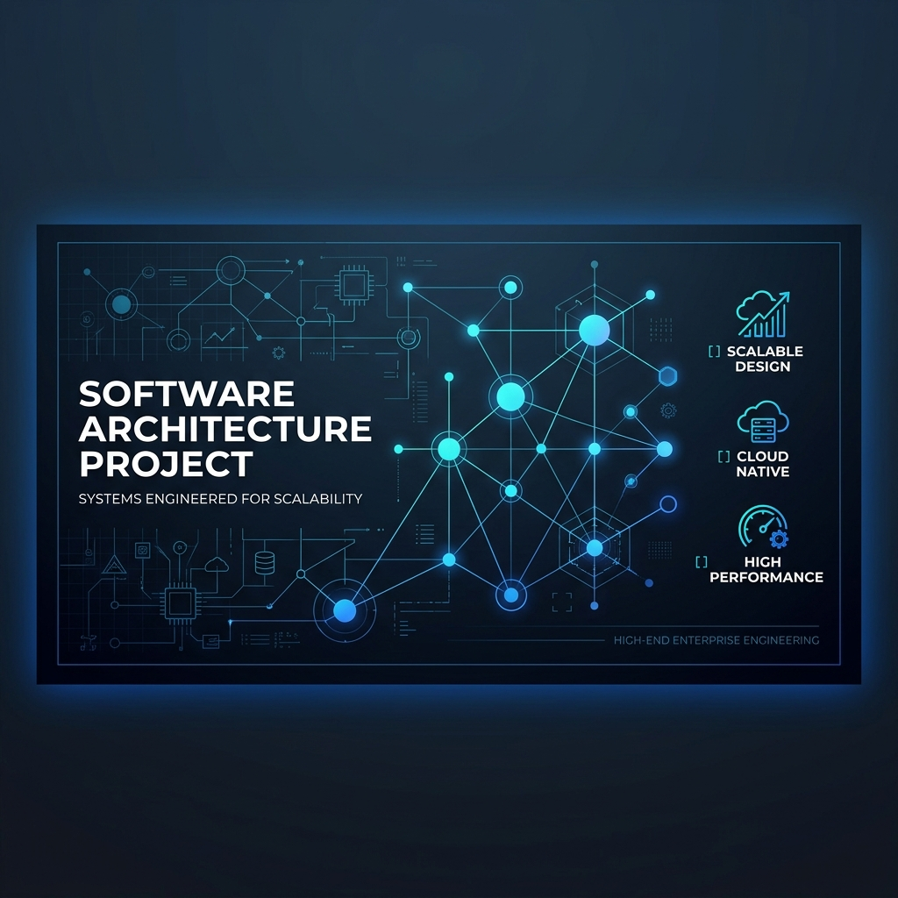

# UMS — Sistema de Gestión de Usuarios Empresarial

> **Monolito Modular de alta escala para Identidad y Autorización Unificada.**
>
>   

---

### 🚀 Hub de Navegación
Explora las capas del repositorio:

- [⚖️ **Gobernanza**](./governance/) — Visión, Roadmap y Requisitos.
- [🏗️ **Arquitectura**](./architecture/) — ADRs, Planos y Modelos C4.
- [🛠️ **Infraestructura**](./infrastructure/) — Docker, K8s y Gateway.
- [🚀 **Operaciones**](./operations/) — Observabilidad y Monitoreo.
- [🎓 **Conocimiento**](./knowledge/) — Onboarding y POCs.
- [💻 **Código Fuente**](./src/) — El "Engine Room" (Apps y Libs).

---

### 🏛️ ADN Técnico
- **Patrones**: Monolito Modular, DDD, Clean Architecture, Hexagonal.
- **Backend**: .NET 8 LTS (Pattern Result, MediatR).
- **Frontend**: React 18 + Vite (Zustand para estado).
- **Seguridad**: Seguridad a Nivel de Fila (RLS) + OAuth2/OIDC.

### 🚦 Inicio Rápido
```powershell
# 1. Entrar al Engine Room
cd src

# 2. Instalar e Iniciar Frontend
npm install; npx nx run app-web:dev

# 3. Compilar Backend
dotnet build ./apps/app-api-dotnet/Ums.sln
```

### ⚖️ Gobernanza de Ingeniería
La navegación técnica detallada está disponible en el [**Indice Maestro**](./MASTER_INDEX.es.md). Este proyecto utiliza **BMAD-METHOD** para la trazabilidad documental asistida por IA.
