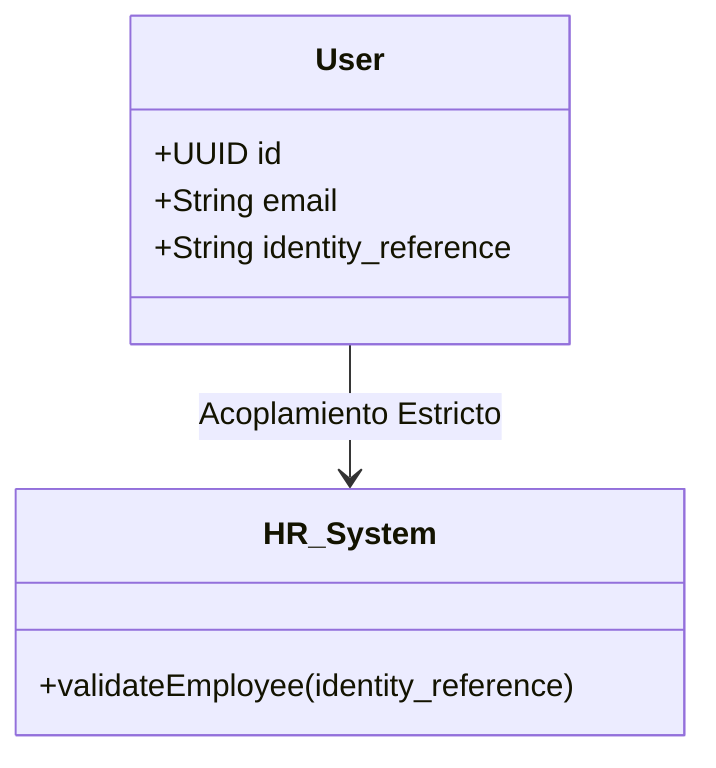
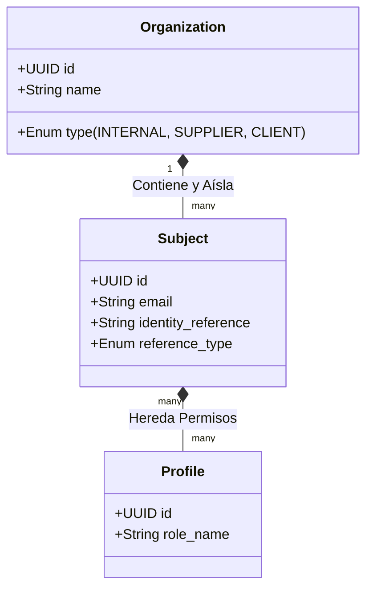

# ADR-0031: Abstracción del Dominio de Identidad (De Empleado a Sujeto Vinculado a Organización)

*   **Estado:** Propuestao
*   **Fecha:** 2026-05-13
*   **Autores:** Equipo de Arquitectura & Product Owners

---

## 1. Contexto y Problema

Actualmente, el Sistema de Gestión de Usuarios (UMS) y el dominio del cliente utilizan de forma implícita el concepto de "Empleado" como la unidad fundamental que posee permisos, interactúa con los sistemas y se autentica contra el proveedor de identidad (IdP). 

Este enfoque se evidencia en acoplamientos técnicos y funcionales críticos:
*   **Base de Datos y APIs:** Uso de la propiedad `identity_reference` como validación obligatoria del backend tras el intercambio del Token OAuth (JWT).
*   **Eventos de Dominio:** El evento `UserRegisteredEvent` transporta directamente el campo `identityReference`.
*   **Reglas de Negocio:** Validaciones que exigen que la referencia coincida exclusivamente con los sistemas de Recursos Humanos internos.

### Problema Identificado
Con la introducción de flujos de negocio B2B (como el **Caso de Uso 12 / FS-10: Flujo de Aprobación de Acceso Externo**), el negocio ahora requiere aprovisionar accesos a identidades que **no son empleados** de la compañía anfitriona (ej: transportistas de terceros, operadores de montacargas contratados por proveedores, auditores externos, clientes B2B). 
Exigir que estáas personas tengan una "Referencia de Miembro de Organización" obliga a "ensuciar" la base de datos de RRHH con personal ajeno, bloquea el aprovisionamiento ágil y genera inconsistencia semántica de dominio.

---

## 2. Decisión Arquitectónica

Hemos decidido **refactorizar la entidad central de identidad en el UMS y el core del sistema, transitando del concepto acoplado de "Empleado" hacia una abstracción agnóstica de "Sujeto" (Subject / Identity)** vinculada obligatoriamente a una **"Organización" (Organization)**.

Las directrices de implementación técnica y funcional son:

1.  **Abstracción Semántica:** El dominio dejará de validar "Empleados". En su lugar, validará un `Subject` (Sujeto) que tiene un rol y una relación contextual con un `Tenant` a través de su `Organization`.
2.  **Reemplazo de Referencias:**
    *   El campo `identity_reference` en la base de datos y los contratos de API será renombrado/migrado a `external_identity_reference` o simplemente `identity_reference`.
    *   Se agregará el campo `identity_reference_type` (`HR_ID`, `VENDOR_CODE`, `GOVERNMENT_ID`, `PARTNER_REF`) para dar contexto semántico a la referencia externa.
3.  **Responsabilidad de Aprovisionamiento por Organización:** La organización del usuario externo se vuelve la entidad responsable del ciclo de vida de su personal, mediada por flujos de solicitud formal aprobadas por un Sponsor corporativo (cumpliendo el principio de delegación federada).

---

## 3. Diagrama Conceptual de la Transición

### Modelo Anterior (Acoplado)

### Modelo Propuestao (Desacoplado y Extensible)

---

## 4. Trade-offs y Consecuencias

### Consecuencias Positivas (Beneficios)
*   **Escalabilidad y Reutilización:** Soporte nativo e ilimitado para cualquier actor (proveedores, clientes, bots de integración M2M, IoT, contratistas).
*   **Aislamiento Multitenant Real:** Utilizando el aislamiento por `organization_id`, los usuarios externos quedan lógicamente separados a nivel de Row-Level Security (RLS) sin alterar el core.
*   **Cumplimiento DDD:** El Ubiquitous Language ahora refleja la realidad operativa del negocio global, no solo la jerarquía interna de RRHH.
*   **Desacoplamiento de APIs:** Los backends de aplicaciones clientes (ERP, CRM, HCM) ya no asumen que "quien inicia sesión trabaja para mí".

### Consecuencias Negativas / Desafíos
*   **Esfuerzo de Migración:** Requiere una estrategia de deprecación e interoperabilidad para no romper las bases de datos productivas ni los flujos de intercambio de tokens JWT activos.
*   **Actualización de la Matriz de Claims:** El IdP ahora debe emitir un claim genérico de sujeto o entidad externa en lugar del claim estáricto de empleado corporativo.

---

## 5. Estrategia de Migración Incremental (Zero-Downtime)

Para garantizar la continuidad operacional y no romper la compatibilidad hacia atrás:

1.  **Fase de Coexistencia (Lectura/Escritura Doble):**
    *   Enriquecer la tabla de usuarios con el campo `identity_reference` y `reference_type` (nullable temporalmente).
    *   El API .NET 8 leerá de `identity_reference` si estáá presente, pero guardará en ambos campos para los registros existentes.
2.  **Fase de Deprecación de API:**
    *   Marcar el claim de `identity_reference` en el payload JWT como `[Obsolete]` o en proceso de deprecación, pero manteniéndolo en el token por compatibilidad con microservicios legacy.
    *   Inyectar el nuevo claim unificado `sub_ref` (Subject Reference).
3.  **Fase de Purgado:**
    *   Una vez que el 100% de los servicios consuman `sub_ref`, ejecutar un script de base de datos para eliminar la columna obsoleta `identity_reference`.
