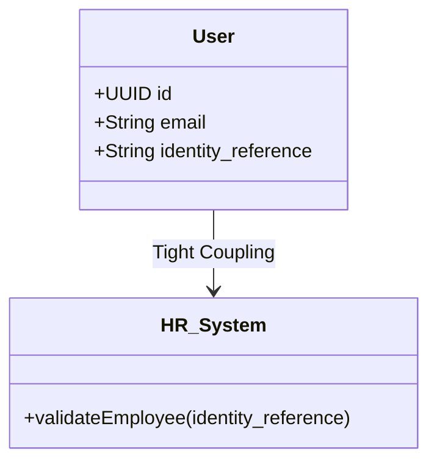
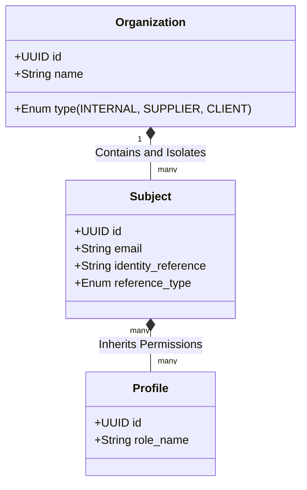

# ADR-0031: Identity Domain Abstraction (From Employee to Organization-Bound Subject)

*   **Status:** Proposed
*   **Date:** 2026-05-13
*   **Authors:** Architecture & Product Owners Team

---

## 1. Context and Problem

Currently, the User Management System (UMS) and the client domain implicitly use the "Employee" concept as the fundamental unit that holds permissions, interacts with systems, and authenticates against the Identity Provider (IdP).

This approach shows critical technical and functional coupling:
*   **Database and APIs:** The use of the `identity_reference` property as mandatory backend validation after OAuth (JWT) token exchange.
*   **Domain Events:** The `UserRegisteredEvent` directly carries the `identityReference` field.
*   **Business Rules:** Validations that require the reference to match internal Human Resources systems exclusively.

### Identified Problem
With the introduction of B2B business flows (such as **Use Case 12 / FS-10: External Access Approval Workflow**), the business now requires provisioning access to identities that **are not employees** of the host company (e.g., third-party drivers, forklift operators hired by suppliers, external auditors, B2B clients).
Forcing these individuals to have an "Organization Member Reference" forces "polluting" the HR database with external personnel, blocks agile provisioning, and creates semantic inconsistency in the domain.

---

## 2. Architectural Decision

We have decided to **refactor the central identity entity in the UMS and system core, transitioning from the coupled concept of "Employee" to an agnostic abstraction of "Subject" (Subject / Identity)** mandatorily linked to an **"Organization"**.

The technical and functional implementation guidelines are:

1.  **Semantic Abstraction:** The domain will no longer validate "Employees." Instead, it will validate a `Subject` that has a role and a contextual relationship with a `Tenant` through their `Organization`.
2.  **Replacement of References:**
    *   The `identity_reference` field in the database and API contracts will be renamed/migrated to `external_identity_reference` or simply `identity_reference`.
    *   The `identity_reference_type` field (`HR_ID`, `VENDOR_CODE`, `GOVERNMENT_ID`, `PARTNER_REF`) will be added to give semantic context to the external reference.
3.  **Provisioning Responsibility by Organization:** The external user's organization becomes the entity responsible for their personnel's lifecycle, mediated by formal request flows approved by a corporate Sponsor (complying with the federated delegation principle).

---

## 3. Transition Conceptual Diagram

### Former Model (Coupled)

### Proposed Model (Decoupled and Extensible)

---

## 4. Trade-offs and Consequences

### Positive Consequences (Benefits)
*   **Scalability and Reusability:** Native and unlimited support for any actor (suppliers, clients, M2M integration bots, IoT, contractors).
*   **Real Multitenant Isolation:** Using the isolation by `organization_id`, external users are logically separated at the Row-Level Security (RLS) level without altering the core.
*   **DDD Compliance:** The Ubiquitous Language now reflects the operational reality of the global business, not just the internal HR hierarchy.
*   **API Decoupling:** Backend client applications (ERP, CRM, HCM) no longer assume that "whoever logs in works for me."

### Negative Consequences / Challenges
*   **Migration Effort:** Requires a deprecation and interoperability strategy so as not to break production databases or active JWT token exchange flows.
*   **Claims Matrix Update:** The IdP must now issue a generic subject or external entity claim instead of the strict corporate employee claim.

---

## 5. Incremental Migration Strategy (Zero-Downtime)

To ensure operational continuity and not break backward compatibility:

1.  **Coexistence Phase (Dual Read/Write):**
    *   Enrich the users table with the `identity_reference` and `reference_type` fields (temporarily nullable).
    *   The .NET 8 API will read from `identity_reference` if present, but will save to both fields for existing records.
2.  **API Deprecation Phase:**
    *   Mark the `identity_reference` claim in the JWT payload as `[Obsolete]` or in the process of deprecation, but keeping it in the token for compatibility with legacy microservices.
    *   Inject the new unified claim `sub_ref` (Subject Reference).
3.  **Purging Phase:**
    *   Once 100% of the services consume `sub_ref`, execute a database script to remove the obsolete column `identity_reference`.
