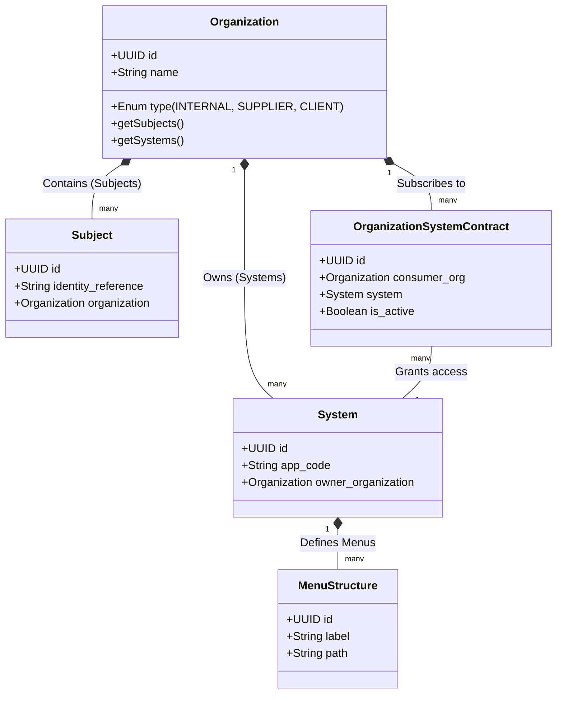

# ADR-0032: Organization as the Strategic Domain Boundary (Ownership & Security Frontier)

*   **Status:** Proposed
*   **Date:** 2026-05-13
*   **Authors:** Senior Architecture & Product Owners Team

---

## 1. Context and Problem

In the development of distributed and multi-tenant enterprise architectures, a recurring risk is treating technological assets (Systems, Menus, Features) and identity entities (Users, Persons) as flat global inventories.

### Flaws of the Traditional Model
Previously, the system ran the risk of permitting ambiguous couplings where:
1.  **Users** (or Employees) "floated" globally, linking to companies via weak attributes.
2.  **Systems** and Applications were treated as a universal agnostic catalog, lacking a clear definition of Ownership.
3.  Permission hierarchies assumed a menu option or action belonged solely to the system role, regardless of the organizational context consuming or operating the resource.

This lack of unified containment compromises the **Zero Trust** principle and introduces operational risks of data bleeding between different B2B tenants sharing the client ecosystem.

---

## 2. Architectural Decision

We have decided to formalize a **Structural Refactoring of the Domain** where the **`Organization`** entity is elevated as the **Primary Root of Governance, Ownership Boundary, and Security Boundary** of the ecosystem.

The mandatory directives of this hierarchical containment are:

1.  **Mandatory Dual Containment:** An Organization is the absolute logical container that simultaneously holds:
    *   **Subjects/Persons:** Human references and bots operating under its tutelage.
    *   **Systems/Resources:** Applications, modules, configurations, menus, and permissions assigned or contracted under its control.
2.  **Hierarchy and Authorization Flow:** The permission compilation and dynamic rendering graph must read hierarchically as:
    `Organization  Subject  Role  System  Module/Menu  Action`.
3.  **Isolation of Owned and Delegated Resources:**
    *   A System has a mandatory `owner_organization_id` attribute (who provides and administers the software).
    *   Consuming Organizations obtain a contractually approved delegation relationship to inject that System into their visual scope of Menus and Features.

---

## 3. Target Domain Conceptual Diagram



---

## 4. Risks, Trade-offs, and Mitigations

### The God Entity Risk
Elevating the `Organization` as the central boundary can tempt developers to inject too much internal business logic from multiple Bounded Contexts, creating an unmanageable centralized monolithic entity.

**DDD Mitigation:** The Organization will not be a single giant software object. Instead, it will act as a contextualized boundary ID:
*   In the **Identity** Bounded Context: Stores corporate metadata and IdP.
*   In the **Authorization** Bounded Context: Acts as the RLS partition for storing the Graph.
*   In the **Configuration** Bounded Context: Acts as the root key for resolving hierarchical Overrides.

---

## 5. Transition Strategy and Compatibility

To transition smoothly without breaking existing code:

1.  **Legacy Systems Association:** All systems registered in previous databases lacking an owner will be mapped via a data migration script to the Central Operating Organization (`LOGISTICS_CORP_ROOT`).
2.  **Gateway Middleware Validation:** The API Gateway will inject the `X-Org-Context-Id` header, validating that both the `Subject` making the requestá and the requested `System` are contractually authorized under that Organization's tree.
3.  **JWT Payload Contract:** The JWT token issued by AuthCore will include the composite claim:
    ```json
    {
      "sub_ref": "S-12345",
      "org_id": "ORG-XYZ-789",
      "allowed_systems": ["ERP", "CRM"]
    }
    ```
    This ensures that, at the frontend and microservices level, there is no latency for filtering local modules and menus.
