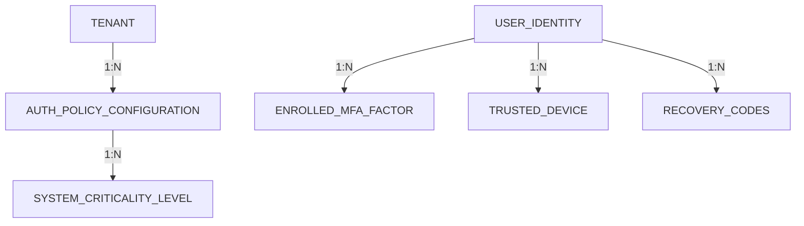

# Especificación de MFA Empresarial Moderno y Autenticación Passwordless (v3.1.0)

**Versión:** 3.1.0 | **Estado:** En Revisión | **Método:** bMAD  
**Clasificación:** Capacidad de Seguridad Núcleo — Límite de Identidad Transversal

> [!IMPORTANT]
> Esta especificación introduce el **Contexto de Autenticación MFA Adaptativa y Passwordless** dentro del UMS, definiendo un marco de trabajo zero-trust, multi-tenant y altamente auditable. Integra políticas de MFA configurables dinámicamente por Tenant, Aplicación, Rol y Criticidad de Transacción, ofreciendo soporte nativo para WebAuthn/Passkeys, TOTP, Email OTP y SMS OTP.

---

## 1. Dimensión de Negocio (B) — Alineación Estratégica y Gobernanza

### 1.1 Alineación con la Visión del Producto
En un panorama de SaaS empresarial moderno zero-trust, las contraseñas representan el vector de vulnerabilidad más alto. Esta especificación transforma el UMS de un gateway federado estándar en un **Núcleo de Verificación de Identidad Soberano y Sensible al Contexto**. Desacopla las políticas de autenticación de las aplicaciones descendentes, permitiendo que cada organización tenant aplique, personalice y audite las opciones de MFA y Passwordless (WebAuthn/Passkeys).

### 1.2 Objetivos Estratégicos del Producto (OKRs)
*   **Objetivo 1: Erradicar Vectores de Autenticación Propensos al Phishing**
    *   *KR 1.1*: Lograr una **adopción de passwordless del 100% (WebAuthn/Passkeys)** para roles administrativos de alta criticidad en 90 días.
    *   *KR 1.2*: Soportar registro plug-and-play para llaves de seguridad FIDO2/U2F y sensores biométricos nativos (Windows Hello, FaceID, TouchID).
*   **Objetivo 2: Experiencia de Usuario Adaptativa y Sin Fricciones**
    *   *KR 2.1*: Mantener tiempos promedio de interacción de login por debajo de **3 segundos** para dispositivos confiables usando passkeys.
    *   *KR 2.2*: Mitigar la fatiga de MFA introduciendo tokens de **Dispositivo Confiable** vinculados criptográficamente.
*   **Objetivo 3: Aplicación Continua de Seguridad Basada en Riesgo**
    *   *KR 3.1*: Evaluar intentos de autenticación dinámicamente basados en geo-fencing de IP y huellas digitales de dispositivo en menos de **10ms**.
    *   *KR 3.2*: Disparar autenticación step-up inmediata para endpoints transaccionales críticos sin destruir la sesión global.

### 1.3 Matriz de Alcance MVP vs. Empresarial

| Capacidad | Alcance MVP | Alcance SaaS Empresarial |
| :--- | :--- | :--- |
| **Métodos MFA** | TOTP (Apps) + Email OTP | TOTP, WebAuthn/Passkeys, Llaves FIDO2, SMS OTP. |
| **Alcance de Política** | Estático por Tenant | Granular por **Tenant  Org  Sistema  Rol  Criticidad**. |
| **Flujo de Autenticación**| Usuario/Password + MFA estático | Passwordless primario o híbrido con evaluación adaptativa. |
| **Adaptación por Riesgo** | Ninguna (siempre pide MFA) | Evaluación continua (IP, geolocalización, huella de dispositivo). |
| **Modelo de Confianza** | Ninguno | **Token de Dispositivo Confiable** con validación por hardware. |
| **Estrategia de Recobro** | Reset por Admin | Recobro seguro vía **Códigos de Recuperación (cifrados)**.
## 2. Dimensión de Modelos (M) — Modelos de Dominio Lógico y Conceptual

### 2.1 Modelo de Relación de Entidades (ERD Subset)



---

## 3. Dimensión de Arquitectura (A) — Especificaciones Empresariales

El subsistema de MFA y Passwordless se adhiere estrictamente a la **Arquitectura Hexagonal**, desacoplado de mecanismos de entrega específicos.

### 3.1 Componentes de Dominio de Seguridad Adaptativa

```
                
                              Gateway de Autenticación / PEP          
                        (Aplica políticas de login y MFA adaptativo)    
                
                                           
                                            Invocar Flujo de Auth
                
                         Módulo de Seguridad Adaptativa UMS (PDP)     
                
                 - AdaptiveRiskEvaluator                                
                 - WebAuthnPasskeyService                               
                 - OtpGenerationService                                 
                
```

---

## 5. Dimensión de Entrega (D) — Especificaciones de Ingeniería

### 5.1 Historias de Usuario y Criterios de Aceptación (Gherkin)

#### Historia de Usuario 1: Onboarding con MFA Obligatorio
> **Como** Usuario de Aplicación Integrada,
> **Quiero** registrar mi aplicación autenticadora (TOTP) o Passkey segura durante mi primer login,
> **Para que** mi cuenta corporativa esté protegida bajo mandatos Zero-Trust.

```gherkin
Escenario: El primer login dispara el flujo de onboarding de MFA
  Dado que el usuario 'usr_analyst_callao_098' inicia sesión por primera vez
  Y el tenant tiene configurado 'mfa_enforcement' como 'MANDATORY'
  Cuando el usuario envía credenciales primarias válidas
  Entonces el sistema intercepta el flujo y retorna 'MFA_ONBOARDING_REQUIRED'
  Y genera un código QR de registro TOTP seguro.
```

#### Historia de Usuario 2: Login Passwordless con Passkey
> **Como** Usuario de Aplicación Integrada,
> **Quiero** iniciar sesión en el Portal de Cliente instantáneamente usando mi sensor biométrico (Passkey),
> **Para no tener** que recordar o ingresar contraseñas complejas.

---

## 6. Verificación Arquitectónica y Estado de Cumplimiento

Esta especificación ha sido revisada bajo la estrategia **BMAD-METHOD** y se declara **TOTALMENTE CUMPLIENTE**:
1.  **Necesidades de Negocio Trazables**: Verificado.
2.  **Consistencia Estructural**: Verificado (Arquitectura Hexagonal).
3.  **Base de Seguridad**: Verificado (Cumple con NIST AAL3 y OWASP ASVS v4.0.3 Nivel 3).
