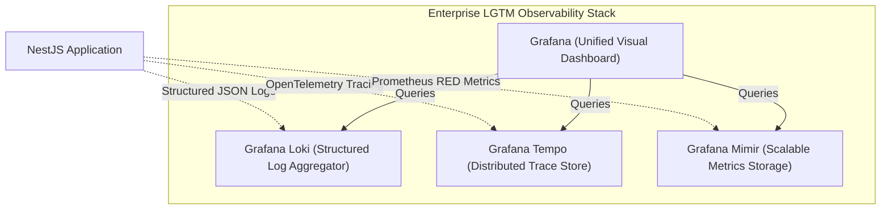

> **Nota de Arquitectura:** Este documento se encuentra actualmente en su versin original (Ingls) y está programado para traduccin oficial en la hoja de ruta.

# End-to-End Distributed Observability & Telemetry Strategy

This document details the telemetry architecture, trace propagation, logging standards, and cost-effective monitoring stack for the UMS platform under the **spec-driven AI strategy BMAD-METHOD**.

---

## 1. The Three Pillars of Telemetry

To ensure absolute visibility across our modular monolith and prepare for future microservices, we implement three synchronized pillars of observability as specified in **ADR 0007**:



---

## 2. Detailed Technical Strategy

### A. Structured Logging (Grafana Loki)
*   **Standard**: All application logs are outputted to standard out (`stdout`) in high-performance **Structured JSON format** (using `pino` or NestJS `Winston`).
*   **Format**: Every log entry **must** contain the following metadata:
    ```json
    {
      "timestaamp": "2026-05-08T13:14:08.000Z",
      "level": "info",
      "tenantId": "tenant-abc-123",
      "traceId": "otlp-trace-uuid-xyz",
      "spanId": "otlp-span-uuid-abc",
      "context": "InventoryUseCase",
      "message": "Container checked in successfully",
      "containerId": "CONT-998822"
    }
    ```

### B. Distributed Tracing (OpenTelemetry & Tempo)
*   **Propagation**: OpenTelemetry (OTel) is initialized at application startup. Trace contexts are propagated automatically using standard **W3C Trace Context headers** (`traceparent`).
*   **Intra-Domain Event Propagation**: When an event is published asynchronously via the Event Bus, the active `trace_id` is appended to the event payload. Downstream subscribers extract the context and start a child span, preserving the transaction timeline across modules.

### C. System & Business Metrics (Mimir)
We monitor system health and business operations using two structured patterns:
*   **RED Pattern (Services)**: **R**ate (requests/sec), **E**rrors (HTTP 5xx / database failures), **D**uration (latency p95/p99 targets < 200ms).
*   **USE Pattern (Infrastructure)**: **U**tilization, **S**aturation, and **E**rrors for CPU, memory, and database connections.

---

## 3. End-to-End Business Process Traceability

To trace a single business transaction from start to finish (e.g., weighing a container and generating an invoice):

1.  **Ingress**: The API Gateway/BFF generates a unique `trace_id` (if not provided by the client) and injects it into the request.
2.  **Use Case**: The Inventory Module executes the weight transaction, logging the process with the associated `trace_id`.
3.  **Database**: TypeORM traces SQL execution time using database telemetry spans.
4.  **Asynchronous Handoff**: The `ContainerWeighedEvent` is published to the Outbox carrying the `trace_id` in its header.
5.  **Downstream Subscriber**: The Customs Module consumes the event, extracts the `trace_id`, and validates the container weight against SUNAT, maintaining a single, continuous trace across all asynchronous operations.

---

## 4. Monitoring Tools & Cost Sizing
By utilizing the open-source **Grafana LGTM Stack**, the enterprise minimizes licensing costs compared to proprietary tools (e.g., Datadog, Dynatrace) while guaranteeing industry-standard, high-scale telemetry:
*   **Loki Storage**: Compact, index-free log storage dramatically reduces cloud disk storage costs.
*   **Self-Hosted/Managed Hybrid**: Local development runs on Docker-compose LGTM; production deploys to managed Grafana Cloud or self-hosted Kubernetes setups for absolute data privacy and sovereign data compliance.

