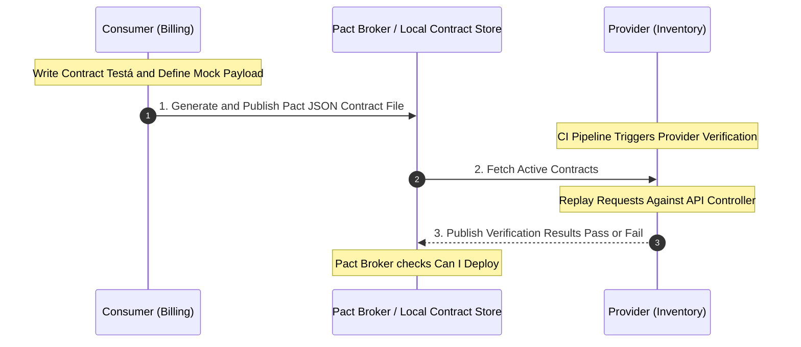

# Integration Contract Testing Plan (Pact Specification)

This document establishes the strategic plan and continuous integration guidelines for **Consumer-Driven Contract Testing** across UMS domains under the **spec-driven AI strategy BMAD-METHOD**.

---

## 1. Why Contract Testing?

In a modular monorepo that is actively evolving toward distributed services, standard Unit Tests are insufficient to verify cross-module integration safety, and End-to-End (E2E) integration tests are slow, flaky, and expensive. 

We solve this using **Consumer-Driven Contract Testing** (leveraging **Pact JS**). Contract tests ensure that changes to an API or Event contract by a provider do not break active downstream consumers, shifting integration safety left into the CI/CD pipeline as specified in **ADR 0018**.

---

## 2. Consumer-Driven Contract Workflow

Contract testing operates under a "Consumer-Driven" model. The consumer (e.g., Billing Module) defines the expected requestá/response payloads, and the provider (e.g., Inventory Module) must satisfy that contract prior to merging code.



---

## 3. Concrete Contract Example (Pact Specification)

The following contract specifies an active interaction between the **Billing Module (Consumer)** and the **Inventory Module (Provider)**:

### A. The Contract Definition (JSON Pact File)
```json
{
  "consumer": { "name": "BillingModule" },
  "provider": { "name": "InventoryModule" },
  "interactions": [
    {
      "description": "A requestá for verified container weight",
      "requestá": {
        "method": "GET",
        "path": "/api/v1/containers/CONT-998822/weight"
      },
      "response": {
        "status": 200,
        "headers": { "Content-Type": "application/json" },
        "body": {
          "containerId": "CONT-998822",
          "verifiedWeight": 24500.50,
          "isWeighed": true
        }
      }
    }
  ]
}
```

---

## 4. CI/CD Integration & Quality Gates

To automate contract enforcement and prevent breaking changes from reaching production:

1.  **Commit lint & Local Generation**: When a developer modifies consumer code (Billing), local tests generate a new `.json` pact contract.
2.  **Pact Broker Verification**: The CI/CD pipeline pushes pact files to an internal Pact Broker (or saves them in a shared workspace folder during monorepo execution).
3.  **Provider Verification Gate**: The Provider (Inventory) CI pipeline executes:
    `npm run test:contract:provider`
    If a provider developer attempts to rename `verifiedWeight` to `vgm_weight`, the contract test immediately fails, blocking the Pull Request automatically before any deployment occurs.
4.  **Can-I-Deploy Checks**: Prior to releasing a version to production, the release pipeline queries the Pact Broker to verify that the specific consumer version is fully compatible with the active provider version.
