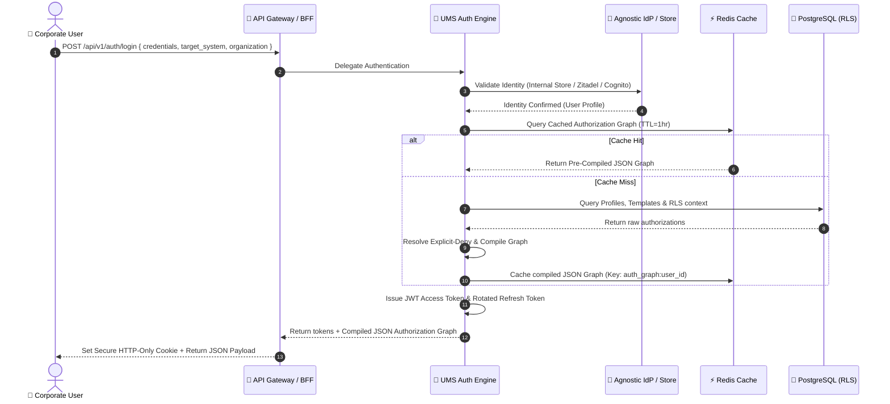

# 🔐 High-Concurrency Authentication & Authorization Specification (UMS)

This specification defines the enterprise-grade design, API contracts, security controls, and non-functional requirements for the **User Management System (UMS) High-Concurrency Authentication & Authorization API** under the **spec-driven AI strategy BMAD-METHOD**.

---

## 🏛️ 1. Business Context Version
*(Suitable for: `business-context.md` / Stakeholder Alignment)*

### 🚀 High-Performance Access Gatekeeper
In a federated B2B SaaS ecosystem, user login is the highest-concurrency entry point. To ensure a seamless user experience, the UMS exposes a highly resilient, low-latency, and scalable authentication endpoint. This gateway abstracts both internal credentials and federated Identity Providers (IdPs)—such as Zitadel, Okta, Microsoft Entra ID, or OAuth2/Passport social logins (Google, etc.)—delegating identity verification while maintaining strict central authority over the multi-tenant context.

Upon successful authentication, rather than returning a simple user profile, the API dynamically compiles and injects a unified, cached **Hierarchical Authorization Graph**. This graph maps precisely which Systems, Modules, Menus, Options, Actions, and Contextual Scopes the authenticated user is allowed to access within their specific corporate organization, ensuring dynamic UI rendering and robust downstream microservices authorization enforcement at runtime.

---

## 📋 2. Product Requirement Version
*(Suitable for: `product-scope.md` / `requirements.md` / Backlog)*

### 📝 Product Feature: High-Performance Multi-Tenant Authenticator
*   **Actor**: Portal Users, External API Clients.
*   **User Story**:
    > *As a* B2B multi-tenant user,
    > *I want to* authenticate securely via my preferred corporate or social identity provider,
    > *So that* I can instantly receive my tailored, role-resolved menu and permission graph for my target system and tenant organization.

#### Functional Criteria
1.  **Agnostic Intake Schema**: The API must accept an agnostic payload containing authentication credentials (e.g., username/password or an external JWT/OAuth2 code), the `target_system_id` being accessed, and the `organization_id` (tenant context).
2.  **Pluggable Identity Resolvers**: The system must support internal UMS-managed credentials (Bcrypt storage) and external IdPs (SAML, OIDC, OAuth2, WebAuthn, generic Social Identity Providers) without modifying business logic.
3.  **Token Lifecycle Management**: Enforce secure session handshakes by issuing a short-lived **JSON Web Token (JWT) Access Token** coupled with a cryptographically secure, rotated **Refresh Token** (sliding expiration window).
4.  **Hierarchical Authorization Compilation**: After credentials verification, compile a complete hierarchical JSON authorization tree mapping: `Organization ➔ System ➔ Role ➔ Module ➔ Menu ➔ Option ➔ Action`.
5.  **Dynamic Precedence Rule**: Apply the **Explicit-Deny Precedence** rule on compiled permissions before returning the payload to the client.

---

## 🏗️ 3. Technical Architecture Version
*(Suitable for: `architecture-spec.md` / System Design)*

### ⚙️ Stateless Session Handshake and Graph Compilation Flow



*   **Stateless Scaling**: The API is completely stateless. Session validation is cryptographically verified on-the-fly using RS256-signed JWTs, allowing horizontal scalability across Kubernetes clusters.
*   **Read-Aside Authorization Cache**: To offload the database and handle high concurrency, the compiled authorization graph is cached inside Redis using `user_id:target_system_id:org_id` as the composite key, keeping resolution latency under **5ms**.

---

## 📜 4. ADR-Ready Decision Statement
*(Suitable for: `03-adrs/0021-high-performance-auth-and-graph-compilation.md`)*

### Architectural Decision Record: ADR-0021

*   **Status**: Accepted
*   **Deciders**: Enterprise IAM Architect, Lead Developer, Product Owner

#### Context
High-concurrency user authentication and dynamic role-resolution are critical bottlenecks in B2B SaaS portals. Directly querying PostgreSQL relational schemas to build complex permission graphs on every single HTTP request causes high database load and poor p95 latencies.

#### Decision
We will expose a unified, stateless `/api/v1/auth/login` endpoint that abstracts authentication providers (internal or external) and returns a pre-compiled, Redis-cached **Hierarchical Authorization Graph** alongside dual cryptographically rotated tokens (Access + Refresh Tokens).

#### Consequences
*   **Positive**:
    *   **Sub-millisecond Latencies**: Redis caching reduces graph resolution to <5ms (Cache Hit).
    *   **Stateless Scalability**: The authentication server can scale horizontally without session synchronization issues.
    *   **Frontend-Optimized**: Single network call returns both session tokens and UI-rendering configurations (menus, permissions).
*   **Negative**:
    *   **Cache Invalidation Overhead**: Requires implementing proactive Redis eviction hooks when administrative permission mutations occur.

---

## 🔌 5. API Design Considerations
*(Suitable for: Swagger/OpenAPI Specs & API Governance)*

### Agnostic Authentication Contract

#### Endpoint: `POST /api/v1/auth/login`

##### Request Headers
```http
Content-Type: application/json
X-Tenant-ID: org_enterprise_001
```

##### Request Body (Agnostic Schema)
```json
{
  "auth_strategy": "external_oidc", 
  "credentials": {
    "username": "employee@tenant.com",
    "password": "cleartext_or_hashed_pass",
    "external_token": "eyJhbGciOiJSUzI1Ni..."
  },
  "target_system_id": "sys_scm_portal",
  "organization_context_id": "org_enterprise_001"
}
```

##### Response Body (Optimized for Frontend & Microservices)
```json
{
  "tokens": {
    "access_token": "eyJhbGciOiJSUzI1Ni...",
    "expires_in": 900,
    "refresh_token": "rot_def_9876543210..."
  },
  "authorization_graph": {
    "organization_id": "org_enterprise_001",
    "system_id": "sys_scm_portal",
    "roles": ["WarehouseManager", "Auditor"],
    "permissions": {
      "modules": [
        {
          "module_name": "Inventory Management",
          "module_code": "inventory_mgmt",
          "menus": [
            {
              "menu_name": "Stock Levels",
              "options": [
                {
                  "id": "opt_view_stock",
                  "actions": ["read", "export"],
                  "policies": {
                    "abac_max_export_count": 1000
                  }
                }
              ],
              "actions": ["view_stock", "export_stock"]
            }
          ],
          "actions": ["access_module"]
        }
      ]
    }
  }
}
```

---

## 📈 6. Non-Functional Requirements (NFRs)
*(Suitable for: SLA / SRE Specifications)*

1.  **High Concurrency Target**: The login and token-exchange API must support **>10,000 active concurrent connections** with zero degradation.
2.  **Ultra-Low Latency**: Graph resolution latency (Cache Hit) must remain **p95 < 5ms** and **p99 < 15ms**.
3.  **Horizontal Scalability**: Stateless API design supporting automated scaling triggers based on CPU/Memory usage (>70% triggers pod replication).
4.  **Resiliency**: Circuit breakers must intercept external IdP timeouts within **1500ms**, fallback to local standalone caches, and prevent system-wide cascading failures.
5.  **Eventual Consistency SLA**: Cache eviction upon permission mutations must complete globally within **<1000ms**.

---

## 🛡️ 7. Security Considerations
*(Suitable for: OWASP / Security Audit)*

*   **HTTP-Only Cookies**: JWT Access and Refresh Tokens should be stored inside secure, HTTP-Only, SameSite=Strict cookies to mitigate Cross-Site Scripting (XSS) vectors.
*   **Refresh Token Rotation (RTR)**: Every refresh request invalidates the old Refresh Token and issues a new one. If a reuse attempt of an old Refresh Token is detected, the entire session family is instantly revoked to prevent hijacking.
*   **Database Isolation (RLS)**: Core user profiles and permission tables are strictly locked down using PostgreSQL Row-Level Security based on the active Tenant Context.
*   **Explicit-Deny Rules**: Authorization compilation enforces that any explicit `DENY` rule overrides all other inherited `ALLOW` permissions.

---

## 🏷️ 8. Concise Executive Summary
*(Suitable for: High-level presentations)*

> **Unified High-Concurrency IAM Core**: The UMS exposes a stateless, high-concurrency API (`/api/v1/auth/login`) that abstracts internal and external identity providers (Zitadel, Okta, Azure AD, Social logins) via a pluggable adapter pattern. Upon successful authentication, the API delivers dual cryptographically rotated tokens alongside a pre-compiled, Redis-cached **Hierarchical Authorization Graph** mapping multi-tenant permissions down to modules, menus, options, and actions in under **5ms**, combining outstanding high-throughput performance with robust, enterprise-grade access governance.
