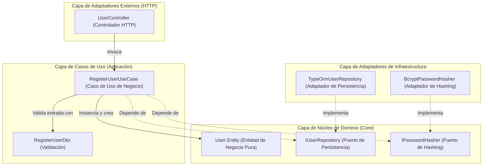

# 🏛️ Documento de Diseño de Arquitectura de Software (UMS)

Este documento detalla la especificación formal del diseño del sistema para el monorepo **`arc-nodejs-workspace`**. Adopta el estándar de modelado de software **Modelo C4** (Nivel 1: Contexto del Sistema, Nivel 2: Contenedores, Nivel 3: Componentes) y presenta el inventario técnico unificado y auditado del proyecto.

> [!IMPORTANT]
> **Mandato de Estándares de Ingeniería:** Todas las decisiones arquitectónicas descritas aquí están estrictamente gobernadas por los **[Estándares Globales de Ingeniería y el Manifiesto BMAD](../04-artifacts/engineering-standards.md)**. Principios como SOLID, Clean Architecture, DDD opcional y la evitación de anti-patrones son obligatorios y se aplican automáticamente a través de pipelines de CI/CD.

---

## 🎯 1. Entregables Arquitectónicos y Línea Base de Requerimientos

La siguiente tabla define los entregables obligatorios, el alcance estratégico y los requisitos de diseño contractual que rigen la arquitectura de software de este monorepo:

| Prioridad | Entregable | Descripción (Nivel Estratégico – Racional Ejecutivo) |
| :--- | :--- | :--- |
| **1** | Mapa de Contextos Acotados (Bounded Context Map) | Representación de los contextos acotados del dominio IAM de UMS, sus responsabilidades, cómo se relacionan y cómo evolucionarán. Establece un alcance funcional claro para los equipos y el presupuesto. |
| **2** | Definición del Core de la Plataforma | Estrategia que identifica capacidades transversales (Identidad, Datos Maestros, Bus de Eventos, API Gateway), su propósito común y principios de reutilización. Justifica las inversiones en componentes compartidos. |
| **3** | Diagrama C4 (Contexto, Contenedor, Componente) | Visión arquitectónica en los niveles 1 y 2: sistemas externos, contenedores grandes y comunicación entre ellos. Dimensiona la complejidad técnica y permite estimar el esfuerzo sin detallar clases o componentes internos. |
| **4** | Estrategia de Base de Datos | Sustenta la elección del patrón de persistencia (Base de datos por módulo), pautas para transacciones distribuidas y políticas generales de respaldo y recuperación. Detalla el impacto en costos y operaciones. |
| **5** | Modelo de Dominio de Eventos (Event Storming) | Mapa de eventos de negocio relevantes, sus productores y consumidores, junto con los principios de entrega y ordenamiento. Guía la integración y el esfuerzo asociado con la orquestación/coreografía. |
| **6** | Estrategia de Observabilidad Extremo a Extremo | Enfoque para la telemetría distribuida: trazabilidad de procesos de negocio completos, métricas clave y modelos de registro (logging) a nivel arquitectónico. Se utiliza para estimar herramientas de monitoreo y costos. |
| **7** | Diseño de Identidad y Autorización | Estrategia para el modelo de identidad y autorización: Proveedor de Identidad (IdP), flujo de autenticación entre contextos y pautas de sesión. Ayuda a dimensionar la seguridad en todos los dominios. |
| **8** | Requerimientos No Funcionales Documentados (NFRs) | Definición de requisitos no funcionales medibles que condicionan la arquitectura: latencia, rendimiento (throughput), disponibilidad y mecanismos de degradación controlada. Representa los objetivos contractuales que el diseño debe cumplir. |
| **9** | Estrategia de Gestión de Datos Maestros | Plan de trabajo para datos maestros: entidades clave, enfoque de migración desde SAP, pautas de calidad y fases. Justifica el esfuerzo de integración y limpieza de datos en el presupuesto. |
| **10** | Estrategia de Versionamiento y Evolución de APIs | Pautas para la evolución de contratos (APIs y eventos): cómo se introducen cambios sin romper dependencias. Prevé la gobernanza técnica y el costo de mantener la compatibilidad. |
| **11** | Estrategia de Sincronización Multi-Dominio | Enfoque para la consistencia eventual entre contextos: definición de fuentes de verdad, pautas de duplicación y resolución de conflictos. Revela la complejidad de integración y su impacto en los cronogramas. |
| **12** | Registros de Decisión de Arquitectura Iniciales (ADRs) | Registro de las decisiones arquitectónicas más influyentes, su justificación y alternativas. Respalda por qué se eligió un camino específico, aclarando riesgos y costos asumidos. |
| **13** | Plan de Pruebas de Contrato de Integración | Estrategia para asegurar que las interacciones entre contextos cumplan con sus contratos, integradas en el pipeline de CI/CD. Justifica el aseguramiento de la calidad en las integraciones sin detallar herramientas específicas. |
| **14** | Infraestructura de Despliegue | Diseño de la topología (nube/on-premise/híbrida), servicios gestionados clave y estimaciones de costos operativos. Proporciona una línea base financiera y técnica para el dimensionamiento. |
| **15** | Estructura de Desglose de Trabajo y Plan | Hoja de ruta con fases, sprints, perfiles, hitos y criterios de aceptación. Traduce la estrategia en un cronograma y justifica la carga de trabajo y los costos de cada etapa. |

---

## 🗺️ 2. Modelo C4

El diseño arquitectónico de UMS se modela en tres niveles progresivos de abstracción para alinear la visión de negocio con la implementación física del código.

### Nivel 1: Diagrama de Contexto del Sistema
Define el límite del Sistema de Gestión de Usuarios (UMS) interactuando con usuarios corporativos y servicios de identidad externos.

```mermaid
graph TD
    User["Usuarios Multi-Tenant (Personal del Tenant)"]
    ExternalUser["Usuarios Externos B2B (Clientes/Proveedores)"]
    Sponsor["Usuario Patrocinador (Aprobador Interno)"]
    Admin["Admin Global / Admin de Tenant / SRE"]
    UMS["Core de Autorización y Configuración UMS"]
    UMSConsole["Consola Web de Administración UMS (PAP)"]
    ExternalAuth["Servicio de Identidad Externo (OAuth / IdP del Tenant)"]
    InternalAuth["DB de Credenciales Interna (Login Nativo)"]
    ExternalFlags["Proveedores de Feature Flags (LaunchDarkly/Unleash)"]
    Downstream["Servicios SaaS Aguas Abajo"]

    User -->|Inicia sesión vía Auth Gateway| UMS
    ExternalUser -->|Envía Solicitud de Acceso| UMS
    Sponsor -->|Aprueba Solicitud Externa (UC-12)| UMSConsole
    Admin -->|Gestiona perfiles, configs, flags| UMSConsole
    UMSConsole -->|Llama a APIs de Auth y Config| UMS
    
    UMS -->|Rama A: Auth Federada| ExternalAuth
    UMS -->|Rama B: Auth Nativa Local| InternalAuth
    
    UMS -->|Evalúa Flags vía Adaptadores| ExternalFlags
    UMS -->|Inyecta Grafo de Auth y Estado de Config| Downstream
```

---

### Nivel 2: Diagrama de Contenedores
Mapea los subsistemas físicos (Frontend React, API NestJS, Base de Datos PostgreSQL) que componen el monorepo y cómo se comunican utilizando protocolos seguros.

```mermaid
graph TD
    subgraph Clients["Aplicaciones Cliente"]
        ReactApp["App Web Frontend React (Portal del Cliente)"]
        AdminApp["Consola Admin UMS (App React PAP)"]
        MobileApp["Futura App Móvil (iOS/Android)"]
    end

    subgraph Gateways["BFF Gateways"]
        WebBFF["Web BFF Gateway (.NET 8)"]
        MobileBFF["Mobile BFF Gateway (Optimizador de Payload)"]
    end

    subgraph Server["Servicios de Aplicación (Aislados por Tenant)"]
        BackendAPI["UMS Core (.NET 8 Auth, Identidad, Perfiles)"]
        ConfigAPI["Módulo de Configuración y Feature Flags"]
        PostgresDB["Base de Datos PostgreSQL 16 (Esquema Compartido + RLS)"]
        AuditDB["Libro de Auditoría y Solicitudes de Acceso (UC-12)"]
        RedisCache["Cluster Redis (Grafo de Auth + Cfg + Flags)"]
    end

    subgraph ExternalServices["Servicios Externos"]
        ExternalIdP["IdPs de Tenant (Zitadel / Azure AD / Okta)"]
        ExternalProviders["Proveedores de Flags (LaunchDarkly / ConfigCat)"]
    end

    ReactApp -->|1. HTTPS / JWT + Header de Tenant| WebBFF
    AdminApp -->|1. HTTPS / JWT + Token de SuperAdmin| WebBFF
    MobileApp -->|1. HTTPS / Payload Optimizado| MobileBFF
    WebBFF -->|2. TCP Interno / gRPC| BackendAPI
    WebBFF -->|2. TCP Interno / gRPC| ConfigAPI
    MobileBFF -->|2. TCP Interno / gRPC| BackendAPI
    BackendAPI -->|3. Establece contexto LOCAL de tenant vía RLS| PostgresDB
    ConfigAPI -->|3. Establece contexto LOCAL de tenant vía RLS| PostgresDB
    BackendAPI -->|4. Búsqueda en caché Read-Aside| RedisCache
    ConfigAPI -->|4. Lectura/Escritura de config y flags| RedisCache
    
    BackendAPI -->|5a. [Rama Auth IDP] Verifica Token| ExternalIdP
    BackendAPI -->|5b. [Rama Auth Interna] Verificación Bcrypt| PostgresDB
    
    ConfigAPI -->|5c. Eval de Flags enchufable vía IFeatureFlagPort| ExternalProviders
    BackendAPI -->|6. Transmite eventos de mutación y Aprobaciones| AuditDB
    ConfigAPI -->|6. Transmite eventos de configuración| AuditDB
```

---

### Nivel 3: Diagrama de Componentes de la API
Un zoom interactivo a la estructura de la **API NestJS**, demostrando el flujo de control hacia el núcleo (*Inversión de Control*) de la Arquitectura Hexagonal.



---

## 📊 3. Inventario Técnico de Dependencias (Sovereign Tech Inventory)

Este inventario detalla todas las herramientas, librerías, plugins y componentes por workspace con su respectiva versión instalada, recomendación de ciclo de vida técnico (*Staff Recommendation*) y URL de referencia oficial.

### 🦁 A. Backend (Capa de API NestJS)

| Dependencia / Librería | Versión Instalada | Recomendación Técnica | URL de Referencia |
| :--- | :--- | :--- | :--- |
| `@nestjs/core` | `^10.0.0` | **Mantener (Estable)** - Núcleo robusto para inyección de dependencias. | [Docs de NestJS](https://docs.nestjs.com/) |
| `@nestjs/throttler` | `^6.5.0` | **Mantener (Estable)** - Prevención de fuerza bruta y ataques DDoS locales. | [Rate Limiting en NestJS](https://docs.nestjs.com/security/rate-limiting) |
| `@nestjs/typeorm` | `^11.0.1` | **Mantener (Estable)** - Integración nativa de persistencia con soporte de transacciones. | [NestJS TypeORM](https://docs.nestjs.com/techniques/database) |
| `typeorm` | `^0.3.28` | **Mantener (Estable)** - ORM maduro con excelente soporte de migraciones y Type Safety. | [TypeORM Oficial](https://typeorm.io/) |
| `bcrypt` | `^6.0.0` | **Mantener (Estable)** - Algoritmo criptográfico robusto para almacenamiento de contraseñas. | [Bcrypt GitHub](https://github.com/kelektiv/node.bcrypt.js) |
| `helmet` | `^8.1.0` | **Mantener (Crítico)** - Inyección automática de cabeceras HTTP seguras (CORS, XSS). | [Docs de Helmet](https://helmetjs.github.com/) |
| `pg` | `^8.20.0` | **Mantener (Estable)** - Driver de conexión nativa de alto rendimiento para PostgreSQL. | [Node Postgres](https://node-postgres.com/) |
| `class-validator` | `^0.15.1` | **Mantener (Estable)** - Validación declarativa de DTOs en tiempo de ejecución. | [Class Validator](https://github.com/typestack/class-validator) |

---

### ⚛️ B. Frontend (Cliente Web React)

| Dependencia / Librería | Versión Instalada | Recomendación Técnica | URL de Referencia |
| :--- | :--- | :--- | :--- |
| `react` | `^18.3.1` | **Mantener (Estable)** - Versión ultra-estable compatible con ecosistemas maduros. | [Documentación de React](https://react.dev/) |
| `vite` | `^5.4.10` | **Mantener (Estable)** - Empaquetador ultra-rápido compatible con Node 18. | [Vite JS](https://vitejs.dev/) |
| `@tanstack/react-query`| `^5.100.9` | **Mantener (Crítico)** - Sincronización de estado del servidor asíncrona y caché inteligente. | [Docs de TanStack Query](https://tanstack.com/query/latest) |
| `zustand` | `^5.0.13` | **Mantener (Estable)** - Gestor de estado global ligero alternativo a Redux. | [Zustand GitHub](https://github.com/pmndrs/zustand) |
| `tailwindcss` | `^3.4.19` | **Mantener (Estable)** - Motor CSS de utilidades de alto rendimiento. | [Tailwind CSS](https://tailwindcss.com/) |
| `axios` | `^1.16.0` | **Mantener (Estable)** - Cliente HTTP robusto con soporte de interceptores globales. | [Docs de Axios](https://axios-http.com/) |
| `lucide-react` | `^1.14.0` | **Mantener (Estable)** - Colección moderna de iconos SVG reactivos. | [Lucide Icons](https://lucide.dev/) |

---

### 🛠️ C. Calidad y Gobernanza Global (Raíz del Monorepo)

| Dependencia / Librería | Versión Instalada | Recomendación Técnica | URL de Referencia |
| :--- | :--- | :--- | :--- |
| `nx` | `^20.3.0` | **Mantener (Crítico)** - Ejecutor de tareas de alto rendimiento con soporte de caché. | [Docs de Nx Dev](https://nx.dev/) |
| `eslint-plugin-boundaries`| `^5.0.0` | **Mantener (Estable)** - Gobernanza estricta para límites hexagonales. | [eslint-plugin-boundaries](https://github.com/javierguzman/eslint-plugin-boundaries) |
| `eslint-plugin-sonarjs` | `^3.0.0` | **Mantener (Estable)** - Análisis estático Sonar de costo cero para proyectos locales. | [SonarJS ESLint](https://github.com/SonarSource/eslint-plugin-sonarjs) |
| `husky` | `^9.0.0` | **Mantener (Estable)** - Intercepción y automatización de Git Hooks. | [Docs de Husky](https://typicode.github.io/husky/) |
| `lint-staged` | `^15.0.0` | **Mantener (Estable)** - Ejecución optimizada de linters solo en archivos Git Staged. | [lint-staged GitHub](https://github.com/lint-staged/lint-staged) |

---

## 🧠 4. Matriz de Decisión Arquitectónica

Esta matriz mapea las decisiones técnicas fundamentales con sus Atributos de Calidad objetivo, resumiendo la estrategia arquitectónica y los mecanismos de aplicación para asegurar un sistema verificable y sostenible bajo la **estrategia de IA impulsada por especificaciones BMAD-METHOD**:

| Decisión / Enfoque | Referencia ADR | Atributos de Calidad Primarios | Resumen de Decisión y Estrategia Técnica | Mecanismo de Aplicación y Verificación |
| :--- | :--- | :--- | :--- | :--- |
| **Orquestación de Monorepo** | [ADR 0001](../03-adrs/0001-monorepo-orchestration-nx.md) | Modularidad, Rendimiento de Build | Utiliza Nx y workspaces npm para gestionar módulos desacoplados con configuraciones localizadas. | Verificación de caché de Nx y chequeos de esquema de dependencias localizados. |
| **Límites Hexagonales** | [ADR 0002](../03-adrs/0002-clean-architecture-nestjs.md) | Desacoplamiento, Testabilidad, Agnosticismo | Implementa tres capas estrictas: Core (Entidades), Aplicación (Casos de Uso), Infraestructura (Adaptadores). | `eslint-plugin-boundaries` bloquea importaciones no autorizadas de afuera hacia adentro. |
| **Telemetría de Observabilidad** | [ADR 0007](../03-adrs/0007-observability-telemetry-loki-opentelemetry.md) | Observabilidad, Rendimiento, Monitoreo | Stack Grafana LGTM (Loki + Grafana + Tempo) con OpenTelemetry (OTel). | Pruebas de integración de OpenTelemetry y monitoreo de dashboards de Grafana. |
| **Gobernanza de Dependencias** | [ADR 0009](../03-adrs/0009-strict-dependency-pinning-vulnerability-management.md) | Seguridad, Estabilidad, Determinismo | Aplica tolerancia cero para versiones dinámicas (se eliminan `^`/`~`) para garantizar builds reproducibles. | `npm audit --audit-level=high` se ejecuta en CI para bloquear PRs vulnerables. |
| **SaaS Multi-Tenancy** | [ADR 0010](../03-adrs/0010-multi-tenancy-architecture-strategy.md) | Seguridad, Aislamiento de Datos, Eficiencia de Costos | Esquema de Base de Datos compartido con Seguridad a Nivel de Fila (RLS) de PostgreSQL para aplicar aislamiento de tenants. | `AsyncLocalStorage` propaga el Contexto del Tenant; los Suscriptores de TypeORM validan RLS. |
| **Tolerancia a Fallos y Resiliencia** | [ADR 0011](../03-adrs/0011-fault-tolerance-resiliency-patterns.md) | Resiliencia, Confiabilidad, Consistencia | Circuit Breaker (`opossum`) + reintentos con Exponential Backoff envueltos estrictamente dentro de los Adaptadores de Infraestructura. | Mocks de Jest simulando fallos HTTP y verificando transiciones de estado del circuito. |
| **Autorización Granular** | [ADR 0012](../03-adrs/0012-advanced-authorization-rbac-abac.md) | Seguridad, Trazabilidad, SoC | RBAC/ABAC consciente del tenant utilizando decodificadores de claims JWT y Guards de contexto de ejecución de NestJS. | Pruebas de integración simulando intentos de acceso entre tenants. |
| **Caché Distribuida** | [ADR 0014](../03-adrs/0014-distributed-caching-strategy-redis.md) | Rendimiento, Descarga de Base de Datos | Caché Read-Aside con almacén Redis, completamente oculto tras una abstracción pura de Core `ICachePort`. | Pruebas de integración de Redis y verificación estricta de TTL. |
| **Desacoplamiento Basado en Eventos** | [ADR 0015](../03-adrs/0015-event-driven-architecture-intra-domain.md) | Desacoplamiento, Escalabilidad, Extensibilidad | Los módulos del monolito se comunican asíncronamente utilizando un bus de eventos interno oculto tras `IEventBusPort`. | Pruebas unitarias verificando rutas de ejecución asíncronas y formatos de payload. |
| **Auditoría Inmutable** | [ADR 0016](../03-adrs/0016-immutable-business-audit-trail.md) | Trazabilidad, Cumplimiento, Seguridad | Rastrea automáticamente las mutaciones críticas de negocio (Valor Anterior -> Valor Nuevo) utilizando suscriptores de base de datos. | Interceptores de Lifecycle Hook de TypeORM con tablas estrictamente aisladas. |
| **Integridad de Dominio Táctico** | [ADR 0019](../03-adrs/0019-tactical-design-patterns-future-proofing.md) | Desacoplamiento, Claridad, Preparación para Dapr | Utiliza el Patrón Result, Null Objects y Decoradores para proteger el Core de lanzar errores HTTP o de frameworks externos. | Tipos de retorno obligatorios y reglas personalizadas de ESLint boundaries. |
| **Abstracción del Proveedor de Identidad** | [ADR 0020](../03-adrs/0020-identity-provider-abstraction-strategy.md) | Desacoplamiento, Neutralidad de Proveedor, Extensibilidad | Abstrae directorios externos (Zitadel, Okta, SAML) vía el Patrón Strategy envuelto bajo un Puerto Hexagonal. | Pruebas unitarias de Jest verificando el enrutamiento agnóstico de credenciales. |
| **Compilación de Alto Rendimiento** | [ADR 0021](../03-adrs/0021-high-performance-auth-and-graph-compilation.md) | Rendimiento, Latencia Ultra Baja, Escalabilidad | Resuelve grafos de permisos jerárquicos dinámicos en menos de 5ms utilizando caché read-aside de Redis. | Pruebas de carga Locust y trazabilidad de telemetría SRE. |
| **Autenticación Contextual** | [ADR 0022](../03-adrs/0022-contextual-auth-and-pluggable-projections.md) | Multi-Tenancy, Personalización, Extensibilidad | Soporta resolución de contexto de sedes corporativas localizadas y proyecta grafos compilados en múltiples formatos de salida. | Pruebas de integración verificando estructuras de menú dinámicas específicas por sede. |
| **Kernel de Autorización Centralizado** | [ADR 0023](../03-adrs/0023-centralized-ums-vs-decentralized-access.md) | Seguridad, SoC, Gobernanza | Establece el UMS como un núcleo de autorización centralizado compartido en todas las aplicaciones empresariales. | Chequeos estrictos de límites de ESLint y auditorías centralizadas del libro de acceso. |

---

## 📈 5. Gestión de Deuda Técnica y Hoja de Ruta Arquitectónica (Backlog)

Para garantizar la evolución saludable del monorepo hacia modelos distribuidos y telemetría de producción, se establecen los siguientes elementos en el backlog de arquitectura:

*   **[ADR 0006: Transición Futura a Microservicios con Dapr](../03-adrs/0006-future-microservices-transition-dapr.md)**: Establece los criterios técnicos y disparadores que determinarán cuándo dividir el monolito modular en microservicios independientes gobernados por sidecars de Dapr.
*   **[ADR 0008: Evolución Progresiva Multi-Módulo con API Gateway y BFF](../03-adrs/0008-progressive-multimodule-evolution-gateway-bff.md)**: Establece el diseño progresivo para transformar esta solución de referencia 100% Node.js en un portal multi-módulo capaz de integrar sistemas independientes (TMS, WMS, etc.) expuestos como servicios con bases de datos aisladas, consumidos a través de un API Gateway central y optimizados mediante gateways Backend For Frontend (BFF) para clientes Web y Móviles.
*   **[ADR 0009: Pinning Estricto de Dependencias y Gestión Automatizada de Vulnerabilidades](../03-adrs/0009-strict-dependency-pinning-vulnerability-management.md)**: Establece la estrategia de tolerancia cero para versiones dinámicas de dependencias, aplicando versiones estáticas en todo el monorepo, con actualizaciones automáticas de bots de dependencias y chequeos de vulnerabilidad CI altos/críticos.
*   **[ADR 0010: Estrategia de Arquitectura Multi-Tenancy para la Evolución SaaS](../03-adrs/0010-multi-tenancy-architecture-strategy.md)**: Establece la estrategia híbrida de multi-tenancy agrupada utilizando un esquema compartido de PostgreSQL junto con Seguridad a Nivel de Fila (RLS) para aplicar el aislamiento absoluto de datos a nivel de motor para una escalabilidad SaaS rentable.
*   **[ADR 0013: Topología de Infraestructura Cloud y DR](../03-adrs/0013-cloud-infrastructure-topology-dr.md)**: Establece topologías de alta disponibilidad y recuperación ante desastres en múltiples zonas de disponibilidad.
*   **[ADR 0024: Plataforma de Gestión de Configuración y Features](../03-adrs/0024-configuration-feature-management-platform.md)**: Extiende UMS para manejar configuración dinámica del sistema y configuraciones multi-IdP.
*   **[ADR 0025: Abstracción del Proveedor de Feature Flags](../03-adrs/0025-feature-flag-provider-abstraction.md)**: Framework enchufable para proveedores de flags externos vía `IFeatureFlagPort`.

---

## 🛡️ 6. Evaluación de Riesgo Financiero y Operativo

Una evaluación exhaustiva de las decisiones **"Build vs. Buy"**, implicaciones de licenciamiento y costos operativos asociados con el stack tecnológico soberano.

*   **[Evaluación de Riesgo de Proveedor y Financiero](./vendor-risk-assessment.md)**: Documentación de línea base que analiza Proveedores de Identidad, licenciamiento de Redis, plataformas de Feature Flags y almacenamiento en caché de Nx Cloud para prevenir cargas financieras inesperadas.

---

## 🏛️ 7. Arquitectura del Motor de Autorización Centralizado (PEP/PDP/PAP/PIP)

Para soportar un control de acceso seguro, consciente del contexto y altamente escalable en todas las aplicaciones corporativas, el sistema adopta un **Sistema de Gestión de Usuarios (UMS)** centralizado que sirve como un "kernel de autorización" compartido. Esta arquitectura desacopla la validación de identidad de la resolución de permisos dinámicos implementando las capas del **Modelo de Referencia Arquitectónica XACML**:

1.  **Policy Enforcement Point (PEP)**: Intercepta las solicitudes entrantes del cliente en el API Gateway o en Guards individuales de NestJS, aplicando las reglas de acceso al leer el grafo de autorización devuelto.
2.  **Policy Decision Point (PDP)**: El motor central de UMS. Compila y resuelve permisos de grano fino en un grafo jerárquico almacenado en caché en menos de 5ms utilizando Redis.
3.  **Policy Administration Point (PAP)**: El portal administrativo de UMS donde los equipos de seguridad gestionan plantillas base, perfiles de tenant y reglas de permiso explícitas.
4.  **Policy Information Point (PIP)**: Registros relacionales de PostgreSQL que suministran atributos activos de tenant, sede y usuario durante la evaluación del grafo.

Al utilizar el **Patrón Strategy** para proyecciones de salida dinámicas, el UMS puede formatear el grafo compilado en una variedad de estructuras de destino sobre la marcha (incluyendo JSON optimizado para frontend, alcances JWT firmados criptográficamente o listas basadas en claims), asegurando una alta adaptabilidad y una longevidad completa sin bloqueos de proveedor. Para un análisis completo del modelo de referencia de Analista de Negocio y los contratos de API, consulte **[enterprise-iam-ums-specification.md](../04-artifacts/enterprise-iam-ums-specification.md)**.
