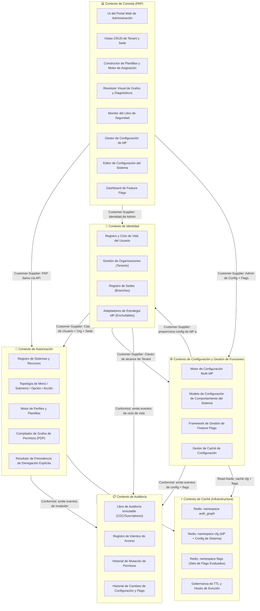

# 🗺️ Mapa de Contextos Acotados — Sistema de Gestión de Usuarios (UMS)

Este documento establece el **Mapa de Contextos Acotados de Diseño Dirigido por Dominios (DDD)** formal para la plataforma UMS. Define los límites de cada contexto de dominio, sus responsabilidades internas y los contratos de integración entre ellos.

> [!IMPORTANT]
> Este es un **Entregable Arquitectónico de Prioridad 1** según lo establecido en `architecture-spec.md`. Todos los equipos deben alinearse con este mapa antes de implementar funcionalidades que crucen los límites de los contextos.

---

## 📐 1. Descripción General del Mapa de Contextos

---

## 📦 2. Definiciones de Contexto

### 🔐 A. Contexto de Identidad
**Misión:** Gestionar el ciclo de vida de todos los principales (usuarios) y las estructuras organizativas (tenants y sedes) a las que pertenecen. Delegar la verificación de credenciales a Proveedores de Identidad externos y enchufables utilizando las configuraciones suministradas por el Contexto de Configuración.

**Es dueño de:**
- Agregado `User` (registro, suspensión, baja)
- Agregado `Organization` (Tenant)
- Agregado `Branch` (Sede)
- `IAuthenticationPort` (adaptador de estrategia de IdP enchufable — lee del Contexto de Configuración)

**NO es dueño de:**
- Reglas de autorización o lógica de permisos
- Almacenamiento del libro de auditoría
- Datos de configuración de IdP (propiedad del Contexto de Configuración)

**Contratos de Integración (Lenguaje Publicado):**
- `UserRegisteredEvent { userId, organizationId, branchId, identityReference }`
- `UserSuspendedEvent { userId, tenantId }`
- `OrganizationCreatedEvent { tenantId, idpStrategy }`

---

### 🔑 B. Contexto de Autorización
**Misión:** Actuar como el **Punto de Decisión de Políticas (PDP)**. Compilar y resolver el grafo de autorización jerárquico para cualquier principal autenticado basado en su organización, sede, perfiles y plantillas adjuntas.

**Es dueño de:**
- Agregado `System` (aplicaciones cliente registradas)
- Topología `Menu → Submenu → Option → Action`
- Agregado `Profile`
- Agregado `AuthorizationTemplate`
- `Authorization` (registros de Permitir/Denegar)
- `Compilador de Grafos de Permisos` (motor central)
- Motor de reglas de `Precedencia de Denegación Explícita`

**NO es dueño de:**
- Verificación de identidad (delegada al Contexto de Identidad vía puerto)
- Almacenamiento en caché (delegado al Contexto de Caché vía `ICachePort`)
- Renderizado de la UI de administración (delegado al Contexto de Consola)
- Estado de feature flags (delegado al Contexto de Configuración)

**Contratos de Integración (Lenguaje Publicado):**
- `GET /v1/authorization/graph` → devuelve `HierarchicalJsonGraph`
- `POST /v1/authorization/templates` → crea plantilla versionada
- `PermissionMutatedEvent { userId, profileId, effect, actionId, timestamp }`

---

### ⚙️ C. Contexto de Configuración y Gestión de Funciones *(NUEVO)*
**Misión:** Gobernar el **comportamiento dinámico de tiempo de ejecución multi-tenant** de todos los sistemas integrados con UMS sin requerir cambios de código o despliegue. Posee tres pilares de capacidad:
1. **Motor de Configuración Multi-IdP** — registro de IdP por tenant/sistema con prioridad/fallback.
2. **Configuración de Comportamiento del Sistema** — configuración JSON versionada para auth, sesión, marca, módulos.
3. **Framework de Feature Flags** — motor de toggles centralizado y multidimensional con estrategias de rollout.

**Es dueño de:**
- Agregado `IdpConfiguration`
- Agregado `SystemConfiguration` (versionado)
- Agregado `FeatureFlag`
- Agregado `FeatureFlagProviderConfig` *(overrides de proveedor por tenant)*
- `FlagEvaluationEngine` (servicio de dominio — enruta vía puerto)
- `IFeatureFlagPort` (puerto central — enchufable: Interno, LaunchDarkly, Unleash, ConfigCat, Azure App Config)
- `IConfigCachePort` (puerto de infraestructura — separado del caché del grafo de auth)
- `ISecretStorePort` (puerto de infraestructura — credenciales referenciadas en vault)

**NO es dueño de:**
- Identidades de usuario u organización (solo las referencia como claves foráneas)
- Grafos de permisos (pertenece al Contexto de Autorización)
- UI de administración (pertenece al Contexto de Consola)

**Contratos de Integración (Lenguaje Publicado):**
- `GET /v1/config/idp?tenant_id&system_id` → devuelve el conjunto ordenado de config de IdP
- `GET /v1/config/system/{system_id}?tenant_id` → devuelve la configuración activa del sistema
- `POST /v1/flags/evaluate` → devuelve el conjunto de flags evaluados para un contexto de ejecución
- `IdpConfigUpdatedEvent { configId, tenantId, version, timestamp }`
- `SystemConfigPublishedEvent { configId, systemId, tenantId, version }`
- `FeatureFlagStateChangedEvent { flagCode, newStatus, targetScope, changedBy }`

---

### 📋 D. Contexto de Auditoría
**Misión:** Mantener un **libro de contabilidad inmutable y a prueba de manipulaciones** de todos los eventos de identidad, mutaciones de permisos **y cambios de configuración**. Atiende necesidades de cumplimiento, forenses y diagnósticos de SRE.

**Es dueño de:**
- Entidad `AuditRecord` (quién, cuándo, qué, resultado)
- `AccessAttemptLog` (éxito/fallo de autenticación)
- `PermissionMutationHistory` (cambios de PERMITIR/DENEGAR)
- `ConfigChangeHistory` (mutaciones de config de IdP, config de sistema, feature flags) *(NUEVO)*

**Patrón de Integración:** Suscriptor basado en eventos (Conformist). Recibe eventos de los contextos de Identidad, Autorización y Configuración a través del bus de eventos interno (`IEventBusPort`).

---

### 💻 E. Contexto de Consola (Punto de Administración de Políticas — PAP)
**Misión:** Proporcionar el **Portal Web Administrativo** que permite a los SuperAdmins y Gerentes de Tenant gobernar organizaciones, sistemas, perfiles, plantillas, configuraciones de IdP, configuraciones de sistema y feature flags.

**Es dueño de:**
- Portal Web de Administración (React SPA)
- UI de Constructor de Plantillas y Configurador de Reglas de Asignación Automática
- Resolutor Visual de Grafos
- **Gestor de Configuración de IdP** *(NUEVO)*
- **Editor de Configuración del Sistema** *(NUEVO)*
- **Dashboard de Feature Flags** *(NUEVO)*

**Patrón de Integración:** Customer-Supplier. Llama a todos los contextos del backend a través de sus APIs REST publicadas. Se autentica utilizando el mismo AuthGateway de UMS con un `system_id` de alcance `SuperAdmin`.

---

### ⚡ F. Contexto de Caché (Infraestructura)
**Misión:** Proporcionar una capa de caché distribuida de alto rendimiento para grafos de autorización, configuraciones de sistema y evaluaciones de feature flags — todo bajo una gobernanza estricta de namespaces.

**Namespaces de Caché:**
| Namespace | Contexto Dueño | Patrón de Clave | TTL |
| :--- | :--- | :--- | :--- |
| `auth_graph:*` | Contexto de Autorización | `auth_graph:{userId}:{systemId}:{tenantId}:{branchId}` | 3600s |
| `cfg:idp:*` | Contexto de Configuración | `cfg:idp:{tenantId}:{systemId}` | 900s |
| `cfg:sys:*` | Contexto de Configuración | `cfg:sys:{systemId}:{tenantId}` | 300s |
| `flags:*` | Contexto de Configuración | `flags:{systemId}:{tenantId}:{userId}` | 60s |

**Patrón de Integración:** Oculto tras abstracciones puras de puertos del núcleo (`ICachePort`, `IConfigCachePort`). Solo los adaptadores de infraestructura interactúan directamente con Redis.

---

## 🔗 3. Relaciones de Contexto

| Contexto Aguas Arriba (Upstream) | Contexto Aguas Abajo (Downstream) | Patrón | Contrato |
| :--- | :--- | :--- | :--- |
| Contexto de Identidad | Contexto de Autorización | **Customer-Supplier** | Claims de Usuario/Org/Sede enviados como eventos o consultados vía API |
| Contexto de Identidad | Contexto de Configuración | **Customer-Supplier** | Claves de alcance de Tenant utilizadas para el aislamiento de configuración |
| Contexto de Configuración | Contexto de Identidad | **Customer-Supplier** | Configuración de IdP suministrada al Auth Gateway para el enrutamiento |
| Contexto de Autorización | Contexto de Auditoría | **Conformist (Evento)** | Publica `PermissionMutatedEvent` |
| Contexto de Identidad | Contexto de Auditoría | **Conformist (Evento)** | Publica `UserRegisteredEvent`, `UserSuspendedEvent` |
| Contexto de Configuración | Contexto de Auditoría | **Conformist (Evento)** | Publica `IdpConfigUpdatedEvent`, `SystemConfigPublishedEvent`, `FeatureFlagStateChangedEvent` |
| Contexto de Consola | Contexto de Autorización | **Customer-Supplier** | PAP llama a APIs de Autorización para gestión de plantillas/perfiles |
| Contexto de Consola | Contexto de Identidad | **Customer-Supplier** | PAP llama a APIs de Identidad para gestión de org/sedes |
| Contexto de Consola | Contexto de Configuración | **Customer-Supplier** | PAP llama a APIs de Configuración para gestión de IdP, config de sistema y flags |
| Contexto de Autorización | Contexto de Caché | **Shared Kernel (ICachePort)** | Read-aside; invalidación en eventos de mutación |
| Contexto de Configuración | Contexto de Caché | **Shared Kernel (IConfigCachePort)** | Read-aside para cfg + flags; invalidación en eventos de configuración |

---

## 🚧 4. Capas Anti-Corrupción (ACL)

| Límite | Mecanismo ACL | Razón |
| :--- | :--- | :--- |
| Autorización ↔ IdP Externo | `IAuthenticationPort` (Patrón Strategy) | Evita que el SDK de Zitadel/Okta contamine el núcleo |
| Configuración ↔ Proveedores de Feature Flags | `IFeatureFlagPort` (Patrón Strategy) | Evita que los SDKs de LaunchDarkly/Unleash/ConfigCat se acoplen al núcleo. Refleja el diseño de IAuthenticationPort (ADR-0025). |
| Configuración ↔ Secret Vault | `ISecretStorePort` (Patrón Strategy) | Evita que el SDK de AWS Secrets Manager / HashiCorp Vault se filtre en el dominio |
| Configuración ↔ Redis (cfg/flags) | `IConfigCachePort` | Puerto separado del caché del grafo de auth para aplicar gobernanza de namespaces |
| Autorización ↔ Redis (auth_graph) | `ICachePort` | Evita que el cliente de Redis se filtre en la capa de dominio |
| Autorización ↔ Bus de Eventos | `IEventBusPort` | Evita que Kafka/RabbitMQ se acoplen a los casos de uso |
| Consola ↔ APIs de UMS | Contratos de API REST (versionados) | La consola es un consumidor externo; se trata como a cualquier tercero |
