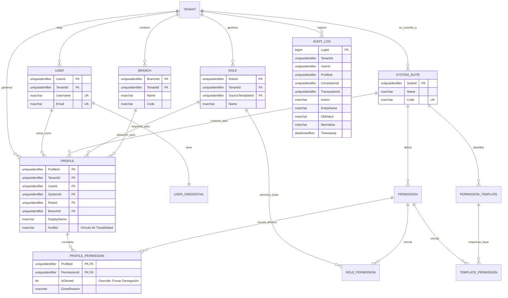

# 🗄️ Modelo Entidad-Relación (E/R) - SQL Server 2022

**Tipo de Documento:** Diseño de Base de Datos  
**Estatus:** Refactorizado (Centrado en el Perfil)  
**Arquitectura:** Multi-tenancy Contextual (Hub de Perfiles)  
**Motor:** SQL Server 2022

## 1. Introducción
Este documento detalla el modelo de datos **Centrado en el Perfil** para el **User Management System (UMS)**. El modelo gira en torno a la entidad `Profile`, que sirve como la consolidación contextual de la identidad y la autoridad a través de Sistemas, Roles y Sucursales.

---

## 2. Estándares Corporativos de Auditoría y Trazabilidad
Cada tabla en este esquema DEBE implementar las siguientes columnas de auditoría para cumplir con los estándares de gobernanza corporativa.

| Columna | Tipo | Descripción |
| :--- | :--- | :--- |
| `CreatedAt` | `datetimeoffset` | Marca de tiempo de creación. |
| `CreatedBy` | `uniqueidentifier` | ID del usuario/sistema que creó el registro. |
| `UpdatedAt` | `datetimeoffset` | Marca de tiempo de la última actualización (Nulo). |
| `UpdatedBy` | `uniqueidentifier` | ID del usuario/sistema que actualizó el registro por última vez. |
| `DeletedAt` | `datetimeoffset` | Marca de tiempo de eliminación lógica (Nulo). |
| `DeletedBy` | `uniqueidentifier` | ID del usuario/sistema que eliminó el registro. |
| `Version` | `int` | Versión de la fila para concurrencia optimista (Predeterminado: 1). |
| `Status` | `int` | Estado del registro (1: Activo, 0: Inactivo, 99: Eliminado). |

---

## 3. Diagrama E/R (Mermaid)

---

## 4. Multi-tenancy y Aislamiento
El aislamiento se aplica mediante **SQL Server Row-Level Security (RLS)**.

*   **Entidades Globales** (`SystemSuites`, `Permissions`, `GlobalTemplates`): Accesibles por todos los inquilinos.
*   **Entidades de Inquilino** (`Users`, `Roles`, `Profiles`, `Branches`): Aisladas por `TenantId` utilizando `SESSION_CONTEXT(N'TenantId')`.
*   **Resolución Efectiva**: El `Motor de Autorización` resuelve los permisos principalmente desde `ProfilePermissions` para el `ActiveProfileId`.

---

## 5. Persistencia de Autorizaciones Efectivas
*   Cuando se crea un **Perfil**, los permisos del **Rol** seleccionado (y su Plantilla) se proyectan en `ProfilePermissions`.
*   Cualquier **Anulación (Override)** realizada por un administrador se almacena directamente en `ProfilePermissions` para ese `ProfileId` específico.
*   Esto garantiza que el `Motor de Autorización` realice una única combinación (join) altamente indexada para recuperar el conjunto completo de permisos para el contexto actual del usuario.
