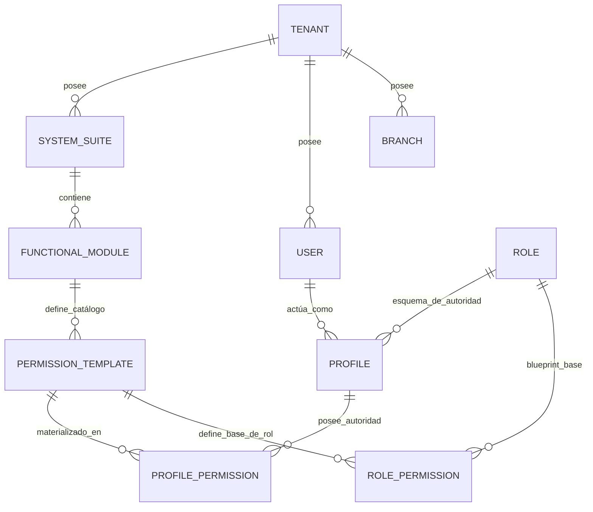
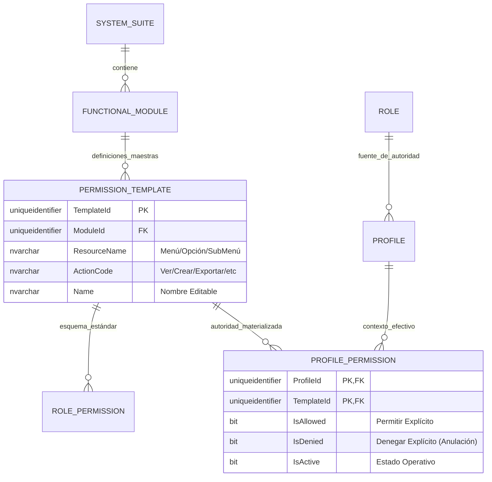
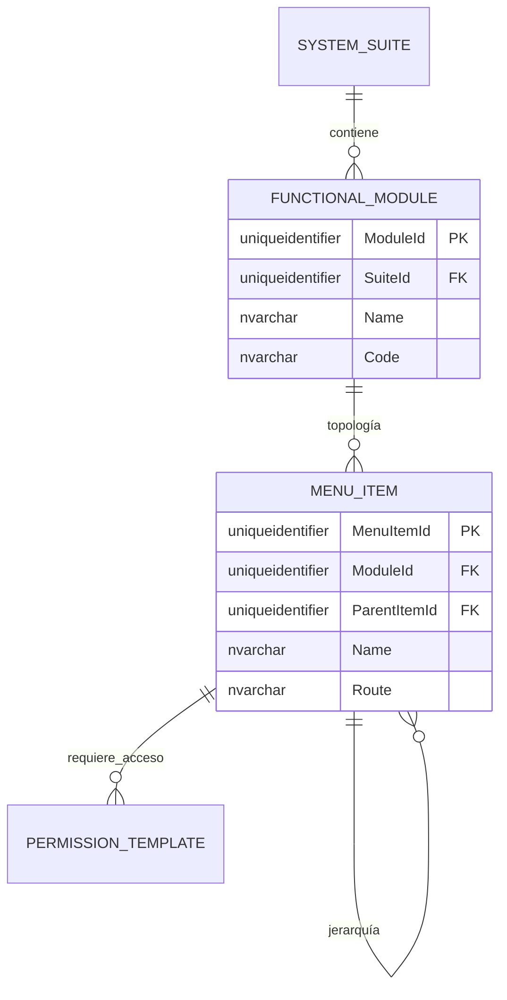
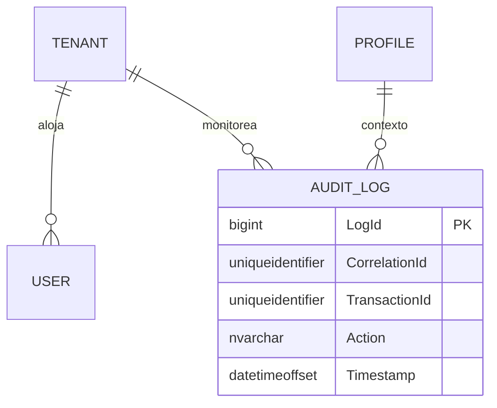

# 🗄️ Modelo Entidad-Relación (E/R) - SQL Server 2022

**Tipo de Documento:** Diseño de Base de Datos  
**Estatus:** Refactorizado (Impulsado por Plantillas Maestras)  
**Arquitectura:** Framework Jerárquico (Autoridad Materializada)  
**Motor:** SQL Server 2022

> [!TIP]
> **¿Problemas de Visualización?**  
> Si los diagramas Mermaid no se renderizan correctamente, utiliza los **[🚀 Formatos de Exportación Alternativos (dbdiagram.io, DDL, D2)](./er-export-formats.md)**. Estos formatos son compatibles con herramientas profesionales como DBeaver, SSMS y dbdiagram.io.

## 1. Introducción
Este documento detalla el modelo de datos **Impulsado por Plantillas Maestras**. Cada permiso efectivo en el sistema debe ser una instancia materializada de una `PermissionTemplate` controlada, garantizando una gobernanza del 100% sobre el catálogo de autoridad.

---

## 2. Estándares Corporativos de Auditoría y Trazabilidad
Cada entidad en este esquema DEBE implementar las siguientes columnas.

| Columna | Tipo | Descripción |
| :--- | :--- | :--- |
| `CreatedAt` | `datetimeoffset` | Marca de tiempo de creación. |
| `CreatedBy` | `uniqueidentifier` | ID del creador. |
| `UpdatedAt` | `datetimeoffset` | Marca de tiempo de actualización. |
| `UpdatedBy` | `uniqueidentifier` | ID del último actualizador. |
| `DeletedAt` | `datetimeoffset` | Marca de tiempo de eliminación lógica. |
| `DeletedBy` | `uniqueidentifier` | ID del eliminador. |
| `Version` | `int` | Bloqueo optimista (Predeterminado: 1). |
| `IsActive` | `bit` | Indicador de estado. |
| `TenantId` | `uniqueidentifier` | Aislamiento contextual. |
| `CorrelationId`| `uniqueidentifier` | Trazabilidad distribuida. |

---

## 3. Vistas Modulares por Dominio

### 🗺️ 3.1 Mapa Global de Alto Nivel
Vista completa de las relaciones entre módulos núcleo.

---

### 🔐 3.2 Dominio: Framework de Autorización Maestro (El Núcleo)
Este dominio gestiona el catálogo de permisos inmutables y su materialización en perfiles.

---

### 📍 3.3 Dominio: Topología Funcional y Navegación
Estructura jerárquica de sistemas y menús.

---

### 📝 3.4 Dominio: Auditoría e Identidad
Gestión de identidades y trazabilidad global.

---

## 4. Reglas de Negocio y Normalización
1.  **Primacía de la Plantilla**: `PermissionTemplate` es la fuente maestra absoluta. No se permiten permisos ad-hoc.
2.  **Autoridad de Triple Estado**: `ProfilePermission` utiliza `IsAllowed`, `IsDenied` e `IsActive` para resolver la autoridad final.
3.  **Jerarquía**: `Sistema > Módulo > Menú > Acción`.
4.  **Matriz de Acciones**: Las plantillas admiten acciones granulares: `view`, `create`, `edit`, `delete`, `approve`, `export`, `import`, `print`, `copy`, `download`, `execute`, `manage`, `assign`, `audit`.
5.  **Eliminación Lógica (Soft Delete)**: Obligatoria para todas las entidades para mantener la integridad de la auditoría.
