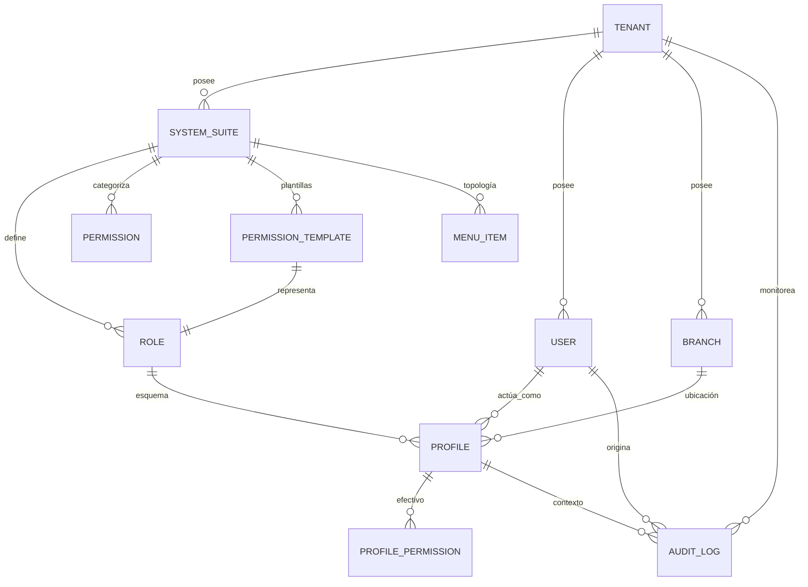
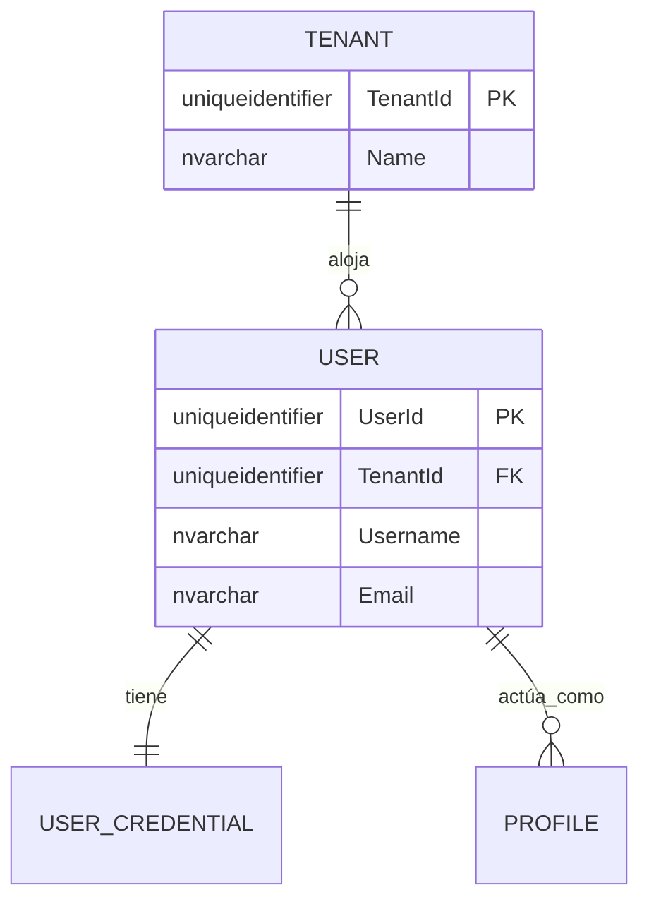
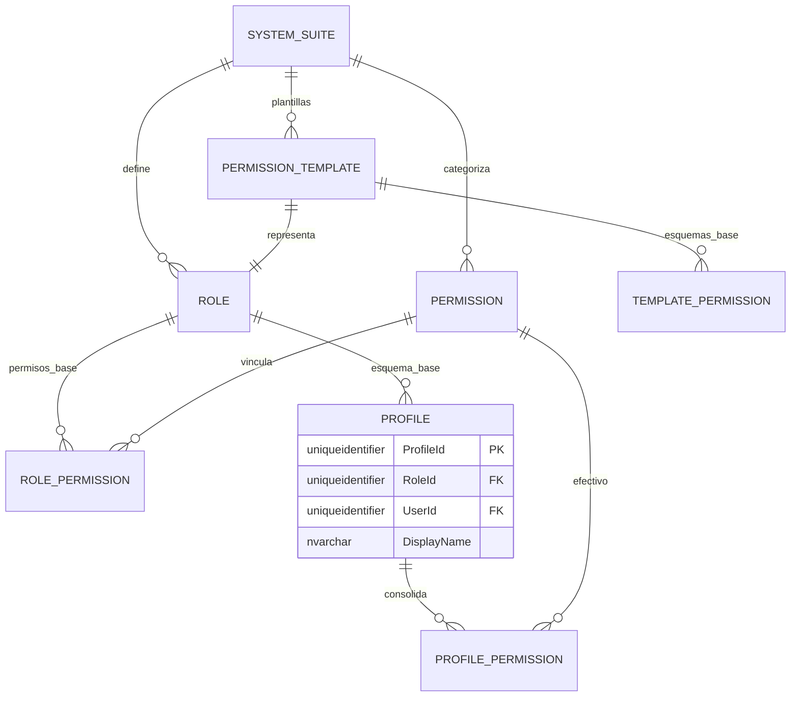
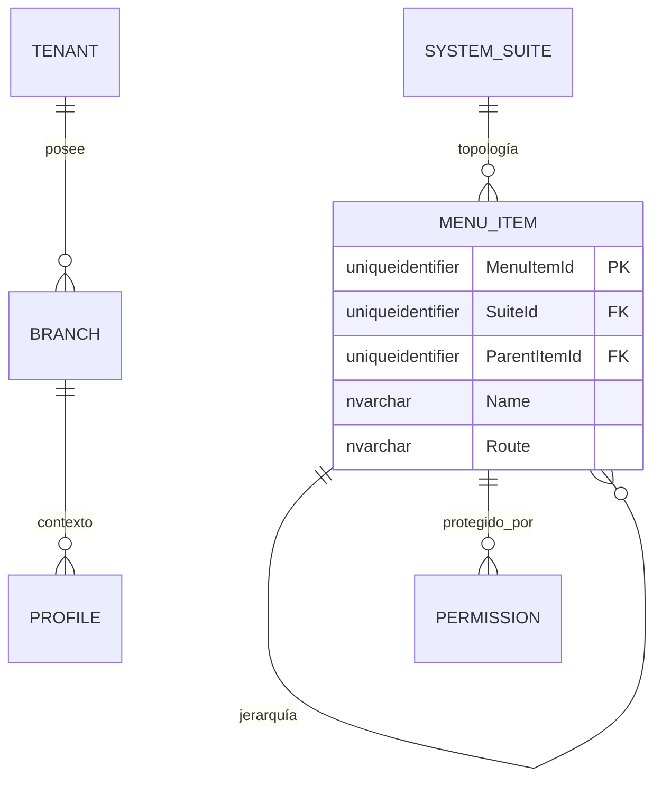
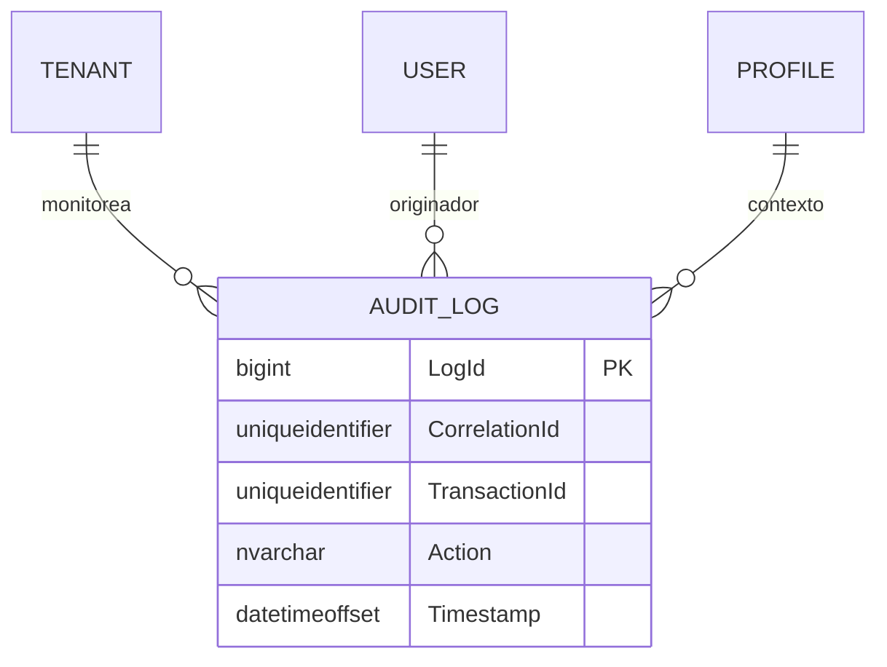

# 🗄️ Modelo Entidad-Relación (E/R) - SQL Server 2022

**Tipo de Documento:** Diseño de Base de Datos  
**Estatus:** Refactorizado (Modelo Perfil Enterprise)  
**Arquitectura:** Multi-tenancy Jerárquico (Nexo de Perfiles)  
**Motor:** SQL Server 2022

## 1. Introducción
Este documento detalla el modelo de datos **Centrado en el Perfil Enterprise** para el **User Management System (UMS)**. El modelo impone una propiedad jerárquica estricta y posiciona al `Profile` como la intersección contextual de la identidad y la autorización.

---

## 2. Estándares Corporativos de Auditoría y Trazabilidad
Cada entidad en este esquema DEBE implementar las siguientes columnas.

| Columna | Tipo | Descripción |
| :--- | :--- | :--- |
| `CreatedAt` | `datetimeoffset` | Marca de tiempo de creación. |
| `CreatedBy` | `uniqueidentifier` | ID del creador. |
| `UpdatedAt` | `datetimeoffset` | Marca de tiempo de actualización. |
| `UpdatedBy` | `uniqueidentifier` | ID del último actualizador. |
| `DeletedAt` | `datetimeoffset` | Marca de tiempo de eliminación lógica. |
| `DeletedBy` | `uniqueidentifier` | ID del eliminador. |
| `Version` | `int` | Bloqueo optimista (Predeterminado: 1). |
| `IsActive` | `bit` | Indicador de estado activo. |
| `TenantId` | `uniqueidentifier` | Aislamiento contextual (cuando aplique). |
| `CorrelationId`| `uniqueidentifier` | Trazabilidad en operaciones distribuidas. |

---

## 3. Diagrama E/R (Mermaid)

## 3. Vistas Modulares por Dominio

Para mejorar la legibilidad y la navegación, el modelo se divide en dominios funcionales.

### 🗺️ 3.1 Mapa Global de Alto Nivel
Vista completa de las relaciones entre módulos núcleo.

---

### 👤 3.2 Dominio: Identidad y Núcleo
Gestión de Inquilinos, Usuarios y sus credenciales primarias.

---

### 🔐 3.3 Dominio: Perfiles y Autoridad (El Núcleo)
El corazón del UMS: cómo los Roles, Plantillas y Perfiles se consolidan en Permisos Efectivos.

---

### 📍 3.4 Dominio: Topología y Navegación
Estructura organizacional y disposición funcional de menús.

---

### 📝 3.5 Dominio: Auditoría y Trazabilidad
Monitoreo global e integridad transaccional.

---

## 🛠️ 4. Exploración Interactiva
Dado que los visores de Markdown son estáticos, para una experiencia dinámica completa (zoom/pan/expandir), utilice las siguientes herramientas:

1.  **Mermaid Live Editor**: Copie los bloques de código Mermaid anteriores en [Mermaid.live](https://mermaid.live/) para explorar e exportar interactivamente en alta resolución.
2.  **Extensiones de VS Code**: Utilice "Markdown Preview Mermaid Support" para habilitar el zoom dentro de su IDE.

---

## 4. Reglas de Negocio y Normalización
1.  **Aislamiento Estricto**: Un Rol no puede existir fuera de un contexto de Sistema.
2.  **Integridad Contextual**: Un Perfil solo puede crearse si el Rol seleccionado pertenece al Sistema seleccionado, y ambos pertenecen al mismo Tenant.
3.  **Hub de Plantillas**: Las plantillas de permisos vinculan a un Rol de Sistema específico, permitiendo la inicialización de perfiles de forma agnóstica a la sucursal.
4.  **Eliminación Lógica (Soft Delete)**: Los datos nunca se eliminan físicamente; se completa `DeletedAt` para mantener el historial.
5.  **Persistencia Efectiva**: `PROFILE_PERMISSION` actúa como la fuente de verdad para el `Motor de Autorización`, combinando los valores por defecto del Rol con las anulaciones específicas del Perfil.
