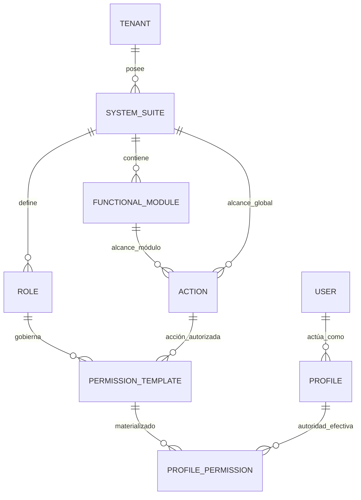
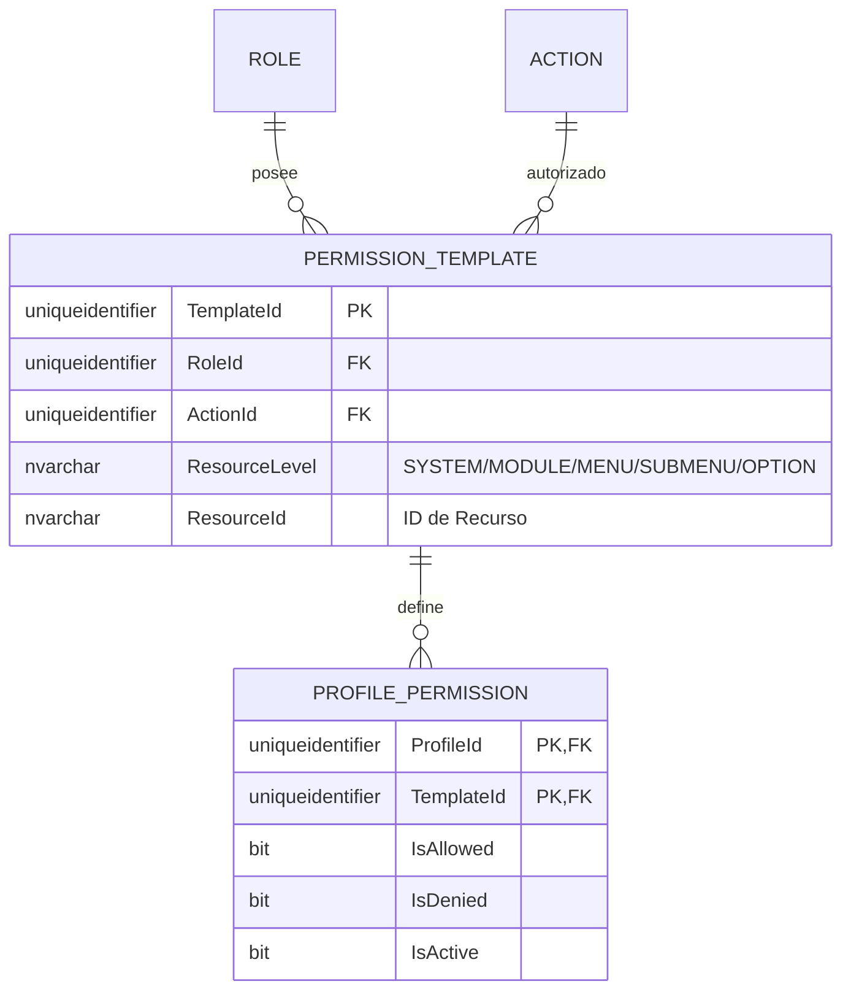
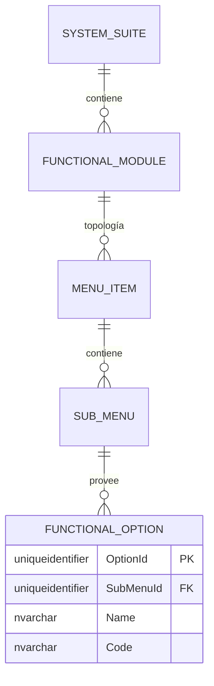

# 🗄️ Modelo Entidad-Relación (E/R) - SQL Server 2022

**Tipo de Documento:** Diseño de Base de Datos  
**Estatus:** Refactorizado (Gobernanza de Plantillas Vinculadas al Rol)  
**Arquitectura:** Framework Maestro de Jerarquía Profunda  
**Motor:** SQL Server 2022

## 1. Introducción
Este documento detalla el modelo de **Plantillas Vinculadas al Rol**. Toda autoridad autorizada se define dentro de una `PermissionTemplate` propiedad de un `Role`, garantizando una alineación estricta con los límites funcionales.

> [!TIP]
> **¿Problemas de Visualización?**  
> Si los diagramas Mermaid no se renderizan correctamente, utiliza los **[🚀 Formatos de Exportación Alternativos (dbdiagram.io, DDL, D2)](./er-export-formats.md)**. Estos formatos son compatibles con herramientas profesionales como DBeaver, SSMS y dbdiagram.io.

---

## 2. Estándares Corporativos de Auditoría y Trazabilidad
Todas las entidades implementan el esquema de auditoría estándar de 10 columnas.

---

## 3. Vistas Modulares por Dominio

### 🗺️ 3.1 Mapa Global de Alto Nivel
Resolución: `Inquilino -> Sistema -> Rol -> Plantilla -> Permiso de Perfil`.

---

### 🔐 3.2 Dominio: Autoridad Centrada en el Rol
Gestión de plantillas vinculadas al rol y jerarquía funcional profunda.

---

### 📍 3.3 Dominio: Recursos Funcionales
Estructura profunda organizacional y de navegación.

---

## 4. Reglas de Negocio y Restricciones
1.  **Primacía del Rol**: Una `PermissionTemplate` DEBE pertenecer a un `Role`.
2.  **Sin Acciones Huérfanas**: Las acciones deben ser propiedad de un Sistema o Módulo.
3.  **Cumplimiento Jerárquico**: La autorización admite 6 niveles desde el Sistema hasta la Acción.
4.  **Inmutabilidad**: Los permisos efectivos (`ProfilePermission`) deben referenciar una plantilla válida vinculada al rol.
