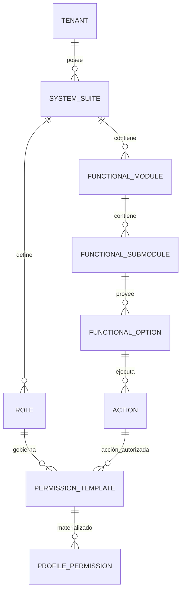
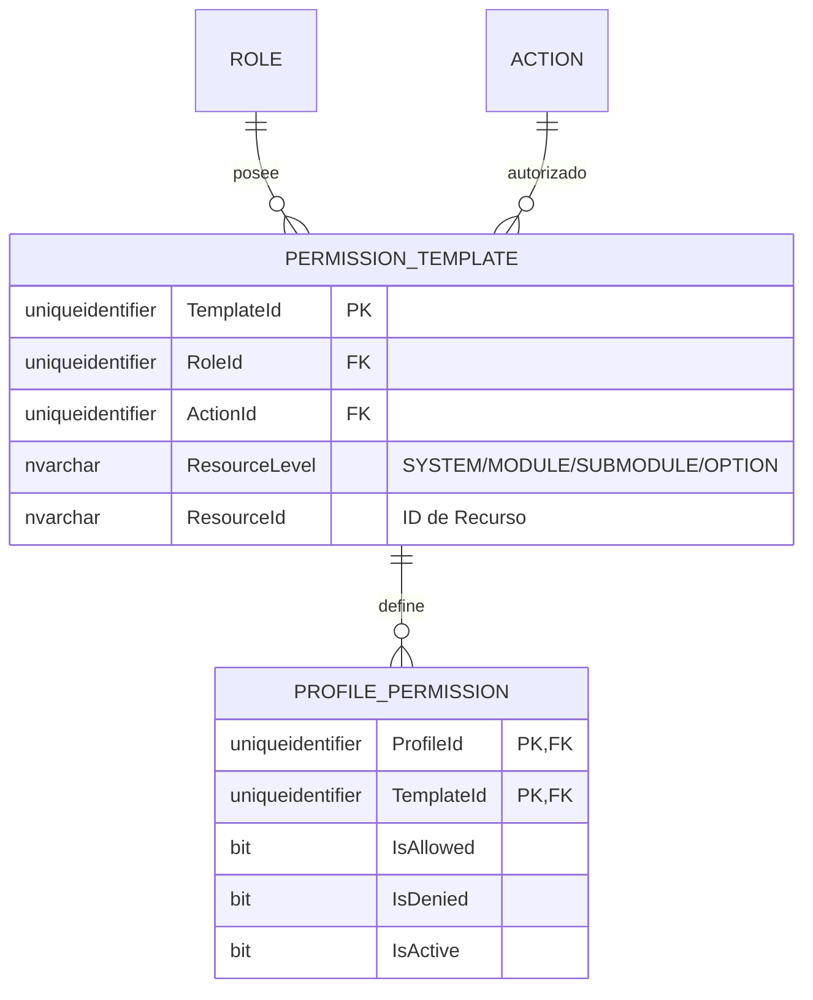
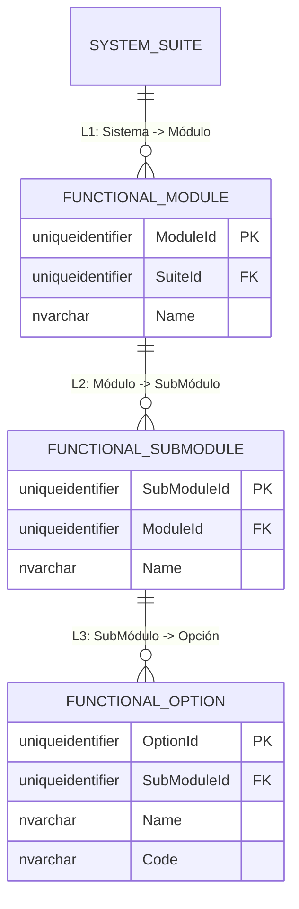

# 🗄️ Modelo Entidad-Relación (E/R) - SQL Server 2022

**Tipo de Documento:** Diseño de Base de Datos  
**Estatus:** Refactorizado (Vinculado al Rol y Jerarquía Estricta)  
**Arquitectura:** Framework Maestro (Control de 5 Niveles)  
**Motor:** SQL Server 2022

## 1. Introducción
Este documento detalla el modelo de autorización **Vinculado al Rol**, aplicando estrictamente la cadena jerárquica: **Sistema -> Módulo -> Sub-módulo -> Opción -> Acción**.

> [!TIP]
> **¿Problemas de Visualización?**  
> Si los diagramas Mermaid no se renderizan correctamente, utiliza los **[🚀 Formatos de Exportación Alternativos (dbdiagram.io, DDL, D2)](./er-export-formats.md)**. Estos formatos son compatibles con herramientas profesionales como DBeaver, SSMS y dbdiagram.io.

---

## 2. Estándares Corporativos de Auditoría y Trazabilidad
Todas las entidades implementan el esquema de auditoría estándar de 10 columnas.

---

## 3. Vistas Modulares por Dominio

### 🗺️ 3.1 Mapa Global de Alto Nivel
Ruta de Resolución: `Inquilino -> Sistema -> Rol -> Plantilla -> Permiso de Perfil`.

---

### 🔐 3.2 Dominio: Autoridad Centrada en el Rol y Jerarquía Estricta
Este dominio garantiza que cada permiso esté limitado a un Rol y se mapee exactamente a la jerarquía funcional de 5 niveles.

---

### 📍 3.3 Dominio: Topología Funcional (Los 5 Niveles)
Estructura organizacional de los recursos.

---

## 4. Reglas de Negocio y Restricciones
1.  **Integridad Jerárquica**: El acceso debe rastrearse a través de `Sistema > Módulo > Sub-módulo > Opción > Acción`.
2.  **Propiedad del Rol**: Una `PermissionTemplate` DEBE pertenecer a un `Role`.
3.  **Sin Acciones Huérfanas**: Las acciones deben ser propiedad de un Sistema o Módulo (Contexto Global vs Local).
4.  **Materialización**: Los permisos efectivos siempre referencian una plantilla válida vinculada al rol.
