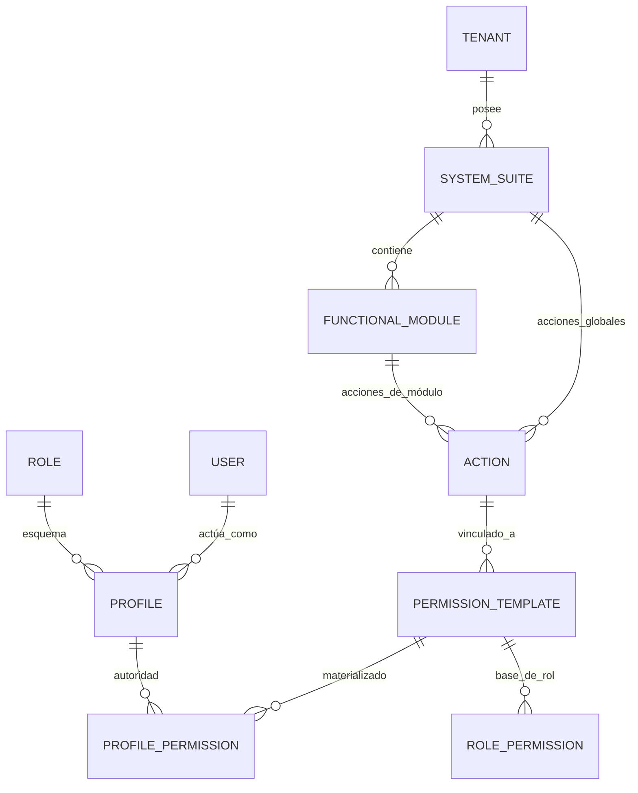
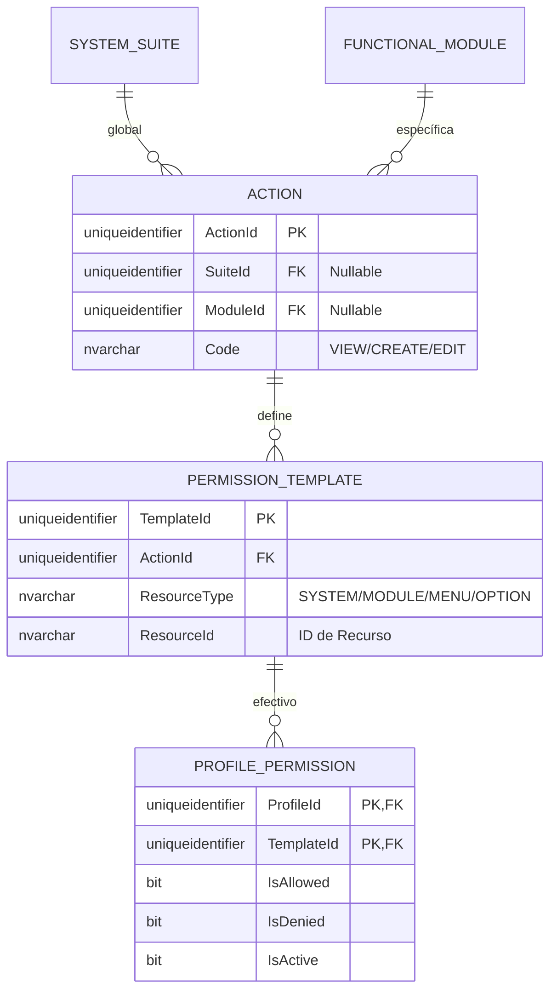
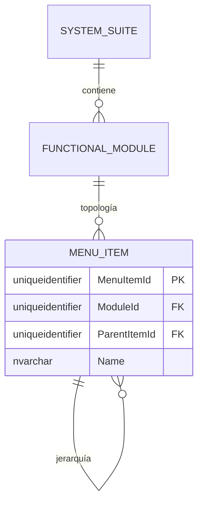

# 🗄️ Modelo Entidad-Relación (E/R) - SQL Server 2022

**Tipo de Documento:** Diseño de Base de Datos  
**Estatus:** Refactorizado (Gobernanza de Acciones con Alcance)  
**Arquitectura:** Framework Jerárquico Maestro  
**Motor:** SQL Server 2022

## 1. Introducción
Este documento detalla el modelo de **Acciones con Alcance**. Toda autoridad en el sistema debe pertenecer a un contenedor funcional (Sistema o Módulo), eliminando los permisos huérfanos y garantizando una gobernanza arquitectónica estricta.

> [!TIP]
> **¿Problemas de Visualización?**  
> Si los diagramas Mermaid no se renderizan correctamente, utiliza los **[🚀 Formatos de Exportación Alternativos (dbdiagram.io, DDL, D2)](./er-export-formats.md)**. Estos formatos son compatibles con herramientas profesionales como DBeaver, SSMS y dbdiagram.io.

---

## 2. Estándares Corporativos de Auditoría y Trazabilidad
Cada entidad en este esquema DEBE implementar las 10 columnas estándar (`CreatedAt`, `CreatedBy`, `UpdatedAt`, `UpdatedBy`, `DeletedAt`, `DeletedBy`, `Version`, `IsActive`, `TenantId`, `CorrelationId`).

---

## 3. Vistas Modulares por Dominio

### 🗺️ 3.1 Mapa Global de Alto Nivel
Ruta de resolución completa: `Inquilino -> Sistema -> Módulo -> Recurso -> Acción -> Plantilla -> Permiso de Perfil`.

---

### 🔐 3.2 Dominio: Framework de Autorización con Alcance
Gestión de acciones con alcance y su materialización.

---

### 📍 3.3 Dominio: Topología Funcional
Jerarquía de estructura organizacional y navegación.

---

## 4. Reglas de Negocio y Restricciones
1.  **Propiedad de Acciones**: Toda Acción DEBE tener un `SuiteId` o un `ModuleId`.
2.  **Restricción**: `CHECK (SuiteId IS NOT NULL OR ModuleId IS NOT NULL)`.
3.  **Sin Huérfanos**: Todos los permisos deben rastrearse hasta una plantilla.
4.  **Inmutabilidad**: Las plantillas son la fuente de verdad; los ProfilePermissions son anulaciones/materializaciones.
