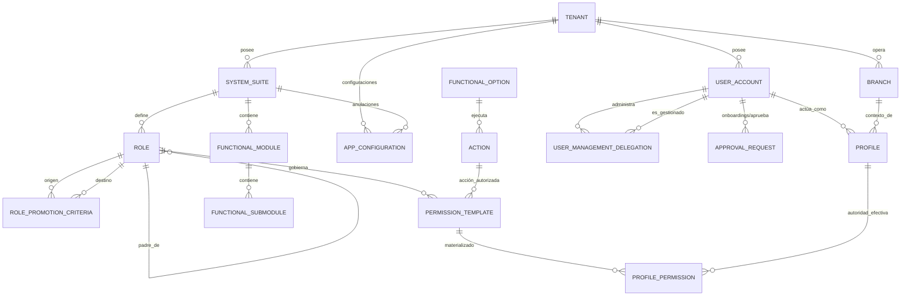
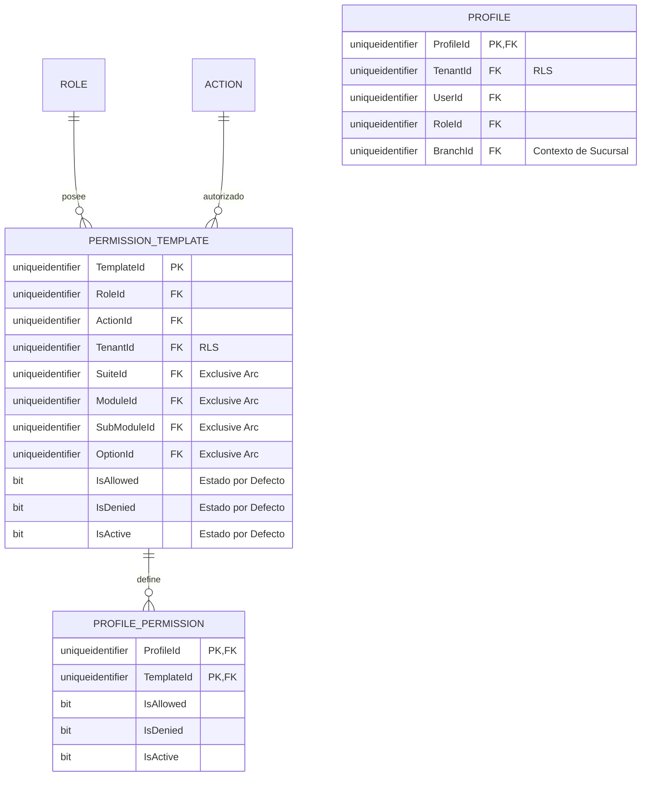
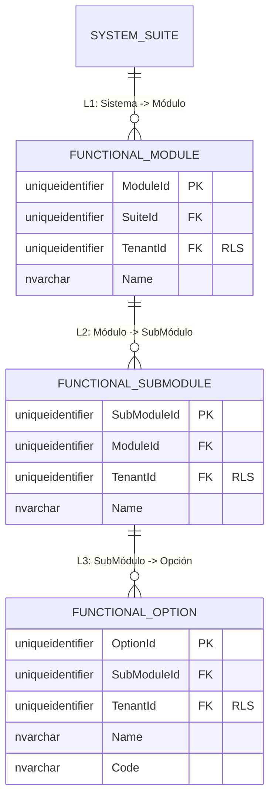
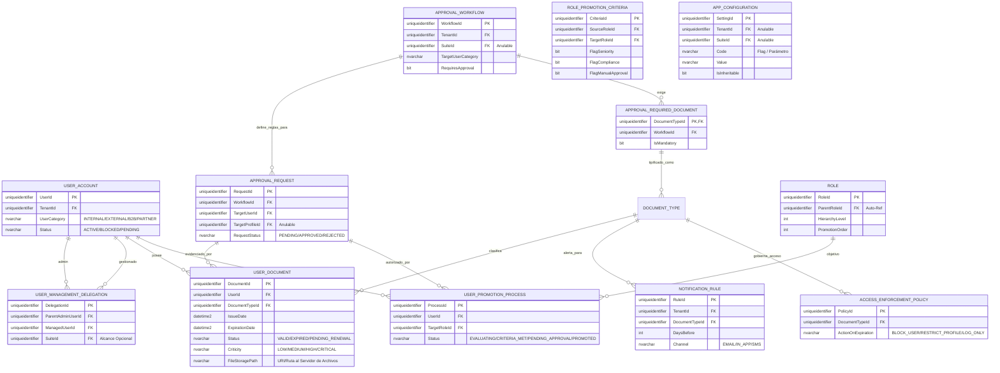

# 🗄️ Modelo Entidad-Relación (E/R) - SQL Server 2022

**Tipo de Documento:** Diseño de Base de Datos  
**Estatus:** Refactorizado (Vinculado al Rol y Jerarquía Estricta)  
**Arquitectura:** Framework Maestro (Control de 5 Niveles)  
**Motor:** SQL Server 2022

## 1. Introducción
Este documento detalla el modelo de autorización **Vinculado al Rol**, aplicando estrictamente la cadena jerárquica: **Sistema -> Módulo -> Sub-módulo -> Opción -> Acción**.

> [!TIP]
> **¿Problemas de Visualización?**  
> Si los diagramas Mermaid no se renderizan correctamente, utiliza los **[🚀 Formatos de Exportación Alternativos (dbdiagram.io, DDL, D2)](./er-export-formats.md)**. Estos formatos son compatibles con herramientas profesionales como DBeaver, SSMS y dbdiagram.io.

---

## 2. Estándares Corporativos de Auditoría y Trazabilidad
Todas las entidades implementan el esquema de auditoría estándar de 10 columnas.

---

## 3. Vistas Modulares por Dominio

### 🗺️ 3.1 Mapa Global de Alto Nivel
Ruta de Resolución: `Inquilino -> Sistema -> Rol -> Plantilla -> Permiso de Perfil`.

---

### 🔐 3.2 Dominio: Autoridad Centrada en el Rol y Jerarquía Estricta
Este dominio garantiza que cada permiso esté limitado a un Rol y se mapee exactamente a la jerarquía funcional de 5 niveles.

---

### 📍 3.3 Dominio: Topología Funcional (Los 5 Niveles)
Estructura organizacional de los recursos.

---

### 🛂 3.4 Dominio: Gobernanza de Identidad y Aprobaciones
Gestión del ciclo de vida del usuario, administración delegada y flujos de trabajo de incorporación para identidades externas o de alto riesgo.

---

## 4. Reglas de Negocio y Restricciones Técnicas
1.  **Row-Level Security (RLS)**: `TenantId` está denormalizado en todas las entidades funcionales (Module, Option, Template, Action, Role) para permitir aislamiento O(1) vía RLS nativo de SQL Server.
2.  **Arco Exclusivo (Integridad de Plantilla)**: `PermissionTemplate` implementa 4 FKs anulables que apuntan a la jerarquía de recursos. Un constraint `CHECK` garantiza que exactamente UNO tenga valor, forzando integridad referencial estricta sobre el polimorfismo.
3.  **Propiedad de Acción XOR Estricta**: Una Acción debe pertenecer a un Sistema O a un Módulo, pero nunca a ambos: `CHECK ((SuiteId IS NOT NULL AND ModuleId IS NULL) OR (SuiteId IS NULL AND ModuleId IS NOT NULL))`.
4.  **Integridad Jerárquica**: El acceso debe rastrearse a través de `Sistema > Módulo > Sub-módulo > Opción > Acción`.
5.  **Administración Delegada (Muchos-a-Muchos)**: El alcance de administración de un usuario se define mediante la tabla `USER_MANAGEMENT_DELEGATION`. Esto permite que múltiples administradores gestionen el mismo pool de usuarios, opcionalmente restringido por `SuiteId`.
6.  **Mandatos de Aprobación**: Los usuarios Externos/B2B DEBEN pasar por un `APPROVAL_WORKFLOW` antes de alcanzar un estado `ACTIVE` o de que se les asignen perfiles de alto riesgo. Los documentos de respaldo definidos en `APPROVAL_REQUIRED_DOCUMENT` deben cargarse en `USER_DOCUMENT` antes del avance del flujo.
7.  **Aplicación Automática de Cumplimiento**: Workers en segundo plano escanean `USER_DOCUMENT`. Al expirar, se activa la `ACCESS_ENFORCEMENT_POLICY`. Los documentos críticos transicionarán automáticamente el `USER_ACCOUNT` a un estado `BLOCKED` o restringirán el contexto de un `PROFILE` específico.
8.  **Notificaciones Paramétricas**: `NOTIFICATION_RULE` permite configurar N-pasos de alerta (ej. 30, 15, 5 días antes de la expiración) por Inquilino y Tipo de Documento.
