# 🗄️ Modelo Entidad-Relación (E/R) - SQL Server 2022

**Tipo de Documento:** Diseño de Base de Datos  
**Estatus:** Propuesto  
**Arquitectura:** Multi-tenancy (Esquema Compartido + RLS)  
**Motor:** SQL Server 2022

## 1. Introducción
Este documento detalla el diseño del modelo de datos para el **User Management System (UMS)**. El diseño está optimizado para **SQL Server 2022**, utilizando tipos de datos modernos y una estructura que facilita el aislamiento de datos mediante **Row-Level Security (RLS)** y el uso de `SESSION_CONTEXT`.

---

## 2. Diagrama E/R (Mermaid)

```mermaid
erDiagram
    TENANT ||--o{ USER : "pertenece_a"
    TENANT ||--o{ ROLE : "define"
    TENANT ||--o{ BRANCH : "posee"
    TENANT ||--o{ AUDIT_LOG : "genera"
    TENANT ||--o{ PERMISSION_TEMPLATE : "define_local"

    SYSTEM_SUITE ||--o{ PERMISSION : "categoriza"
    SYSTEM_SUITE ||--o{ PERMISSION_TEMPLATE : "provee_base_para"

    PERMISSION_TEMPLATE ||--o{ TEMPLATE_PERMISSION : "contiene"
    PERMISSION_TEMPLATE ||--o{ ROLE : "inicializa"

    USER ||--|| USER_CREDENTIAL : "tiene"
    USER ||--|| PROFILE : "tiene"
    USER ||--o{ USER_ROLE : "asignado_a"
    USER ||--o{ USER_BRANCH : "opera_en"

    ROLE ||--o{ ROLE_PERMISSION : "contiene"
    ROLE ||--o{ USER_ROLE : "asignado_a"
    
    PERMISSION ||--o{ ROLE_PERMISSION : "asociado_a"
    PERMISSION ||--o{ TEMPLATE_PERMISSION : "asociado_a"
    
    BRANCH ||--o{ USER_BRANCH : "asociado_a"

    SYSTEM_SUITE {
        uniqueidentifier SuiteId PK
        nvarchar Name "NOT NULL"
        nvarchar Code "UK, NOT NULL"
    }

    PERMISSION_TEMPLATE {
        uniqueidentifier TemplateId PK
        uniqueidentifier TenantId FK "NULL para Global"
        uniqueidentifier SuiteId FK
        nvarchar Name "NOT NULL"
        nvarchar Version "NOT NULL"
        bit IsActive
    }

    TEMPLATE_PERMISSION {
        uniqueidentifier TemplateId PK, FK
        uniqueidentifier PermissionId PK, FK
    }

    TENANT {
        uniqueidentifier TenantId PK
        nvarchar Name "NOT NULL"
        nvarchar Code "UK, NOT NULL"
        int Status "NOT NULL"
        datetimeoffset CreatedAt "DEFAULT GETDATE()"
    }

    USER {
        uniqueidentifier UserId PK
        uniqueidentifier TenantId FK "RLS"
        nvarchar Username "UK, NOT NULL"
        nvarchar Email "UK, NOT NULL"
        bit IsActive "DEFAULT 1"
        bit IsServiceAccount "DEFAULT 0"
        datetimeoffset CreatedAt
    }

    USER_CREDENTIAL {
        uniqueidentifier CredentialId PK
        uniqueidentifier UserId FK "UK"
        nvarchar PasswordHash "NOT NULL"
        nvarchar SecurityStamp
        datetimeoffset LastChangedAt
    }

    PROFILE {
        uniqueidentifier ProfileId PK
        uniqueidentifier UserId FK "UK"
        nvarchar FirstName
        nvarchar LastName
        nvarchar Attributes "JSON (ABAC)"
    }

    ROLE {
        uniqueidentifier RoleId PK
        uniqueidentifier TenantId FK
        uniqueidentifier SourceTemplateId FK "NULLABLE"
        nvarchar Name "NOT NULL"
        nvarchar Description
        bit IsSystemRole "DEFAULT 0"
    }

    PERMISSION {
        uniqueidentifier PermissionId PK
        uniqueidentifier SuiteId FK
        nvarchar Code "UK, NOT NULL"
        nvarchar Name "NOT NULL"
        nvarchar Category
    }

    ROLE_PERMISSION {
        uniqueidentifier RoleId PK, FK
        uniqueidentifier PermissionId PK, FK
    }

    USER_ROLE {
        uniqueidentifier UserId PK, FK
        uniqueidentifier RoleId PK, FK
    }

    BRANCH {
        uniqueidentifier BranchId PK
        uniqueidentifier TenantId FK
        nvarchar Name "NOT NULL"
        nvarchar Code "NOT NULL"
    }

    USER_BRANCH {
        uniqueidentifier UserId PK, FK
        uniqueidentifier BranchId PK, FK
    }

    AUDIT_LOG {
        bigint LogId PK "IDENTITY"
        uniqueidentifier TenantId FK
        uniqueidentifier UserId FK
        nvarchar Action "NOT NULL"
        nvarchar EntityName "NOT NULL"
        nvarchar EntityId
        nvarchar OldValue "JSON"
        nvarchar NewValue "JSON"
        datetimeoffset Timestamp "DEFAULT GETDATE()"
    }
```



---

## 3. Diccionario de Datos y Tipos SQL Server

### 3.1 Estándares de Tipos
*   **Identificadores (PK/FK):** `uniqueidentifier` utilizando `NEWSEQUENTIALID()` en SQL Server para evitar fragmentación de índices.
*   **Fechas:** `datetimeoffset` para garantizar precisión en zonas horarias globales.
*   **Cadenas:** `nvarchar(n)` para soporte Unicode completo.
*   **Metadatos/ABAC:** `nvarchar(max)` con validación `ISJSON()` para flexibilidad de atributos dinámicos.

### 3.2 Tablas Principales

| Tabla | Propósito | Estrategia de Índice |
| :--- | :--- | :--- |
| `Tenants` | Maestro de inquilinos. | Clustered en `TenantId`. Unique en `Code`. |
| `Users` | Identidades de usuario. | Clustered en `UserId`. Non-clustered en `TenantId` (RLS Optimization). |
| `Roles` | Definición de roles por tenant. | Filtrado por `TenantId`. |
| `AuditLogs` | Trazabilidad de cambios. | Clustered en `LogId` (bigint identity). Particionado por `Timestamp` si la escala aumenta. |

---

## 4. Implementación de Multi-tenancy (RLS)

Para SQL Server, la propuesta de aislamiento se basa en el uso de **Security Policies** y **Inline Table-Valued Functions (iTVF)**.

### Función de Filtro Predicado
```sql
CREATE FUNCTION Security.fn_tenantSecurityPredicate(@TenantId uniqueidentifier)
    RETURNS TABLE
    WITH SCHEMABINDING
AS
    RETURN SELECT 1 AS fn_security_predicate_result
    WHERE @TenantId = CAST(SESSION_CONTEXT(N'TenantId') AS uniqueidentifier)
       OR CAST(SESSION_CONTEXT(N'IsSuperAdmin') AS bit) = 1;
```

### Política de Seguridad
```sql
CREATE SECURITY POLICY Security.TenantIdFilter
    ADD FILTER PREDICATE Security.fn_tenantSecurityPredicate(TenantId) ON dbo.Users,
    ADD FILTER PREDICATE Security.fn_tenantSecurityPredicate(TenantId) ON dbo.Roles,
    ADD FILTER PREDICATE Security.fn_tenantSecurityPredicate(TenantId) ON dbo.AuditLogs
    WITH (STATE = ON);
```

---

## 5. Consideraciones para el Blueprint
1.  **Escalabilidad:** Se recomienda el uso de **Indexes Columnstore** en la tabla `AuditLogs` si el volumen de auditoría supera los millones de registros.
2.  **Integridad:** Todas las relaciones N:M se manejan mediante tablas de unión con claves compuestas para optimizar la navegación.
3.  **Seguridad:** Los hashes de contraseña nunca deben almacenarse en la tabla `Users`, sino en `UserCredentials` para permitir la rotación de secretos y múltiples métodos de autenticación (ej. MFA).
