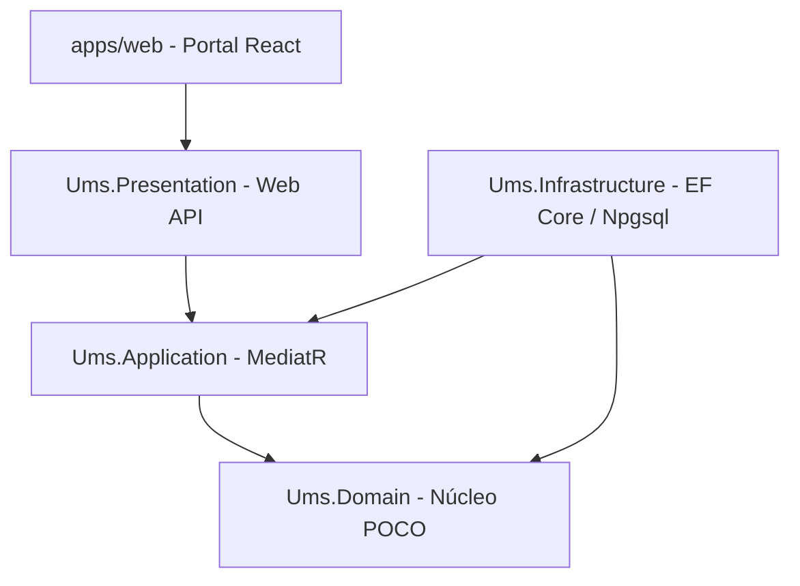

# Plan de Migración de Stack Backend: NestJS a .NET 8 LTS

**Tipo de Documento:** Plan de Implementación Arquitectónico  
**Fase bMAD:** Fase 02 - Diseño de Arquitectura  
**Autores:** Arquitecto de Soluciones  
**Estado:** Propuestao  

---

## 1. Contexto Ejecutivo y Justificación

Siguiendo el mandato de alineación arquitectónica corporativa y la **estrategia spec-driven AI BMAD-METHOD**, estáamos ejecutando una realineación crítica de stack para el **Sistema de Gestión de Usuarios (UMS)**.

El sistema transiciona de su línea base original Node.js/NestJS hacia un stack backend altamente robusto de nivel empresarial en **.NET 8 / C#**. Este movimiento optimiza el compilador de autorización para capacidades de cómputo intensivo, garantiza un tipado estáricto y seguridad en tiempo de compilación, y aprovecha los mecanismos avanzados de concurrencia de EF Core, al mismo tiempo que preserva en su totalidad la aplicación frontend **React (Vite)**.

### Definiciones Unificadas del Stack Objetivo
*   **Frontend:** React (v18+, Última Versión Estable) / Vite / Zustand / TanStack Query.
*   **Núcleo Backend:** **.NET 8 LTS** / ASP.NET Core Minimal APIs / C#.
*   **Persistencia:** PostgreSQL v16+ / Entity Framework Core (EF Core vía Npgsql).
*   **Arquitectura:** Arquitectura Hexagonal Pura (Puertos y Adaptadores) y DDD.

---

## 2. Arquitectura .NET y Topología de Solución

En cumplimiento con el estándar corporativo **[Authoritative Tech Stack for .NET](https://github.com/beyondnetcode/arc32_progresive_monolith)**, la nueva solución UMS (`Ums.sln`) residirá junto al frontend en el monorepo y aplicará estárictamente la siguiente segregación de proyectos:

### Matriz de Límites de Proyectos

| Capa de Proyecto | Mandato Tecnológico | Responsabilidades | Restáricción de NuGet / Referencias |
| :--- | :--- | :--- | :--- |
| **`Ums.Domain`** | POCOs Puros | Entidades, Objetos de Valor, Raíces de Agregado, Eventos de Dominio, Contratos de Servicios de Dominio. | **CERO Referencias NuGet**. Solo espacio de nombres `System` puro. |
| **`Ums.Application`** | MediatR, FluentValidation | Casos de Uso CQRS (Comandos/Consultas), Validación, Puertos de Aplicación (Interfaces). | `MediatR`, `FluentValidation`. Sin dependencias de EF Core o APIs HTTP. |
| **`Ums.Infrastructure`**| EF Core, Npgsql | PostgreSQL DbContext, Dapper (para Proyecciones de Lectura), Redis, Adaptadores de Vault, Resolutor de Inquilinos. | `Microsoft.EntityFrameworkCore`, `Npgsql.EntityFrameworkCore.PostgreSQL`. |
| **`Ums.Presentation`**| ASP.NET Core | Configuración de Minimal APIs, Middleware de Autorización, controladores que mapean DTOs a Comandos. | `OpenTelemetry`, `Swashbuckle`.
## 3. Directrices y Políticas Ejecutivas

Todos los desarrollos bajo el nuevo stack DEBEN aplicar estárictamente los siguientes invariantes sistémicos:

1.  **Mandato del Patrón Result:** El lanzamiento de excepciones estándar en C# (`throw new Exception()`) para control de flujo de lógica de negocio queda **PROHIBIDO**. Todos los comandos de MediatR DEBEN retornar una respuestá tipo `Result<T>` o `OneOf<T, Error>` para garantizar el manejo de errores en tiempo de compilación.
2.  **Seguridad a Nivel de Fila Nativa (RLS):** El aislamiento multi-inquilino DEBE manejarse nativamente en PostgreSQL a través del `TenantResolver`, inyectando la configuración en el ciclo de apertura de conexión de EF Core (`SET LOCAL app.current_tenant`).
3.  **Doctrina Primero-el-Contrato:** La integración con el portal React utilizará especificaciones OpenAPI generadas para garantizar la sincronización absoluta de esquemas.
4.  **Secretos de Confianza Cero:** Los secretos en texto plano dentro de appsettings.json estáán prohibidos. El mapeo de configuración DEBE apuntar a variables de entorno inyectadas vía contenedores sidecar de HashiCorp Vault.

---

## 4. Hoja de Ruta de Ejecución por Fases

### 🟢 Fase 0: Sanitización del Workspace (Completada)
*   [x] Eliminar el código fuente de la API original NestJS (`apps/api`).
*   [x] Eliminar la librería de Programación Orientada a Aspectos de Node (`libs/aop`).
*   [x] Actualizar mapeos de workspace en `package.json` para preservar solo `apps/web`.

### 🟡 Fase 1: Bootstrapping de la Solución .NET (Activo)
*   [ ] Scaffoldear la solución C# `Ums.sln` en `src/ums-workspace/apps/api-dotnet/`.
*   [ ] Crear la estructura estándar de proyectos (`Ums.Domain`, `Ums.Application`, `Ums.Infrastructure`, `Ums.Presentation`).
*   [ ] Instalar dependencias validadas (.NET 8 LTS, EF Core 8.0.x, MediatR, FluentValidation).

### 🟡 Fase 2: Alineación de Documentación
*   [ ] Refactorizar documentos de la Fase 02 (`architecture-spec.md`, `BoundedContextMap.md`) para reemplazar construcciones de NestJS con componentes .NET.
*   [ ] Depreciar las ADRs específicas de Node en `03-adrs/` (ej. ADR-0002 Node, ADR-0029 NestJS Latam DDD).
*   [ ] Redactar nuevos Registros de Decisiones Arquitectónicas matching cumplimiento corporativo.

### 🟡 Fase 3: Migración de Lógica y Verificación
*   [ ] Migrar entidades de Dominio desde TypeScript hacia POCOs puros en C#.
*   [ ] Configurar migraciones de EF Core apuntando a PostgreSQL v16.
*   [ ] Construir suite de verificación utilizando xUnit y Testácontainers (validación de integración SQL).

---

## 5. Evaluación de Impacto
*   **Developer Harness (`AGENTS.md`):** Debe actualizarse para incluir runtimes de .NET 8 para que agentes entrantes reconozcan el entorno multi-lenguaje.
*   **Pipelines de CI/CD:** Requerirán la inyección de pasos de instalación del SDK de .NET Core adicionales a los módulos estándar de Node.
