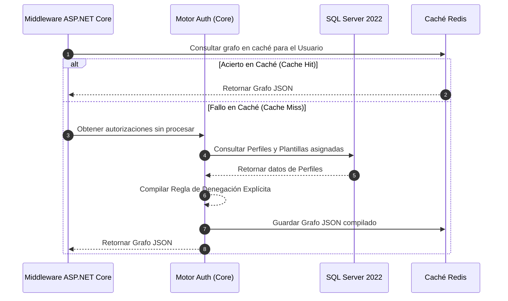

# 🛡️ Technical Enabler 1: Compilar Grafo de Autorización

Este documento especifica el flujo de transacciones, los actores y las estrategias de caché para compilar el grafo dinámico de acciones y recursos permitidos para una sesión autenticada bajo la **estrategia spec-driven AI BMAD-METHOD**.

---

## 🏛️ 1. Definición del Caso de Uso

| Atributo | Especificación |
| :--- | :--- |
| **Nombre** | Compilar Grafo de Autorización del Usuario |
| **Actor Principal** | Guard de Autenticación / API Gateway |
| **Precondiciones** | El usuario está autenticado exitosamente. |
| **Postcondiciones** | Se compila un grafo jerárquico ligero de permisos en formato JSON y se almacena en caché (Redis). |

---

## 🔄 2. Flujo de Transacción

### A. Flujo Principal
1.  El interceptor/guard de .NET 8 recibe una solicitud API entrante.
2.  El guard consulta el clúster de caché Redis de alto rendimiento utilizando el `user_id` único como clave.
3.  **Caso de Acierto en Caché:** Redis devuelve el grafo jerárquico de permisos JSON precompilado. El guard resuelve el permiso instantáneamente (Objetivo p95 < 5ms).
4.  **Caso de Fallo en Caché:** El guard envía un comando de compilación al Motor de Autorización principal.
5.  El motor consulta SQL Server 2022 para recuperar todos los `Perfiles` asignados al `Usuario` y cualquier `Plantilla de Autorización` principal vinculada a esos perfiles.
6.  El motor aplica las **Reglas de precedencia de Denegación Explícita**:
    *   Encuentra todas las políticas `ALLOW` (Permitir).
    *   Encuentra todas las políticas `DENY` (Denegar).
    *   Cualquier `DENY` anula instantáneamente las reglas `ALLOW` coincidentes.
7.  El motor compila un árbol ligero que mapea los permitidos `Sistemas ➔ Menús ➔ Opciones ➔ Acciones`.
8.  El motor guarda el árbol JSON dentro de Redis con un Tiempo de Vida (TTL) de 1 hora y devuelve el grafo resuelto al guard.

---

## 🛡️ 3. Flujos Alternativos y Manejo de Excepciones

### Flujo Alternativo A: Servidor de Caché Desconectado
*   Si Redis está inactivo o agota el tiempo de espera, el guard intercepta el error de la caché y de forma segura consulta la base de datos SQL Server 2022 directamente, garantizando la disponibilidad total del sistema con una latencia de lectura ligeramente degradada.

### Flujo Alternativo B: Asignación de Perfil Vacía
*   Si un usuario no tiene Perfiles activos asignados a su cuenta, el motor devuelve un grafo JSON vacío con un estado de no asignado, impidiendo que el usuario visualice cualquier subportal.

---

## 📋 4. Referencia del Modelo Operativo Principal
El flujo de transacciones completo, la estrategia de caché Redis y las reglas de compilación de Denegación Explícita para este caso de uso están modelados en torno al rol de **Analista de Negocio** en el Terminal del Callao (bajo *Logistics Corp*). Para conocer los esquemas técnicos detallados, estructuras de parámetros y ejemplos de OpenAPI, consulte **[enterprise-iam-ums-specification.md](../../04-artifacts/enterprise-iam-ums-specification.md)**.
