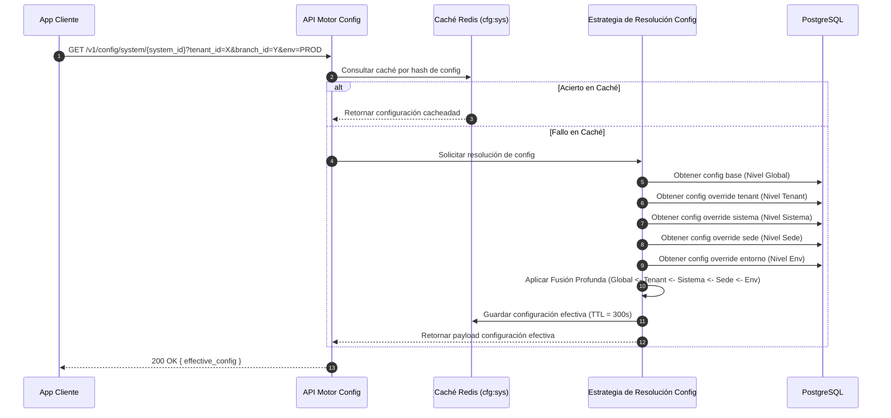

# 🧪 Technical Enabler 2: Resolver Configuración Jerárquica del Sistema

Este caso de uso detalla el flujo para calcular la configuración del sistema "efectiva" para una aplicación cliente, mediante la evaluación y fusión de capas de sobrescritura (override) jerárquicas.

---

## 🏛️ 1. Definición del Caso de Uso

| Atributo | Especificación |
| :--- | :--- |
| **Nombre** | Resolver Configuración Jerárquica del Sistema |
| **Actor Principal** | Sistema Cliente (M2M) o API Gateway |
| **Precondiciones** | El sistema que solicita la configuración está registrado en el UMS. |
| **Postcondiciones** | Se devuelve y se almacena en caché un objeto JSON que representa la configuración efectiva (luego de aplicar todas las sobrescrituras jerárquicas). |

---

## 🔄 2. Flujo de Transacción



### A. Flujo Principal
1. Un sistema cliente (ej., Portal Cliente) se inicia y solicita su configuración desde la API de UMS, proporcionando su `system_id`, `tenant_id` y su contexto de ejecución (ej., `branch_id`, `environment`).
2. La API de Configuración verifica en Redis si existe una configuración efectiva pre-calculada que coincida exactamente con este hash de contexto.
3. En caso de fallo de caché, se invoca la Estrategia de Resolución. Esta consulta la base de datos por todas las capas de configuración disponibles para dicho contexto.
4. El Motor realiza una **Fusión Profunda (Deep Merge)** comenzando desde la capa de menor prioridad (Global) y aplicando las sobrescrituras secuencialmente hasta llegar a la capa de mayor prioridad (Entorno).
5. El objeto final calculado se guarda en caché con un Tiempo de Vida (TTL) de 5 minutos.
6. El sistema cliente recibe el JSON con la configuración final y ajusta su comportamiento (ej., oculta el botón de MFA si `mfa_enabled=false` a nivel de Sistema, aunque esté habilitado a nivel Tenant).

---

## ⚙️ 3. Lógica de Precedencia de Resolución

La función de Fusión Profunda sigue esta precedencia estricta (Prioridad 1 sobreescribe a Prioridad 7):

1. **Nivel Entorno**: Restricciones dictadas por infraestructura (ej., `PROD` obliga a cookies seguras).
2. **Nivel Usuario**: Personalización en extremo (ej., `user_id_123` sobreescribe el tema visual).
3. **Nivel Rol**: Ajustes de configuración según el Perfil asignado.
4. **Nivel Sede (Branch)**: Sobrescrituras específicas a una sede física (ej., `Terminal Callao` fuerza el IdP local).
5. **Nivel Sistema**: Sobrescrituras de aplicación (ej., `TMS` frente a `WMS`).
6. **Nivel Inquilino (Tenant)**: Línea base de toda la organización (ej., `LogisticsCorp`).
7. **Nivel Global**: Valores predeterminados en duro del UMS.

### Ejemplo de Fusión Profunda (Deep Merge)

**Configuración Nivel Inquilino (Tenant):**
```json
{ "auth": { "mfa_enabled": true, "session_timeout": 3600 }, "branding": { "color": "#000" } }
```

**Configuración Nivel Sistema (Override):**
```json
{ "auth": { "mfa_enabled": false }, "modules_enabled": ["tracking"] }
```

**Configuración Efectiva Resultante:**
```json
{
  "auth": { "mfa_enabled": false, "session_timeout": 3600 },
  "branding": { "color": "#000" },
  "modules_enabled": ["tracking"]
}
```

---

## 🛡️ 4. Manejo de Excepciones

### Flujo Alternativo A: Configuración Base Ausente
- Si no existe configuración para el Tenant o Sistema solicitado, el resolutor recae elegantemente al Nivel Global Predeterminado. No retorna error 404, asegurando que el sistema cliente reciba valores de respaldo seguros para seguir operando.

### Flujo Alternativo B: Error de Sintaxis durante Fusión
- Si un override JSON personalizado contiene sintaxis inválida que rompe el proceso de fusión profunda, el motor registra un error en el Contexto de Auditoría y omite esa capa específica, continuando con las capas de menor prioridad.
