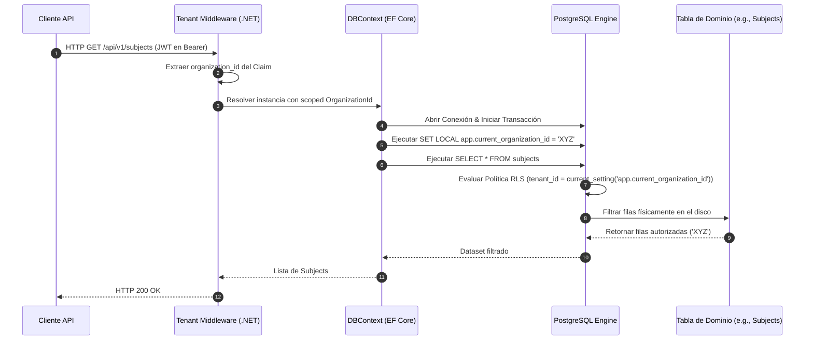

# 🛡️ Technical Enabler 3: Aplicar Seguridad a Nivel de Fila (RLS) por Organización

Este documento especifica el flujo de transacciones, la inyección del contexto de sesión en base de datos y la configuración de políticas RLS en PostgreSQL para garantizar el aislamiento físico de datos multitenant bajo la **estrategia spec-driven AI BMAD-METHOD**.

---

## 🏛️ 1. Definición del Caso de Uso

| Atributo | Especificación |
| :--- | :--- |
| **Nombre** | Aplicar Row-Level Security (RLS) por Organización en PostgreSQL |
| **Actor Principal** | Interceptor de Persistencia / DbContext de EF Core |
| **Precondiciones** | El `organization_id` está presente en el contexto de la solicitud (JWT o Encabezados). |
| **Postcondiciones** | PostgreSQL restringe automáticamente la visualización y modificación de filas a nivel de motor de base de datos, independientemente de la query ORM ejecutada. |

---

## 🔄 2. Flujo de Transacción



### A. Flujo Principal
1.  El cliente envía un request HTTP portando el JWT de sesión.
2.  El **Tenant Middleware** del backend en .NET 8 intercepta la solicitud, decodifica los claims del token y extrae el valor unificado del `org_id` (Organization Context).
3.  El middleware almacena el `org_id` en un servicio con ciclo de vida *Scoped* (`ITenantContext`).
4.  Al resolver una consulta a través de **Entity Framework Core**, se activa un **DbConnectionInterceptor** personalizado.
5.  Inmediatamente después de abrir la conexión física a PostgreSQL, el interceptor ejecuta el comando SQL nativo de sesión local:
    ```sql
    SET LOCAL app.current_organization_id = 'XYZ';
    ```
    *Nota: `SET LOCAL` garantiza que el parámetro solo viva durante la transacción actual, evitando la contaminación de hilos en el Connection Pool.*
6.  EF Core emite el comando SQL estándar de dominio (e.g., `SELECT * FROM public.subjects`).
7.  El motor de **PostgreSQL**, al detectar la tabla protegida por RLS, intercepta la consulta en caliente.
8.  El motor evalúa la política de seguridad global:
    ```sql
    CREATE POLICY organization_isolation_policy ON subjects
    USING (organization_id = NULLIF(current_setting('app.current_organization_id', true), '')::uuid);
    ```
9.  El dataset se restringe directamente en memoria/disco del motor de BD y viaja filtrado hacia el backend.

---

## 🛡️ 3. Flujos Alternativos y Manejo de Excepciones

### Flujo Alternativo A: Ejecución en Tareas en Segundo Plano (Background Jobs)
*   Si un worker asíncrono (ej. RabbitMQ Listener) procesa un evento sin token de usuario, debe resolver el `organization_id` directamente del cuerpo del evento e inyectarlo manualmente en el scoped context para activar el RLS antes de persistir en base de datos.

### Flujo Alternativo B: Consulta por Super-Admin Corporativo (Bypass RLS)
*   Para tareas de soporte global o auditorías cruzadas de la organización dueña del software (`INTERNAL`), la conexión EF Core utilizará un rol de conexión con atributo `BYPASSRLS` habilitado en la base de datos (ej: rol `ums_admin`). Esto desactiva las políticas dinámicas permitiendo la visualización del inventario global.

### Flujo Alternativo C: Variable de Sesión Vacía
*   Si por un error lógico la variable `app.current_organization_id` no se configura, la política RLS devolverá un conjunto de resultados vacío (0 filas) en lugar de exponer todos los registros (comportamiento seguro por defecto de PostgreSQL).

---

## 📋 4. Referencia del Modelo Operativo Principal
El andamiaje técnico de configuración SQL, las migraciones de EF Core para habilitar `ENABLE ROW LEVEL SECURITY` y los interceptores de conexión están alineados con el patrón del **[Reporte de Gobernanza Multi-Tenant](../../04-artifacts/enterprise-multitenant-governance-report.md)** y la estrategia definida originalmente en el **[ADR-0010](../../03-adrs/0010-multi-tenancy-architecture-strategy.md)**.
