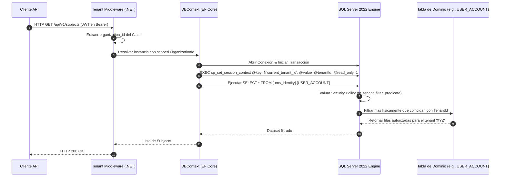

# Technical Enabler 3: Aplicar Seguridad a Nivel de Fila (RLS) por Organización

Este documento especifica el flujo de transacciones, la inyección del contexto de sesión en base de datos y la configuración de políticas RLS en SQL Server 2022 para garantizar el aislamiento físico de datos multitenant bajo la **estrategia spec-driven AI BMAD-METHOD**.

---

## 1. Definición del Caso de Uso

| Atributo | Especificación |
| :--- | :--- |
| **Nombre** | Aplicar Row-Level Security (RLS) por Organización en SQL Server 2022 |
| **Actor Principal** | Interceptor de Persistencia / DbContext de EF Core |
| **Precondiciones** | El `organization_id` estáá presente en el contexto de la solicitud (JWT o Encabezados). |
| **Postcondiciones** | SQL Server 2022 restáringe automáticamente la visualización y modificación de filas a nivel de motor de base de datos, independientemente de la query ORM ejecutada.
## 2. Flujo de Transacción



### A. Flujo Principal
1.  El cliente envía un requestá HTTP portando el JWT de sesión.
2.  El **Tenant Middleware** del backend en .NET 8 intercepta la solicitud, decodifica los claims del token y extrae el valor unificado del `org_id` (Organization Context).
3.  El middleware almacena el `org_id` en un servicio con ciclo de vida *Scoped* (`ITenantContext`).
4.  Al resolver una consulta a través de **Entity Framework Core**, se activa un **DbConnectionInterceptor** personalizado.
5.  Inmediatamente después de abrir la conexión física a SQL Server, el interceptor establece el contexto de sesión mediante la API nativa de SQL Server:
    ```sql
    EXEC sp_set_session_context
        @key   = N'current_tenant_id',
        @value = @tenantId,
        @read_only = 1;
    ```
    *Nota: `@read_only = 1` marca el valor del contexto de sesión como inmutable durante la vida de la conexión, evitando la sobreescritura accidental y la contaminación de hilos en el Connection Pool.*
6.  EF Core emite el comando SQL estándar de dominio (ej., `SELECT * FROM [ums_identity].[USER_ACCOUNT]`).
7.  El motor de **SQL Server 2022**, al detectar la tabla protegida por la Security Policy, intercepta la consulta y evalúa el predicado activo.
8.  El motor invoca la función de predicado inline (tabla de valores):
    ```sql
    CREATE FUNCTION dbo.fn_tenant_filter_predicate(@TenantId uniqueidentifier)
    RETURNS TABLE WITH SCHEMABINDING
    AS RETURN
        SELECT 1 AS result
        WHERE @TenantId = CAST(SESSION_CONTEXT(N'current_tenant_id') AS uniqueidentifier);
    ```
9.  La Security Policy aplica tanto un predicado FILTER (restáringe SELECT) como un predicado BLOCK (restáringe INSERT):
    ```sql
    CREATE SECURITY POLICY dbo.TenantIsolationPolicy
        ADD FILTER PREDICATE dbo.fn_tenant_filter_predicate(TenantId)
            ON [ums_identity].[USER_ACCOUNT],
        ADD BLOCK PREDICATE dbo.fn_tenant_filter_predicate(TenantId)
            ON [ums_identity].[USER_ACCOUNT] AFTER INSERT
    WITH (STATE = ON);
    ```
10. El dataset se restáringe directamente a nivel del motor de SQL Server y viaja filtrado hacia el backend.

---

## 3. Flujos Alternativos y Manejo de Excepciones

### Flujo Alternativo A: Ejecución en Tareas en Segundo Plano (Background Jobs)
*   Si un worker asíncrono (ej. RabbitMQ Listener) procesa un evento sin token de usuario, debe resolver el `organization_id` directamente del cuerpo del evento e inyectarlo manualmente en el scoped context. El interceptor entonces llama a `sp_set_session_context` antes de cualquier operación de persistencia para activar el RLS.

### Flujo Alternativo B: Consulta por Super-Admin Corporativo (Bypass RLS)
*   Para tareas de soporte global o auditorías cruzadas de la organización dueña del software (`INTERNAL`), se dispone de dos enfoques:
    *   Usar una cadena de conexión dedicada para administración, mapeada a un rol de base de datos (`ums_admin`) excluido explícitamente de la `TenantIsolationPolicy` (creando la política con `WITH (STATE = OFF)` para ese rol, o usando `ALTER SECURITY POLICY` para deshabilitarla antes de las operaciones de administrador y reactivarla después).
    *   Alternativamente, usar `@read_only = 0` al llamar a `sp_set_session_context` para que el contexto pueda cambiarse por operación, y omitir el establecimiento de `current_tenant_id`; el predicado retorna `UNKNOWN` (no TRUE), resultando en un conjunto vacío en lugar de acceso sin restricciónes — usar con precaución.

### Flujo Alternativo C: Contexto de Sesión Vacío
*   Si por un error lógico no se llama a `sp_set_session_context` antes de la consulta, `SESSION_CONTEXT(N'current_tenant_id')` devuelve `NULL`. El predicado `NULL = CAST(NULL AS uniqueidentifier)` evalúa a `UNKNOWN` (no TRUE), provocando que el predicado FILTER retorne un conjunto de resultados vacío (0 filas) en lugar de exponer todos los registros — preservando el comportamiento seguro por defecto.

---

## 4. Referencia de Implementación .NET 8

El `DbConnectionInterceptor` establece el contexto de tenant inmediatamente después de abrir una conexión:

```csharp
public class TenantSessionContextInterceptor : DbConnectionInterceptor
{
    private readonly ITenantContext _tenantContext;

    public TenantSessionContextInterceptor(ITenantContext tenantContext)
        => _tenantContext = tenantContext;

    public override async Task ConnectionOpenedAsync(
        DbConnection connection,
        ConnectionEndEventData eventData,
        CancellationToken cancellationToken = default)
    {
        if (_tenantContext.OrganizationId.HasValue)
        {
            await connection.ExecuteAsync(
                "EXEC sp_set_session_context @key = N'current_tenant_id', @value = @tenantId, @read_only = 1",
                new { tenantId = _tenantContext.OrganizationId.Value });
        }
    }
}
```

Registro en `Program.cs`:

```csharp
services.AddDbContext<UmsDbContext>((sp, options) =>
{
    options.UseSqlServer(connectionString)
           .AddInterceptors(sp.GetRequiredService<TenantSessionContextInterceptor>());
});
services.AddScoped<TenantSessionContextInterceptor>();
```

---

## 5. Referencia del Modelo Operativo Principal
El andamiaje técnico de configuración SQL, las migraciones de EF Core para crear la Security Policy y la función de predicado, y los interceptores de conexión estáán alineados con el patrón del **[Reporte de Gobernanza Multi-Tenant](../../04-artifacts/enterprise-multitenant-governance-report.md)** y la decisión autoritativa registrada en el **[ADR-0041](../../03-adrs/0041-sql-server-2022-as-database-engine.md)** (SQL Server 2022 como motor de base de datos para todos los servicios UMS).
