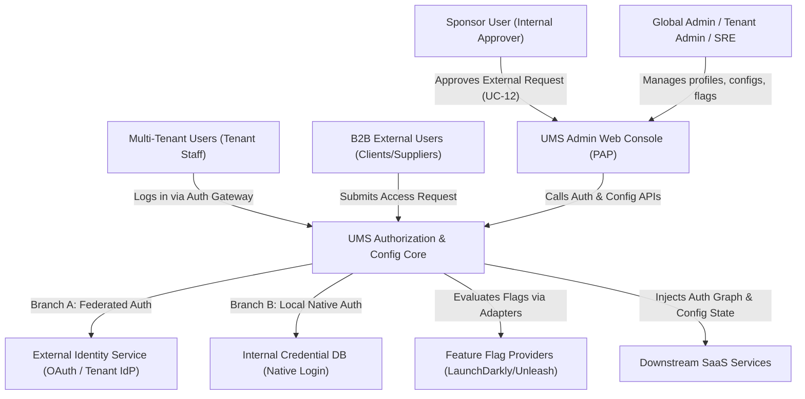
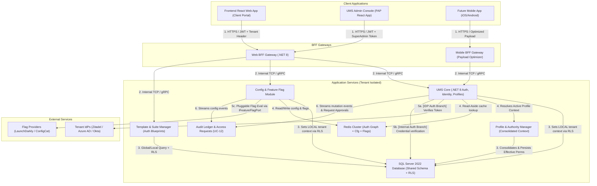
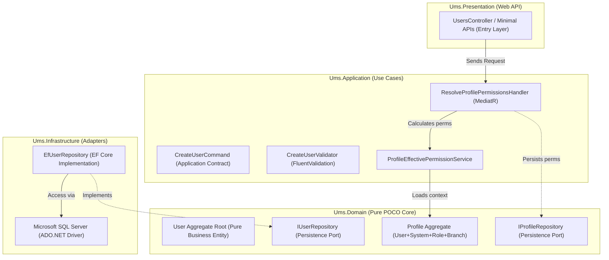
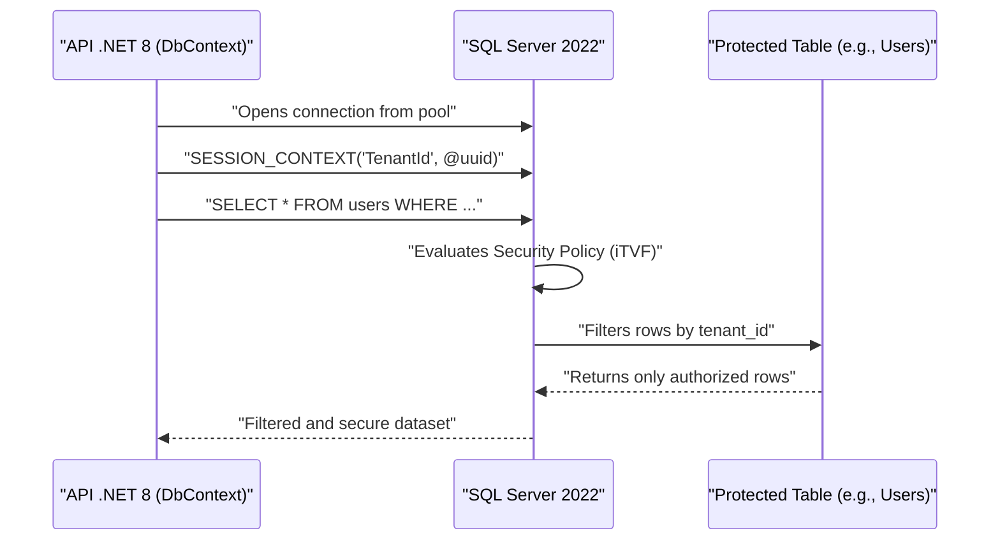
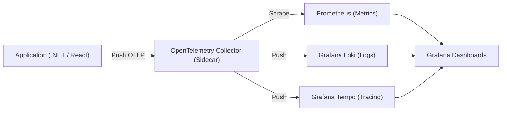
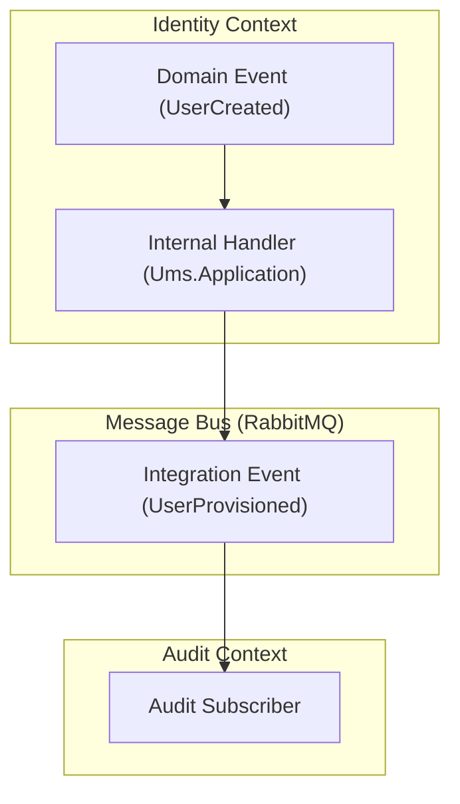
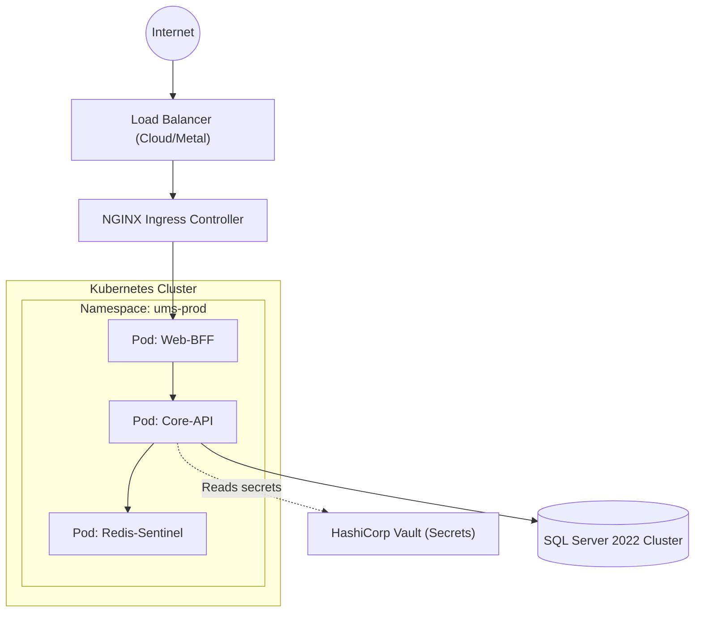
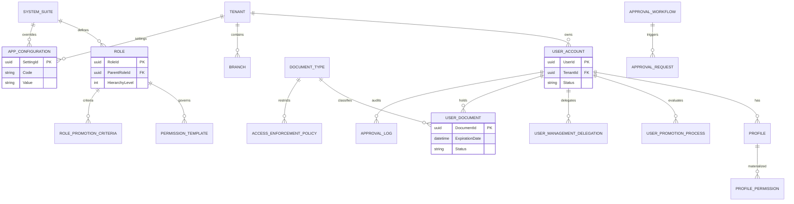

# 🏛️ Software Architecture Design Document (UMS)

This document details the formal system design specification for the **`ums`** monorepo. It adopts the **C4 Model** software modeling standard (Level 1: System Context, Level 2: Containers, Level 3: Components) and presents the unified and audited technical inventory of the project.

> [!IMPORTANT]
> **Engineering Standards Mandate:** All architectural decisions described here are strictly governed by the **[Global Engineering Standards & BMAD Manifesto](../artifacts/engineering-standards.md)**. Principles like SOLID, Clean Architecture, optional DDD, and the avoidance of anti-patterns are mandatory and automatically enforced via CI/CD pipelines.

---

## 🎯 1. Architectural Deliverables & Requirements Baseline

The following table defines the mandatory deliverables, strategic scope, and contractual design requirements governing the software architecture of this monorepo:

| Priority | Deliverable | Description (Strategic Level – Executive Rationale) |
| :--- | :--- | :--- |
| **1** | [Bounded Context Map](./bounded-context-map.md) | Representation of the bounded contexts of the UMS IAM domain, their responsibilities, how they relate, and how they will evolve. Establishes a clear functional scope for teams and budgeting. |
| **2** | [Platform Core Definition](#-7-centralized-authorization-engine-architecture-peppdppappip) | Strategy that identifies cross-cutting capabilities (Identity, Master Data, Event Bus, API Gateway), their common purpose, and reuse principles. Justifies investments in shared components. |
| **3** | [C4 Diagram (Context, Container, Component)](#-2-c4-model) | Architectural vision at levels 1 and 2: external systems, large containers, and communication between them. Sizes technical complexity and allows estimating effort without detailing classes or internal components. |
| **4** | [Database Strategy](#-8-database-strategy--multi-tenant-isolation-rls) | Substantiates the choice of persistence pattern (Database-per-Module), guidelines for distributed transactions, and general backup and recovery policies. Details the impact on costs and operations. |
| **5** | [Entity-Relationship (E/R) Model](./database-design-er.md) | Logical and physical representation of UMS entities (Identity, RBAC, Multi-tenancy) optimized for SQL Server 2022. |
| **6** | [Authorization Template Specification](#-14-authorization-template--inheritance-flow) | Strategy for managing reusable permission blueprints (Templates) and their inheritance lifecycle across systems and tenants. |
| **7** | [Event Domain Model (Event Storming)](#-10-asynchronous-communication--event-model) | Map of relevant business events, their producers, and consumers, along with delivery and ordering principles. Guides integration and the effort associated with orchestration/choreography. |
| **10** | API Versioning & Evolution Strategy | Guidelines for contract evolution (APIs and events): how changes are introduced without breaking dependencies. Forecasts technical governance and the cost of maintaining compatibility. |
| **11** | Multi-Domain Synchronization Strategy | Approach to eventual consistency between contexts: definition of sources of truth, duplication guidelines, and conflict resolution. Reveals integration complexity and its impact on timelines. |
| **12** | [Initial Architecture Decision Records (ADRs)](#-4-architectural-decision-matrix) | Log of the most influential architectural decisions, including the **[Profile-Centric Model](../adrs/0043-profile-centric-authorization-governance.md)**, justification, and alternatives. |
| **13** | [Integration Contract Testing Plan](#-12-quality-strategy--contract-testing) | Strategy to ensure interactions between contexts comply with their contracts. |
| **14** | [Deployment Infrastructure](#-11-deployment-infrastructure--cloud-topology) | Layout of the topology (cloud/on-premise/hybrid) and operational costs. |
| **15** | [Work Breakdown Structure & Plan](#-5-technical-debt-management--architectural-roadmap-backlog) | Roadmap with phases, sprints, and milestones. |

> [!IMPORTANT]
> **Mandatory Parametric Catalog Standard:** All parameter/configuration/catalog tables and entities in UMS MUST include `code`, `value`, and `description`, with enforced uniqueness by scope, versioning, auditability, traceability, cacheability, and future extensibility. This applies to global/tenant/system-scope parameters, feature flags, policies, security settings, workflows, business rules, and notification/approval configuration.

---

## 🗺️ 2. C4 Model

The architectural design of UMS is modeled at three progressive levels of abstraction to align business vision with physical code implementation.

### Level 1: System Context Diagram
Defines the boundary of the User Management System (UMS) interacting with corporate users and external identity services.

---

### Level 2: Container Diagram
Maps the physical subsystems (React Frontend, .NET 8 API, SQL Server 2022 Database) that make up the monorepo and how they communicate using secure protocols.

---

### Level 3: API Component Diagram
An interactive zoom into the **.NET 8 API** structure, demonstrating the flow of control towards the core (*Inversion of Control*) of the Hexagonal Architecture and the use of **MediatR**.

---

## 📊 3. Dependency Technical Inventory (Sovereign Tech Inventory)

This inventory details all tools, libraries, plugins, and components per workspace with their respective installed version, technical lifecycle recommendation (*Staff Recommendation*), and official reference URL.

### 🚀 A. Backend (.NET 8 API Layer)

| Dependency / Library | Installed Version | Technical Recommendation | Reference URL |
| :--- | :--- | :--- | :--- |
| `Microsoft.AspNetCore.App` | `8.0.x` | **Keep (Stable)** - High-performance framework for modern APIs. | [.NET 8 Docs](https://learn.microsoft.com/en-us/aspnet/core/) |
| `MediatR` | `^12.0.0` | **Keep (Critical)** - Decoupling implementation via Mediator pattern. | [MediatR GitHub](https://github.com/jbogard/MediatR) |
| `Microsoft.EntityFrameworkCore.SqlServer`| `8.0.x` | **Keep (Stable)** - ORM with official SQL Server support and RLS. | [EF Core SQL Server](https://learn.microsoft.com/en-us/ef/core/providers/sql-server/) |
| `Microsoft.Data.SqlClient` | `^5.2.0` | **Keep (Stable)** - Official and mature connection driver for SQL Server. | [SqlClient GitHub](https://github.com/dotnet/SqlClient) |
| `FluentValidation` | `^11.0.0` | **Keep (Stable)** - Strongly-typed validation for commands and queries. | [FluentValidation](https://fluentvalidation.net/) |
| `BCrypt.Net-Next` | `^4.0.3` | **Keep (Stable)** - Secure hashing for credential storage. | [BCrypt.Net](https://github.com/BcryptNet/bcrypt.net) |
| `Swashbuckle.AspNetCore` | `^6.5.0` | **Keep (Stable)** - Automatic generation of OpenAPI 3 specifications. | [Swashbuckle Docs](https://github.com/domaindrivendev/Swashbuckle.AspNetCore) |
| `OpenTelemetry` | `^1.7.0` | **Keep (Critical)** - Industry standard for observability and traceability. | [OpenTelemetry .NET](https://opentelemetry.io/docs/instrumentation/net/) |

---

### ⚛️ B. Frontend (React Web Client)

| Dependency / Library | Installed Version | Technical Recommendation | Reference URL |
| :--- | :--- | :--- | :--- |
| `react` | `^18.3.1` | **Keep (Stable)** - Ultra-stable version compatible with mature ecosystems. | [React Documentation](https://react.dev/) |
| `vite` | `^5.4.10` | **Keep (Stable)** - Ultra-fast bundler compatible with Node 18. | [Vite JS](https://vitejs.dev/) |
| `@tanstack/react-query`| `^5.100.9` | **Keep (Critical)** - Asynchronous server state synchronization and smart caching. | [TanStack Query Docs](https://tanstack.com/query/latest) |
| `zustand` | `^5.0.13` | **Keep (Stable)** - Lightweight global state manager alternative to Redux. | [Zustand GitHub](https://github.com/pmndrs/zustand) |
| `tailwindcss` | `^3.4.19` | **Keep (Stable)** - High-performance utility-first CSS engine. | [Tailwind CSS](https://tailwindcss.com/) |
| `axios` | `^1.16.0` | **Keep (Stable)** - Robust HTTP client with global interceptor support. | [Axios Docs](https://axios-http.com/) |
| `lucide-react` | `^1.14.0` | **Keep (Stable)** - Modern collection of reactive SVG icons. | [Lucide Icons](https://lucide.dev/) |

---

### 🛠️ C. Quality and Global Governance (Root Monorepo)

| Dependency / Library | Installed Version | Technical Recommendation | Reference URL |
| :--- | :--- | :--- | :--- |
| `nx` | `^20.3.0` | **Keep (Critical)** - High-performance task runner with caching support. | [Nx Dev Docs](https://nx.dev/) |
| `eslint-plugin-boundaries`| `^5.0.0` | **Keep (Stable)** - Strict governance for Hexagonal boundaries. | [eslint-plugin-boundaries](https://github.com/javierguzman/eslint-plugin-boundaries) |
| `eslint-plugin-sonarjs` | `^3.0.0` | **Keep (Stable)** - Zero-cost Sonar static analysis for local projects. | [SonarJS ESLint](https://github.com/SonarSource/eslint-plugin-sonarjs) |
| `husky` | `^9.0.0` | **Keep (Stable)** - Interception and automation of Git Hooks. | [Husky Docs](https://typicode.github.io/husky/) |
| `lint-staged` | `^15.0.0` | **Keep (Stable)** - Optimized execution of linters only on Git Staged files. | [lint-staged GitHub](https://github.com/lint-staged/lint-staged) |

---

## 🧠 4. Architectural Decision Matrix

This matrix maps foundational technical decisions to their targeted Quality Attributes, summarizing the architectural strategy and enforcement mechanisms to ensure a verifiable and sustainable system under the **spec-driven AI strategy BMAD-METHOD**:

| Decision / Focus | ADR Reference | Primary Quality Attributes | Decision Summary & Technical Strategy | Enforcement & Verification Mechanism |
| :--- | :--- | :--- | :--- | :--- |
| **Monorepo Orchestration** | [ADR 0001](../adrs/0001-monorepo-orchestration-nx.md) | Modularity, Build Performance | Uses Nx & npm workspaces to manage decoupled modules with localized configurations. | Nx cache verification and localized dependency schema checks. |
| **Hexagonal Boundaries** | [ADR 0002](../adrs/0002-clean-architecture-nestjs.md) | Decoupling, Testability, Agnosticism | Implements three strict layers: Core (Entities), Application (Use Cases), Infrastructure (Adapters). | `eslint-plugin-boundaries` blocks unauthorized outer-to-inner imports. |
| **Observability Telemetry** | [ADR 0007](../adrs/0007-observability-telemetry-loki-opentelemetry.md) | Observability, Performance, Monitoring | Grafana LGTM Stack (Loki + Grafana + Tempo) with OpenTelemetry (OTel). | OpenTelemetry integration tests and Grafana dashboards monitoring. |
| **Dependency Governance** | [ADR 0009](../adrs/0009-strict-dependency-pinning-vulnerability-management.md) | Security, Stability, Determinism | Zero-tolerance for dynamic versions (removes `^`/`~`) to guarantee reproducible builds. | `npm audit --audit-level=high` runs in CI to block vulnerable PRs. |
| **DB Engine Strategy** | [ADR 0026](../adrs/0026-authoritative-database-engine-strategy.md) | Ecosystem, Performance, Maintainability | SQL Server for .NET; PostgreSQL/Mongo for Node.js. Aligned with Microsoft standards. | Integration tests and infrastructure provisioning policies. |
| **SaaS Multi-Tenancy** | [ADR 0010](../adrs/0010-multi-tenancy-architecture-strategy.md) | Security, Data Isolation, Cost Efficiency | Shared schema with RLS (PostgreSQL for Node / SQL Server for .NET) to enforce tenant isolation. | `AsyncLocalStorage` propagates Tenant Context; EF Core Interceptors validate RLS. |
| **Fault Tolerance & Resiliency** | [ADR 0011](../adrs/0011-fault-tolerance-resiliency-patterns.md) | Resilience, Reliability, Consistency | Circuit Breaker (`opossum`) + Exponential Backoff retries strictly wrapped inside Infrastructure Adapters. | Jest mocks simulating HTTP failures and verifying circuit state transitions. |
| **Granular Authorization** | [ADR 0012](../adrs/0012-advanced-authorization-rbac-abac.md) | Security, Traceability, SoC | Tenant-aware RBAC/ABAC using JWT claim decoders and NestJS execution context Guards. | Integration tests simulating cross-tenant access attempts. |
| **Distributed Caching** | [ADR 0014](../adrs/0014-distributed-caching-strategy-redis.md) | Performance, Database Offloading | Read-Aside caching with Redis store, completely hidden behind a pure Core `ICachePort` abstraction. | Redis integration tests and strict TTL verification. |
| **Event-Driven Decoupling** | [ADR 0015](../adrs/0015-event-driven-architecture-intra-domain.md) | Decoupling, Scalability, Extensibilidad | Monolith modules communicate asynchronously using an internal event bus hidden behind `IEventBusPort`. | Unit tests verifying asynchronous execution paths and payload formats. |
| **Immutable Auditing** | [ADR 0016](../adrs/0016-immutable-business-audit-trail.md) | Traceability, Compliance, Security | Automatically tracks business-critical mutations (Old Value -> New Value) using database subscribers. | TypeORM Lifecycle Hook interceptors with strictly isolated tables. |
| **Tactical Domain Integrity** | [ADR 0019](../adrs/0019-tactical-design-patterns-future-proofing.md) | Decoupling, Clarity, Dapr Readiness | Uses Result Pattern, Null Objects, and Decorators to protect the Core from throwing HTTP/external framework errors. | Mandatory return types and custom ESLint boundaries rules. |
| **Identity Provider Abstraction** | [ADR 0020](../adrs/0020-identity-provider-abstraction-strategy.md) | Decoupling, Vendor Neutrality, Extensibilidad | Abstracts external directories (Zitadel, Okta, SAML) via the Strategy Pattern wrapped under a Hexagonal Port. | Jest unit tests verifying agnostic credential routing. |
| **High-Performance Compilation** | [ADR 0021](../adrs/0021-high-performance-auth-and-graph-compilation.md) | Performance, Ultra-Low Latency, Scalability | Resolves dynamic hierarchical permission graphs under 5ms using Redis read-aside caching. | Locust load tests and SRE telemetry tracing. |
| **Contextual Authentication** | [ADR 0022](../adrs/0022-contextual-auth-and-pluggable-projections.md) | Multi-Tenancy, Customization, Extensibilidad | Supports localized corporate branch context resolution and projects compiled graphs into multiple output formats. | Integration tests verifying branch-specific (sedes) dynamic menu structures. |
| **Centralized Auth Kernel** | [ADR 0023](../adrs/0023-centralized-ums-vs-decentralized-access.md) | Security, SoC, Governance | Establishes the UMS as a centralized authorization core shared across all enterprise applications. | Strict ESLint boundary checks and centralized access ledger audits. |

---

## 📈 5. Technical Debt Management & Architectural Roadmap (Backlog)

To guarantee the healthy evolution of the monorepo towards distributed models and production telemetry, the following items are established in the architecture backlog:

*   **[ADR 0006: Future Microservices Transition with Dapr](../adrs/0006-future-microservices-transition-dapr.md)**: Establishes the technical criteria and triggers that will determine when to split the modular monolith into independent microservices governed by Dapr sidecars.
*   **[ADR 0008: Progressive Multi-Module Evolution with API Gateway and BFF](../adrs/0008-progressive-multimodule-evolution-gateway-bff.md)**: Establishes the progressive design to transform this 100% Node.js reference solution into a multi-module portal capable of integrating independent systems (TMS, WMS, etc.) exposed as services with isolated databases, consumed via a central API Gateway and optimized through Backend For Frontend (BFF) gateways for Web and Mobile clients.
*   **[ADR 0009: Strict Dependency Pinning and Automated Vulnerability Management](../adrs/0009-strict-dependency-pinning-vulnerability-management.md)**: Establishes the strategy of zero-tolerance for dynamic dependency versions, enforcing static versions across the monorepo, with automated dependency bot updates and high/critical CI vulnerability checks.
*   **[ADR 0010: Multi-Tenancy Architecture Strategy for SaaS Evolution](../adrs/0010-multi-tenancy-architecture-strategy.md)**: Establishes the hybrid pooled multi-tenancy strategy utilizing a shared database schema coupled with RLS to enforce absolute data isolation at the engine level.
*   **[ADR 0013: Cloud Infrastructure Topology & DR](../adrs/0013-cloud-infrastructure-topology-dr.md)**: Establishes high availability and disaster recovery topologies across multiple availability zones.
*   **[ADR 0024: Configuration & Feature Management Platform](../adrs/0024-configuration-feature-management-platform.md)**: Extends UMS to handle dynamic system configuration and multi-IdP setups.
*   **[ADR 0025: Feature Flag Provider Abstraction](../adrs/0025-feature-flag-provider-abstraction.md)**: Pluggable framework for external flag providers via `IFeatureFlagPort`.
*   **[ADR 0026: Authoritative Database Engine Strategy](../adrs/0026-authoritative-database-engine-strategy.md)**: Defines engine-specific standards (SQL Server for .NET, PostgreSQL for Node.js) to leverage cloud-native features and RLS/SESSION_CONTEXT capabilities.

---

## 🛡️ 6. Financial & Operational Risk Assessment

An exhaustive evaluation of **"Build vs. Buy"** decisions, licensing implications, and operational costs associated with the sovereign tech stack. 

*   **[Vendor Lock-In & Financial Risk Assessment](./vendor-risk-assessment.md)**: Baseline documentation analyzing Identity Providers, Redis licensing, Feature Flag platforms, and Nx Cloud caching to prevent unexpected financial burdens.

---

## 🏛️ 7. Centralized Authorization Engine Architecture (PEP/PDP/PAP/PIP)

To support secure, context-aware, and highly scalable access control across all corporate applications, the system adopts a centralized **User Management System (UMS)** serving as a shared "authorization kernel". This architecture decouples identity validation from dynamic permission resolution by implementing standard **XACML Architectural Reference Model** layers:

1.  **Policy Enforcement Point (PEP)**: Intercepts incoming client requests at the API Gateway or individual NestJS Guards, enforcing access rules by reading the returned authorization graph.
2.  **Policy Decision Point (PDP)**: The core UMS Engine. It compiles and resolves fine-grained permissions into a cached, hierarchical graph under 5ms using Redis.
3.  **Policy Administration Point (PAP)**: The UMS administrative portal where security teams manage baseline templates, tenant profiles, and explicit permission rules.
4.  **Policy Information Point (PIP)**: Relational database registries supplying active tenant, branch (sedes), and user attributes during graph evaluation.

By utilizing the **Strategy Pattern** for dynamic output projections, the UMS can format the compiled graph into a variety of target structures on-the-fly (including frontend-optimized JSON, cryptographically signed JWT scopes, or Claims-based lists), ensuring high adaptability and complete zero-lock-in longevity. For a complete analysis of the Business Analyst reference model and API contracts, consult **[enterprise-iam-ums-specification.md](../artifacts/enterprise-iam-ums-specification.md)**.

---

## 🗄️ 8. Database Strategy & Multi-tenant Isolation (RLS)

The system utilizes a **Shared Database** model with logical isolation reinforced via SQL Server **SESSION_CONTEXT** and security policies (iTVF). This ensures that no tenant can ever access data from another, even if an application-layer error occurs.

---

## 📊 9. Observability & Distributed Telemetry Strategy

Strict adherence to the **OpenTelemetry** standard to guarantee sovereign monitoring data and avoid cloud-provider lock-in (Cloud-Agnostic).

---

## 🔭 Observability Layer vs. Audit Context — Dual-Ledger Strategy

The UMS observability design distinguishes two complementary but non-interchangeable record-keeping layers:

| Dimension | OpenTelemetry (Telemetry) | Audit Context (Business Ledger) |
| :--- | :--- | :--- |
| **Purpose** | SRE diagnostics, latency, error rates | Compliance, forensic, access accountability |
| **Primary consumer** | Grafana / Jaeger / Prometheus | Internal compliance tools, security auditors |
| **Mutability** | Rotated / pruned by TTL policy | Immutable — append-only, never deleted |
| **Event granularity** | Every HTTP request, gRPC call, DB query | Business events only (login, permission change, document expiry) |
| **Schema** | OTLP (spans, metrics, logs) | `AuditRecord { who, when, what, result, tenantId }` |
| **Transport** | OpenTelemetry SDK → Jaeger/Loki | Domain event bus (`IEventBusPort`) → Audit subscriber |

### Instrumentation Rule

Every critical business operation MUST emit BOTH signals in the same transaction boundary:

1. **OpenTelemetry span** — wraps the use case handler (MediatR pipeline behavior), capturing duration, error code, and `tenantId` attribute.
2. **Domain event** — published via `IEventBusPort` at the end of the use case, consumed by the Audit Context subscriber which writes the `AuditRecord`.

### Event → Audit Record Mapping

| Domain Event | Audit Record Type | OTel Span Name |
| :--- | :--- | :--- |
| `UserRegisteredEvent` | `IdentityLifecycleRecord` | `identity.user.register` |
| `UserSuspendedEvent` | `IdentityLifecycleRecord` | `identity.user.suspend` |
| `PermissionMutatedEvent` | `PermissionMutationRecord` | `authz.permission.mutate` |
| `PromotionApprovedEvent` | `PromotionRecord` | `iga.promotion.approve` |
| `DocumentExpiredEvent` | `ComplianceEnforcementRecord` | `compliance.document.expire` |
| `IdpConfigUpdatedEvent` | `ConfigChangeRecord` | `config.idp.update` |
| `FeatureFlagStateChangedEvent` | `ConfigChangeRecord` | `config.flag.change` |
| `AccessAttemptEvent` (auth gateway) | `AccessAttemptLog` | `auth.attempt` |

### SRE Alert Escalation Path

A sustained error rate on `authz.permission.mutate` spans (>2% over 5 min) triggers a Grafana alert → SRE validates via Audit Context ledger whether the errors correlate with a legitimate permission migration or an anomalous pattern.

---

## 🔄 10. Asynchronous Communication & Event Model

Clear differentiation between **Domain Events** (within the same bounded context) and **Integration Events** (between different contexts or external systems) to maintain module autonomy.

---

## ☁️ 11. Deployment Infrastructure & Cloud Topology

Design optimized for **Kubernetes** with the capability to deploy in public clouds or private on-premise environments.

---

## 🧪 12. Quality Strategy & Contract Testing

To ensure that changes in one context do not break its consumers, automated contract tests are implemented.

- **Unit Tests**: Pure logic in `Ums.Domain`.
- **Integration Tests**: Using **Testcontainers** to validate real behavior with SQL Server and Redis.
- **Contract Tests**: Validation of OpenAPI schemas and asynchronous events.

---

## 🗄️ 13. Data Modeling & Persistence (E/R)

The system architecture utilizes a shared database strategy with high-density multi-tenancy. Data isolation is strictly enforced at the engine level using SQL Server 2022 **SESSION_CONTEXT** and **Security Policies (iTVF)**. The model is logically partitioned into six Bounded Contexts (Aggregates) to maintain modularity and high-performance resolution.

### 13.1 Aggregate Reference Matrix

| Aggregate | Entities | Responsibility | Design Notes |
| :--- | :--- | :--- | :--- |
| **Identity** | TENANT, USER_ACCOUNT, BRANCH | Core identity management and context. | Denormalized TenantId for RLS. |
| **Authorization**| ROLE, PROFILE, ACTION, SUITE, PERMS | Fine-grained permission resolution. | Recursive role hierarchies and XOR action ownership. |
| **IGA** | PROMOTION, DELEGATION, CRITERIA | Merit-based evolution and delegation. | Flag-driven criteria engine. |
| **Compliance** | DOCUMENT, DOC_TYPE, NOTIF_RULE | Document validity and access locking. | Expiration-based access enforcement. |
| **Approvals** | WORKFLOW, REQUEST, LOG | Multi-step evidence-based approvals. | Immutable audit trail with 10-col schema. |
| **Configuration**| APP_CONFIGURATION | Multi-level hierarchical parameters. | Closest-scope-wins resolution (Global->Tenant->Suite). |

To view the complete DDL, DBML, and technical constraints, consult the **Source of Truth**:
👉 **[Detailed E/R Model & Export Formats (er-export-formats.md)](./er-export-formats.md)**

---

*   **Functional Hierarchy**: Access is governed by the intersection of **Resource** (Module/Menu) and **Action** (View/Create/Approve/etc).

### 14.2 Granular Action Matrix
The framework supports a standard enterprise action matrix including:
*   `view`, `create`, `edit`, `delete`, `approve`, `export`, `import`, `print`, `copy`, `download`, `execute`, `manage`, `assign`, `audit`.

### 14.3 Governance & Traceability
*   **Explicit Deny**: Supports overrides at the profile level without mutating the master template.
*   **Audit Compliance**: Every materialization and override is captured with full corporate audit fields and correlation IDs.

