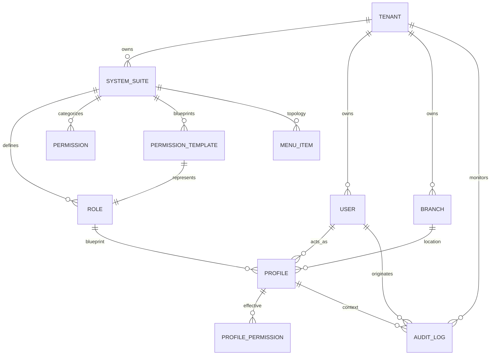
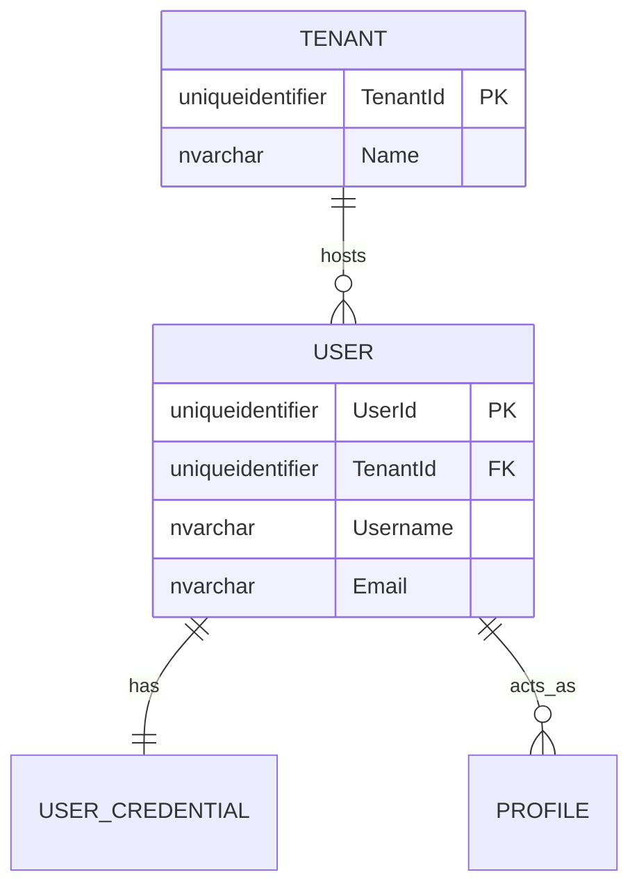
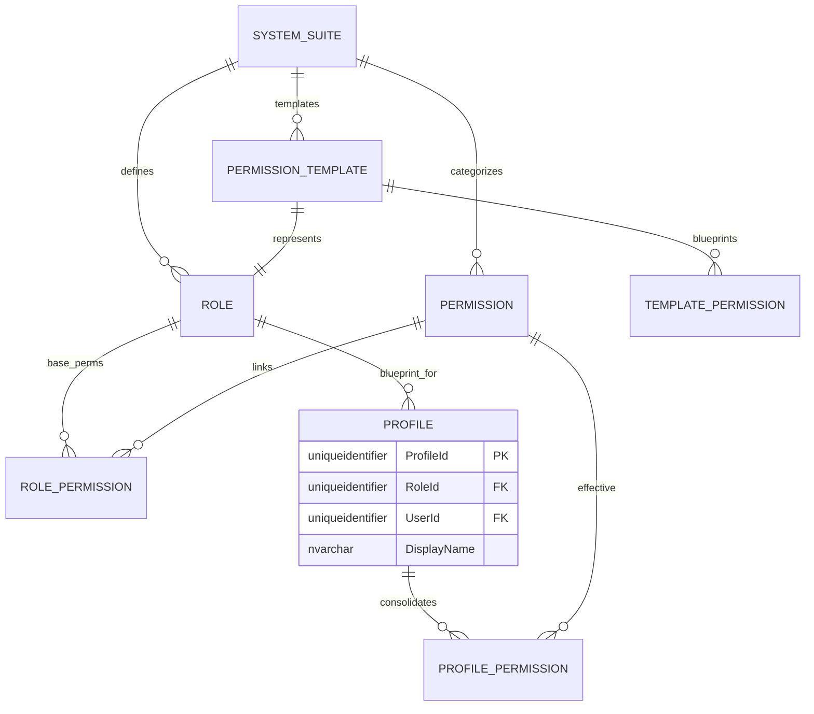
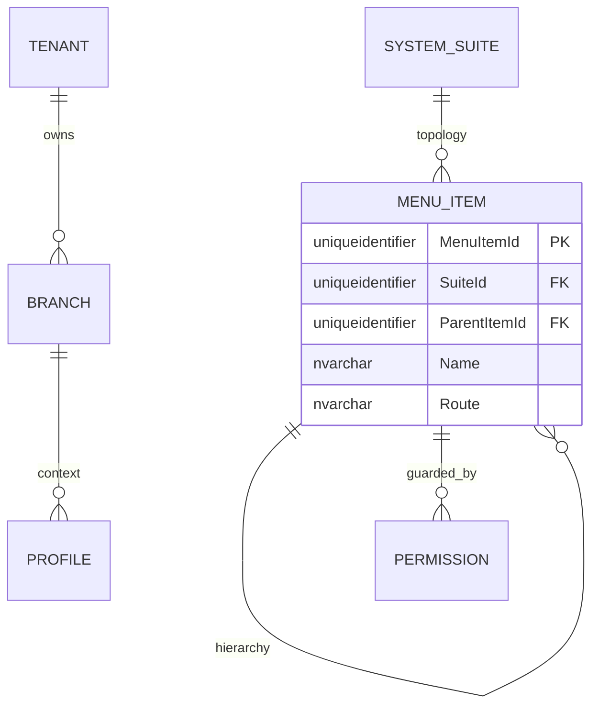
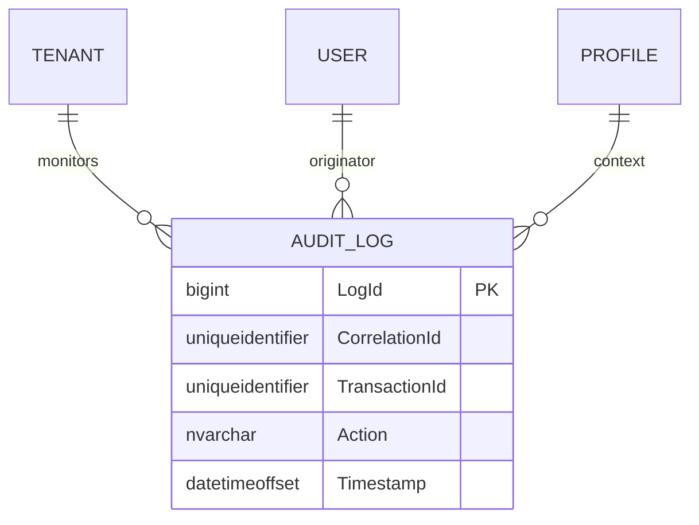

# 🗄️ Entity-Relationship (E/R) Model - SQL Server 2022

**Document Type:** Database Design  
**Status:** Refactored (Enterprise Profile-Centric)  
**Architecture:** Hierarchical Multi-tenancy (Profile Nexus)  
**Engine:** SQL Server 2022

## 1. Introduction
This document details the **Enterprise Profile-Centric** data model for the **User Management System (UMS)**. The model enforces strict hierarchical ownership and positions the `Profile` as the contextual intersection of identity and authorization.

---

## 2. Standard Corporate Audit & Traceability
Every entity in this schema MUST implement the following columns.

| Column | Type | Description |
| :--- | :--- | :--- |
| `CreatedAt` | `datetimeoffset` | Creation timestamp. |
| `CreatedBy` | `uniqueidentifier` | Creator ID. |
| `UpdatedAt` | `datetimeoffset` | Update timestamp. |
| `UpdatedBy` | `uniqueidentifier` | Last updater ID. |
| `DeletedAt` | `datetimeoffset` | Soft delete timestamp. |
| `DeletedBy` | `uniqueidentifier` | Deletor ID. |
| `Version` | `int` | Optimistic locking (Default: 1). |
| `IsActive` | `bit` | Status flag. |
| `TenantId` | `uniqueidentifier` | Contextual isolation (where applicable). |
| `CorrelationId`| `uniqueidentifier` | Traceability across distributed operations. |

---

## 3. E/R Diagram (Mermaid)

## 3. Modular Domain Views

To improve readability and navigation, the model is divided into functional domains.

### 🗺️ 3.1 Global High-Level Map
Comprehensive view of core module relationships.

---

### 👤 3.2 Domain: Identity & Core
Management of Tenants, Users, and their primary credentials.

---

### 🔐 3.3 Domain: Profiles & Authority (The Core)
The heart of the UMS: how Roles, Templates, and Profiles consolidate into Effective Permissions.

---

### 📍 3.4 Domain: Topology & Navigation
Organizational structure and functional menu layout.

---

### 📝 3.5 Domain: Audit & Traceability
Global monitoring and transactional integrity.

---

## 🛠️ 4. Interactive Exploration
Since Markdown viewers are static, for a full dynamic experience (zoom/pan/expand), please use the following tools:

1.  **Mermaid Live Editor**: Copy the Mermaid code blocks above into [Mermaid.live](https://mermaid.live/) to interactively explore and export in high resolution.
2.  **VS Code Extensions**: Use "Markdown Preview Mermaid Support" to enable zooming within your IDE.

---

## 4. Business Rules & Normalization
1.  **Strict Isolation**: A Role cannot exist outside a System context.
2.  **Contextual Integrity**: A Profile can only be created if the selected Role belongs to the selected System, and both belong to the same Tenant.
3.  **Template Hub**: Permission Templates link to a specific System Role, allowing for branch-agnostic profile initialization.
4.  **Soft Delete**: Data is never physically removed; `DeletedAt` is populated to maintain history.
5.  **Effective Persistance**: `PROFILE_PERMISSION` acts as the source of truth for the `Authorization Engine`, combining Role-based defaults with Profile-specific overrides.
