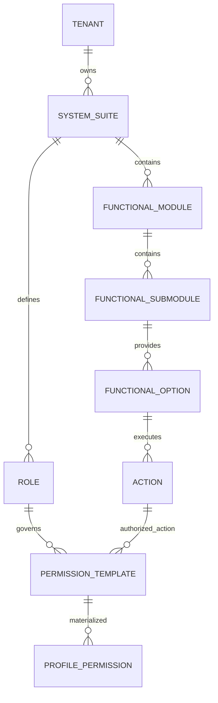
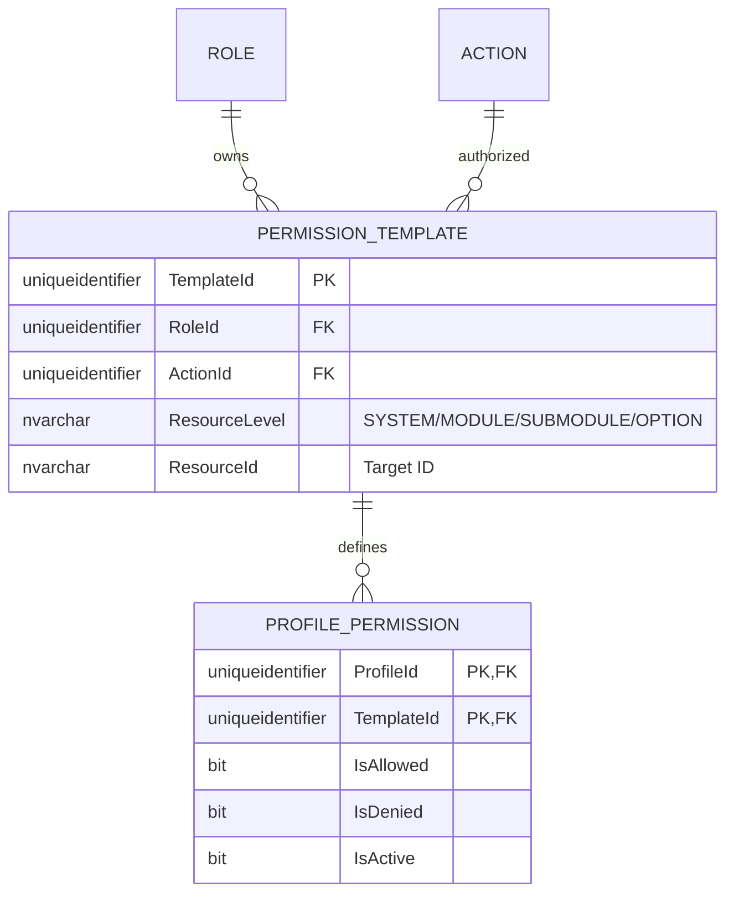
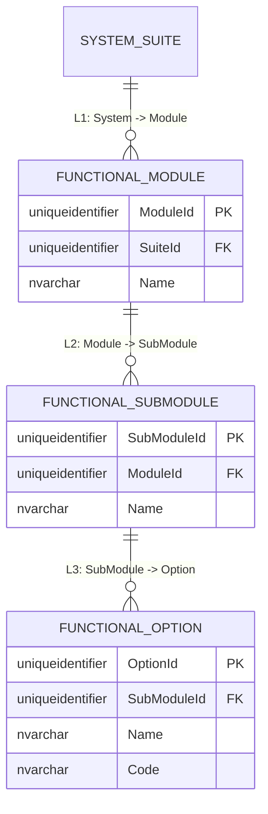

# 🗄️ Entity-Relationship (E/R) Model - SQL Server 2022

**Document Type:** Database Design  
**Status:** Refactored (Role-Scoped & Strict Hierarchy)  
**Architecture:** Hierarchical Master Framework (5-Level Control)  
**Engine:** SQL Server 2022

## 1. Introduction
This document details the **Role-Scoped** authorization model, strictly enforcing the hierarchical chain: **System -> Module -> Sub-module -> Option -> Action**.

> [!TIP]
> **Visualization Issues?**  
> If Mermaid diagrams do not render correctly in your IDE, please use the **[🚀 Alternative Export Formats (dbdiagram.io, DDL, D2)](./er-export-formats.md)**. These formats are compatible with professional tools like DBeaver, SSMS, and dbdiagram.io.

---

## 2. Standard Corporate Audit & Traceability
All entities implement the standard 10-column audit schema.

---

## 3. Modular Domain Views

### 🗺️ 3.1 Global High-Level Map
Full Resolution Path: `Tenant -> System -> Role -> Template -> ProfilePermission`.

---

### 🔐 3.2 Domain: Role-Centric Authority & Strict Hierarchy
This domain ensures every permission is scoped to a Role and maps exactly to the 5-level functional hierarchy.

---

### 📍 3.3 Domain: Functional Topology (The 5 Levels)
Organizational structure of resources.

---

## 4. Business Rules & Constraints
1.  **Hierarchy Integrity**: Access must be traced through `System > Module > Sub-module > Option > Action`.
2.  **Role Ownership**: A `PermissionTemplate` MUST belong to a `Role`.
3.  **No Orphan Actions**: Actions must be owned by a System or Module (Global vs Local context).
4.  **Materialization**: Effective permissions always reference a valid Role-scoped template.
