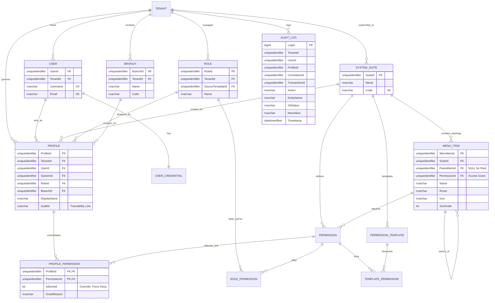

# 🗄️ Entity-Relationship (E/R) Model - SQL Server 2022

**Document Type:** Database Design  
**Status:** Refactored (Profile-Centric)  
**Architecture:** Contextual Multi-tenancy (Profile Hub)  
**Engine:** SQL Server 2022

## 1. Introduction
This document details the **Profile-Centric** data model for the **User Management System (UMS)**. The model is centered around the `Profile` entity, which serves as the contextual consolidation of identity and authority across Systems, Roles, and Branches.

---

## 2. Standard Corporate Audit & Traceability
Every table in this schema MUST implement the following audit columns to comply with corporate governance standards.

| Column | Type | Description |
| :--- | :--- | :--- |
| `CreatedAt` | `datetimeoffset` | Creation timestamp. |
| `CreatedBy` | `uniqueidentifier` | ID of the user/system that created the record. |
| `UpdatedAt` | `datetimeoffset` | Last update timestamp (Nullable). |
| `UpdatedBy` | `uniqueidentifier` | ID of the user/system that last updated the record. |
| `DeletedAt` | `datetimeoffset` | Soft delete timestamp (Nullable). |
| `DeletedBy` | `uniqueidentifier` | ID of the user/system that deleted the record. |
| `Version` | `int` | Row version for optimistic concurrency (Default: 1). |
| `Status` | `int` | Record status (1: Active, 0: Inactive, 99: Deleted). |

---

## 3. E/R Diagram (Mermaid)

---

## 4. Multi-tenancy & Isolation
The isolation is enforced via **SQL Server Row-Level Security (RLS)**.

*   **Global Entities** (`SystemSuites`, `Permissions`, `GlobalTemplates`): Accessible by all tenants.
*   **Tenant Entities** (`Users`, `Roles`, `Profiles`, `Branches`): Isolated by `TenantId` using `SESSION_CONTEXT(N'TenantId')`.
*   **Effective Resolution**: The `Authorization Engine` resolves permissions primarily from `ProfilePermissions` for the `ActiveProfileId`.

---

## 5. Persistence of Effective Permissions
*   When a **Profile** is created, permissions from the selected **Role** (and its Template) are projected into `ProfilePermissions`.
*   Any **Override** performed by an administrator is stored directly in `ProfilePermissions` for that specific `ProfileId`.
*   This ensures that the `Authorization Engine` performs a single, highly-indexed join to retrieve the full permission set for the user's current context.
