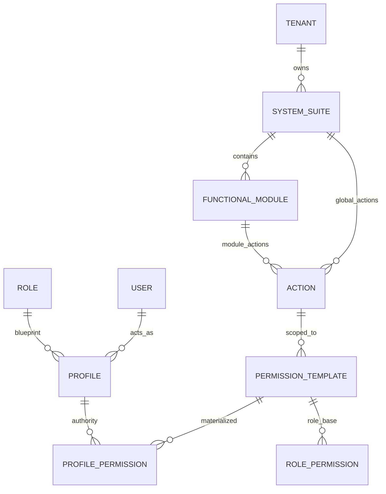
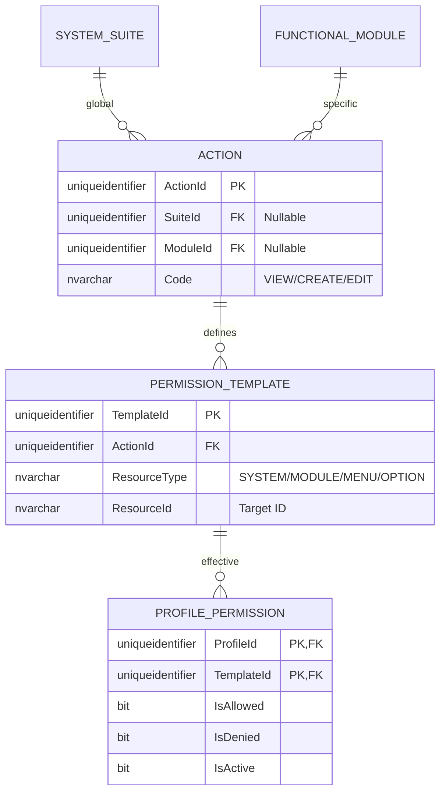
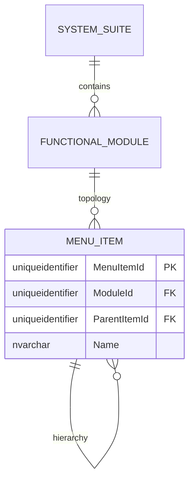

# 🗄️ Entity-Relationship (E/R) Model - SQL Server 2022

**Document Type:** Database Design  
**Status:** Refactored (Scoped Action Governance)  
**Architecture:** Hierarchical Master Framework  
**Engine:** SQL Server 2022

## 1. Introduction
This document details the **Scoped Action** authorization model. Every authority in the system must belong to a functional container (System or Module), eliminating orphaned permissions and ensuring strict architectural governance.

> [!TIP]
> **Visualization Issues?**  
> If Mermaid diagrams do not render correctly in your IDE, please use the **[🚀 Alternative Export Formats (dbdiagram.io, DDL, D2)](./er-export-formats.md)**. These formats are compatible with professional tools like DBeaver, SSMS, and dbdiagram.io.

---

## 2. Standard Corporate Audit & Traceability
Every entity in this schema MUST implement the standard 10 columns (`CreatedAt`, `CreatedBy`, `UpdatedAt`, `UpdatedBy`, `DeletedAt`, `DeletedBy`, `Version`, `IsActive`, `TenantId`, `CorrelationId`).

---

## 3. Modular Domain Views

### 🗺️ 3.1 Global High-Level Map
Full resolution path: `Tenant -> System -> Module -> Resource -> Action -> Template -> ProfilePermission`.

---

### 🔐 3.2 Domain: Scoped Authorization Framework
Management of scoped actions and their materialization.

---

### 📍 3.3 Domain: Functional Topology
Hierarchy of organizational structure and navigation.

---

## 4. Business Rules & Constraints
1.  **Action Ownership**: Every Action MUST have either a `SuiteId` or a `ModuleId`.
2.  **Constraint**: `CHECK (SuiteId IS NOT NULL OR ModuleId IS NOT NULL)`.
3.  **No Orphans**: All permissions must trace back to a template.
4.  **Immutability**: Permission templates are the source of truth; ProfilePermissions are overrides/materializations.
