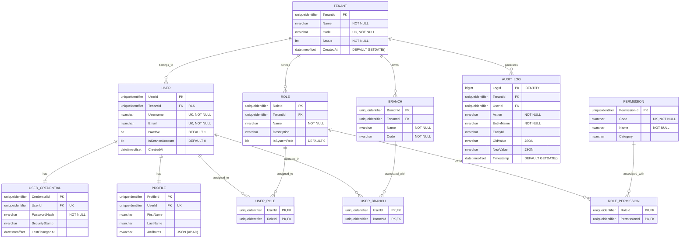

# 🗄️ Entity-Relationship (E/R) Model - SQL Server 2022

**Document Type:** Database Design  
**Status:** Proposed  
**Architecture:** Multi-tenancy (Shared Schema + RLS)  
**Engine:** SQL Server 2022

## 1. Introduction
This document details the data model design for the **User Management System (UMS)**. The design is optimized for **SQL Server 2022**, utilizing modern data types and a structure that facilitates data isolation through **Row-Level Security (RLS)** and the use of `SESSION_CONTEXT`.

---

## 2. E/R Diagram (Mermaid)



---

## 3. Data Dictionary & SQL Server Types

### 3.1 Type Standards
*   **Identifiers (PK/FK):** `uniqueidentifier` using `NEWSEQUENTIALID()` in SQL Server to avoid index fragmentation.
*   **Dates:** `datetimeoffset` to ensure precision across global time zones.
*   **Strings:** `nvarchar(n)` for full Unicode support.
*   **Metadata/ABAC:** `nvarchar(max)` with `ISJSON()` validation for dynamic attribute flexibility.

### 3.2 Primary Tables

| Table | Purpose | Index Strategy |
| :--- | :--- | :--- |
| `Tenants` | Tenant master. | Clustered on `TenantId`. Unique on `Code`. |
| `Users` | User identities. | Clustered on `UserId`. Non-clustered on `TenantId` (RLS Optimization). |
| `Roles` | Role definition per tenant. | Filtered by `TenantId`. |
| `AuditLogs` | Change traceability. | Clustered on `LogId` (bigint identity). Partitioned by `Timestamp` if scale increases. |

---

## 4. Multi-tenancy Implementation (RLS)

For SQL Server, the isolation proposal is based on the use of **Security Policies** and **Inline Table-Valued Functions (iTVF)**.

### Predicate Filter Function
```sql
CREATE FUNCTION Security.fn_tenantSecurityPredicate(@TenantId uniqueidentifier)
    RETURNS TABLE
    WITH SCHEMABINDING
AS
    RETURN SELECT 1 AS fn_security_predicate_result
    WHERE @TenantId = CAST(SESSION_CONTEXT(N'TenantId') AS uniqueidentifier)
       OR CAST(SESSION_CONTEXT(N'IsSuperAdmin') AS bit) = 1;
```

### Security Policy
```sql
CREATE SECURITY POLICY Security.TenantIdFilter
    ADD FILTER PREDICATE Security.fn_tenantSecurityPredicate(TenantId) ON dbo.Users,
    ADD FILTER PREDICATE Security.fn_tenantSecurityPredicate(TenantId) ON dbo.Roles,
    ADD FILTER PREDICATE Security.fn_tenantSecurityPredicate(TenantId) ON dbo.AuditLogs
    WITH (STATE = ON);
```

---

## 5. Blueprint Considerations
1.  **Scalability:** The use of **Columnstore Indexes** on the `AuditLogs` table is recommended if audit volume exceeds millions of records.
2.  **Integrity:** All N:M relationships are handled through junction tables with composite keys to optimize navigation.
3.  **Security:** Password hashes must never be stored in the `Users` table, but in `UserCredentials` to allow for secret rotation and multiple authentication methods (e.g., MFA).
