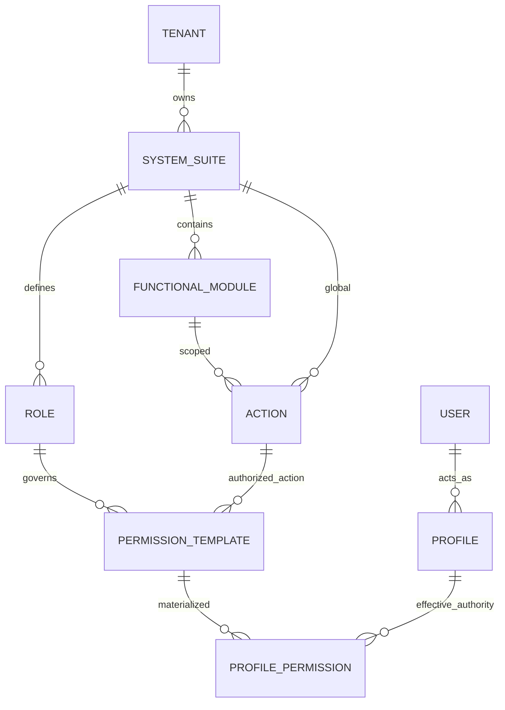
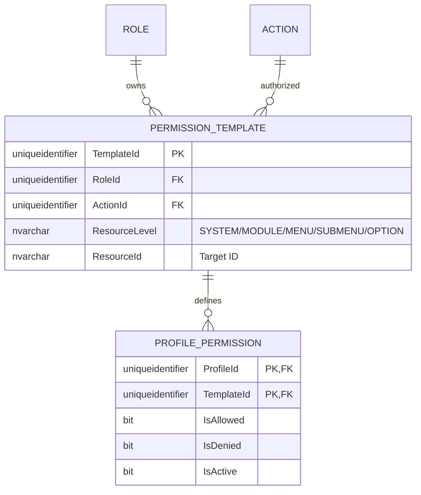
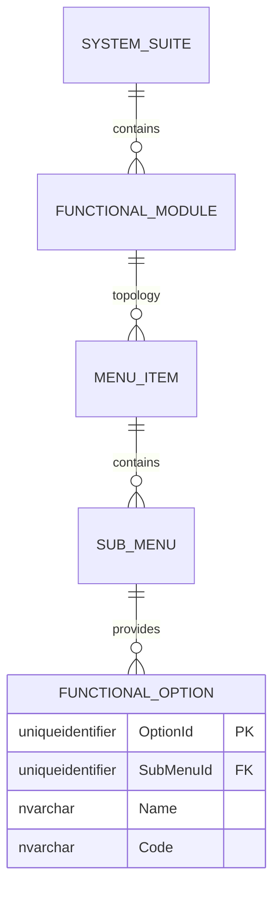

# 🗄️ Entity-Relationship (E/R) Model - SQL Server 2022

**Document Type:** Database Design  
**Status:** Refactored (Role-Scoped Template Governance)  
**Architecture:** Deep Hierarchy Master Framework  
**Engine:** SQL Server 2022

## 1. Introduction
This document details the **Role-Scoped** authorization model. Every authorized authority is defined within a `PermissionTemplate` owned by a `Role`, ensuring strict alignment with functional boundaries.

> [!TIP]
> **Visualization Issues?**  
> If Mermaid diagrams do not render correctly in your IDE, please use the **[🚀 Alternative Export Formats (dbdiagram.io, DDL, D2)](./er-export-formats.md)**. These formats are compatible with professional tools like DBeaver, SSMS, and dbdiagram.io.

---

## 2. Standard Corporate Audit & Traceability
All entities implement the standard 10-column audit schema.

---

## 3. Modular Domain Views

### 🗺️ 3.1 Global High-Level Map
Resolution: `Tenant -> System -> Role -> Template -> ProfilePermission`.

---

### 🔐 3.2 Domain: Role-Centric Authority
Management of role-scoped templates and deep functional hierarchy.

---

### 📍 3.3 Domain: Functional Resources
Deep organizational and navigational structure.

---

## 4. Business Rules & Constraints
1.  **Role Primacy**: A `PermissionTemplate` MUST belong to a `Role`.
2.  **No Orphan Actions**: Actions must be owned by a System or Module.
3.  **Hierarchy Compliance**: Authorization supports 6 levels from System to Action.
4.  **Immutability**: Effective permissions (`ProfilePermission`) must reference a valid Role-Scoped template.
