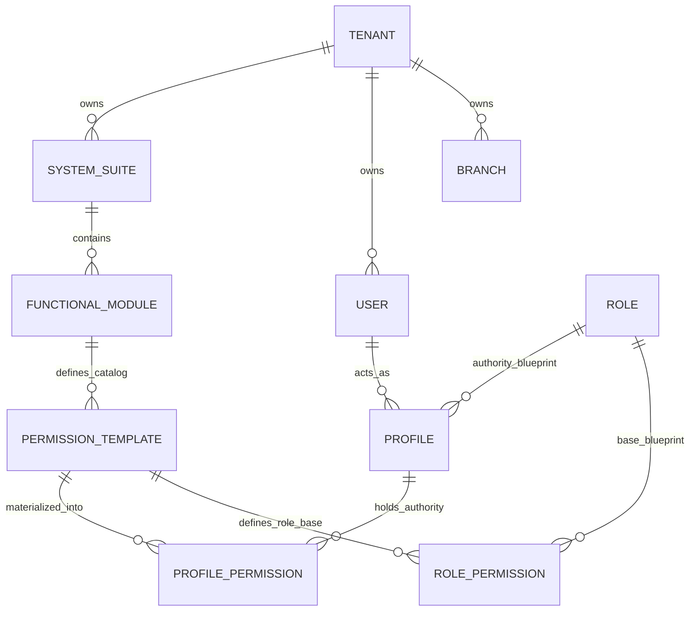
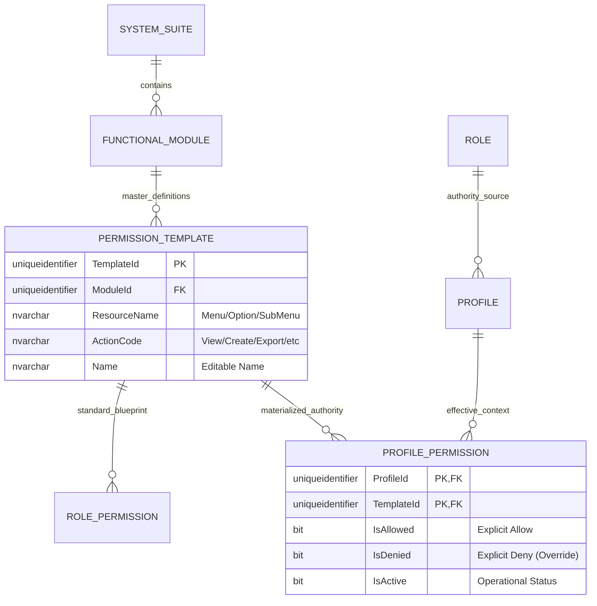
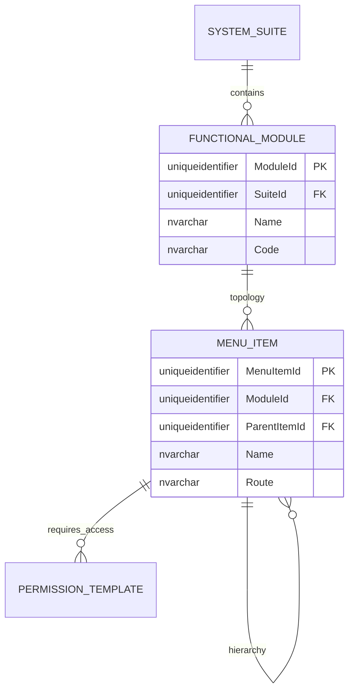
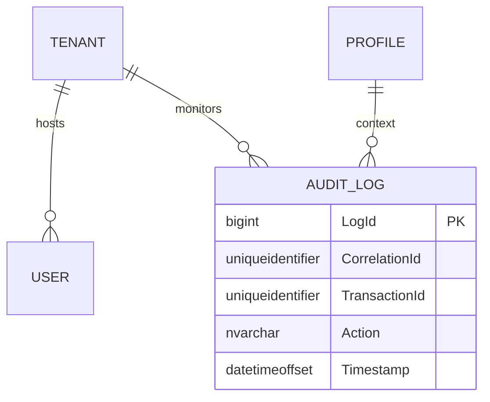

# 🗄️ Entity-Relationship (E/R) Model - SQL Server 2022

**Document Type:** Database Design  
**Status:** Refactored (Master-Template Driven)  
**Architecture:** Hierarchical Framework (Materialized Authority)  
**Engine:** SQL Server 2022

## 1. Introduction
This document details the **Master-Template Driven** authorization model. Every effective permission in the system must be a materialized instance of a controlled `PermissionTemplate`, ensuring 100% governance over the authority catalog.

---

## 2. Standard Corporate Audit & Traceability
Every entity in this schema MUST implement the following columns.

| Column | Type | Description |
| :--- | :--- | :--- |
| `CreatedAt` | `datetimeoffset` | Creation timestamp. |
| `CreatedBy` | `uniqueidentifier` | Creator ID. |
| `UpdatedAt` | `datetimeoffset` | Update timestamp. |
| `UpdatedBy` | `uniqueidentifier` | Last updater ID. |
| `DeletedAt` | `datetimeoffset` | Soft delete timestamp. |
| `DeletedBy` | `uniqueidentifier` | Deletor ID. |
| `Version` | `int` | Optimistic locking (Default: 1). |
| `IsActive` | `bit` | Status flag. |
| `TenantId` | `uniqueidentifier` | Contextual isolation. |
| `CorrelationId`| `uniqueidentifier` | Distributed traceability. |

---

## 3. Modular Domain Views

### 🗺️ 3.1 Global High-Level Map
Comprehensive view of core module relationships.

---

### 🔐 3.2 Domain: Master Authorization Framework (The Core)
This domain manages the immutable permission catalog and its materialization into profiles.

---

### 📍 3.3 Domain: Functional Topology & Navigation
Hierarchical structure of systems and menus.

---

### 📝 3.4 Domain: Audit & Identity
Management of identities and global traceability.

---

## 4. Business Rules & Normalization
1.  **Template Primacy**: `PermissionTemplate` is the absolute master source. No ad-hoc permissions are allowed.
2.  **Triple-State Authority**: `ProfilePermission` uses `IsAllowed`, `IsDenied`, and `IsActive` to resolve final authority.
3.  **Hierarchy**: `System > Module > Menu > Action`.
4.  **Action Matrix**: Templates support granular actions: `view`, `create`, `edit`, `delete`, `approve`, `export`, `import`, `print`, `copy`, `download`, `execute`, `manage`, `assign`, `audit`.
5.  **Soft Delete**: Mandatory for all entities to maintain audit integrity.
