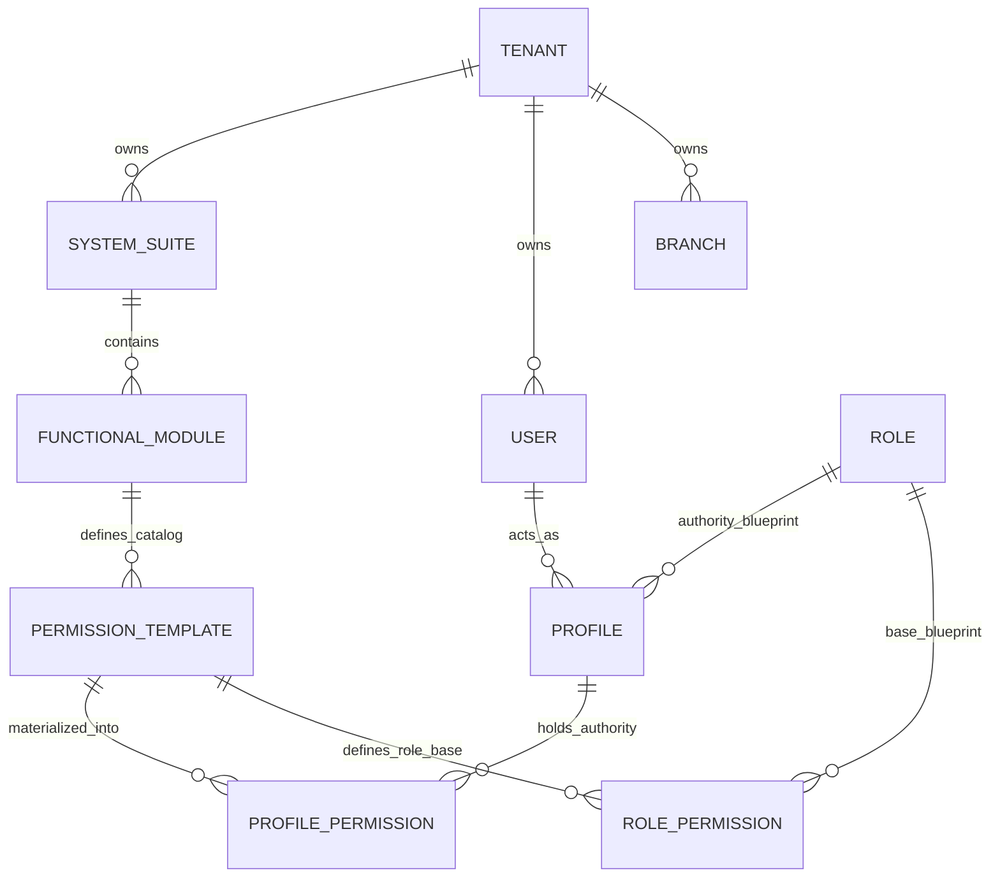
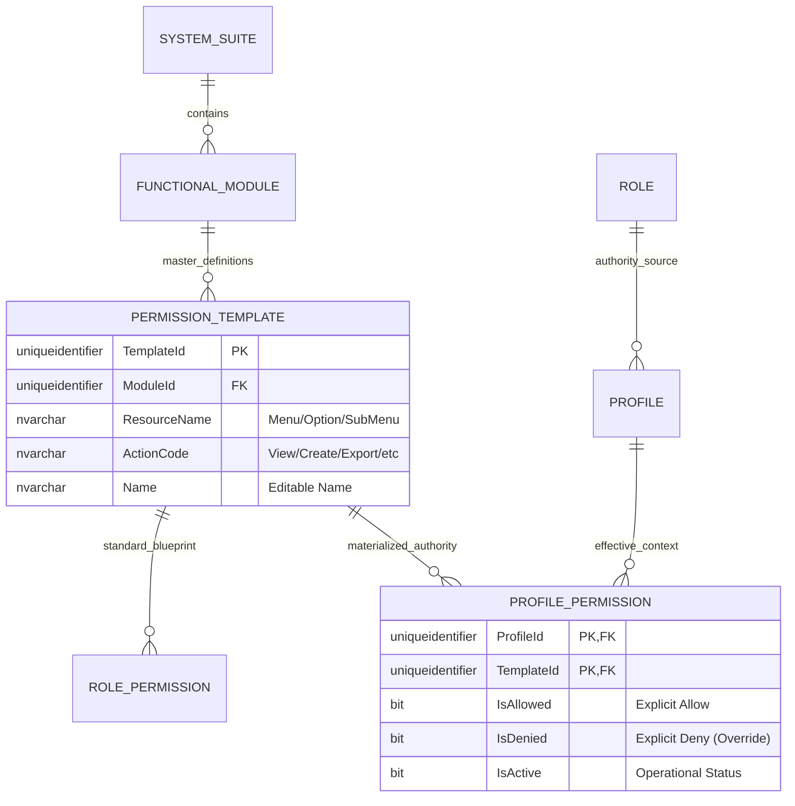
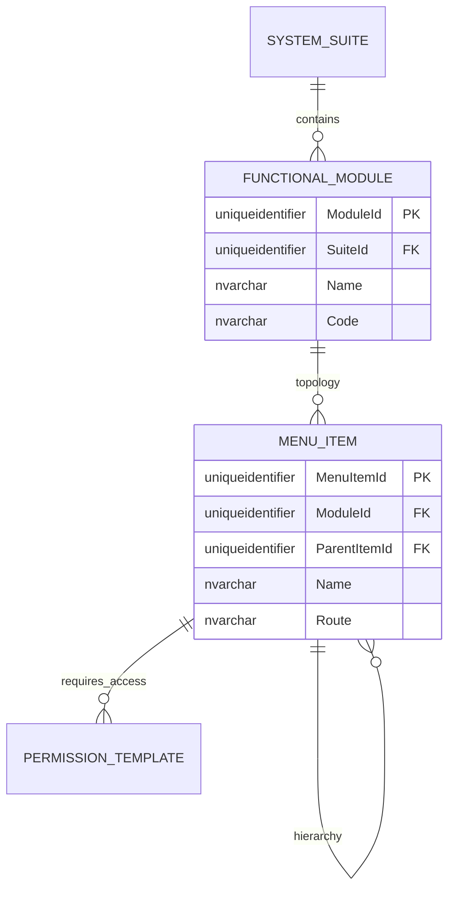
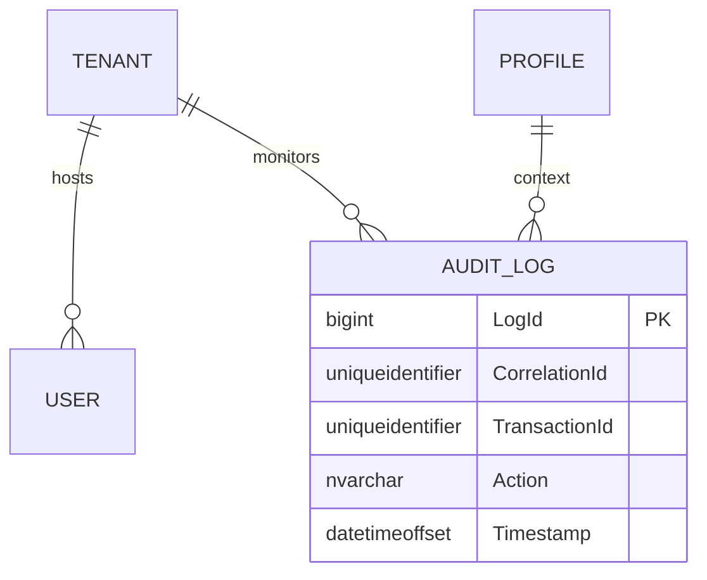

# 🗄️ Entity-Relationship (E/R) Model - SQL Server 2022

**Document Type:** Database Design  
**Status:** Refactored (Master-Template Driven)  
**Architecture:** Hierarchical Framework (Materialized Authority)  
**Engine:** SQL Server 2022

## 1. Introduction
This document details the **Master-Template Driven** authorization model. Every effective permission in the system must be a materialized instance of a controlled `PermissionTemplate`, ensuring 100% governance over the authority catalog.

---

## 🛠️ 4. Interactive Exploration
Standard Markdown viewers render Mermaid as static images. For a dynamic experience (zoom, pan, search), use one of the following:

1.  **🚀 [Launch Interactive E/R Viewer (HTML)](./interactive-er-viewer.html)**: Open this standalone viewer in any browser to explore all domains dynamically.
2.  **Mermaid Live Editor**: Use the links below to open each domain in the official editor for high-resolution export:
    *   [Open Global Map in Live Editor](https://mermaid.live/edit#erDiagram%0A%20%20%20%20TENANT%20%7C%7C--o%7B%20SYSTEM_SUITE%20%3A%20%22owns%22%0A%20%20%20%20TENANT%20%7C%7C--o%7B%20USER%20%3A%20%22owns%22%0A%20%20%20%20TENANT%20%7C%7C--o%7B%20BRANCH%20%3A%20%22owns%22%0A%20%20%20%20TENANT%20%7C%7C--o%7B%20AUDIT_LOG%20%3A%20%22monitors%22%0A%20%20%20%20SYSTEM_SUITE%20%7C%7C--o%7B%20FUNCTIONAL_MODULE%20%3A%20%22contains%22%0A%20%20%20%20FUNCTIONAL_MODULE%20%7C%7C--o%7B%20PERMISSION_TEMPLATE%20%3A%20%22defines%22%0A%20%20%20%20PERMISSION_TEMPLATE%20%7C%7C--o%7B%20PROFILE_PERMISSION%20%3A%20%22materializes%22%0A%20%20%20%20USER%20%7C%7C--o%7B%20PROFILE%20%3A%20%22acts_as%22%0A%20%20%20%20PROFILE%20%7C%7C--o%7B%20PROFILE_PERMISSION%20%3A%20%22authority%22%0A%20%20%20%20BRANCH%20%7C%7C--o%7B%20PROFILE%20%3A%20%22location%22)
    *   [Open Auth Framework in Live Editor](https://mermaid.live/edit#erDiagram%0A%20%20%20%20SYSTEM_SUITE%20%7C%7C--o%7B%20FUNCTIONAL_MODULE%20%3A%20%22contains%22%0A%20%20%20%20FUNCTIONAL_MODULE%20%7C%7C--o%7B%20PERMISSION_TEMPLATE%20%3A%20%22master_definitions%22%0A%20%20%20%20PERMISSION_TEMPLATE%20%7C%7C--o%7B%20ROLE_PERMISSION%20%3A%20%22blueprint%22%0A%20%20%20%20PERMISSION_TEMPLATE%20%7C%7C--o%7B%20PROFILE_PERMISSION%20%3A%20%22materialized%22%0A%20%20%20%20PROFILE%20%7C%7C--o%7B%20PROFILE_PERMISSION%20%3A%20%22effective%22%0A%20%20%20%20ROLE%20%7C%7C--o%7B%20PROFILE%20%3A%20%22source%22)

---

## 2. Standard Corporate Audit & Traceability
Every entity in this schema MUST implement the following columns.

| Column | Type | Description |
| :--- | :--- | :--- |
| `CreatedAt` | `datetimeoffset` | Creation timestamp. |
| `CreatedBy` | `uniqueidentifier` | Creator ID. |
| `UpdatedAt` | `datetimeoffset` | Update timestamp. |
| `UpdatedBy` | `uniqueidentifier` | Last updater ID. |
| `DeletedAt` | `datetimeoffset` | Soft delete timestamp. |
| `DeletedBy` | `uniqueidentifier` | Deletor ID. |
| `Version` | `int` | Optimistic locking (Default: 1). |
| `IsActive` | `bit` | Status flag. |
| `TenantId` | `uniqueidentifier` | Contextual isolation. |
| `CorrelationId`| `uniqueidentifier` | Distributed traceability. |

---

## 3. Modular Domain Views

### 🗺️ 3.1 Global High-Level Map
Comprehensive view of core module relationships.

---

### 🔐 3.2 Domain: Master Authorization Framework (The Core)
This domain manages the immutable permission catalog and its materialization into profiles.

---

### 📍 3.3 Domain: Functional Topology & Navigation
Hierarchical structure of systems and menus.

---

### 📝 3.4 Domain: Audit & Identity
Management of identities and global traceability.

---

## 4. Business Rules & Normalization
1.  **Template Primacy**: `PermissionTemplate` is the absolute master source. No ad-hoc permissions are allowed.
2.  **Triple-State Authority**: `ProfilePermission` uses `IsAllowed`, `IsDenied`, and `IsActive` to resolve final authority.
3.  **Hierarchy**: `System > Module > Menu > Action`.
4.  **Action Matrix**: Templates support granular actions: `view`, `create`, `edit`, `delete`, `approve`, `export`, `import`, `print`, `copy`, `download`, `execute`, `manage`, `assign`, `audit`.
5.  **Soft Delete**: Mandatory for all entities to maintain audit integrity.

---

## 🛠️ 4. Exploración Interactiva
Los visores de Markdown estándar renderizan Mermaid como imágenes estáticas. Para una experiencia dinámica (zoom, pan, búsqueda), utilice uno de los siguientes:

1.  **🚀 [Lanzar Visor E/R Interactivo (HTML)](./interactive-er-viewer.html)**: Abra este visor independiente en cualquier navegador para explorar todos los dominios dinámicamente.
2.  **Mermaid Live Editor**: Use los enlaces a continuación para abrir cada dominio en el editor oficial para exportación en alta resolución:
    *   [Abrir Mapa Global en Live Editor](https://mermaid.live/edit#erDiagram%0A%20%20%20%20TENANT%20%7C%7C--o%7B%20SYSTEM_SUITE%20%3A%20%22posee%22%0A%20%20%20%20TENANT%20%7C%7C--o%7B%20USER%20%3A%20%22posee%22%0A%20%20%20%20TENANT%20%7C%7C--o%7B%20BRANCH%20%3A%20%22posee%22%0A%20%20%20%20TENANT%20%7C%7C--o%7B%20AUDIT_LOG%20%3A%20%22monitorea%22%0A%20%20%20%20SYSTEM_SUITE%20%7C%7C--o%7B%20FUNCTIONAL_MODULE%20%3A%20%22contiene%22%0A%20%20%20%20FUNCTIONAL_MODULE%20%7C%7C--o%7B%20PERMISSION_TEMPLATE%20%3A%20%22define%22%0A%20%20%20%20PERMISSION_TEMPLATE%20%7C%7C--o%7B%20PROFILE_PERMISSION%20%3A%20%22materializa%22%0A%20%20%20%20USER%20%7C%7C--o%7B%20PROFILE%20%3A%20%22act%C3%BAa_como%22%0A%20%20%20%20PROFILE%20%7C%7C--o%7B%20PROFILE_PERMISSION%20%3A%20%22autoridad%22%0A%20%20%20%20BRANCH%20%7C%7C--o%7B%20PROFILE%20%3A%20%22ubicaci%C3%B3n%22)
    *   [Abrir Framework de Autorización en Live Editor](https://mermaid.live/edit#erDiagram%0A%20%20%20%20SYSTEM_SUITE%20%7C%7C--o%7B%20FUNCTIONAL_MODULE%20%3A%20%22contiene%22%0A%20%20%20%20FUNCTIONAL_MODULE%20%7C%7C--o%7B%20PERMISSION_TEMPLATE%20%3A%20%22definiciones_maestras%22%0A%20%20%20%20PERMISSION_TEMPLATE%20%7C%7C--o%7B%20ROLE_PERMISSION%20%3A%20%22blueprint%22%0A%20%20%20%20PERMISSION_TEMPLATE%20%7C%7C--o%7B%20PROFILE_PERMISSION%20%3A%20%22materializado%22%0A%20%20%20%20PROFILE%20%7C%7C--o%7B%20PROFILE_PERMISSION%20%3A%20%22efectivo%22%0A%20%20%20%20ROLE%20%7C%7C--o%7B%20PROFILE%20%3A%20%22fuente%22)
