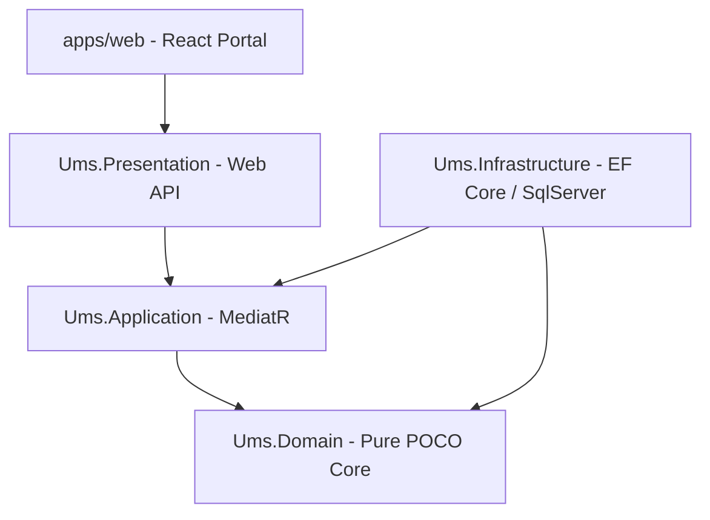

# 📐 Backend Stack Migration Plan: NestJS to .NET 8 LTS

**Document Type:** Architectural Implementation Plan  
**bMAD Phase:** Phase 02 - Architecture Design  
**Authors:** Solutions Architect  
**Status:** Proposed  

---

## 💡 1. Executive Context & Justification

Following the mandate for corporate architectural alignment and the **spec-driven AI BMAD-METHOD strategy**, we are executing a critical stack realignment for the **User Management System (UMS)**.

The system is transitioning from its original Node.js/NestJS baseline to a highly robust, enterprise-grade **.NET 8 / C#** backend stack. This move optimizes the core authorization compiler for heavy compute capabilities, guarantees strict compile-time safety, and leverages advanced EF Core concurrency mechanisms while fully preserving the **React (Vite)** frontend application.

### 🎯 Target Unified Stack Definitions
*   **Frontend:** React (v18+, Latest Stable) / Vite / Zustand / TanStack Query.
*   **Backend Core:** **.NET 8 LTS** / ASP.NET Core Minimal APIs / C#.
*   **Persistence:** **SQL Server 2022** (Latest Stable Version) / Entity Framework Core (EF Core via SqlServer).
*   **Architecture:** Pure Hexagonal Architecture (Ports & Adapters) and DDD.

---

## 🏗️ 2. .NET Architecture & Solution Topology

In compliance with the corporate standard **[Authoritative Tech Stack for .NET](https://github.com/beyondnetcode/arc32_progresive_monolith)**, the new UMS solution (`Ums.sln`) will reside alongside the frontend in the monorepo and strictly enforce the following project segregation:

### 📂 Project Boundary Matrix

| Project Layer | Technology Mandate | Responsibilities | NuGet / Reference Constraint |
| :--- | :--- | :--- | :--- |
| **`Ums.Domain`** | Pure POCOs | Entities, Value Objects, Aggregate Roots, Domain Events, Domain Service Contracts. | **ZERO NuGet References**. Pure `System` namespace only. |
| **`Ums.Application`** | MediatR, FluentValidation | CQRS Use Cases (Commands/Queries), Validation, Application Ports (Interfaces). | `MediatR`, `FluentValidation`. No EF Core or HTTP API dependencies. |
| **`Ums.Infrastructure`**| EF Core, SQL Server | SQL Server DbContext, Dapper (for Read Projections), Redis, Vault Adapters, Tenant Resolver. | `Microsoft.EntityFrameworkCore.SqlServer`, `Microsoft.Data.SqlClient`. |
| **`Ums.Presentation`**| ASP.NET Core | Minimal APIs configuration, Authorization Middleware, controllers mapping DTOs to Commands. | `OpenTelemetry`, `Swashbuckle`. |

---

## 🛡️ 3. Executive Guidelines & Policies

All developments under the new stack MUST strictly enforce the following systemic invariants:

1.  **The Result Pattern Mandate:** Standard C# exception throwing (`throw new Exception()`) for business logic flow control is **PROHIBITED**. All MediatR commands MUST return a `Result<T>` or `OneOf<T, Error>` response to guarantee compile-time error handling.
2.  **Native Row-Level Security (RLS):** Multi-tenant isolation MUST be handled natively in SQL Server via the `TenantResolver`, injecting the context into the EF Core connection lifecycle using `SESSION_CONTEXT` and security policies (iTVF).
3.  **Contract-First Doctrine:** Integration with the React portal will utilize generated OpenAPI specifications to ensure absolute schema synchronization.
4.  **Zero-Trust Secrets:** Plaintext secrets in appsettings.json are prohibited. Configuration mapping MUST point to environment variables injected via HashiCorp Vault sidecars.

---

## 🚀 4. Phase-wise Execution Roadmap

### 🟢 Phase 0: Workspace Sanitization (Completed)
*   [x] Remove original NestJS API source code (`apps/api`).
*   [x] Remove Node-based Aspect Oriented Programming library (`libs/aop`).
*   [x] Update workspace mappings in `package.json` to preserve only `apps/web`.

### 🟡 Phase 1: .NET Solution Bootstrapping (Active)
*   [ ] Scaffold C# solution `Ums.sln` at `src/ums-workspace/apps/api-dotnet/`.
*   [ ] Create standard project structure (`Ums.Domain`, `Ums.Application`, `Ums.Infrastructure`, `Ums.Presentation`).
*   [ ] Install validated dependencies (.NET 8 LTS, EF Core 8.0.x, MediatR, FluentValidation).

### 🟡 Phase 2: Documentation Alignment
*   [ ] Refactor Phase 02 documents (`architecture-spec.md`, `BoundedContextMap.md`) to replace NestJS constructs with .NET components.
*   [ ] Depreciate Node-specific ADRs in `03-adrs/` (e.g., ADR-0002 Node, ADR-0029 NestJS Latam DDD).
*   [ ] Author new .NET Architectural Decision Records matching corporate compliance.

### 🟡 Phase 3: Logic Migration & Verification
*   [ ] Migrate Domain entities from TypeScript to pure C# POCOs.
*   [ ] Configure EF Core migrations pointing to SQL Server 2022.
*   [ ] Build verification suite using xUnit and Testcontainers (SQL Server integration validation).
*   [ ] Enforce the mandatory parametric catalog standard (`Code`, `Value`, `Description`) across all configuration/policy/workflow entities in Domain + Infrastructure mappings.
*   [ ] Add scope-aware unique constraints and migration backfill plan for catalog entities (`APP_CONFIGURATION`, `NOTIFICATION_RULE`, `ACCESS_ENFORCEMENT_POLICY`, `APPROVAL_WORKFLOW`).

---

## ⚖️ 5. Impact Assessment
*   **Developer Harness (`AGENTS.md`):** Must be updated to include .NET 8 runtimes so incoming agents recognize the multi-language environment.
*   **CI/CD Pipelines:** Will require .NET Core SDK installation steps in addition to standard Node modules.
