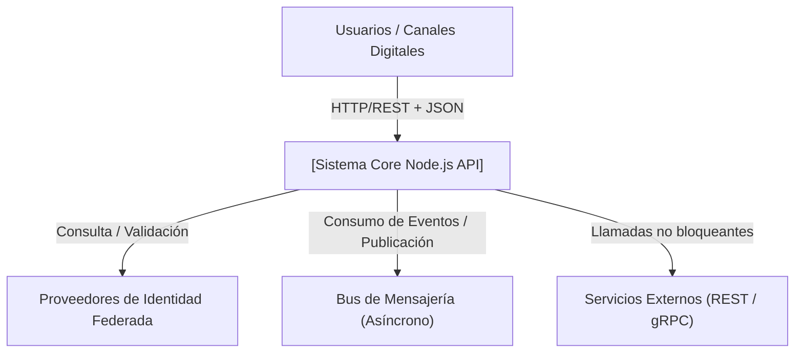
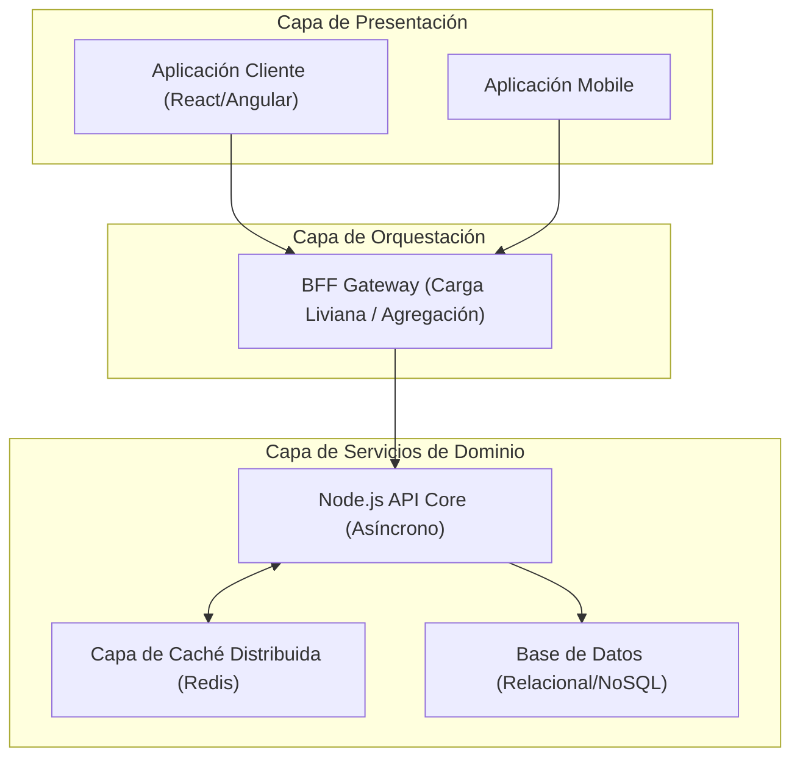

# 🏛️ Arquitectura de Referencia Evolutiva para Sistemas API-Driven (Node.js Stack)

> [!IMPORTANT]
> **Corporate Reference Architecture (Monolito-a-Microservicios)**: Este documento define el estándar para construir aplicaciones que inician su ciclo de vida como un **Monolito Modular** altamente desacoplado, con una ruta clara y sin refactorización para evolucionar hacia una malla de **Microservicios Distribuidos**. Utiliza el proyecto base como la implementación canónica de este estándar internacional (**arc42 v8**).

---

## 1. Introducción y Objetivos

Esta arquitectura de referencia proporciona un plano estandarizado para construir sistemas empresariales modernos, altamente escalables y modulares. 

### 1.1 Propósito y Aplicabilidad
Este patrón está diseñado específicamente para sistemas que:
*   Tienen una orientación fuerte al **uso intensivo de APIs**.
*   Requieren procesamiento concurrente y asíncrono nativo.
*   **No** dependen de servicios con bloqueos de entrada/salida (I/O) constantes o procesamiento matemático pesado que bloquee el event loop.

### 1.2 Objetivos de Calidad Mandatorios
1.  **Evolución Progresiva**: Diseño "Monolith-First" que permite extraer microservicios en el futuro sin cambiar código del Dominio.
2.  **Desacoplamiento Estricto**: Módulos con alta cohesión interna y bajo acoplamiento externo protegidos por linting de fronteras (boundaries).
3.  **Resiliencia**: Patrones nativos de tolerancia a fallos para operaciones aisladas o en malla.

---

## 2. Restricciones de Arquitectura y Pilares Base

Cualquier sistema basado en este blueprint debe adherirse a los siguientes pilares del ecosistema:

*   **Gobernanza del Stack**: Base tecnológica en Node.js/TypeScript gestionada mediante un entorno modular (Monorepo Nx o similar para cohesión de contratos).
*   **Mandato bMAD / Global Engineering Standards**: Aplicación estricta de SOLID, Clean Code y principios de Arquitectura Hexagonal.
*   **Manejo de I/O**: Aprovechamiento del modelo no bloqueante de Node.js. Evitar operaciones sincrónicas en el hilo principal.

---

## 3. Contexto y Alcance (Modelo Operacional)

Define cómo interactúan los sistemas basados en este stack con el ecosistema corporativo. 

### 3.1 Patrón de Contexto General
*(Ejemplo de Instanciación Técnica usando UMS como referencia)*

---

## 4. Estrategia de Solución

Las decisiones técnicas fundamentales invariantes para esta arquitectura de referencia son:

### 4.1 Arquitectura Hexagonal (Puertos y Adaptadores)
Mandatorio aislar la lógica de negocio (Domain & Application) de los detalles de entrada/salida (Infrastructure). 
*   **Beneficio**: Permite cambiar la base de datos (ej. de Postgres a MongoDB) o el framework (ej. de Express a NestJS o Fastify) sin reescribir el core del sistema.

### 4.2 Persistencia y Aislamiento
Uso preferente de estrategias agnósticas de persistencia. En entornos SQL, se recomienda el uso de **Row-Level Security (RLS)** para delegar la seguridad multi-tenant al motor de base de datos, optimizando el performance de la capa Node.js.

### 4.3 Estrategia de Comunicación e Integración
*   **API-First**: Todos los servicios exponen contratos claros.
*   **Backend For Frontend (BFF)**: Obligatorio para optimizar payloads a dispositivos clientes y proteger el sistema core de lógica de presentación.

### 4.4 Ruta de Evolución Progresiva (Progressive Blueprint)
El roadmap de evolución física sigue tres hitos clave definidos en los ADRs asociados:
1.  **Hito 1: Monolito Modular (Estado Actual)**: Una sola instancia en ejecución física pero con dominios aislados lógicamente mediante `apps/api` y `libs` que consumen el mismo proceso.
2.  **Hito 2: Extracción de Servcios de Alto Rendimiento**: Mover librerías de dominios críticos a sus propios micro-proyectos NX, convirtiéndolos en microservicios con su propia base de datos, consumidos vía gRPC/Dapr.
3.  **Hito 3: Malla de Microservicios Completa**: Implementación de Sidecars (Dapr) y una Malla de Servicios completa, donde el Monolito original se convierte en el API Gateway/BFF orquestador.

---

## 5. Vista de Bloques Técnica (Plantilla de Contenedores)

La topología física recomendada para este ecosistema incluye tres capas de distribución:

---

## 6. Vista de Tiempo de Ejecución (Patrones de Flujo)

Para maximizar el rendimiento del Event Loop de Node.js:
1.  **Validación Inmediata**: Toda petición se valida sintácticamente antes de tocar cualquier base de datos o servicio externo.
2.  **Delegación Asíncrona**: Procesos pesados o secundarios (envío de correos, auditoría extendida) se delegan a colas de mensajes de inmediato, respondiendo al cliente con latencia mínima.
3.  **Estrategia de Caché Activa**: Los datos de lectura intensiva y baja mutación deben resolverse en la capa de caché distribuida (latencias < 5ms) liberando al hilo de Node de consultas pesadas.

---

## 7. Vista de Despliegue (Target Cloud)

Recomendado: Contenerización Docker, orquestación en Kubernetes (K8s) y autoescalado basado en métricas de CPU/Memoria, asegurando alta disponibilidad multi-zona.

---

## 8. Conceptos Transversales Corporativos

Independientemente del sistema implementado, se deben integrar estos estándares:

*   **Seguridad Centralizada**: Implementación obligatoria de modelos basados en Claims/Scopes (ej. RBAC/ABAC).
*   **Observabilidad Nativa**:
    *   Logging Estructurado (JSON).
    *   Tracing Distribuido (OpenTelemetry) para rastrear peticiones entre múltiples saltos de red.
*   **Manejo de Errores**: Evitar el uso de Excepciones para control de flujo de negocio; preferir patrones funcionales (Result/Either Type).

---

## 9. Matriz de Decisiones de Referencia (ADR Baseline)

Cualquier implementación de este stack hereda por defecto estas estrategias:

| Enfoque de Diseño | Estrategia Técnica | Justificación Técnica |
| :--- | :--- | :--- |
| **Gobierno Interno** | `eslint-plugin-boundaries` | Evita el acoplamiento cíclico y protege las capas del Hexágono. |
| **Resiliencia** | Circuit Breakers (`opossum` o similar) | Previene el fallo en cascada en sistemas orientados a APIs. |
| **Caché** | Patrón Read-Aside distribuido | Protege la base de datos y optimiza el throughput del API. |
| **Testing** | Pirámide de Pruebas Automatizada | Garantiza la calidad con fuerte énfasis en Pruebas de Unidad y Contrato. |

---

## 10. Requerimientos de Calidad del Stack (NFR Benchmark)

Valores objetivo que toda implementación bajo este stack debería certificar:
*   **Latencia API Interna**: P95 < 50ms.
*   **Seguridad**: 0 vulnerabilidades "High/Critical" (escaneo estático SAST).
*   **Eficiencia**: Bajo consumo base de memoria (Idle memory footprint) facilitando la densidad de microservicios.

---

## 11. Implementación de Referencia Canónica

Para ver el ejemplo vivo de la aplicación de todos estos conceptos teóricos en código real y arquitectura física, consulte el repositorio/módulo de:

👉 **[User Management System (UMS) Codebase](./README.md)**

Donde se materializan estos conceptos usando:
*   **Framework**: NestJS.
*   **ORM**: TypeORM con soporte PostgreSQL RLS nativo.
*   **Testing**: Jest para lógica hexagonal.
