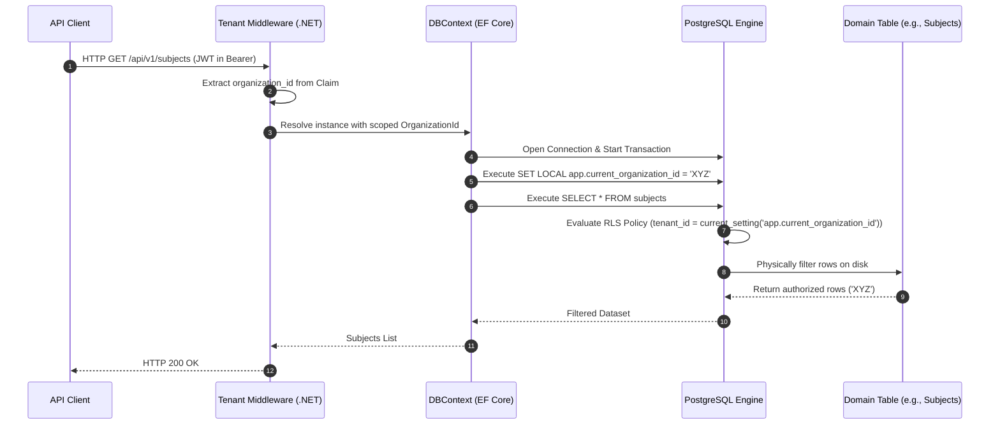

# 🛡️ Technical Enabler 3: Enforce Row-Level Security (RLS) by Organization

This document specifies the transaction flow, database session context injection, and PostgreSQL RLS policy configuration to guarantee physical multi-tenant data isolation under the **spec-driven AI BMAD-METHOD strategy**.

---

## 🏛️ 1. Use Case Definition

| Attribute | Specification |
| :--- | :--- |
| **Name** | Enforce Row-Level Security (RLS) by Organization in PostgreSQL |
| **Main Actor** | Persistence Interceptor / EF Core DbContext |
| **Preconditions** | `organization_id` is present in the request context (JWT or Headers). |
| **Postconditions** | PostgreSQL automatically restricts row visibility and modification at the database engine level, regardless of the ORM query executed. |

---

## 🔄 2. Transaction Flow



### A. Main Flow
1.  The client sends an HTTP request carrying the session JWT.
2.  The **Tenant Middleware** in the .NET 8 backend intercepts the request, decodes the token claims, and extracts the unified `org_id` value (Organization Context).
3.  The middleware stores the `org_id` in a service with a *Scoped* lifecycle (`ITenantContext`).
4.  When resolving a query through **Entity Framework Core**, a custom **DbConnectionInterceptor** is activated.
5.  Immediately after opening the physical connection to PostgreSQL, the interceptor executes the native local session SQL command:
    ```sql
    SET LOCAL app.current_organization_id = 'XYZ';
    ```
    *Note: `SET LOCAL` ensures that the parameter only lives during the current transaction, preventing thread contamination in the Connection Pool.*
6.  EF Core issues the standard domain SQL command (e.g., `SELECT * FROM public.subjects`).
7.  The **PostgreSQL engine**, upon detecting the RLS-protected table, intercepts the query on the fly.
8.  The engine evaluates the global security policy:
    ```sql
    CREATE POLICY organization_isolation_policy ON subjects
    USING (organization_id = NULLIF(current_setting('app.current_organization_id', true), '')::uuid);
    ```
9.  The dataset is restricted directly in the database engine's memory/disk and travels filtered to the backend.

---

## 🛡️ 3. Alternative Flows and Exception Handling

### Alternative Flow A: Execution in Background Jobs
*   If an asynchronous worker (e.g., RabbitMQ Listener) processes an event without a user token, it must resolve the `organization_id` directly from the event body and manually inject it into the scoped context to activate RLS before persisting to the database.

### Alternative Flow B: Query by Corporate Super-Admin (Bypass RLS)
*   For global support tasks or cross-organizational audits by the software owner organization (`INTERNAL`), the EF Core connection will use a connection role with the `BYPASSRLS` attribute enabled in the database (e.g., `ums_admin` role). This deactivates dynamic policies, allowing global inventory viewing.

### Alternative Flow C: Empty Session Variable
*   If, due to a logical error, the `app.current_organization_id` variable is not configured, the RLS policy will return an empty result set (0 rows) instead of exposing all records (PostgreSQL's default secure behavior).

---

## 📋 4. Main Operating Model Reference
The technical configuration SQL scaffolding, EF Core migrations to enable `ENABLE ROW LEVEL SECURITY`, and connection interceptors are aligned with the pattern of the **[Multi-Tenant Governance Report](../../04-artifacts/enterprise-multitenant-governance-report.md)** and the strategy originally defined in **[ADR-0010](../../03-adrs/0010-multi-tenancy-architecture-strategy.md)**.
