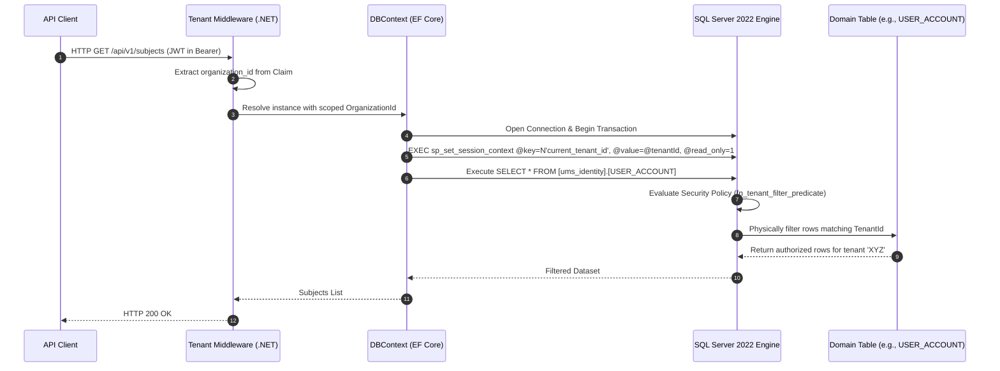

# 🛡️ Technical Enabler 3: Enforce Row-Level Security (RLS) by Organization

This document specifies the transaction flow, database session context injection, and SQL Server 2022 RLS policy configuration to guarantee physical multi-tenant data isolation under the **spec-driven AI BMAD-METHOD strategy**.

---

## 🏛️ 1. Use Case Definition

| Attribute | Specification |
| :--- | :--- |
| **Name** | Enforce Row-Level Security (RLS) by Organization in SQL Server 2022 |
| **Main Actor** | Persistence Interceptor / EF Core DbContext |
| **Preconditions** | `organization_id` is present in the request context (JWT or Headers). |
| **Postconditions** | SQL Server 2022 automatically restricts row visibility and modification at the database engine level, regardless of the ORM query executed. |

---

## 🔄 2. Transaction Flow



### A. Main Flow
1.  The client sends an HTTP request carrying the session JWT.
2.  The **Tenant Middleware** in the .NET 8 backend intercepts the request, decodes the token claims, and extracts the unified `org_id` value (Organization Context).
3.  The middleware stores the `org_id` in a service with a *Scoped* lifecycle (`ITenantContext`).
4.  When resolving a query through **Entity Framework Core**, a custom **DbConnectionInterceptor** is activated.
5.  Immediately after opening the physical connection to SQL Server, the interceptor sets the session context using the native SQL Server API:
    ```sql
    EXEC sp_set_session_context
        @key   = N'current_tenant_id',
        @value = @tenantId,
        @read_only = 1;
    ```
    *Note: `@read_only = 1` marks the session context value as immutable for the duration of the connection, preventing accidental overwrite and thread contamination in the Connection Pool.*
6.  EF Core issues the standard domain SQL command (e.g., `SELECT * FROM [ums_identity].[USER_ACCOUNT]`).
7.  The **SQL Server 2022 engine**, upon detecting the RLS-protected table, intercepts the query and evaluates the active Security Policy.
8.  The engine invokes the inline table-valued predicate function:
    ```sql
    CREATE FUNCTION dbo.fn_tenant_filter_predicate(@TenantId uniqueidentifier)
    RETURNS TABLE WITH SCHEMABINDING
    AS RETURN
        SELECT 1 AS result
        WHERE @TenantId = CAST(SESSION_CONTEXT(N'current_tenant_id') AS uniqueidentifier);
    ```
9.  The Security Policy applies both a FILTER predicate (restricts SELECT) and a BLOCK predicate (restricts INSERT):
    ```sql
    CREATE SECURITY POLICY dbo.TenantIsolationPolicy
        ADD FILTER PREDICATE dbo.fn_tenant_filter_predicate(TenantId)
            ON [ums_identity].[USER_ACCOUNT],
        ADD BLOCK PREDICATE dbo.fn_tenant_filter_predicate(TenantId)
            ON [ums_identity].[USER_ACCOUNT] AFTER INSERT
    WITH (STATE = ON);
    ```
10. The dataset is restricted directly at the SQL Server engine level and travels filtered to the backend.

---

## 🛡️ 3. Alternative Flows and Exception Handling

### Alternative Flow A: Execution in Background Jobs
*   If an asynchronous worker (e.g., RabbitMQ Listener) processes an event without a user token, it must resolve the `organization_id` directly from the event body and manually inject it into the scoped context. The interceptor then calls `sp_set_session_context` before any persistence operations to activate RLS.

### Alternative Flow B: Query by Corporate Super-Admin (Bypass RLS)
*   For global support tasks or cross-organizational audits by the software owner organization (`INTERNAL`), two approaches are available:
    *   Use a dedicated admin connection string mapped to a database role (`ums_admin`) that is explicitly excluded from the `TenantIsolationPolicy` (created with `WITH (STATE = OFF)` for that role's schema, or using `ALTER SECURITY POLICY` to disable before admin operations and re-enable after).
    *   Alternatively, set `@read_only = 0` when calling `sp_set_session_context` so the context can be changed per operation, and omit setting `current_tenant_id` entirely; the predicate returns `UNKNOWN` (not TRUE), resulting in an empty set rather than unrestricted access — use with caution.

### Alternative Flow C: Empty Session Context
*   If, due to a logical error, `sp_set_session_context` is not called before the query, `SESSION_CONTEXT(N'current_tenant_id')` returns `NULL`. The predicate `NULL = CAST(NULL AS uniqueidentifier)` evaluates to `UNKNOWN` (not TRUE), causing the FILTER predicate to return an empty result set (0 rows) rather than exposing all records — preserving secure-by-default behavior.

---

## ⚙️ 4. .NET 8 Implementation Reference

The `DbConnectionInterceptor` sets tenant context immediately after a connection is opened:

```csharp
public class TenantSessionContextInterceptor : DbConnectionInterceptor
{
    private readonly ITenantContext _tenantContext;

    public TenantSessionContextInterceptor(ITenantContext tenantContext)
        => _tenantContext = tenantContext;

    public override async Task ConnectionOpenedAsync(
        DbConnection connection,
        ConnectionEndEventData eventData,
        CancellationToken cancellationToken = default)
    {
        if (_tenantContext.OrganizationId.HasValue)
        {
            await connection.ExecuteAsync(
                "EXEC sp_set_session_context @key = N'current_tenant_id', @value = @tenantId, @read_only = 1",
                new { tenantId = _tenantContext.OrganizationId.Value });
        }
    }
}
```

Register in `Program.cs`:

```csharp
services.AddDbContext<UmsDbContext>((sp, options) =>
{
    options.UseSqlServer(connectionString)
           .AddInterceptors(sp.GetRequiredService<TenantSessionContextInterceptor>());
});
services.AddScoped<TenantSessionContextInterceptor>();
```

---

## 📋 5. Main Operating Model Reference
The technical configuration SQL scaffolding, EF Core migrations to create the Security Policy and predicate function, and connection interceptors are aligned with the pattern of the **[Multi-Tenant Governance Report](../../04-artifacts/enterprise-multitenant-governance-report.md)** and the authoritative decision recorded in **[ADR-0041](../../03-adrs/0041-sql-server-2022-as-database-engine.md)** (SQL Server 2022 as the database engine for all UMS services).
