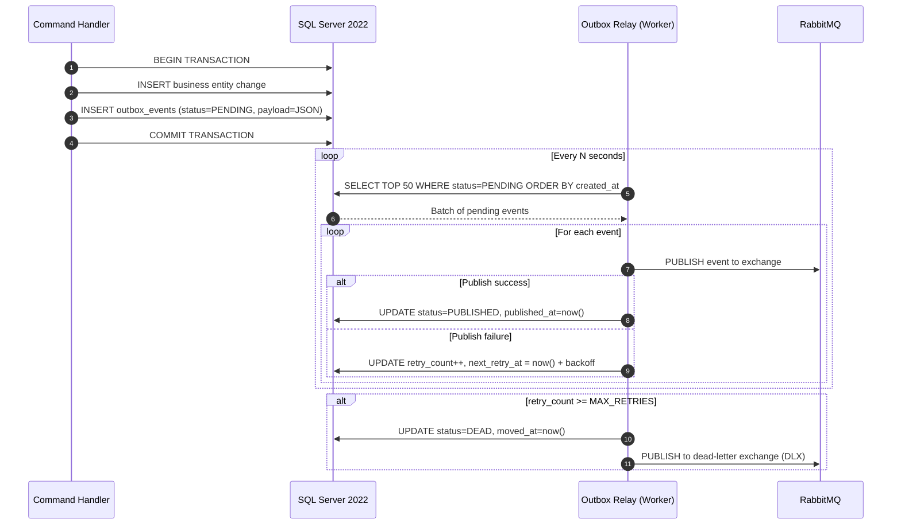

# Technical Enabler 4: Transactional Outbox Pattern

This document specifies the flow, actors, and failure recovery strategy for guaranteeing at-least-once delivery of domain events to the message bus without distributed transaction risk, following the **BMAD-METHOD spec-driven strategy**.

> **Backing ADRs:** [ADR-0033 — Transactional Outbox](../../../arc32_progresive_monolith/architecture/adrs/core/0033-transactional-outbox-pattern.md) · [ADR-0036 — Message Bus Delivery & DLQ](../../../arc32_progresive_monolith/architecture/adrs/core/0036-message-bus-delivery-strategy.md)  
> **Consumed by:** FS-10 (B2B Access Approval), FS-11 (Document Validation), FS-15 (Expiration Notifications)

---

## 1. Use Case Definition

| Attribute | Specification |
| :--- | :--- |
| **Name** | Transactional Outbox — At-Least-Once Domain Event Delivery |
| **Primary Actor** | Domain Command Handler (ASP.NET Core) |
| **Secondary Actor** | Outbox Relay Service (background worker) |
| **Preconditions** | A business command has been received and validated. The UMS database is reachable. |
| **Postconditions** | The domain event is persisted atomically with the business entity change and eventually delivered to RabbitMQ. No event is lost even if the broker is temporarily unavailable. |
| **Invariant** | The business state change and its event record are written in the **same local transaction**. The relay never publishes an event before the business transaction commits.
## 2. Transaction Flow



### A. Main Flow

1. The command handler receives a validated business command (e.g., `ApproveB2BAccessRequest`, `DocumentValidated`, `AccessExpirationScheduled`).
2. A local SQL Server transaction is opened.
3. The business aggregate state change is persisted (e.g., `access_requests`, `user_documents`, `access_policies` tables).
4. In the **same transaction**, a row is inserted into the `outbox_events` table with:
   - `event_type` — fully qualified name (e.g., `ums.access.B2BAccessApproved`)
   - `aggregate_id` — the entity that originated the event
   - `payload` — serialized JSON of the domain event
   - `status` — `PENDING`
   - `created_at`, `retry_count = 0`, `next_retry_at = NULL`
5. The transaction commits. From this point, both the business state and the event record are durable.
6. The **Outbox Relay** (a hosted `BackgroundService`) polls the `outbox_events` table every configurable interval (default: 5s).
7. For each `PENDING` event, the relay publishes to the corresponding RabbitMQ exchange.
8. On successful publish acknowledgement from the broker, the row is marked `PUBLISHED`.

### B. Relay Polling Detail

The relay uses an **optimistic batch cursor** to avoid re-processing already-published events:

```sql
SELECT TOP 50 id, event_type, aggregate_id, payload
FROM outbox_events
WHERE status = 'PENDING'
  AND (next_retry_at IS NULL OR next_retry_at <= GETUTCDATE())
ORDER BY created_at ASC
```

---

## 3. Alternative Flows & Exception Handling

### Alternative A: RabbitMQ Temporarily Unavailable

- The relay catches the publish exception and increments `retry_count`.
- `next_retry_at` is calculated with **exponential backoff**: `now() + (2^retry_count * base_interval_seconds)`.
- The event remains `PENDING` and will be retried on the next polling cycle once backoff expires.
- No business data is rolled back — the entity change is already committed and consistent.

### Alternative B: Maximum Retries Reached

- When `retry_count >= MAX_RETRIES` (default: 5), the event is transitioned to `DEAD` status.
- The relay publishes the raw payload to the **Dead Letter Exchange (DLX)** in RabbitMQ for manual inspection.
- An alert is emitted via OpenTelemetry (`outbox.event.dead_lettered` counter) for Grafana alerting.

### Alternative C: Relay Crash Mid-Batch

- Because the relay only marks events as `PUBLISHED` **after** broker acknowledgement, any events published but not yet updated in SQL will be re-picked on the next relay startup.
- RabbitMQ consumers must implement **idempotent message handling** (deduplicate by `event_id`) to tolerate duplicate delivery.

### Alternative D: Database Unavailable

- The command handler fails before committing — no partial state exists.
- The relay cannot poll — events already committed remain safely in `PENDING` until the database recovers.

---

## 4. Outbox Table Schema

```sql
CREATE TABLE outbox_events (
    id              UNIQUEIDENTIFIER    NOT NULL DEFAULT NEWSEQUENTIALID(),
    event_type      NVARCHAR(256)       NOT NULL,
    aggregate_id    NVARCHAR(128)       NOT NULL,
    payload         NVARCHAR(MAX)       NOT NULL,  -- JSON
    status          NVARCHAR(20)        NOT NULL DEFAULT 'PENDING',
        -- PENDING | PUBLISHED | DEAD
    retry_count     INT                 NOT NULL DEFAULT 0,
    created_at      DATETIMEOFFSET      NOT NULL DEFAULT SYSUTCDATETIME(),
    published_at    DATETIMEOFFSET      NULL,
    next_retry_at   DATETIMEOFFSET      NULL,
    moved_at        DATETIMEOFFSET      NULL,
    CONSTRAINT PK_outbox_events PRIMARY KEY (id),
    INDEX IX_outbox_relay (status, next_retry_at, created_at)
);
```

---

## 5. Idempotency Contract for Consumers

All RabbitMQ consumers **must** deduplicate by `event_id` (the `aggregate_id + event_type + created_at` composite, or the outbox row `id` embedded in the message header):

```
X-Event-Id: {outbox_events.id}
X-Event-Type: ums.access.B2BAccessApproved
X-Aggregate-Id: {aggregate_id}
```

Consumers check this header against a processed-events log before applying side effects.

---

## 6. Observability

| Signal | Instrument | Meaning |
| :--- | :--- | :--- |
| `outbox.events.pending` | Gauge | Backlog size — alert if > threshold for > N minutes |
| `outbox.events.published_total` | Counter | Healthy throughput |
| `outbox.events.dead_lettered` | Counter | Events that exhausted retries — requires intervention |
| `outbox.relay.poll_duration_ms` | Histogram | Relay cycle latency
## 7. Related Documents

- [ADR-0033 — Transactional Outbox Pattern](../../../arc32_progresive_monolith/architecture/adrs/core/0033-transactional-outbox-pattern.md)
- [ADR-0036 — Message Bus Delivery & DLQ Strategy](../../../arc32_progresive_monolith/architecture/adrs/core/0036-message-bus-delivery-strategy.md)
- [FS-10 — B2B External Access Approval](../../governance/requirements/functional-stories/fs-10-external-b2b-access-requestá-approval.md)
- [FS-11 — Document Upload & Validation](../../governance/requirements/functional-stories/fs-11-user-document-upload.md)
- [FS-15 — Expiration Notification Rules](../../governance/requirements/functional-stories/fs-15-notification-rules.md)
- [Observability Strategy](../../artifacts/observability-strategy.md)
