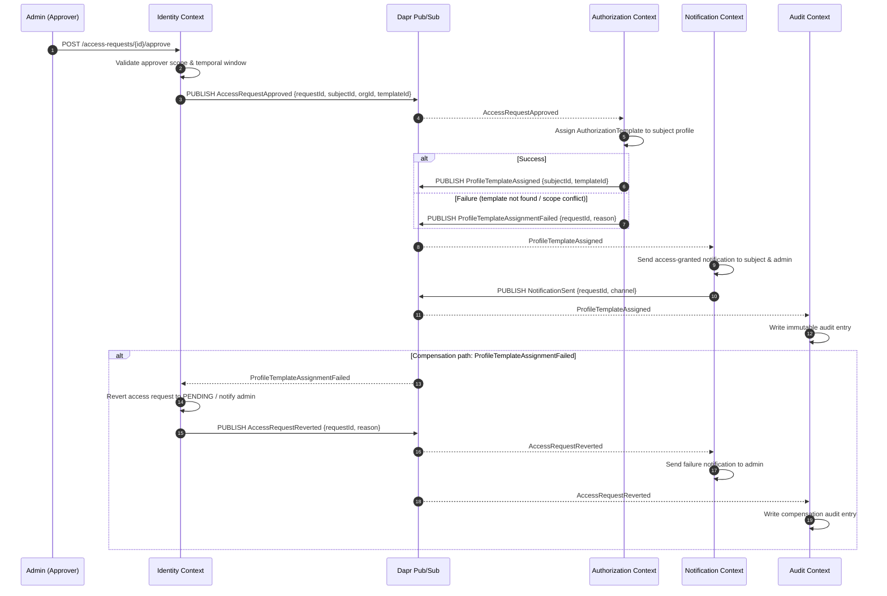
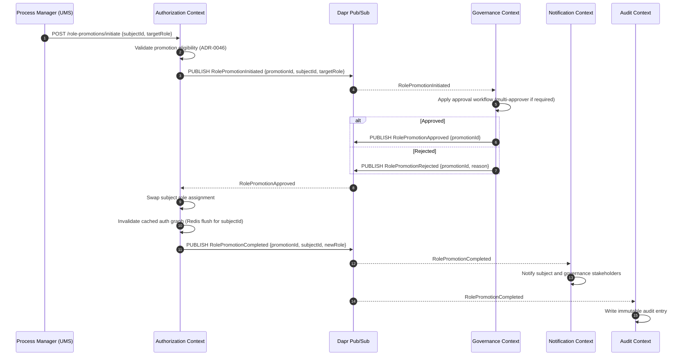

# Technical Enabler 5: Distributed Saga with Dapr

This document specifies the choreography-based saga pattern for managing distributed business processes that span multiple bounded contexts, using Dapr pub/sub as the event backbone and compensation flows for rollback consistency.

> **Backing ADRs:** [ADR-0035 — Distributed Saga Strategy](../../../arc32_progresive_monolith/architecture/adrs/core/0035-distributed-saga-strategy.md) · [ADR-0006 — Future Microservices Transition with Dapr](../../../arc32_progresive_monolith/architecture/adrs/core/0006-future-microservices-transition-dapr.md)  
> **Consumed by:** FS-10 (B2B Access Approval), FS-12 (Role Promotion Process)

---

## 1. Use Case Definition

| Attribute | Specification |
| :--- | :--- |
| **Name** | Distributed Saga — Multi-Step Business Process with Compensation |
| **Primary Actor** | Domain Event (published by a bounded context) |
| **Participants** | Identity Context · Authorization Context · Notification Context · Audit Context |
| **Preconditions** | All participating services are registered in the Dapr sidecar mesh. The initiating event is published to the Dapr pub/sub component. |
| **Postconditions** | Either all saga steps complete successfully (happy path) or all compensating transactions have been executed, leaving the system in a consistent state. |
| **Invariant** | No saga step is considered final until a success or failure event is received from the responsible context. Compensation flows are **idempotent**. |

---

## 2. Saga Strategy: Choreography

UMS uses **choreography** (event-driven, no central coordinator) as the default saga strategy during the progressive monolith phase. Each service reacts to domain events and emits its own success/failure events.

> **When to use orchestration instead:** If the business flow requires conditional branching logic that cannot be expressed through event reactions alone, introduce a lightweight saga orchestrator using Dapr Workflow. Document this escalation as a new ADR before implementation.

---

## 3. Transaction Flow — FS-10: B2B Access Approval Saga



### A. Main Flow (Happy Path)

1. An administrator approves a B2B access request via the UMS REST API.
2. The Identity Context validates approver authority and temporal scope (ADR-0038).
3. `AccessRequestApproved` is published to the Dapr pub/sub topic `ums.access`.
4. The Authorization Context subscribes to `AccessRequestApproved`, assigns the specified authorization template to the subject's profile, and publishes `ProfileTemplateAssigned`.
5. The Notification Context subscribes to `ProfileTemplateAssigned` and dispatches the access-granted notification.
6. The Audit Context subscribes to `ProfileTemplateAssigned` and writes an immutable audit entry (ADR-0016).

### B. Compensation Flow

1. If the Authorization Context cannot assign the template (scope conflict, template archived, privilege escalation detected per ADR-0036), it publishes `ProfileTemplateAssignmentFailed`.
2. The Identity Context reverts the access request status and publishes `AccessRequestReverted`.
3. Notification and Audit contexts react to the reversal event, completing the compensating path.

---

## 4. Transaction Flow — FS-12: Role Promotion Saga



---

## 5. Dapr Configuration

### pub/sub Component (RabbitMQ)

```yaml
apiVersion: dapr.io/v1alpha1
kind: Component
metadata:
  name: ums-pubsub
spec:
  type: pubsub.rabbitmq
  version: v1
  metadata:
    - name: host
      value: "amqp://rabbitmq:5672"
    - name: durable
      value: "true"
    - name: deletedWhenUnused
      value: "false"
    - name: autoAck
      value: "false"
    - name: reconnectWait
      value: "2"
    - name: maxLen
      value: "0"
    - name: prefetchCount
      value: "10"
```

### Subscription Declarations

Each bounded context declares its subscriptions in `components/subscriptions.yaml`:

```yaml
apiVersion: dapr.io/v1alpha1
kind: Subscription
metadata:
  name: auth-context-subscriptions
spec:
  pubsubname: ums-pubsub
  topic: ums.access
  route: /dapr/subscribe/access-approved
  filter: |
    event.type == "AccessRequestApproved"
```

---

## 6. Idempotency & At-Least-Once Guarantee

Because Dapr pub/sub guarantees **at-least-once delivery**, all saga step handlers must be idempotent:

| Strategy | Implementation |
| :--- | :--- |
| Deduplication key | `saga_step_id = {sagaId}:{stepName}` stored in `saga_processed_steps` table |
| Check on entry | Before applying side effects, query `saga_processed_steps` by key |
| Record on success | Insert `saga_step_id` with `processed_at` timestamp after successful execution |

---

## 7. Observability

| Signal | Instrument | Meaning |
| :--- | :--- | :--- |
| `saga.step.duration_ms` | Histogram | Per-step latency; label: `saga_type`, `step_name` |
| `saga.completed_total` | Counter | Successful full-saga completions |
| `saga.compensated_total` | Counter | Sagas that triggered compensation |
| `saga.step.failed_total` | Counter | Individual step failures before compensation |

Dapr sidecar traces are automatically captured by OpenTelemetry and forwarded to Tempo (ADR-0046).

---

## 8. Related Documents

- [ADR-0035 — Distributed Saga Strategy](../../../arc32_progresive_monolith/architecture/adrs/core/0035-distributed-saga-strategy.md)
- [ADR-0006 — Future Microservices Transition with Dapr](../../../arc32_progresive_monolith/architecture/adrs/core/0006-future-microservices-transition-dapr.md)
- [ADR-0036 — Message Bus Delivery & DLQ Strategy](../../../arc32_progresive_monolith/architecture/adrs/core/0036-message-bus-delivery-strategy.md)
- [ADR-0016 — Immutable Audit Trail](./adrs/0016-immutable-business-audit-trail.md)
- [ADR-0046 — Role Evolution & Promotion Governance](./adrs/0046-role-evolution-promotion-governance.md)
- [TE-04 — Transactional Outbox](./te-04-transactional-outbox.md) ← events are published via outbox before Dapr relay
- [FS-10 — B2B Access Approval](../../governance/requirements/functional-stories/fs-10-external-b2b-access-request-approval.md)
- [FS-12 — Role Promotion Process](../../governance/requirements/functional-stories/fs-12-role-promotion-process.md)
