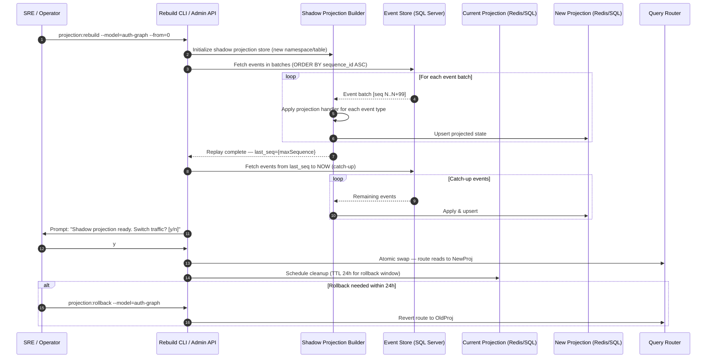

# Technical Enabler 6: CQRS Projection Rebuild Strategy

This document specifies the process for safely rebuilding a read model (query-side projection) from the event store when the projection becomes stale, is corrupted, or when a new projection is introduced that must backfill historical events.

> **Backing ADRs:** [ADR-0034 — CQRS Application Matrix](../../../arc32_progresive_monolith/architecture/adrs/core/0034-cqrs-applicability-matrix.md) · [ADR-0015 — Event-Driven Architecture](../../../arc32_progresive_monolith/architecture/adrs/core/0015-event-driven-architecture-intra-domain.md)  
> **Consumed by:** FS-07 (Permission Graph Visualizer)

---

## 1. Use Case Definition

| Attribute | Specification |
| :--- | :--- |
| **Name** | CQRS Projection Rebuild from Event Store |
| **Primary Actor** | Platform Operator / SRE |
| **Trigger** | Projection schema migration · Bug fix in projection logic · New read model introduction · Data inconsistency detected |
| **Preconditions** | The event store contains the authoritative sequence of domain events. The target projection store (SQL read schema or Redis) is accessible. |
| **Postconditions** | The projection reflects the correct state as computed by replaying all events up to the latest sequence. Live traffic is not disrupted during the rebuild. |
| **Invariant** | The write side (command model) is never modified during a projection rebuild. The event store is treated as append-only and read-only during this process.
## 2. CQRS Applicability in UMS

The UMS applies CQRS selectively per ADR-0034. The primary projection subject is the **Authorization Graph** (FS-07):

| Read Model | Projection Store | Rebuild Trigger | Typical Frequency |
| :--- | :--- | :--- | :--- |
| User Authorization Graph | Redis (hot) + SQL (warm) | Policy logic change, template mutation, bug fix | On-demand |
| Organization Hierarchy View | SQL read schema | Closure table migration | Rare |
| Audit Trail View | SQL read-only replica | Schema evolution | Rare
## 3. Rebuild Flow



### A. Main Flow

1. The operator initiates a rebuild via CLI or Admin API, specifying the target projection model and the starting event sequence (usually `0` for full rebuild).
2. A **shadow projection store** is created in an isolated namespace (Redis key prefix `shadow:auth-graph:*` or a separate SQL schema).
3. The rebuild worker reads events from the event store in **batches of 100**, ordered by `sequence_id ASC`, and applies each event through the projection handler.
4. Upon reaching the last known sequence, the worker performs a **catch-up phase**: it fetches any events written during the rebuild window and applies them to close the lag.
5. The operator is prompted for confirmation before live traffic is switched.
6. The **query router** performs an atomic swap — all new read requests are directed to the rebuilt projection.
7. The old projection is retained for 24 hours (rollback window) then cleaned up.

### B. Incremental Rebuild (Partial)

For cases where only events since a specific date need to be reprocessed (e.g., a bug introduced at a known point in time):

```bash
projection:rebuild --model=auth-graph --from=2026-03-01T00:00:00Z
```

The worker fetches events with `created_at >= specified_date` and applies them on top of the existing projection state, rather than starting from scratch.

---

## 4. Event Store Schema

```sql
CREATE TABLE domain_events (
    sequence_id     BIGINT              NOT NULL IDENTITY(1,1),
    event_id        UNIQUEIDENTIFIER    NOT NULL DEFAULT NEWID(),
    aggregate_type  NVARCHAR(128)       NOT NULL,
    aggregate_id    NVARCHAR(128)       NOT NULL,
    event_type      NVARCHAR(256)       NOT NULL,
    payload         NVARCHAR(MAX)       NOT NULL,  -- JSON
    metadata        NVARCHAR(MAX)       NULL,       -- JSON (correlation_id, causation_id, actor_id)
    created_at      DATETIMEOFFSET      NOT NULL DEFAULT SYSUTCDATETIME(),
    CONSTRAINT PK_domain_events PRIMARY KEY (sequence_id),
    INDEX IX_domain_events_aggregate (aggregate_type, aggregate_id, sequence_id),
    INDEX IX_domain_events_type (event_type, sequence_id)
);
```

---

## 5. Projection Handler Contract

Each projection model registers handlers for the event types it cares about:

```csharp
public interface IProjectionHandler<TEvent>
{
    Task HandleAsync(TEvent domainEvent, ProjectionContext ctx, CancellationToken ct);
}

// Example: Auth Graph projection handler
public class AuthGraphProjectionHandler
    : IProjectionHandler<ProfileTemplateAssigned>,
      IProjectionHandler<TemplatePermissionRevoked>,
      IProjectionHandler<ProfileDeactivated>
{
    // Each handler must be idempotent — replaying the same event twice
    // must produce the same projected state.
}
```

**Idempotency requirement:** Handlers use `sequence_id` as an optimistic concurrency check. If the projected state already reflects a `sequence_id >= current`, the event is skipped.

---

## 6. Query Router Pattern

The query router abstracts which projection store is active without coupling consumers:

```csharp
public interface IProjectionRouter
{
    IAuthGraphReadStore GetActiveStore(string model);
}

// During rebuild: routes to shadow store after swap confirmation
// Rollback: reverts to previous store without consumer code changes
```

---

## 7. Rebuild Performance Guidelines

| Projection Size | Expected Rebuild Time | Recommended Batch Size |
| :--- | :--- | :--- |
| < 100K events | < 2 min | 100 |
| 100K–1M events | 5–20 min | 500 |
| > 1M events | 20–60 min | 1000 + parallel workers | For large projections, consider enabling **parallel aggregate rebuild**: partition by `aggregate_id` hash and run N workers concurrently. Each worker owns a non-overlapping subset of aggregates.

---

## 8. Observability

| Signal | Instrument | Meaning |
| :--- | :--- | :--- |
| `projection.rebuild.events_processed` | Counter | Progress indicator |
| `projection.rebuild.lag_seconds` | Gauge | Distance to live event head |
| `projection.rebuild.batch_duration_ms` | Histogram | Throughput per batch |
| `projection.rebuild.errors_total` | Counter | Failed handler applications | Set a Grafana alert: if `projection.rebuild.lag_seconds` does not decrease for > 5 minutes, the rebuild has stalled.

---

## 9. Related Documents

- [ADR-0034 — CQRS Application Matrix](../../../arc32_progresive_monolith/architecture/adrs/core/0034-cqrs-applicability-matrix.md)
- [ADR-0015 — Event-Driven Architecture (Intra-Domain)](../../../arc32_progresive_monolith/architecture/adrs/core/0015-event-driven-architecture-intra-domain.md)
- [TE-01 — Build Authorization Graph](./te-01-build-authorization-graph.md) ← the read model this TE rebuilds
- [FS-07 — Diagnose Permissions via Graph Visualizer](../../governance/requirements/functional-stories/fs-07-visual-graph-resolver.md)
- [Observability Strategy](../../artifacts/observability-strategy.md)
