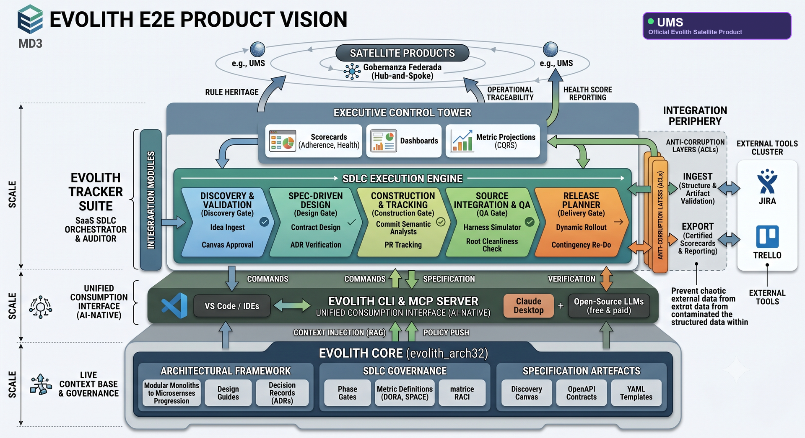

<div align="center">

# UMS: Sistema Empresarial de Gestión de Usuarios

> **Navegación Bilingüe:** [English](../README.md)

[]()
[]()
[](https://github.com/beyondnetcode/evolith_arch32)
[](./architecture/adrs/)
[]()

<br/>

<a href="./diagrams/evolith-ums-satellite.png" title="Arquitectura E2E de Evolith - UMS Producto Satélite - clic para ampliar">
  
</a>

<sub>Framework de Arquitectura E2E de Evolith - UMS producto satélite oficial - clic para ampliar</sub>

<br/>

**UMS es un monolito modular para identidad, autorización, configuración, aprobaciones, cumplimiento, IGA y auditoría.**<br/>
Construido sobre **.NET 10, PostgreSQL, EF Core mediante Npgsql, React 18, TypeScript y Nx**.<br/>
Especializa la referencia de arquitectura corporativa [Evolith](https://github.com/beyondnetcode/evolith_arch32) para un sistema de gestión de usuarios de nivel producto.

> *Heredar el estándar, especializar el producto.*

</div>

---

## Comienza Aquí

<details>
<summary><strong>Puntos de entrada principales</strong></summary>

- [Visión del Producto](./governance/product/product-vision.md) - estrategia, objetivos del producto y posicionamiento de negocio.
- [Portal de Arquitectura](./architecture/index.md) - vista arquitectónica, ADRs, blueprints y referencia aplicada.
- [Modelo de Dominio](./domain/index.md) - contextos acotados, agregados, entidades y reglas de dominio.
- [Historias Funcionales](./governance/requirements/functional-stories/index.md) - backlog de producto legible para negocio.
- [Índice Maestro](./MASTER_INDEX.md) - navegación completa de documentación.
- [Evolith Upstream](https://github.com/beyondnetcode/evolith_arch32) - base de referencia corporativa heredada por UMS.

</details>

<details>
<summary><strong>Inicio por rol</strong></summary>

- **Arquitectos:** comenzar con [Portal de Arquitectura](./architecture/index.md), luego revisar [Registro ADR](./architecture/adrs/) y [Matriz de Trazabilidad](./architecture/traceability-matrix.md).
- **Desarrolladores backend:** comenzar con [Referencia API .NET](./architecture/api-dotnet/README.md), luego revisar [Agregados de Dominio](./domain/index.md) y [SDK .NET](./sdk/dotnet/README.md).
- **Desarrolladores frontend:** comenzar con [ADR de Arquitectura Limpia Frontend](./architecture/adrs/0056-clean-architecture-frontend.md), luego revisar [SDK TypeScript](./sdk/typescript/README.md) y [ADR de Gestión de Estado](./architecture/adrs/0057-zustand-tanstack-query-state.md).
- **Producto y PM:** comenzar con [Visión del Producto](./governance/product/product-vision.md), luego revisar [Alcance](./governance/product/scope.md), [Objetivos](./governance/product/objectives.md) y [Gap Tracker](./governance/project/functional-story-gap-tracker.md).
- **DevOps y SRE:** comenzar con [Plan de Infraestructura](../infra/infrastructure_plan.md), luego revisar [Portal de Operaciones](./operations/index.md), [Runbooks](./operations/runbooks/index.md) y [Métricas](./operations/metrics/index.md).
- **Contribuidores IA:** comenzar con [AGENTS.md](../AGENTS.md), luego revisar [Agentes de Control Documental](./governance/documentation-control-agents.md) y [Plantilla ADR](./governance/sdlc/adr-template.md).

</details>

## Navegación SDLC

Abre el área del ciclo de vida en la que estás trabajando. Cada sección agrupa documentos y puntos de entrada del repositorio que soportan su gate.

<details>
<summary><strong>Fase 00 - Producto y Gobernanza</strong></summary>

- [Hub de Gobernanza](./governance/index.md)
- [Visión del Producto](./governance/product/product-vision.md)
- [Contexto de Negocio](./governance/product/business-context.md)
- [Alcance y Límites](./governance/product/scope.md)
- [Stakeholders](./governance/product/stakeholders.md)
- [Objetivos](./governance/product/objectives.md)

</details>

<details>
<summary><strong>Fase 01 - Requisitos</strong></summary>

- [Hub de Requisitos](./governance/requirements/index.md)
- [Historias Funcionales](./governance/requirements/functional-stories/index.md)
- [Estándar de Historia Funcional](./governance/requirements/functional-stories/functional-story-standard.md)
- [Modelo de Datos Conceptual](./governance/requirements/conceptual-data-model.md)
- [Ejemplo de Matriz de Permisos](./governance/requirements/permission-matrix-example.md)
- [Glosario](./governance/requirements/glossary.md)

</details>

<details>
<summary><strong>Fase 02 - Diseño y Arquitectura</strong></summary>

- [Portal de Arquitectura](./architecture/index.md)
- [Vista General de Arquitectura](./architecture/overview.md)
- [Registro ADR](./architecture/adrs/)
- [Matriz de Trazabilidad](./architecture/traceability-matrix.md)
- [Blueprints](./architecture/blueprints/)
- [Patrones Canónicos](./architecture/artifacts/canonical-patterns/index.md)
- [Hub de Diseño DDD](./governance/construction/ddd-design/index.md)
- [Matriz ADR de Evolith](https://github.com/beyondnetcode/evolith_arch32/blob/main/reference/architecture/adrs/adr-matrix.md)

</details>

<details>
<summary><strong>Fase 03 - Construcción</strong></summary>

- [Hub de Construcción](./governance/construction/index.md)
- [Mapa de Contextos Acotados](./governance/construction/ddd-design/01-bounded-context-map.md)
- [Flujos Cross-Context](./governance/construction/ddd-design/10-cross-context-flows.md)
- [Primitivos DDD](./governance/construction/ddd-design/11-ddd-primitives.md)
- [Referencia Aplicada API .NET](./architecture/api-dotnet/ums-api-dotnet-applied-reference.md)
- [Portal SDK](./sdk/index.md)
- [Backlog del Proyecto](./governance/project/index.md)

</details>

<details>
<summary><strong>Fase 04 - Validación y QA</strong></summary>

- [Reporte QA](./qa/qa_report.md)
- [Resultados de Pruebas Unitarias](./governance/testing/unit-testing-results.md)
- [Resultados de Pruebas de Integración](./governance/testing/integration-testing-results.md)
- [Plan de Pruebas de Rendimiento](./governance/testing/performance-testing-plan.md)
- [Resultados de Pruebas de Rendimiento](./governance/testing/performance-testing-results.md)
- [Evidencias QA](./qa/evidences/)

</details>

<details>
<summary><strong>Fase 05 - Entrega y Operaciones</strong></summary>

- [Portal de Operaciones](./operations/index.md)
- [Runbooks](./operations/runbooks/index.md)
- [Métricas](./operations/metrics/index.md)
- [Plan de Despliegue Kubernetes](../infra/UMS_K8s_Deployment_Plan.md)
- [Plan de Infraestructura](../infra/infrastructure_plan.md)
- [Plan de Implementación](../infra/implementation_plan.md)
- [Proceso de Release Documental](./releases/bmad-documentation-release-process.md)

</details>

## Referencias Transversales

<details>
<summary><strong>Referencia de arquitectura, dominio y producto</strong></summary>

- [Dominio Identidad](./domain/identity/index.md)
- [Dominio Autorización](./domain/authorization/index.md)
- [Dominio Configuración](./domain/configuration/index.md)
- [Dominio Aprobaciones](./domain/approvals/index.md)
- [Dominio IGA](./domain/iga/index.md)
- [Dominio Auditoría](./domain/audit/index.md)
- [Reglas de Consistencia](./domain/consistency-rules/index.md)
- [Contratos SDK](./sdk/contracts/schema-overview.md)
- [Estándares de Documentación](./STANDARDS.md)
- [Control Documental Bilingüe](./governance/documentation-control-agents.md)

</details>

<details>
<summary><strong>Herencia entre UMS y Evolith</strong></summary>

- UMS hereda de [Evolith](https://github.com/beyondnetcode/evolith_arch32) estándares arquitectónicos reutilizables, reglas de gobernanza, patrones ADR y prácticas documentales.
- UMS conserva en este repositorio la implementación específica del producto, contextos acotados, esquemas, estrategia de seed y comportamiento runtime.
- Los ADRs de producto pueden promoverse upstream cuando UMS aporta evidencia ejecutable de que la decisión es reutilizable por otros productos.
- La multi-tenancy se aplica principalmente en la capa de aplicación. Las políticas de PostgreSQL, constraints, propiedad de schemas y row-level security son failsafes secundarios de infraestructura.

</details>

## Herramientas y Automatización

<details>
<summary><strong>Comandos de desarrollo local</strong></summary>

Ejecuta los comandos técnicos desde `src/`, salvo cuando el comando apunte explícitamente a la solución backend.

```bash
# Instalar dependencias frontend
cd src
npm install

# Frontend: React 18 y Vite
npx nx run app-web:dev

# Backend: .NET 10
cd apps/ums.api
dotnet build
dotnet run

# Pruebas backend
dotnet test
```

</details>

<details>
<summary><strong>Validación documental</strong></summary>

```bash
# Desde la raíz del repositorio
python3 .bmad-core/scripts/cleanup_markdown_encoding.py

# Desde src/, cuando se requiere setup de Context7
cd src
npx ctx7 setup
```

Los cambios de documentación deben mantener sincronizados los artefactos en inglés y español, preservar integridad UTF-8 y evitar iconos decorativos o caracteres Markdown no estándar.

</details>

---

## Contribución

Antes de contribuir, lee:

- [AGENTS.md](../AGENTS.md) - reglas y convenciones del repositorio para agentes.
- [Estándares](./STANDARDS.md) - estándares de ingeniería y documentación.
- [Plantilla ADR](./governance/sdlc/adr-template.md) - cómo proponer una decisión.
- [Guía de Herencia de Repositorios Hijo](https://github.com/beyondnetcode/evolith_arch32/blob/main/reference/governance/standards/onboarding/child-repository-inheritance-guide.md) - cómo UMS hereda de Evolith.

---

## Licencia

Este repositorio es propietario salvo que un archivo de licencia separado indique lo contrario.

---

<div align="center">
  <sub>UMS - Sistema Empresarial de Gestión de Usuarios | Producto Satélite de Evolith | .NET 10, React 18, PostgreSQL</sub>
</div>
