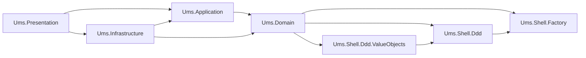

# ADR-0054: Shell Library Isolation for DDD and Factory Patterns

**Status:** Accepted  
**Date:** 2026-05-15  
**Decision Owner:** Architecture  
**Related Blueprint:** [Shell Library Architecture](../blueprints/shell-library-architecture.md)

## Context

UMS now includes reusable DDD and Factory libraries under `src/libs/shell`. These libraries originated from external/reference sources, but UMS must not expose upstream namespaces or repository conventions in application code.

The previous ADR registry described ADR-0029 as "C# Native DDD Primitives (no external library)". That wording is no longer precise for the implementation. The correct position is:

- UMS owns its domain dependency surface through `Ums.Shell.*`.
- The shell layer may encapsulate inherited or adapted library code.
- Application layers consume the UMS shell abstraction, not the upstream source identity.

## Decision

UMS will adopt a **Shell Library Isolation** strategy:

1. Shared DDD and Factory patterns live under `src/libs/shell`.
2. All shell assemblies use the `Ums.Shell.*` namespace and project naming convention.
3. `Ums.Domain` may reference:
   - `Ums.Shell.Ddd`
   - `Ums.Shell.Ddd.ValueObjects`
   - `Ums.Shell.Factory`
4. `Ums.Shell.Ddd` may depend on `Ums.Shell.Factory` because DDD pattern construction can use factory abstractions internally.
5. Application layers must not reference upstream namespaces such as `BeyondNet.*` or source repository names such as `csdevlib.*`.
6. Shell libraries must compile cross-platform and target the current stable .NET LTS baseline used by the API.

## Dependency Direction



## Consequences

### Positive

- UMS has a stable internal dependency surface for tactical DDD and Factory patterns.
- Domain implementation avoids duplicated primitive code across bounded contexts.
- Upstream source changes can be absorbed inside `src/libs/shell`.
- Project naming and namespaces remain consistent with UMS ownership.
- Cross-platform builds are easier to enforce because shell projects share the same `net10.0` baseline.

### Trade-offs

- The shell layer becomes a real architectural dependency and must be versioned and reviewed accordingly.
- Security and package warnings from shell dependencies affect the UMS build health.
- ADR-0029 must be interpreted as "no direct external dependency from application domain code", not "no reusable pattern library exists".

## Compliance

The following checks are mandatory after shell changes:

```bash
dotnet build src/apps/app-api-dotnet/Ums.Presentation/Ums.Presentation.csproj
dotnet build src/libs/shell/factory/src/Ums.Shell.Factory.sln
dotnet build src/libs/shell/ddd/src/Ums.Shell.Ddd/Ums.Shell.Ddd.sln
```

## Supersedes / Clarifies

This ADR clarifies ADR-0029. The implementation standard is now:

> UMS domain code must not depend directly on unmanaged external pattern libraries. It may depend on UMS-owned shell libraries that encapsulate and normalize those patterns.

