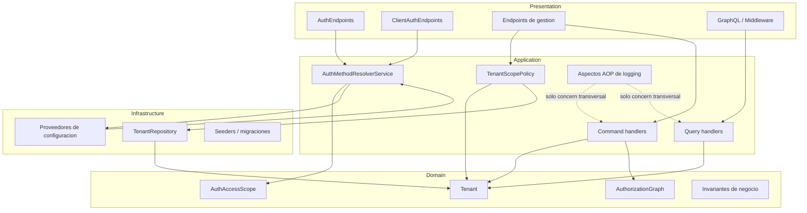
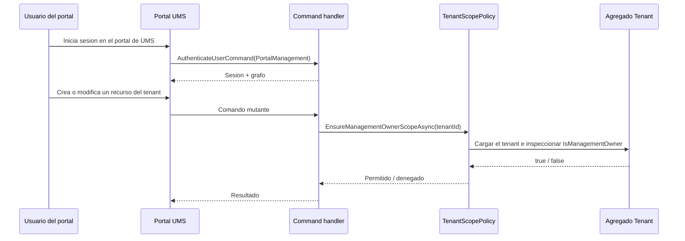

# ADR-0077: Frontera de Autorizacion para Gestion del Portal del Tenant y Politica de Scope

**Estado:** Accepted  
**Fecha:** 2026-06-02  
**Decision Owner:** Architecture  
**Relacionados:**
- [ADR-0071: Motor de Grafo de Autorizacion](./0071-auth-graph-engine.es.md)
- [ADR-0072: Resolucion Dinamica del Metodo de Autenticacion](./0072-dynamic-auth-method-resolution.es.md)
- [ADR-0060: Estrategia de AOP para Concerns Transversales](./0060-aop-cross-cutting-concern-strategy.es.md)
- [ADR-0075: Bandeja de Aprobacion de Onboarding y Autorizacion por Alcance](./0075-onboarding-approval-inbox-and-scope-based-authorization.es.md)

---

## Contexto

UMS debe soportar dos responsabilidades de autorizacion distintas que pueden confundirse facilmente si se implementan con el mismo mecanismo:

| Flujo | Proposito | Regla rectora |
|---|---|---|
| Gestion del portal | Un usuario del tenant inicia sesion en el portal de UMS para ver o administrar sus propios datos permitidos | Debe autorizarse por scope de tenant, roles, permisos y `Tenant.IsManagementOwner` |
| API publica externa | Un cliente downstream se autentica contra la API publica de autenticacion | Debe respetar el metodo de autenticacion configurado del tenant y el grafo de autorizacion |

Historicamente, el AOP transversal ha parecido un lugar conveniente para imponer checks de acceso porque ya esta unido a los command handlers. Esa es la frontera equivocada para una decision de seguridad. La autorizacion es critica para el negocio, debe permanecer explicita y debe ser facil de inspeccionar en tests y code reviews.

Por eso el flujo del portal necesita una frontera interna de gestion separada del flujo de autenticacion de la API publica. La frontera de gestion debe ser consciente del tenant, leer el flag de propiedad del tenant desde el modelo de dominio y evitar que cualquier tenant opere fuera de su scope.

---

## Decision

UMS tratara la autorizacion de gestion del portal como una politica explicita de aplicacion, no como una preocupacion de AOP.

| Area de Decision | Eleccion |
|---|---|
| Scope del portal | Introducir `AuthAccessScope.PortalManagement` para el acceso al portal y `AuthAccessScope.ExternalApi` para la API publica de autenticacion. |
| Regla de gestion interna | Usar `ITenantScopePolicy` para validar propiedad del tenant y scope antes de ejecutar comandos mutantes del portal. |
| Propiedad del tenant | Usar `Tenant.IsManagementOwner` como el flag autoritativo que habilita acciones de gestion interna para un tenant. |
| Autenticacion API externa | Mantener `IAuthMethodResolver.ResolveAsync(tenantId, scope)` como el resolvedor explicito para la API publica de autenticacion. |
| Uso de AOP | Reservar AOP para logging, tracing, enrichment de auditoria y otros concerns transversales. Nunca usarlo como frontera principal de autorizacion. |
| Scope de consultas | Permitir que los query handlers usen la policy para resolver el scope visible, pero mantener la autorizacion de escritura explicita en el boundary del comando. |

---

## Modelo de Arquitectura

---

## Por Que Esta Decision

1. Mantiene las decisiones de seguridad explicitas en la capa de aplicacion.
2. Evita convertir AOP en un motor de autorizacion oculto.
3. Alinea la gestion del portal con la propiedad del tenant en vez de mezclarla con el flujo publico de resolucion de IDP.
4. Preserva la testabilidad porque las decisiones de scope pueden cubrirse con pruebas unitarias directas.
5. Mantiene intacto el flujo de la API externa para clientes downstream.
6. Reduce el riesgo de que el acceso al portal y la autenticacion externa se influyan accidentalmente.

---

## Alternativas Consideradas

| Alternativa | Decision | Motivo |
|---|---|---|
| Hacer cumplir el acceso al tenant en aspectos AOP | Rechazada | Las reglas de seguridad quedarian implicitas y mas dificiles de auditar. |
| Hacer cumplir el acceso al tenant solo en middleware | Rechazada | Middleware es demasiado temprano y demasiado grueso para varias reglas de negocio. |
| Mezclar la gestion del portal y la autenticacion externa en un solo flujo | Rechazada | Los dos casos de uso tienen fronteras de confianza y reglas de negocio distintas. |
| Guardar la capacidad de gestion fuera de `Tenant` | Rechazada | La propiedad del tenant debe ser la fuente de verdad para el scope de gestion interna. |

---

## Consecuencias

### Positivas

- Las reglas de acceso del portal son faciles de encontrar en la capa de aplicacion.
- Las pruebas de autorizacion siguen siendo enfocadas y legibles.
- La propiedad de gestion del tenant es visible en el modelo de dominio.
- La API externa sigue respetando la configuracion de IDP especifica del tenant.

### Compromisos

- Algunos handlers deben llamar explicitamente a la policy en vez de depender de un interceptor global.
- La base de codigo necesita disciplina para mantener AOP limitado a concerns transversales.
- Un tenant marcado como management owner sigue requiriendo checks de rol y permiso para cada operacion.

---

## Notas de Implementacion

| Area | Guia |
|---|---|
| Commands | Los comandos mutantes del portal deben validar `ITenantScopePolicy` antes de cualquier escritura. |
| Queries | Los query handlers pueden usar la policy para resolver el scope visible, pero nunca para saltarse la autorizacion. |
| Auth | Usar `AuthAccessScope.PortalManagement` para el login del portal y `AuthAccessScope.ExternalApi` para la API publica de autenticacion. |
| Domain | Mantener `Tenant.IsManagementOwner` como la fuente de verdad para la capacidad de gestion interna. |
| AOP | Usar `LoggerAspect` y aspectos relacionados solo para instrumentacion, no para conceder acceso. |
| Trazabilidad | Enlazar este ADR desde historias funcionales y documentacion de dominio que hablen de gestion del portal del tenant. |

---

