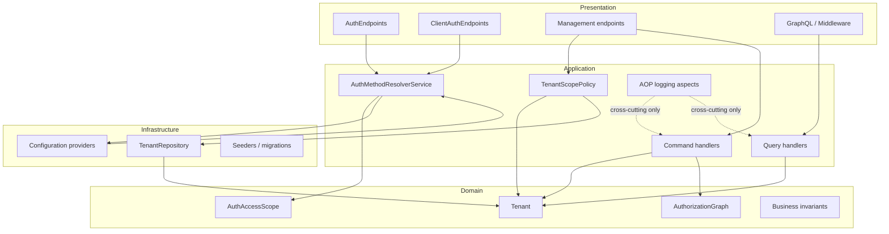
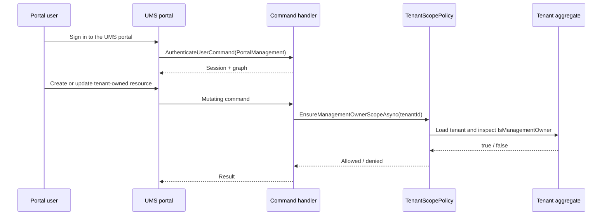

# ADR-0077: Tenant Portal Management Authorization Boundary and Scope Policy

> **UMS-specific:** No Evolith upstream. Tenant portal authorization boundaries and scope policies are intrinsic to UMS's multi-tenant SaaS architecture and not generalizable to other satellite products.

**Status:** Accepted  
**Date:** 2026-06-02  
**Decision Owner:** Architecture  
**Related:**
- [ADR-0071: Auth Graph Engine](./0071-auth-graph-engine.md)
- [ADR-0072: Dynamic Auth Method Resolution](./0072-dynamic-auth-method-resolution.md)
- [ADR-0060: AOP Cross-Cutting Concern Strategy](./0060-aop-cross-cutting-concern-strategy.md)
- [ADR-0075: Onboarding Approval Inbox and Scope-Based Authorization](./0075-onboarding-approval-inbox-and-scope-based-authorization.md)

---

## Context

UMS must support two different authorization responsibilities that are easy to confuse if they are implemented with the same mechanism:

| Flow | Purpose | Governing rule |
|---|---|---|
| Portal management | A tenant user signs into the UMS portal to view or manage their own allowed data | Must be authorized by tenant scope, roles, permissions, and `Tenant.IsManagementOwner` |
| Public external API | A downstream client authenticates against the public auth API | Must honor the tenant's configured auth method and the auth graph |

Historically, cross-cutting AOP was a tempting place to enforce access checks because it is already attached to command handlers. That would be the wrong boundary for a security decision. Authorization is business-critical, must remain explicit, and must be easy to inspect in tests and code reviews.

The portal flow therefore needs an internal management boundary that is separate from the external API authentication flow. The management boundary must be tenant-aware, read the tenant ownership flag from the domain model, and prevent any tenant from operating outside its scope.

---

## Decision

UMS will treat portal management authorization as an explicit application policy, not as an AOP concern.

| Decision Area | Choice |
|---|---|
| Portal scope | Introduce `AuthAccessScope.PortalManagement` for portal access and `AuthAccessScope.ExternalApi` for the public auth API. |
| Internal management rule | Use `ITenantScopePolicy` to validate tenant ownership and scope before executing mutating portal commands. |
| Tenant ownership | Use `Tenant.IsManagementOwner` as the authoritative flag that enables internal management actions for a tenant. |
| External API auth | Keep `IAuthMethodResolver.ResolveAsync(tenantId, scope)` as the explicit resolver for the public authentication API. |
| AOP usage | Reserve AOP for logging, tracing, audit enrichment, and other cross-cutting concerns. Never use it as the primary authorization boundary. |
| Query scope | Allow query handlers to use the policy for scope resolution, but keep write authorization explicit at the command boundary. |

---

## Architecture Model

---

## Why This Decision

1. It keeps security decisions explicit in the application layer.
2. It avoids turning AOP into a hidden authorization engine.
3. It aligns portal management with tenant ownership rather than with the public IDP resolution path.
4. It preserves testability because scope decisions can be covered with direct unit tests.
5. It keeps the external API flow fully intact for downstream clients.
6. It reduces the chance that portal access and external authentication will accidentally influence each other.

---

## Alternatives Considered

| Alternative | Decision | Reason |
|---|---|---|
| Enforce tenant access in AOP aspects | Rejected | Security rules would become implicit and harder to audit. |
| Enforce tenant access only in middleware | Rejected | Middleware is too early and too coarse for many business rules. |
| Merge portal management and external API auth into one flow | Rejected | The two use cases have different trust boundaries and different business rules. |
| Store management access outside `Tenant` | Rejected | Tenant ownership must be the source of truth for internal management scope. |

---

## Consequences

### Positive

- Portal access rules are easy to find in the application layer.
- Authorization tests remain focused and readable.
- Tenant management ownership is visible in the domain model.
- The external API still honors tenant-specific IDP configuration.

### Trade-offs

- Some handlers must explicitly call the policy instead of relying on a global interceptor.
- The codebase needs discipline to keep AOP limited to cross-cutting concerns.
- A tenant marked as management owner still requires role and permission checks for each operation.

---

## Implementation Notes

| Area | Guidance |
|---|---|
| Commands | Mutating portal commands must validate `ITenantScopePolicy` before any write occurs. |
| Queries | Query handlers may use the policy to resolve the visible scope, but never to bypass authorization. |
| Auth | Use `AuthAccessScope.PortalManagement` for portal login and `AuthAccessScope.ExternalApi` for the public auth API. |
| Domain | Keep `Tenant.IsManagementOwner` as the source of truth for internal management capability. |
| AOP | Use `LoggerAspect` and related aspects only for instrumentation, not for granting access. |
| Traceability | Link this ADR from functional stories and domain documentation that talk about tenant portal management. |

---

