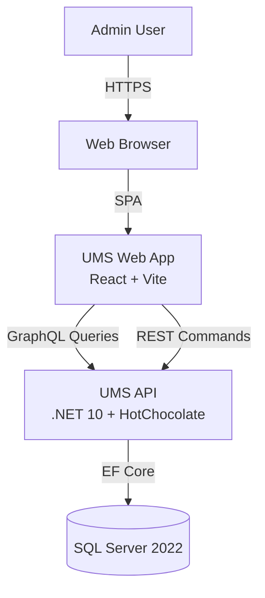
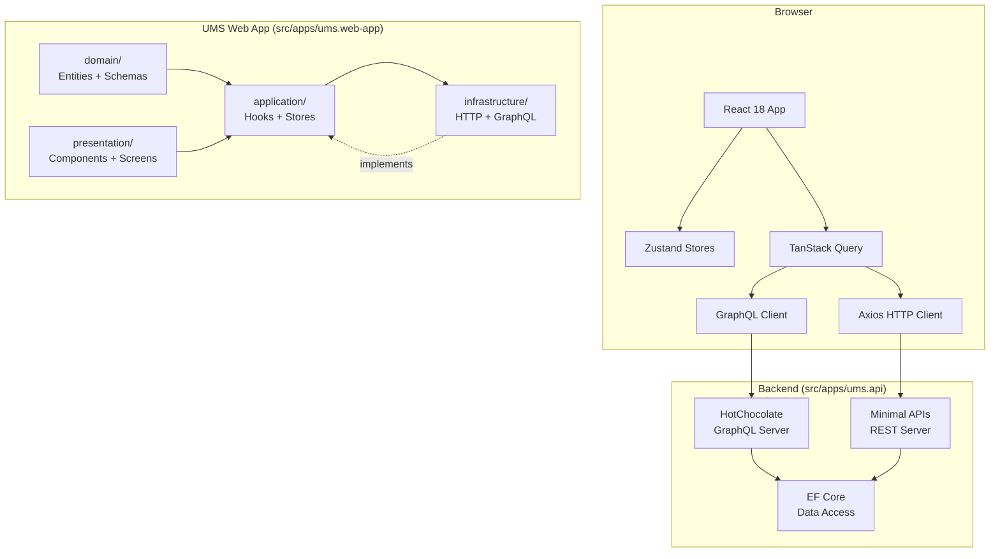
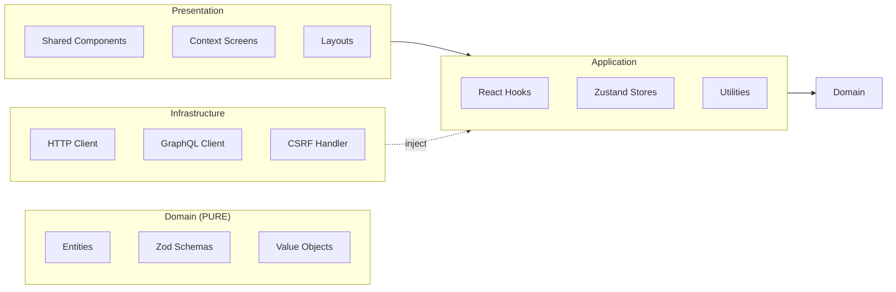
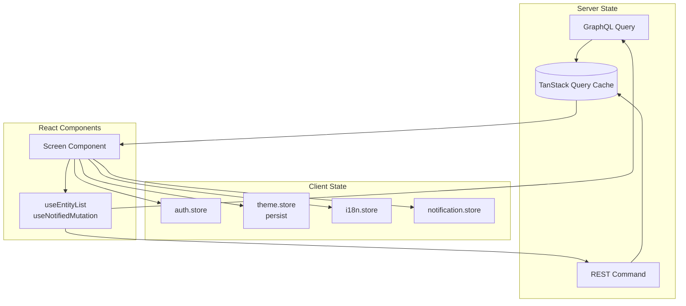

# UMS Architecture Diagram

## System Context (C4 Level 1)



## Container Diagram (C4 Level 2)



## Layer Dependencies (Clean Architecture)



## State Management Flow



## Security Architecture

```mermaid
graph TB
 subgraph "Browser"
 App[React App]
 CSRF[CSRF Token\nCookie + Meta]
 end

 subgraph "Nginx (Production)"
 CSP[CSP Header\nno unsafe-eval]
 HSTS[HSTS Header]
 XFrame[X-Frame-Options: DENY]
 end

 subgraph "Backend"
 DevAuth[DevAuthMiddleware\n(dev only)]
 JWTAuth[JWT Authentication\n(production)]
 CORS[CORS Policy]
 end

 App -->|Request + CSRF| CSRF
 CSRF -->|X-CSRF-Token| Nginx
 Nginx -->|CSP + HSTS + XFrame| App
 Nginx -->|Forward| DevAuth
 DevAuth -->|X-User-Id| App
 JWTAuth -.->|future| DevAuth
```
