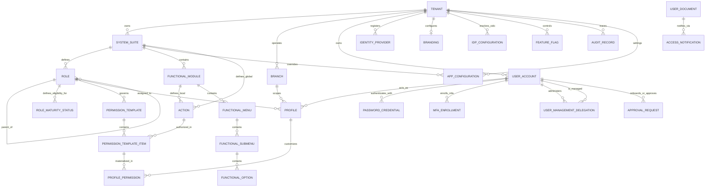
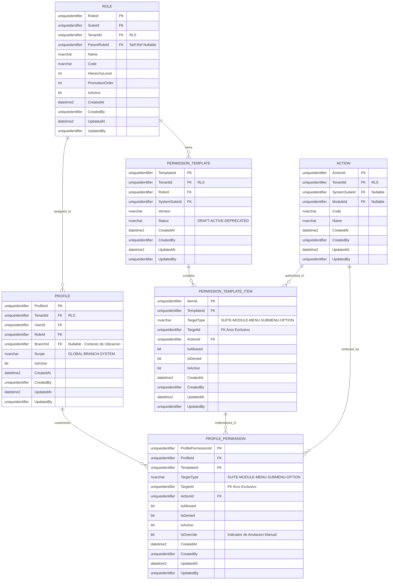
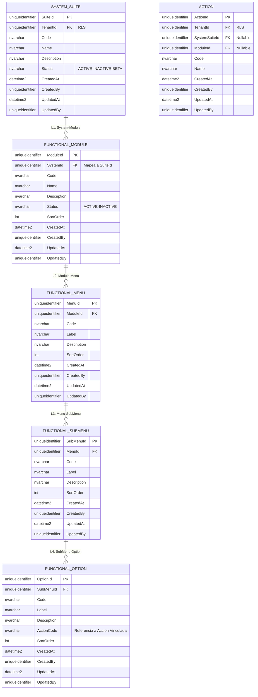
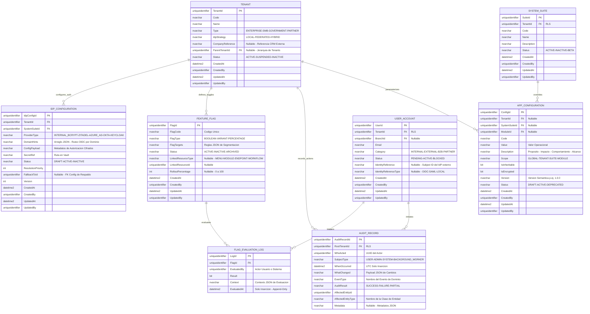

# Modelo Entidad-Relación (E/R) - SQL Server 2022

**Tipo de Documento:** Diseño de Base de Datos  
**Estado:** Refactorizado (Alcance por Rol y Jerarquía Estricta)  
**Arquitectura:** Marco Maestro Jerárquico (Control de 5 Niveles)  
**Motor:** SQL Server 2022

## 1. Introducción
Este documento detalla el modelo de autorización **por Rol**, que aplica estrictamente la cadena jerárquica: **Sistema → Módulo → Menú → SubMenú → Opción**.

Todos los bloques de atributos de entidad se derivan directamente de las clases `*Props` del dominio en `Ums.Domain`, garantizando que el diagrama refleje el modelo de datos autoritativo.

> [!NOTE]
> **Mapeo de Lenguaje Ubicuo:** Los nombres de entidades del esquema están alineados con el [Glosario](../../governance/requirements/glossary.md) de la siguiente manera:
> `SYSTEM_SUITE` = **System** · `FUNCTIONAL_MODULE` = **Module** · `FUNCTIONAL_MENU` = **Menu** · `FUNCTIONAL_SUBMENU` = **SubMenu** · `FUNCTIONAL_OPTION` = **Option**

> [!TIP]
> **¿Problemas de visualización?**  
> Si los diagramas Mermaid no se renderizan correctamente en tu IDE, utiliza los **[Formatos de Exportación Alternativos (dbdiagram.io, DDL, D2)](./er-export-formats.md)**. Estos formatos son compatibles con herramientas profesionales como DBeaver, SSMS y dbdiagram.io.

---

## 2. Auditoría y Trazabilidad Corporativa Estándar
Todas las entidades (excepto logs append-only) implementan el esquema de auditoría estándar — cuatro columnas derivadas de `AuditValueObject`:

| Columna | Tipo | Descripción |
|---|---|---|
| `CreatedAt` | `datetime2` | Marca de tiempo UTC de creación |
| `CreatedBy` | `uniqueidentifier` | Actor que creó el registro |
| `UpdatedAt` | `datetime2` | Marca de tiempo UTC de última actualización |
| `UpdatedBy` | `uniqueidentifier` | Actor que realizó la última actualización |

Las entidades append-only (`AUDIT_RECORD`, `FLAG_EVALUATION_LOG`, `ACCESS_NOTIFICATION`) no incluyen columnas de actualización — son inmutables por diseño.

---

## 3. Vistas de Dominio Modulares

### 3.1 Mapa Global de Alto Nivel
Ruta de Resolución Completa: `Tenant -> System -> Role -> Template -> ProfilePermission`.

---

### 3.2 Dominio: Autoridad Centrada en Roles y Jerarquía Estricta
Este dominio garantiza que cada permiso esté acotado a un Rol y se mapee exactamente a la jerarquía funcional de 5 niveles.

---

### 3.3 Dominio: Topología Funcional (Los 5 Niveles)
Estructura organizacional de recursos.

---

### 3.4 Dominio: Gobernanza de Identidad y Aprobaciones
Gestión del ciclo de vida del usuario, credenciales, administración delegada, flujos de documentos y promociones de roles IGA.

```mermaid
erDiagram
    TENANT ||--o{ USER_ACCOUNT : "owns"
    TENANT ||--o{ BRANCH : "operates"
    TENANT ||--o{ IDENTITY_PROVIDER : "registers"
    TENANT ||--o| BRANDING : "configures"
    USER_ACCOUNT ||--o{ PASSWORD_CREDENTIAL : "authenticates_with"
    USER_ACCOUNT ||--o{ MFA_ENROLLMENT : "enrolls_mfa"
    USER_ACCOUNT ||--o{ USER_MANAGEMENT_DELEGATION : "admin"
    USER_ACCOUNT ||--o{ USER_MANAGEMENT_DELEGATION : "managed"
    USER_ACCOUNT ||--o{ ROLE_MATURITY_STATUS : "has"
    ROLE ||--o{ ROLE_MATURITY_STATUS : "defines_eligibility"
    APPROVAL_WORKFLOW ||--o{ APPROVAL_REQUEST : "defines_rules_for"
    APPROVAL_WORKFLOW ||--o{ APPROVAL_REQUIRED_DOCUMENT : "mandates"
    APPROVAL_REQUEST ||--o{ USER_DOCUMENT : "evidenced_by"
    APPROVAL_REQUIRED_DOCUMENT ||--o{ DOCUMENT_TYPE : "typed_as"
    USER_ACCOUNT ||--o{ USER_DOCUMENT : "holds"
    DOCUMENT_TYPE ||--o{ USER_DOCUMENT : "classifies"
    DOCUMENT_TYPE ||--o{ NOTIFICATION_RULE : "alerts_for"
    DOCUMENT_TYPE ||--o{ ACCESS_ENFORCEMENT_POLICY : "governs_access"
    USER_DOCUMENT ||--o{ ACCESS_NOTIFICATION : "notifies_via"
    USER_ACCOUNT ||--o{ PROMOTION_REQUEST : "initiates"
    ROLE ||--o{ PROMOTION_REQUEST : "target"
    APPROVAL_REQUEST ||--o{ PROMOTION_REQUEST : "authorized_by"
    PROMOTION_REQUEST ||--o{ PROMOTION_IMPACT_ANALYSIS : "evaluates_risk"

    TENANT {
        uniqueidentifier TenantId PK
        nvarchar Code
        nvarchar Name
        nvarchar Type "ENTERPRISE-SMB-GOVERNMENT-PARTNER"
        nvarchar IdpStrategy "LOCAL-FEDERATED-HYBRID"
        nvarchar CompanyReference "Nullable - Referencia CRM Externa"
        uniqueidentifier ParentTenantId FK "Nullable - Jerarquia de Tenants"
        nvarchar Status "ACTIVE-SUSPENDED-INACTIVE"
        datetime2 CreatedAt
        uniqueidentifier CreatedBy
        datetime2 UpdatedAt
        uniqueidentifier UpdatedBy
    }

    USER_ACCOUNT {
        uniqueidentifier UserId PK
        uniqueidentifier TenantId FK "RLS"
        uniqueidentifier BranchId FK "Nullable"
        nvarchar Email
        nvarchar Category "INTERNAL-EXTERNAL-B2B-PARTNER"
        nvarchar Status "PENDING-ACTIVE-BLOCKED"
        nvarchar IdentityReference "Nullable - Subject ID del IdP externo"
        nvarchar IdentityReferenceType "Nullable - OIDC-SAML-LOCAL"
        datetime2 CreatedAt
        uniqueidentifier CreatedBy
        datetime2 UpdatedAt
        uniqueidentifier UpdatedBy
    }

    BRANCH {
        uniqueidentifier BranchId PK
        uniqueidentifier TenantId FK
        nvarchar Code
        nvarchar Name
        nvarchar GeofencingMetadata "Nullable - Coordenadas JSON"
        bit IsActive
        datetime2 CreatedAt
        uniqueidentifier CreatedBy
        datetime2 UpdatedAt
        uniqueidentifier UpdatedBy
    }

    IDENTITY_PROVIDER {
        uniqueidentifier IdpId PK
        uniqueidentifier TenantId FK
        nvarchar Code
        nvarchar Name
        nvarchar Description
        nvarchar Strategy "OIDC-SAML2-WS_FED"
        bit IsActive
        datetime2 CreatedAt
        uniqueidentifier CreatedBy
        datetime2 UpdatedAt
        uniqueidentifier UpdatedBy
    }

    BRANDING {
        uniqueidentifier BrandingId PK
        uniqueidentifier TenantId FK "Uno-a-Uno RLS"
        nvarchar Logo "URI Ruta de Almacenamiento"
        nvarchar LogoFormat "PNG-SVG-JPEG"
        nvarchar PrimaryColor "Codigo de Color Hex"
        nvarchar BackgroundStyle "Glassmorphism-SleekDark"
        nvarchar HeadlineText
        nvarchar SecondaryText
        nvarchar PrimaryButtonLabel
        nvarchar FooterText
        nvarchar CustomDomain "Nullable"
        nvarchar DnsVerificationStatus "PENDING-VERIFIED-FAILED"
        nvarchar DnsCnameTarget
        bit MagicLinkFallbackEnabled
        datetime2 CreatedAt
        uniqueidentifier CreatedBy
        datetime2 UpdatedAt
        uniqueidentifier UpdatedBy
    }

    PASSWORD_CREDENTIAL {
        uniqueidentifier CredentialId PK
        uniqueidentifier UserAccountId FK
        nvarchar PasswordHash "Hash BCrypt"
        bit IsActive
        datetime2 CreatedAt
        uniqueidentifier CreatedBy
        datetime2 UpdatedAt
        uniqueidentifier UpdatedBy
    }

    MFA_ENROLLMENT {
        uniqueidentifier MfaEnrollmentId PK
        uniqueidentifier UserAccountId FK
        nvarchar Method "TOTP-SMS-EMAIL-WEBAUTHN"
        nvarchar Status "ENROLLED-PENDING-REVOKED"
        datetime2 CreatedAt
        uniqueidentifier CreatedBy
        datetime2 UpdatedAt
        uniqueidentifier UpdatedBy
    }

    ROLE {
        uniqueidentifier RoleId PK
        uniqueidentifier SuiteId FK
        uniqueidentifier TenantId FK "RLS"
        uniqueidentifier ParentRoleId FK "Self-Ref Nullable"
        nvarchar Name
        nvarchar Code
        int HierarchyLevel
        int PromotionOrder
        bit IsActive
        datetime2 CreatedAt
        uniqueidentifier CreatedBy
        datetime2 UpdatedAt
        uniqueidentifier UpdatedBy
    }

    ROLE_MATURITY_STATUS {
        uniqueidentifier MaturityStatusId PK
        uniqueidentifier TenantId FK "RLS"
        uniqueidentifier UserId FK
        uniqueidentifier RoleId FK
        nvarchar CurrentMaturityLevel "JUNIOR-INTERMEDIATE-SENIOR-LEAD-PRINCIPAL"
        nvarchar NextEligibleMaturityLevel "Nullable"
        datetime2 AssignedAt
        datetime2 CurrentLevelSince
        datetime2 EligibleForPromotionAt "Nullable"
        int CompletedCertificationsCount
        int CompletedTrainingsCount
        decimal PerformanceScore
        bit HasNoComplianceIssues
        nvarchar BlockingFactor "Nullable"
        datetime2 LastReviewedAt "Nullable"
        datetime2 CreatedAt
        uniqueidentifier CreatedBy
        datetime2 UpdatedAt
        uniqueidentifier UpdatedBy
    }

    USER_MANAGEMENT_DELEGATION {
        uniqueidentifier DelegationId PK
        uniqueidentifier ParentAdminUserId FK
        uniqueidentifier ManagedUserId FK
        uniqueidentifier SuiteId FK "Nullable - Alcance Opcional"
    }

    APPROVAL_WORKFLOW {
        uniqueidentifier WorkflowId PK
        uniqueidentifier TenantId FK
        uniqueidentifier SystemSuiteId FK "Nullable"
        nvarchar Code
        nvarchar Name
        nvarchar Description
        nvarchar TargetUserCategory "INTERNAL-EXTERNAL-B2B-PARTNER"
        bit RequiresApproval
        datetime2 CreatedAt
        uniqueidentifier CreatedBy
        datetime2 UpdatedAt
        uniqueidentifier UpdatedBy
    }

    APPROVAL_REQUIRED_DOCUMENT {
        uniqueidentifier RequiredDocId PK
        uniqueidentifier WorkflowId FK
        uniqueidentifier DocumentTypeId FK
        bit IsMandatory
        datetime2 CreatedAt
        uniqueidentifier CreatedBy
        datetime2 UpdatedAt
        uniqueidentifier UpdatedBy
    }

    APPROVAL_REQUEST {
        uniqueidentifier RequestId PK
        uniqueidentifier WorkflowId FK
        uniqueidentifier TargetUserId FK
        uniqueidentifier TargetProfileId FK "Nullable"
        nvarchar Status "PENDING-APPROVED-REJECTED"
        datetime2 CreatedAt
        uniqueidentifier CreatedBy
        datetime2 UpdatedAt
        uniqueidentifier UpdatedBy
    }

    DOCUMENT_TYPE {
        uniqueidentifier DocumentTypeId PK
        uniqueidentifier TenantId FK
        nvarchar Code
        nvarchar Name
        nvarchar Description
        nvarchar Criticity "LOW-MEDIUM-HIGH-CRITICAL"
        datetime2 CreatedAt
        uniqueidentifier CreatedBy
        datetime2 UpdatedAt
        uniqueidentifier UpdatedBy
    }

    NOTIFICATION_RULE {
        uniqueidentifier RuleId PK
        uniqueidentifier TenantId FK
        uniqueidentifier DocumentTypeId FK
        nvarchar Channel "EMAIL-IN_APP-SMS"
        nvarchar Recipient
        int DaysBefore "Dias de Anticipacion para la Alerta"
        nvarchar Code
        nvarchar Description
        bit IsActive
        datetime2 CreatedAt
        uniqueidentifier CreatedBy
        datetime2 UpdatedAt
        uniqueidentifier UpdatedBy
    }

    ACCESS_ENFORCEMENT_POLICY {
        uniqueidentifier PolicyId PK
        uniqueidentifier TenantId FK
        uniqueidentifier ProfileId FK "Nullable"
        uniqueidentifier RoleId FK "Nullable"
        nvarchar EnforcementAction "BLOCK_USER-RESTRICT_PROFILE-LOG_ONLY"
        bit IsActive
        datetime2 CreatedAt
        uniqueidentifier CreatedBy
        datetime2 UpdatedAt
        uniqueidentifier UpdatedBy
    }

    USER_DOCUMENT {
        uniqueidentifier DocumentId PK
        uniqueidentifier UserId FK
        uniqueidentifier DocumentTypeId FK
        datetime2 IssueDate
        datetime2 ExpirationDate
        nvarchar Status "PENDING_REVIEW-VALID-EXPIRED-PENDING_RENEWAL"
        nvarchar Criticity "LOW-MEDIUM-HIGH-CRITICAL"
        nvarchar FileStoragePath "URI Ruta al Servidor de Archivos"
        nvarchar FileChecksum "Hash de Verificacion de Integridad"
        int NotificationStep "Indice del Paso de Alerta Actual"
        datetime2 CreatedAt
        uniqueidentifier CreatedBy
        datetime2 UpdatedAt
        uniqueidentifier UpdatedBy
    }

    ACCESS_NOTIFICATION {
        uniqueidentifier NotificationId PK
        uniqueidentifier UserDocumentId FK
        int Step "Numero de Paso de Notificacion"
        nvarchar Channel "EMAIL-IN_APP-SMS"
        int DaysRemaining "Dias Hasta el Vencimiento"
        datetime2 SentAt "Solo Insercion - Append-Only"
    }

    PROMOTION_REQUEST {
        uniqueidentifier PromotionRequestId PK
        uniqueidentifier TenantId FK
        uniqueidentifier UserId FK
        uniqueidentifier CurrentRoleId FK
        uniqueidentifier TargetRoleId FK
        datetime2 RequestedAt
        uniqueidentifier RequestedBy "Actor que Inicio la Solicitud"
        nvarchar RequestReason "Nullable"
        uniqueidentifier ManagerId FK
        nvarchar ManagerApprovalStatus "PENDING-APPROVED-REJECTED"
        datetime2 ManagerDecisionAt "Nullable"
        nvarchar SecurityApprovalStatus "PENDING-APPROVED-REJECTED"
        datetime2 SecurityDecisionAt "Nullable"
        nvarchar Status "DRAFT-SUBMITTED-APPROVED-EXECUTED-VERIFIED"
        datetime2 ExecutedAt "Nullable"
        uniqueidentifier ExecutedBy "Nullable"
        datetime2 VerifiedAt "Nullable"
        datetime2 CreatedAt
        uniqueidentifier CreatedBy
        datetime2 UpdatedAt
        uniqueidentifier UpdatedBy
    }

    PROMOTION_IMPACT_ANALYSIS {
        uniqueidentifier ImpactAnalysisId PK
        uniqueidentifier PromotionRequestId FK
        decimal RiskScore
        nvarchar RiskLevel "LOW-MEDIUM-HIGH-CRITICAL"
        int NewPermissionsCount
        int RemovedPermissionsCount
        int AffectedSystemsCount
        nvarchar ConflictingPermissions "Nullable - Lista JSON"
        nvarchar RiskFactors "Nullable - Lista JSON"
        nvarchar SuggestedMitigations "Nullable - Lista JSON"
        datetime2 AnalyzedAt
        nvarchar AnalyzedBy "Nullable - Identidad del Analizador"
        datetime2 CreatedAt
        uniqueidentifier CreatedBy
        datetime2 UpdatedAt
        uniqueidentifier UpdatedBy
    }
```

---

### 3.5 Dominio: Configuración de Plataforma y Auditoría del Sistema
Este dominio cubre la configuración global del sistema, integraciones OIDC con Proveedores de Identidad, controles multi-dimensionales de Feature Flags, y el libro mayor inmutable append-only de todas las acciones del sistema.

---

## 4. Reglas de Negocio y Restricciones Técnicas
1.  **Seguridad a Nivel de Fila (RLS)**: `TenantId` está desnormalizado en todas las entidades funcionales (Module, Option, Template, Action, Role) para permitir verificaciones de aislamiento O(1) mediante SQL Server RLS.
2.  **Arco Exclusivo (Integridad de Template)**: `PermissionTemplateItem` usa un discriminador `TargetType` y una columna `TargetId` única en lugar de 5 FKs anulables. Una restricción `CHECK` garantiza que `TargetType` siempre esté poblado, aplicando integridad referencial estricta en base de datos sobre el polimorfismo.
3.  **XOR Estricto de Propiedad de Acción**: Una Acción debe pertenecer a un Sistema O a un Módulo, pero nunca a ambos: `CHECK ((SystemSuiteId IS NOT NULL AND ModuleId IS NULL) OR (SystemSuiteId IS NULL AND ModuleId IS NOT NULL))`.
4.  **Integridad de Jerarquía**: El acceso debe trazarse a través de `System > Module > Menu > SubMenu > Option` (esquema: `SYSTEM_SUITE → FUNCTIONAL_MODULE → FUNCTIONAL_MENU → FUNCTIONAL_SUBMENU → FUNCTIONAL_OPTION`).
5.  **Administración Delegada (Muchos-a-Muchos)**: El alcance de administración de un usuario se define a través de la tabla `USER_MANAGEMENT_DELEGATION`. Esto permite que múltiples administradores gestionen el mismo grupo de usuarios, opcionalmente restringido por `SuiteId`.
6.  **Mandatos de Aprobación**: Los usuarios Externos/B2B DEBEN pasar por un `APPROVAL_WORKFLOW` antes de alcanzar el estado `ACTIVE` o ser asignados a perfiles de alto riesgo. Los documentos requeridos definidos en `APPROVAL_REQUIRED_DOCUMENT` deben subirse a `USER_DOCUMENT` antes de avanzar en el flujo.
7.  **Aplicación Automática de Cumplimiento**: Workers en segundo plano escanean `USER_DOCUMENT`. Al vencer, se activa `ACCESS_ENFORCEMENT_POLICY`. Los documentos críticos transicionarán automáticamente el `USER_ACCOUNT` a estado `BLOCKED` o restringirán el contexto del `PROFILE`.
8.  **Notificaciones Paramétricas**: `NOTIFICATION_RULE` permite configurar alertas de N pasos (p.ej., 30, 15, 5 días antes del vencimiento) por Tenant y Tipo de Documento. Cada notificación disparada se registra como una entrada inmutable `ACCESS_NOTIFICATION`.
9.  **Estándar de Catálogo Paramétrico Obligatorio**: Cada entidad de parámetro/configuración/catálogo DEBE incluir `Code`, `Value` y `Description`. `Description` debe documentar propósito, impacto funcional, comportamiento esperado y alcance aplicable. Todas estas entidades deben además definir unicidad por alcance, linaje de versiones, metadatos de auditoría, eventos de trazabilidad, estrategia de invalidación de caché y extensibilidad futura.
10. **Aislamiento de Credenciales**: `PASSWORD_CREDENTIAL` y `MFA_ENROLLMENT` son entidades separadas propiedad de `USER_ACCOUNT`. Un usuario puede tener como máximo una `PASSWORD_CREDENTIAL` activa y múltiples registros `MFA_ENROLLMENT` (uno por método). Esto permite rotación limpia de credenciales y gestión de métodos multi-factor sin acoplamiento al registro de identidad principal.
11. **Doble Puerta de Aprobación IGA**: `PROMOTION_REQUEST` rastrea dos etapas de aprobación independientes — Manager y Seguridad — cada una con su propio estado y marca de tiempo. Ambas deben estar en `APPROVED` antes de que el `Status` pueda avanzar a `EXECUTED`. El registro `PROMOTION_IMPACT_ANALYSIS` se genera automáticamente y debe ser revisado antes de otorgar la aprobación de Seguridad.
