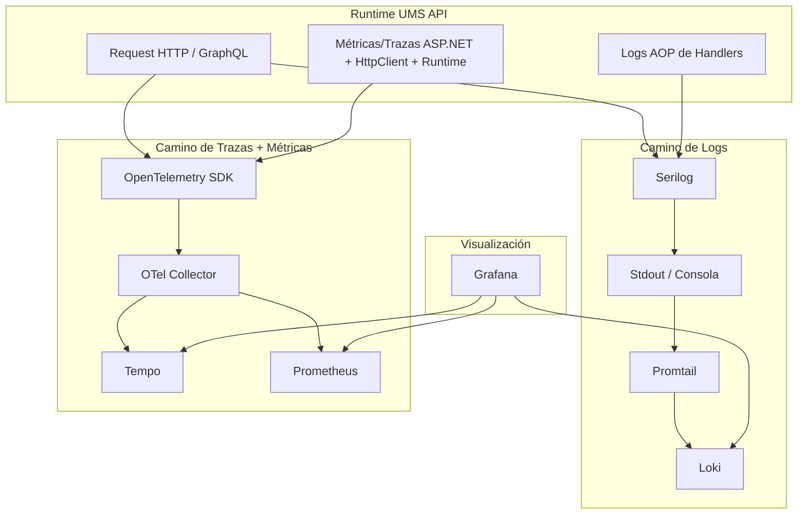

# Flujo de Arquitectura de Observabilidad

## Propósito

Este blueprint muestra cómo UMS propaga `CorrelationId`, `SessionTrackingId`, trazas, logs y métricas a través del pipeline de API, los decoradores AOP, la instrumentación de runtime y el stack local de observabilidad.

Complementa:
- [Guía de Logging y Observabilidad](../blueprints/logging-observability-guide.md)
- [ADR-0053: Observabilidad con OpenTelemetry](../adrs/0053-opentelemetry-observability.md)
- [ADR-0060: Estrategia AOP para Cross-Cutting Concerns](../adrs/0060-aop-cross-cutting-concern-strategy.md)
- [ADR-0061: Patrón Execution Context Accessor](../adrs/0061-execution-context-accessor.es.md)
- [ADR-0062: Configuración PII-Safe de Serilog](../adrs/0062-pii-safe-serilog-configuration.es.md)

## 1. Flujo Lógico

```mermaid
flowchart LR
    Client["Cliente / Navegador / Consumidor API"]
    Correlation["CorrelationIdMiddleware"]
    Session["SessionTrackingMiddleware"]
    RequestCtx["RequestContextAccessor / IRequestContext"]
    RequestLog["Serilog Request Logging"]
    Endpoint["Endpoint REST / GraphQL"]
    Handler["Handler MediatR"]
    Aop["LoggerAspect(IUmsLogger)"]
    UmsLogger["UmsSerilogLogger"]
    Activity["Activity.Current / Contexto OTel"]
    Mel["Microsoft ILogger"]
    Serilog["Pipeline Serilog"]
    Stdout["Stdout del contenedor / Consola"]
    OTel["OpenTelemetry SDK"]
    Collector["OTel Collector"]
    Tempo["Tempo"]
    Promtail["Promtail"]
    Loki["Loki"]
    Prometheus["Prometheus"]
    Grafana["Grafana"]

    Client -->|"X-Correlation-Id\nX-Session-Tracking-Id"| Correlation
    Correlation --> Session
    Correlation -->|"baggage: correlation.id"| Activity
    Session --> RequestCtx
    Session -->|"baggage/tag: session.tracking_id"| Activity
    Session --> RequestLog
    RequestLog --> Endpoint
    Endpoint --> Handler
    Handler --> Aop
    Aop --> UmsLogger
    UmsLogger -->|"TenantId\nCorrelationId\nSessionTrackingId\nTraceId\nSpanId\nBoundedContext"| Mel
    Mel --> Serilog
    Serilog --> Stdout
    Stdout --> Promtail
    Promtail --> Loki

    Endpoint -. ASP.NET / HttpClient / Runtime .-> OTel
    Activity -. trace/span actual .-> OTel
    OTel -->|"OTLP traces + metrics"| Collector
    Collector --> Tempo
    Collector --> Prometheus

    Grafana --> Loki
    Grafana --> Tempo
    Grafana --> Prometheus
```

## 2. Responsabilidades de Runtime

| Componente | Responsabilidad |
| --- | --- |
| `CorrelationIdMiddleware` | Resolver o generar `X-Correlation-Id`, escribirlo en la respuesta, en `Activity` baggage y en el scope de logs. |
| `SessionTrackingMiddleware` | Resolver o generar `X-Session-Tracking-Id`, escribirlo en la respuesta, en `Activity` baggage/tag y en el contexto scoped de ejecución. |
| `RequestContextAccessor` | Proveer un snapshot seguro por request para AOP, manejo global de excepciones, request logging y futura continuidad asíncrona. |
| `UseSerilogRequestLogging(...)` | Emitir logs HTTP enriquecidos con host, correlación, sesión, trace y span. |
| `LoggerAspect(IUmsLogger)` | Interceptar entrada/salida/excepción del handler y delegar al logger final orientado a observabilidad. |
| `UmsSerilogLogger` | Enriquecer logs AOP con el envelope completo de UMS y emitirlos por el pipeline Serilog-backed de `ILogger`. |
| `OpenTelemetry SDK` | Producir trazas y métricas desde ASP.NET Core, HttpClient, runtime y `Activity` actual. |
| `Promtail` | Leer logs de stdout del contenedor y enviarlos a Loki. |
| `OTel Collector` | Distribuir trazas y métricas OTLP hacia los stores finales. |

## 3. Ruteo de Señales



## 4. Reglas de Correlación End-to-End

1. El cliente debe enviar `X-Session-Tracking-Id` en cada request.
2. La API debe responder siempre con `X-Correlation-Id` y `X-Session-Tracking-Id`.
3. `CorrelationId` y `SessionTrackingId` deben ser visibles en:
   - request logs
   - logs AOP de handlers
   - tags / baggage de trazas
   - logs de excepción
4. `TenantId` se enriquece en `UmsSerilogLogger`, no en middleware.
5. `SessionTrackingId` no debe usarse como dimensión general de métricas por su alta cardinalidad.

## 5. Aclaración Importante

La implementación actual de UMS utiliza:

- **Logs**: `Serilog -> stdout -> Promtail -> Loki`
- **Trazas / Métricas**: `OpenTelemetry SDK -> OTLP -> OTel Collector -> Tempo / Prometheus`

Entonces, el decorador AOP sí es totalmente compatible con el ciclo de observabilidad, pero hoy los logs viajan por la ruta **Serilog + stdout + Promtail** y no por un exportador OTLP directo de logs.

Eso es intencional y operacionalmente válido para entornos locales y containerizados.

## 6. Continuidad Background y Asíncrona

El camino HTTP ya propaga correctamente el contexto de ejecución.

El siguiente objetivo arquitectónico es asegurar que ese mismo envelope sobreviva en:
- outbox dispatch
- background services
- handlers downstream por mensajería

Esa continuidad debe preservar:
- `CorrelationId`
- `SessionTrackingId`
- `TraceId`
- `SpanId`

## 7. Orden de Lectura

1. [Guía de Logging y Observabilidad](../blueprints/logging-observability-guide.md)
2. [ADR-0053: Observabilidad con OpenTelemetry](../adrs/0053-opentelemetry-observability.md)
3. [ADR-0061: Execution Context Accessor](../adrs/0061-execution-context-accessor.es.md)
4. [ADR-0062: Serilog PII-Safe](../adrs/0062-pii-safe-serilog-configuration.es.md)
