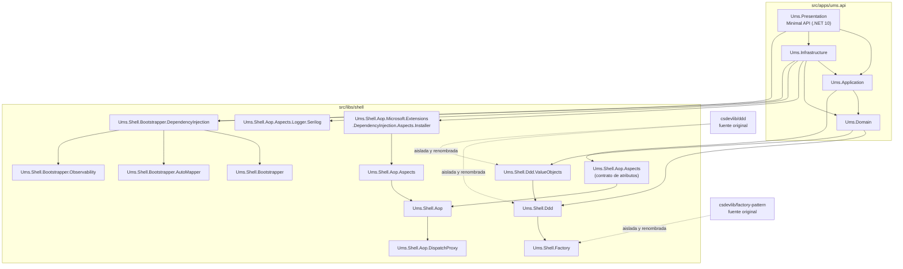

# Arquitectura de Librerías Shell

**Tipo:** Blueprint de Arquitectura  
**Estado:** Aceptado · Enmendado 2026-05-24 — librerías AOP y Bootstrapper agregadas  
**Runtime:** .NET 10 LTS  
**Ubicación en código:** `src/libs/shell`

## Propósito

UMS aísla los patrones reutilizables de implementación en una **Capa de Librerías Shell**. Esta capa encapsula y normaliza código heredado bajo namespaces propios de UMS para que la aplicación use patrones DDD, Factory, AOP y Bootstrapper sin filtrar nombres, estructura de repositorio ni detalles internos de la fuente original.

La capa shell no es una carpeta genérica de utilidades. Es una frontera arquitectónica con cuatro grupos de librerías distintos:

| Grupo | Responsabilidad |
|-------|-----------------|
| `Ums.Shell.Ddd` | Primitivas tácticas DDD: entidades, aggregate roots, eventos de dominio, value objects, especificaciones, convenciones de resultado/error |
| `Ums.Shell.Ddd.ValueObjects` | Patrones reutilizables de value objects construidos sobre el shell DDD |
| `Ums.Shell.Factory` | Patrones de creación y resolución usados por el shell DDD y el modelo de dominio |
| `Ums.Shell.Aop` | Preocupaciones transversales dirigidas por atributos vía `DispatchProxy`: logging, trazabilidad, métricas, reintentos |
| `Ums.Shell.Bootstrapper` | Orquestación de inicio de aplicación: DI, AutoMapper, observabilidad |

Los namespaces heredados de la fuente original no deben aparecer en el código de aplicación UMS.

---

## Diagrama de Dependencias



---

## Grupos de Librerías

### Ums.Shell.Ddd

Provee las primitivas tácticas DDD base. Todos los agregados, entidades y value objects del dominio extienden estos tipos base.

**Proyectos:**
- `Ums.Shell.Ddd` — `IAggregateRoot`, `Entity`, `AggregateRoot`, `ValueObject<T>`, `DomainEvent`, `DomainEnumeration`, `BrokenRules`, `TrackingState`
- `Ums.Shell.Ddd.ValueObjects` — `AuditValueObject`, `IdValueObject` y otros patrones VO reutilizables

**Consumida por:** `Ums.Domain` (directo), `Ums.Shell.Ddd.ValueObjects` (extiende Ddd)

```xml
<!-- Ums.Domain.csproj -->
<ProjectReference Include="../../../libs/shell/ddd/src/Ums.Shell.Ddd/Ums.Shell.Ddd.csproj" />
<ProjectReference Include="../../../libs/shell/ddd/src/Ums.Shell.Ddd.ValueObjects/Ums.Shell.Ddd.ValueObjects.csproj" />
```

---

### Ums.Shell.Factory

Provee patrones de factory/resolución fluentes utilizados internamente por el shell DDD y opcionalmente por Infrastructure.

**Proyectos:**
- `Ums.Shell.Factory` — `AbstractFactorySetupSource`, DSL `For<TTarget, TService>().Create<TImpl>().When(pred)`, `IFactoryInterceptor`, grupos de factory nombrados
- `Ums.Shell.Factory.Installer` — extensión DI `AddFactory()`, escaneo de grupos de factory

**Consumida por:** `Ums.Shell.Ddd` (transitivo — Domain lo recibe vía DDD shell, no directamente)

> **Importante:** `Ums.Domain.csproj` **no debe** referenciar `Ums.Shell.Factory` directamente. La referencia es transitiva a través de `Ums.Shell.Ddd`. Ver ADR-0054 (corrección 2026-05-24).

---

### Ums.Shell.Aop

Provee AOP dirigido por atributos mediante `System.Reflection.DispatchProxy`. Aplica preocupaciones transversales selectivas, por método, sin modificar la lógica de negocio del handler.

**Proyectos:**
- `Ums.Shell.Aop` — `IAspect`, `IJoinPoint`, `IPointCut`, `AspectExecutor`, `AopProxy`
- `Ums.Shell.Aop.DispatchProxy` — implementación `DispatchProxy`, fábrica de proxies
- `Ums.Shell.Aop.Aspects` — `OnMethodBoundaryAspect<T>`, `LoggerAspect`, `RetryAspect`, `AdviceAspect`, interfaz `ILogger`, atributo `[LoggerAspect]`
- `Ums.Shell.Aop.Aspects.Logger.Serilog` — adaptador `SerilogLogger` (valores destructurados, opt-in)
- `Ums.Shell.Aop.Microsoft.Extensions.DependencyInjection.Aspects.Installer` — `AddAop()`, `AddAopProxy<TService, TImpl>()`

**Consumida por:**
- `Ums.Application` — solo contrato de atributos (`Ums.Shell.Aop.Aspects`): los handlers declaran `[LoggerAspect]` sin acoplarse a la infraestructura de proxy
- `Ums.Infrastructure` — cableado DI completo: `AddAop()`, `AddAopProxy<>()`, adaptador `SerilogLogger`

```xml
<!-- Ums.Application.csproj -->
<ProjectReference Include="../../../libs/shell/aop/src/Ums.Shell.Aop.Aspects/Ums.Shell.Aop.Aspects.csproj" />

<!-- Ums.Infrastructure.csproj -->
<ProjectReference Include="../../../libs/shell/aop/src/Ums.Shell.Aop.Microsoft.Extensions.DependencyInjection.Aspects.Installer/..." />
<ProjectReference Include="../../../libs/shell/aop/src/Ums.Shell.Aop.Aspects.Logger.Serilog/..." />
```

**Corrección async:** `OnMethodBoundaryAspect.Apply` detecta tipos de retorno `Task`/`Task<TResult>` y los envuelve en tareas de continuación vía `ConfigureAwait(false)`. `OnSuccess` y `OnExit` se disparan *después* del resultado esperado, no cuando se devuelve el objeto `Task`.

**Patrón MelLogger:** `IMelLogger` (interfaz marcadora en `Ums.Application.Common.Aop`) extiende `Ums.Shell.Aop.Aspects.ILogger`. `MelLogger` en `Ums.Infrastructure.Aop` lo implementa vía `ILoggerFactory`. Política PII: los valores de argumentos **nunca** se registran; solo nombres de métodos y tipos.

```csharp
// Capa Application — declaración de atributo (sin importar proxy)
[LoggerAspect(Type = typeof(IMelLogger), LogDuration = true, LogException = true, LogArguments = [])]
public async Task<Result<CreateTenantResponse>> Handle(CreateTenantCommand request, CancellationToken ct)
{ ... }

// Cableado DI en Infrastructure
services.AddAop();
services.AddKeyedTransient<Ums.Shell.Aop.Aspects.ILogger, MelLogger>(typeof(IMelLogger));
services.AddAopProxy<IRequestHandler<CreateTenantCommand, Result<CreateTenantResponse>>,
                     CreateTenantCommandHandler>();
```

---

### Ums.Shell.Bootstrapper

Provee orquestación composable del inicio de la aplicación. Separa responsabilidades (DI, mapping, observabilidad) en unidades de bootstrapper independientes.

**Proyectos:**
- `Ums.Shell.Bootstrapper` — `IBootstrapper<T>`, `CompositeBootstrapper` (fan-out)
- `Ums.Shell.Bootstrapper.DependencyInjection` — `DependencyInjectionBootstrapper` (registra servicios desde ensamblados)
- `Ums.Shell.Bootstrapper.AutoMapper` — `AutoMapperBootstrapper` (escaneo de perfiles + registro de `IMapper`)
- `Ums.Shell.Bootstrapper.Observability` — `ObservabilityBootstrapper`, `ObservabilityConfiguration` (endpoint OTLP, nombre de servicio, tasa de muestreo)

**Consumida por:** `Ums.Infrastructure` y `Ums.Presentation` (solo inicio)

```csharp
// Ejemplo de inicio compuesto
var bootstrapper = new CompositeBootstrapper<IServiceCollection>(
    new DependencyInjectionBootstrapper(Assembly.GetExecutingAssembly()),
    new AutoMapperBootstrapper(Assembly.GetExecutingAssembly()),
    new ObservabilityBootstrapper(new ObservabilityConfiguration
    {
        ServiceName   = "ums-api",
        OtlpEndpoint  = "http://localhost:4317",
        SamplingRatio = 1.0
    }));
bootstrapper.Bootstrap(services);
```

---

## Reglas Arquitectónicas

| Regla | Decisión |
|-------|----------|
| Propiedad de namespace | Las librerías shell usan `Ums.Shell.*`; los namespaces heredados (`BeyondNet.*`, `csdevlib.*`) no se permiten en el código de aplicación UMS. |
| Runtime base | Las librerías shell apuntan al mismo runtime estable que la API: `net10.0`. |
| Pureza de dominio | `Ums.Domain` **no debe** referenciar `Ums.Shell.Aop.*`, `Ums.Shell.Bootstrapper.*` ni `Ums.Shell.Factory` directamente. |
| Contrato AOP en Application | `Ums.Application` referencia únicamente `Ums.Shell.Aop.Aspects` (declaraciones de atributos). Sin proxy, sin instalador DI, sin infraestructura de runtime. |
| Cableado en Infrastructure | `Ums.Infrastructure` gestiona el registro de proxies AOP y el cableado de inicio con Bootstrapper. |
| Encapsulación de patrones | Los detalles de DDD, Factory, AOP y Bootstrapper viven centralizados en shell libraries, no copiados en cada bounded context. |
| Estrategia de reemplazo | Si una fuente upstream cambia, UMS adapta el cambio dentro de `src/libs/shell`; las capas de aplicación no deberían cambiar por movimiento interno upstream. |
| Requisito cross-platform | Las referencias de proyecto usan rutas relativas portables y proyectos SDK-style de .NET. No se permiten rutas de build específicas de sistema operativo. |

### Grafo de referencias autorizado (resumen)

```
Ums.Domain       → Ums.Shell.Ddd, Ums.Shell.Ddd.ValueObjects
Ums.Application  → Ums.Domain, Ums.Shell.Aop.Aspects (solo contrato de atributos)
Ums.Infrastructure → Ums.Application, Ums.Domain,
                     Ums.Shell.Aop.*.Installer, Ums.Shell.Aop.Aspects.Logger.Serilog,
                     Ums.Shell.Bootstrapper.*
Ums.Presentation → Todas las capas + Ums.Shell.Bootstrapper.* (inicio)
```

---

## Validaciones

Ejecutar después de cualquier cambio en referencias de librerías shell o registros de aspectos:

```bash
# 1. Compilar la solución completa
dotnet build src/apps/ums.api/Ums.sln

# 2. Ejecutar tests de librerías shell
dotnet test src/libs/shell/aop/src/Ums.Shell.Aop.Tests/Ums.Shell.Aop.Tests.csproj --verbosity minimal
dotnet test src/libs/shell/factory/src/Ums.Shell.Factory.Test/Ums.Shell.Factory.Test.csproj --verbosity minimal

# 3. Verificar pureza de Domain — sin refs AOP
grep -r "Ums.Shell.Aop" src/apps/ums.api/Ums.Domain/ --include="*.csproj"
# Esperado: sin salida

# 4. Verificar sin referencia directa a Factory en Domain
grep "Ums.Shell.Factory" src/apps/ums.api/Ums.Domain/Ums.Domain.csproj
# Esperado: sin salida
```

---

## Decisiones y Guías Relacionadas

- [ADR-0054: Aislamiento de Librerías Shell — DDD, Factory, AOP, Bootstrapper](../adrs/0054-shell-library-isolation.md)
- [ADR-0060: Estrategia de Preocupaciones Transversales con AOP](../adrs/0060-aop-cross-cutting-concern-strategy.md)
- [Guías de Desarrollo Shell Libraries](../shell-libraries/README.md) — DDD · Factory · AOP · Bootstrapper · Uso Combinado
- [Primitivas DDD](../../governance/construction/ddd-design/11-ddd-primitives.md)
- [Portal de Arquitectura](../index.es.md)
