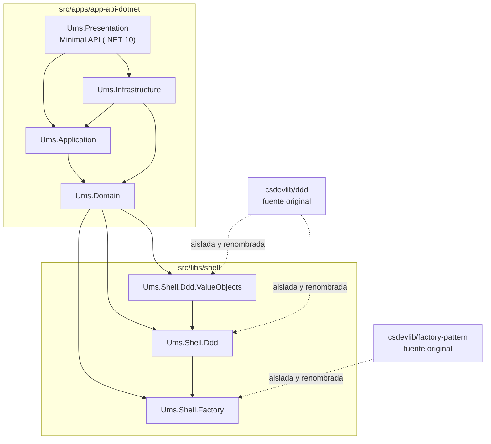

# Arquitectura de Librerías Shell

**Tipo:** Blueprint de Arquitectura  
**Estado:** Aceptado  
**Runtime:** .NET 10 LTS  
**Ubicación en código:** `src/libs/shell`

## Propósito

UMS aísla los patrones reutilizables de implementación en una **Capa de Librerías Shell**. Esta capa encapsula y normaliza código heredado bajo namespaces propios de UMS para que la aplicación use patrones DDD y Factory sin filtrar nombres, estructura de repositorio o detalles internos de la fuente original.

La capa shell no es una carpeta genérica de utilidades. Es una frontera arquitectónica:

- `Ums.Domain` depende de contratos y primitivas shell propiedad de UMS.
- `Ums.Shell.Ddd` encapsula patrones tácticos DDD como entidades, soporte de agregados, eventos de dominio, especificaciones, validación, notificación y convenciones de error/resultado.
- `Ums.Shell.Ddd.ValueObjects` extiende el shell DDD con patrones reutilizables de value objects.
- `Ums.Shell.Factory` provee patrones de creación y resolución usados por el shell DDD y el modelo de dominio.
- Los namespaces heredados de la fuente original no deben aparecer en el código de aplicación UMS.

## Diagrama de Dependencias



## Reglas Arquitectónicas

| Regla | Decisión |
|-------|----------|
| Propiedad de namespace | Las librerías shell usan `Ums.Shell.*`; no se permiten namespaces heredados en el código de aplicación UMS. |
| Runtime base | Las librerías shell apuntan al mismo runtime estable que la API: `net10.0`. |
| Dependencia de dominio | `Ums.Domain` puede referenciar shell libraries, pero no debe referenciar Infrastructure, Presentation, proveedores de persistencia, brokers ni SDKs externos. |
| Encapsulación de patrones | Los detalles DDD y Factory viven centralizados en shell libraries, no copiados en cada bounded context. |
| Estrategia de reemplazo | Si una fuente upstream cambia, UMS adapta el cambio dentro de `src/libs/shell`; las capas de aplicación no deberían cambiar por movimiento interno upstream. |
| Requisito cross-platform | Las referencias de proyecto usan rutas relativas portables y proyectos SDK-style de .NET. No se permiten rutas de build específicas de sistema operativo. |

## Librerías Shell Actuales

| Librería | Responsabilidad | Consumida por |
|----------|-----------------|---------------|
| `Ums.Shell.Factory` | Soporte de patrones Factory y resolución de servicios. | `Ums.Shell.Ddd`, `Ums.Domain` |
| `Ums.Shell.Ddd` | Primitivas y comportamiento táctico DDD. | `Ums.Domain`, `Ums.Shell.Ddd.ValueObjects` |
| `Ums.Shell.Ddd.ValueObjects` | Patrones reutilizables de value objects construidos sobre el shell DDD. | `Ums.Domain` |

## Referencia de Implementación

`Ums.Domain` referencia directamente la capa shell:

```xml
<ProjectReference Include="../../../libs/shell/ddd/src/Ums.Shell.Ddd/Ums.Shell.Ddd.csproj" />
<ProjectReference Include="../../../libs/shell/ddd/src/Ums.Shell.Ddd.ValueObjects/Ums.Shell.Ddd.ValueObjects.csproj" />
<ProjectReference Include="../../../libs/shell/factory/src/Ums.Shell.Factory/Ums.Shell.Factory.csproj" />
```

Esto mantiene el dominio conciso y preserva la dirección de dependencia:

```text
Presentation -> Application -> Domain -> Shell
Infrastructure -> Application / Domain
Shell -> sin dependencia hacia capas de aplicación
```

## Validaciones

- `dotnet build src/apps/app-api-dotnet/Ums.Presentation/Ums.Presentation.csproj`
- `dotnet build src/libs/shell/factory/src/Ums.Shell.Factory.sln`
- `dotnet build src/libs/shell/ddd/src/Ums.Shell.Ddd/Ums.Shell.Ddd.sln`

## Decisiones Relacionadas

- [ADR-0054: Aislamiento de Librerías Shell para Patrones DDD y Factory](../adrs/0054-shell-library-isolation.md)
- [Primitivas DDD](../../governance/construction/ddd-design/11-ddd-primitives.md)
- [Portal de Arquitectura](../index.es.md)

