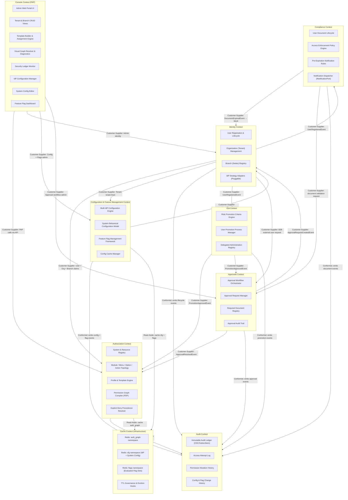

# Bounded Context Map — User Management System (UMS)

This document establishes the formal **Domain-Driven Design (DDD) Bounded Context Map** for the UMS platform. It defines the boundaries of each domain context, their internal responsibilities, and the integration contracts between them.

> [!IMPORTANT]
> This is a **Priority 1 Architectural Deliverable** as established in `architecture-spec.md`. All teams must align to this map before implementing features that cross context boundaries.

---

## Quick Navigation
| Context | Primary Mission | Direct Access |
| :--- | :--- | :--- |
| **Identity** | User and Tenant management. | [View Detail](#-a-identity-context) |
| **Authorization** | Permission Engine and PDP. | [View Detail](#-b-authorization-context) |
| **Configuration** | Flag and override management. | [View Detail](#-c-configuration--feature-management-context-new) |
| **Audit** | Immutable event ledger. | [View Detail](#-d-audit-context) |
| **Console** | Administration interface (PAP). | [View Detail](#-e-console-context-policy-administration-point--pap) |
| **Approvals** | Approval workflow orchestration. | [View Detail](#-f-approvals-context-new) |
| **Cache** | High-performance layer. | [View Detail](#-g-cache-context-infrastructure) |
| **IGA** | Role promotion and delegated administration. | [View Detail](#-h-iga-context-identity-governance--administration) |
| **Compliance** | Document lifecycle and access enforcement. | [View Detail](#-i-compliance-context)
## 1. Context Map Overview

---

## 2. Context Definitions

### A. Identity Context
**Mission:** Manage the lifecycle of all principals (users) and the organizational structures (tenants and branches) they belong to. Delegate credential verification to pluggable, external Identity Providers using configurations supplied by the Configuration Context.

**Owns:**
- `User` aggregate (registration, suspension, offboarding)
- `Organization` (Tenant) aggregate
- `Branch` (Sedes) aggregate
- `IAuthenticationPort` (pluggable IdP strategy adapter — reads from Config Context)

**Does NOT own:**
- Authorization rules or permission logic
- Audit ledger storage
- IdP configuration data (owned by Config Context)

**Integration Contracts (Published Language):**
- `UserRegisteredEvent { userId, organizationId, branchId, identityReference }`
- `UserSuspendedEvent { userId, tenantId }`
- `OrganizationCreatedEvent { tenantId, idpStrategy }`

---

### B. Authorization Context
**Mission:** Act as the **Policy Decision Point (PDP)**. Compile and resolve the hierarchical authorization graph for any authenticated principal based on their organization, branch, profiles, and attached templates.

**Owns:**
- `System` aggregate (registered client applications)
- `Module → Menu → Option → Action` topology (schema: `FUNCTIONAL_MODULE → FUNCTIONAL_SUBMODULE → FUNCTIONAL_OPTION`)
- `Profile` aggregate
- `AuthorizationTemplate` aggregate
- `Authorization` (Allow/Deny records)
- `Permission Graph Compiler` (core engine)
- `Explicit-Deny Precedence` rules engine

**Does NOT own:**
- Identity verification (delegated to Identity Context via port)
- Cache storage (delegated to Cache Context via `ICachePort`)
- Admin UI rendering (delegated to Console Context)
- Feature flag state (delegated to Config Context)

**Integration Contracts (Published Language):**
- `GET /v1/authorization/graph` → returns `HierarchicalJsonGraph`
- `POST /v1/authorization/templates` → creates versioned template
- `PermissionMutatedEvent { userId, profileId, effect, actionId, timestaamp }`

---

### C. Configuration & Feature Management Context *(NEW)*
**Mission:** Govern the **dynamic, multi-tenant runtime behavior** of all UMS-integrated systems without requiring code changes or redeployment. Owns three capability pillars:
1. **Multi-IdP Configuration Engine** — per-tenant/system IdP registry with priority/fallback
2. **System Behavioral Configuration** — versioned JSON config for auth, session, branding, modules
3. **Feature Flag Framework** — centralized, multi-dimensional toggle engine with rollout strategies

**Owns:**
- `IdpConfiguration` aggregate
- `SystemConfiguration` aggregate (versioned)
- `FeatureFlag` aggregate
- `FeatureFlagProviderConfig` aggregate *(per-tenant provider overrides)*
- `FlagEvaluationEngine` (domain service — routes via port)
- `IFeatureFlagPort` (core port — pluggable: Internal, LaunchDarkly, Unleash, ConfigCat, Azure App Config)
- `IConfigCachePort` (infrastructure port — separate from auth graph cache)
- `ISecretStorePort` (infrastructure port — vault-referenced credentials)

**Does NOT own:**
- User or organization identities (scopes them as foreign keys only)
- Permission graphs (belongs to Authorization Context)
- Admin UI (belongs to Console Context)

**Integration Contracts (Published Language):**
- `GET /v1/config/idp?tenant_id&system_id` → returns ordered IdP config set
- `GET /v1/config/system/{system_id}?tenant_id` → returns active system config
- `GET /v1/config/app?tenant_id&code` → returns app configuration value (with inheritance chain)
- `POST /v1/config/app` → creates/updates app config (versioned, tenant/system-scoped)
- `GET /v1/config/app/hierarchy?tenant_id&code` → explains inheritance chain (tenant → system → global)
- `POST /v1/flags/evaluate` → returns evaluated flag set for a runtime context
- `IdpConfigUpdatedEvent { configId, tenantId, version, timestamp }`
- `SystemConfigPublishedEvent { configId, systemId, tenantId, version }`
- `AppConfigUpdatedEvent { configId, tenantId, systemId, code, version, timestamp }`
- `FeatureFlagStateChangedEvent { flagCode, newStatus, targetScope, changedBy }`

---

### D. Audit Context
**Mission:** Maintain an **immutable, tamper-proof ledger** of all identity events, permission mutations, configuration changes, approval decisions, document lifecycle events, and role promotions. Serves compliance, forensic, and SRE diagnostic needs.

**Owns:**
- `AuditRecord` entity (who, when, what, result)
- `AccessAttemptLog` (authentication success/failure)
- `PermissionMutationHistory` (ALLOW/DENY changes)
- `ConfigChangeHistory` (IdP config, system config, feature flag mutations) *(NEW)*
- `ApprovalAuditLog` (approval request creation, resolution, decisions) *(NEW)*
- `DocumentLifecycleHistory` (document upload, validation, expiration, enforcement) *(NEW)*
- `RolePromotionAuditLog` (promotion criteria evaluation, approvals, status transitions) *(NEW)*

**Integration Pattern:** Event-driven subscriber (Conformist). Receives events from all business contexts (Identity, Authorization, Configuration, Approvals, Compliance, IGA) via internal event bus (`IEventBusPort`).

**Published Events Consumed:**
- From Identity: `UserRegisteredEvent`, `UserSuspendedEvent`, `OrganizationCreatedEvent`
- From Authorization: `PermissionMutatedEvent`
- From Configuration: `IdpConfigUpdatedEvent`, `SystemConfigPublishedEvent`, `AppConfigUpdatedEvent`, `FeatureFlagStateChangedEvent`
- From Approvals: `ApprovalRequestCreatedEvent`, `ApprovalResolvedEvent`
- From Compliance: `DocumentExpiredEvent`, `DocumentValidatedEvent`, `NotificationSentEvent`
- From IGA: `PromotionCriteriaMetEvent`, `PromotionApprovedEvent`

---

### E. Console Context (Policy Administration Point — PAP)
**Mission:** Provide the **Administrative Web Portal** that allows SuperAdmins and Tenant Managers to govern organizations, systems, profiles, templates, IdP configurations, system configs, and feature flags.

**Owns:**
- Admin Web Portal (React SPA)
- Template Builder UI & Automated Assignment Rule Configurator
- Visual Graph Resolver
- **IdP Configuration Manager** *(NEW)*
- **System Config Editor** *(NEW)*
- **Feature Flag Dashboard** *(NEW)*

**Integration Pattern:** Customer-Supplier. Calls all backend contexts via their published REST APIs. Authenticates using the same UMS AuthGateway with a `SuperAdmin`-scoped `system_id`.

---

### F. Approvals Context *(NEW)*
**Mission:** Orchestrate and manage approval workflows for B2B external access requests, document validation, and role promotion processes. Act as the central point of control for all multi-step authorization and compliance decisions.

**Schema DB:** `[ums_approval]`
**Owner Service:** UMS Core API (.NET 8)

**Owns:**
- `ApprovalWorkflow` aggregate (defines approval routing, required steps, approver roles)
- `ApprovalRequest` aggregate (status: `PENDING → APPROVED | REJECTED`)
- `ApprovalRequiredDocument` entity (document type requirements linked to workflows)
- `ApprovalLog` entity (immutable decision record: who, when, what, decision, reason)
- `IApprovalRouterPort` (core port — routes requests to correct approvers based on scope)

**Does NOT own:**
- Document storage (owned by Compliance Context)
- User identity (owned by Identity Context)
- Role definitions or profile assignment (owned by Authorization Context)
- Audit ledger (owned by Audit Context)

**Integration Contracts (Published Language):**
- `POST /v1/approvals/workflows` → create or update approval workflow
- `POST /v1/approvals/request` → submit approval request (B2B, document validation, promotion)
- `PATCH /v1/approvals/request/{requestId}` → approve/reject with decision and reason
- `GET /v1/approvals/request/{requestId}` → retrieve request status and decision
- `GET /v1/approvals/pending?tenant_id&role=approver` → list pending approvals by approver
- `ApprovalRequestCreatedEvent { requestId, workflowId, targetUserId, targetProfileId, requestType, timestamp }`
- `ApprovalResolvedEvent { requestId, decision, approvedBy, reason, timestamp }`
- `ApprovalRejectedEvent { requestId, rejectionReason, rejectedBy, timestamp }`

**Integration Pattern:** Customer-Supplier (upstream from Identity, Compliance, IGA). Publishes approval events to Identity and Authorization for provisioning/profile updates. Conformist to Audit for all decisions.

---

### G. Cache Context (Infrastructure)
**Mission:** Provide a high-performance distributed cache layer for authorization graphs, system configurations, and feature flag evaluations — all under strict namespace governance.

**Cache Namespaces:**
| Namespace | Owner Context | Key Pattern | TTL |
| :--- | :--- | :--- | :--- |
| `auth_graph:*` | Authorization Context | `auth_graph:{userId}:{systemId}:{tenantId}:{branchId}` | 3600s |
| `cfg:idp:*` | Configuration Context | `cfg:idp:{tenantId}:{systemId}` | 900s |
| `cfg:sys:*` | Configuration Context | `cfg:sys:{systemId}:{tenantId}` | 300s |
| `flags:*` | Configuration Context | `flags:{systemId}:{tenantId}:{userId}` | 60s |

**Integration Pattern:** Hidden behind pure core port abstractions (`ICachePort`, `IConfigCachePort`). Only infrastructure adapters interact with Redis directly.

---

### H. IGA Context (Identity Governance & Administration)
**Mission:** Govern the complete lifecycle of role evolution, user promotion processes, and delegated user administration. Acts as the rules engine that evaluates promotion criteria and orchestrates approval workflows for role advancement.

**Schema DB:** `ums_iga`
**Owner Service:** .NET 8 Core API (migrated from NestJS satellite — ADR-0041 in progress)

**Owns:**
- `RolePromotionCriteria` aggregate (seniority thresholds, document flags, custom rules)
- `UserPromotionProcess` aggregate (status: `EVALUATING → CRITERIA_MET → PENDING_APPROVAL → PROMOTED`)
- `UserManagementDelegation` entity (admin scope with optional SuiteId restriction)
- `IPromotionEvaluatorPort` (core port — background worker abstraction)

**Does NOT own:**
- Role definitions (owned by Authorization Context)
- User identity (owned by Identity Context)
- Notification delivery (owned by Compliance Context)

**Integration Contracts (Published Language):**
- `POST /v1/iga/promotion/evaluate` → triggers criteria evaluation for a user
- `GET /v1/iga/promotion/pending` → list promotions awaiting approval
- `PromotionCriteriaMetEvent { userId, roleId, processId, timestamp }`
- `PromotionApprovedEvent { userId, fromRoleId, toRoleId, approvedBy, timestamp }`

**Integration Pattern:** Receives `UserRegisteredEvent` from Identity Context. Publishes `PromotionApprovedEvent` consumed by Authorization Context (to update Profile) and Identity Context (to update user status).

---

### I. Compliance Context
**Mission:** Enforce document-based access policies for all users. Manages the complete lifecycle of user documents, evaluates expiration status, dispatches configurable pre-expiration notifications, and triggers automated enforcement actions (block, downgrade, notify-only, suspend) upon expiration.

**Schema DB:** `ums_compliance`
**Owner Service:** .NET 8 Core API (migrated from NestJS satellite — ADR-0041 in progress)

**Owns:**
- `UserDocument` aggregate (status: `PENDING_REVIEW → VALID | REJECTED | EXPIRED`)
- `AccessEnforcementPolicy` entity (ActionOnExpiration: `BLOCK_ACCESS | NOTIFY_ONLY | DOWNGRADE_ROLE | SUSPEND`)
- `NotificationRule` entity (N-step pre-expiration alerts via Channel: `EMAIL | SMS | IN_APP | WEBHOOK`)
- `AccessNotification` entity (dispatched notification audit record)
- `INotificationPort` (core port — pluggable: SMTP, Twilio, Webhook)
- `IDocumentStoragePort` (core port — MinIO S3-compatible adapter)

**Does NOT own:**
- User identity or blocking authority (delegates `UserBlockedEvent` to Identity Context)
- Approval workflow orchestration (owned by Approvals Context)
- Audit ledger (owned by Audit Context)

**Integration Contracts (Published Language):**
- `POST /v1/compliance/documents` → upload user document
- `GET /v1/compliance/documents/{userId}/status` → document compliance summary
- `POST /v1/compliance/documents/{documentId}/validate` → validate or reject document
- `DocumentExpiredEvent { userId, documentId, criticity, enforcementAction, timestamp }`
- `DocumentValidatedEvent { userId, documentId, validatedBy, timestamp }`
- `NotificationSentEvent { userId, documentId, channel, timestamp }`

**Integration Pattern:** Receives `UserRegisteredEvent` from Identity to initialize document tracking. Publishes `DocumentExpiredEvent` (triggers enforcement in Identity), `DocumentValidatedEvent`, and sends notifications via `INotificationPort`. Sends all document/notification events to Audit Context (Conformist).

---

## 3. Context Relationships

| Upstream Context | Downstream Context | Pattern | Contract |
| :--- | :--- | :--- | :--- |
| Identity Context | Authorization Context | **Customer-Supplier** | User/Org/Branch claims pushed as events or queried via API |
| Identity Context | Config Context | **Customer-Supplier** | Tenant scope keys used for config isolation |
| Identity Context | Approvals Context | **Customer-Supplier** | B2B user registration requests trigger approval workflows |
| Config Context | Identity Context | **Customer-Supplier** | IdP config supplied to Auth Gateway for routing |
| Authorization Context | Audit Context | **Conformist (Event)** | Publishes `PermissionMutatedEvent` |
| Identity Context | Audit Context | **Conformist (Event)** | Publishes `UserRegisteredEvent`, `UserSuspendedEvent`, `OrganizationCreatedEvent` |
| Config Context | Audit Context | **Conformist (Event)** | Publishes `IdpConfigUpdatedEvent`, `SystemConfigPublishedEvent`, `AppConfigUpdatedEvent`, `FeatureFlagStateChangedEvent` |
| Console Context | Authorization Context | **Customer-Supplier** | PAP calls Authorization APIs for template/profile management |
| Console Context | Identity Context | **Customer-Supplier** | PAP calls Identity APIs for org/branch management |
| Console Context | Config Context | **Customer-Supplier** | PAP calls Config APIs for IdP, system config, and flag management |
| Console Context | Approvals Context | **Customer-Supplier** | PAP admin calls Approvals APIs for workflow management and decision review |
| Authorization Context | Cache Context | **Shared Kernel (ICachePort)** | Read-aside; invalidation on mutation events |
| Config Context | Cache Context | **Shared Kernel (IConfigCachePort)** | Read-aside for cfg + flags; invalidation on config events |
| Identity Context | IGA Context | **Customer-Supplier** | Publishes `UserRegisteredEvent` consumed by IGA to initialize promotion tracking |
| Identity Context | Compliance Context | **Customer-Supplier** | Publishes `UserRegisteredEvent` consumed by Compliance to initialize document tracking |
| IGA Context | Authorization Context | **Customer-Supplier** | Publishes `PromotionApprovedEvent` consumed by Authorization to update Profile |
| IGA Context | Approvals Context | **Customer-Supplier** | Role promotion decisions require approval workflow |
| IGA Context | Audit Context | **Conformist (Event)** | Publishes `PromotionCriteriaMetEvent`, `PromotionApprovedEvent` |
| Approvals Context | Identity Context | **Customer-Supplier** | Publishes `ApprovalRequestCreatedEvent`, `ApprovalResolvedEvent` for B2B provisioning |
| Approvals Context | Authorization Context | **Customer-Supplier** | Publishes approval events for profile/role assignment based on decisions |
| Approvals Context | Audit Context | **Conformist (Event)** | Publishes `ApprovalRequestCreatedEvent`, `ApprovalResolvedEvent`, `ApprovalRejectedEvent` |
| Compliance Context | Identity Context | **Customer-Supplier** | Publishes `DocumentExpiredEvent` triggering BLOCK_ACCESS in Identity |
| Compliance Context | Approvals Context | **Customer-Supplier** | Document validation requests trigger approval workflows |
| Compliance Context | Audit Context | **Conformist (Event)** | Publishes `DocumentExpiredEvent`, `DocumentValidatedEvent`, `NotificationSentEvent`
## 4. Anti-Corruption Layers (ACL)

| Boundary | ACL Mechanism | Reason |
| :--- | :--- | :--- |
| Authorization ↔ External IdP | `IAuthenticationPort` (Strategy Pattern) | Prevents Zitadel/Okta SDK from polluting core |
| Config ↔ Feature Flag Providers | `IFeatureFlagPort` (Strategy Pattern) | Prevents LaunchDarkly/Unleash/ConfigCat SDKs from coupling to core. Mirrors IAuthenticationPort design (ADR-0025). |
| Config ↔ Secret Vault | `ISecretStorePort` (Strategy Pattern) | Prevents AWS Secrets Manager / HashiCorp Vault SDK from leaking into domain |
| Config ↔ Redis (cfg/flags) | `IConfigCachePort` | Separate port from auth graph cache to enforce namespace governance |
| Authorization ↔ Redis (auth_graph) | `ICachePort` | Prevents Redis client from leaking into domain layer |
| Authorization ↔ Event Bus | `IEventBusPort` | Prevents Kafka/RabbitMQ from coupling to use cases |
| Approvals ↔ Approver Notification | `IApprovalRouterPort` (Strategy Pattern) | Routes approval requests to correct approvers; prevents tight coupling to notification mechanism |
| Console ↔ UMS APIs | REST API contracts (versioned) | Console is an external consumer; treated as any third party |
| Compliance ↔ Notification Providers | `INotificationPort` (Strategy Pattern) | Prevents SMTP/Twilio SDKs from coupling to domain |
| Compliance ↔ Object Storage | `IDocumentStoragePort` (Strategy Pattern) | Prevents MinIO/S3 SDK from leaking into domain |