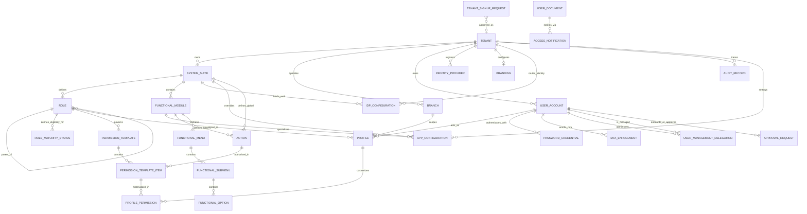
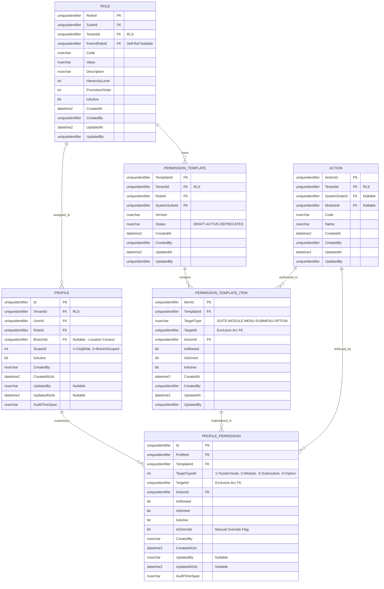
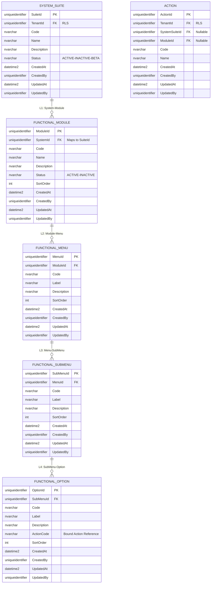

# Entity-Relationship (E/R) Model - SQL Server 2022

**Document Type:** Database Design  
**Status:** Refactored (Role-Scoped & Strict Hierarchy)  
**Architecture:** Hierarchical Master Framework (5-Level Control)  
**Engine:** SQL Server 2022

## 1. Introduction
This document details the **Role-Scoped** authorization model, strictly enforcing the hierarchical chain: **System → Module → Menu → SubMenu → Option**.

All entity attribute blocks are derived directly from the domain `*Props` classes in `Ums.Domain`, ensuring the diagram reflects the authoritative data model.

> [!NOTE]
> **Ubiquitous Language Mapping:** The schema entity names align with the [Glossary](../../governance/requirements/glossary.md) as follows:
> `SYSTEM_SUITE` = **System** · `FUNCTIONAL_MODULE` = **Module** · `FUNCTIONAL_MENU` = **Menu** · `FUNCTIONAL_SUBMENU` = **SubMenu** · `FUNCTIONAL_OPTION` = **Option**

> [!TIP]
> **Visualization Issues?**  
> If Mermaid diagrams do not render correctly in your IDE, please use the **[ Alternative Export Formats (dbdiagram.io, DDL, D2)](./er-export-formats.md)**. These formats are compatible with professional tools like DBeaver, SSMS, and dbdiagram.io.

---

## 2. Standard Corporate Audit & Traceability
All entities (except append-only logs) implement the standard audit schema — four columns derived from `AuditValueObject`:

| Column | Type | Description |
|---|---|---|
| `CreatedAt` | `datetime2` | UTC timestamp of creation |
| `CreatedBy` | `uniqueidentifier` | Actor who created the record |
| `UpdatedAt` | `datetime2` | UTC timestamp of last update |
| `UpdatedBy` | `uniqueidentifier` | Actor who last updated the record |

Append-only entities (`AUDIT_RECORD`, `FLAG_EVALUATION_LOG`, `ACCESS_NOTIFICATION`) do not include update columns — they are immutable by design.

## 2.1 Onboarding Data Alignment

The onboarding model is split across existing bounded contexts:

| Flow | Implemented Persistence Source | Current Code Status | EP-09 Business Outcome |
|---|---|---|---|
| Tenant signup | `identity.TenantSignupRequests` | Implemented with `Pending`, `Approved`, `Rejected` status values; approval command implemented. | Global request can be approved; denial uses the reserved `Rejected` value until a dedicated command is added. |
| User signup | `identity.UserAccounts` with `StatusId = Pending` | Implemented as pending user account; activation command implemented. | Tenant Admin must close as Approved or Denied; denial command and lifecycle reason are required extensions. |
| Profile access request | `approvals.ApprovalRequests` | Implemented generic request with `Pending`, `Approved`, `Rejected`. | `Rejected` maps to the business outcome `Denied`; requested/granted role separation is a required extension for FS-23/FS-24. |

`ActiveWithoutProfile` is not a stored `UserStatus`. It is a derived login state: `UserAccount.Status = Active` and no active `Profile` exists for the resolved authorization scope.

---

## 3. Modular Domain Views

### 3.1 Global High-Level Map
Full Resolution Path: `Tenant -> System -> Role -> Template -> ProfilePermission`.

---

### 3.2 Domain: Role-Centric Authority & Strict Hierarchy
This domain ensures every permission is scoped to a Role and maps exactly to the 5-level functional hierarchy.

---

### 3.3 Domain: Functional Topology (The 5 Levels)
Organizational structure of resources.

---

### 3.4 Domain: Identity Governance & Approvals
Management of user lifecycle, credential management, delegated administration, document workflows, and IGA role promotions.

```mermaid
erDiagram
    TENANT ||--o{ USER_ACCOUNT : "owns"
    TENANT_SIGNUP_REQUEST }o--o| TENANT : "approved_as"
    TENANT ||--o{ BRANCH : "operates"
    TENANT ||--o{ IDENTITY_PROVIDER : "registers"
    TENANT ||--o| BRANDING : "configures"
    USER_ACCOUNT ||--o{ PASSWORD_CREDENTIAL : "authenticates_with"
    USER_ACCOUNT ||--o{ MFA_ENROLLMENT : "enrolls_mfa"
    USER_ACCOUNT ||--o{ USER_MANAGEMENT_DELEGATION : "admin"
    USER_ACCOUNT ||--o{ USER_MANAGEMENT_DELEGATION : "managed"
    USER_ACCOUNT ||--o{ ROLE_MATURITY_STATUS : "has"
    ROLE ||--o{ ROLE_MATURITY_STATUS : "defines_eligibility"
    APPROVAL_WORKFLOW ||--o{ APPROVAL_REQUEST : "defines_rules_for"
    APPROVAL_WORKFLOW ||--o{ APPROVAL_REQUIRED_DOCUMENT : "mandates"
    APPROVAL_REQUEST ||--o{ USER_DOCUMENT : "evidenced_by"
    APPROVAL_REQUIRED_DOCUMENT ||--o{ DOCUMENT_TYPE : "typed_as"
    USER_ACCOUNT ||--o{ USER_DOCUMENT : "holds"
    DOCUMENT_TYPE ||--o{ USER_DOCUMENT : "classifies"
    TENANT ||--o{ NOTIFICATION_RULE : "routes_alerts"
    DOCUMENT_TYPE ||--o{ ACCESS_ENFORCEMENT_POLICY : "governs_access"
    USER_DOCUMENT ||--o{ ACCESS_NOTIFICATION : "notifies_via"
    USER_ACCOUNT ||--o{ PROMOTION_REQUEST : "initiates"
    ROLE ||--o{ PROMOTION_REQUEST : "target"
    APPROVAL_REQUEST ||--o{ PROMOTION_REQUEST : "authorized_by"
    PROMOTION_REQUEST ||--o{ PROMOTION_IMPACT_ANALYSIS : "evaluates_risk"

    TENANT {
        uniqueidentifier TenantId PK
        nvarchar Code
        nvarchar Name
        nvarchar Type "ENTERPRISE-SMB-GOVERNMENT-PARTNER"
        nvarchar IdpStrategy "LOCAL-FEDERATED-HYBRID"
        nvarchar CompanyReference "Nullable - External CRM Reference"
        uniqueidentifier ParentTenantId FK "Nullable - Tenant Hierarchy"
        nvarchar Status "ACTIVE-SUSPENDED-INACTIVE"
        datetime2 CreatedAt
        uniqueidentifier CreatedBy
        datetime2 UpdatedAt
        uniqueidentifier UpdatedBy
    }

    TENANT_SIGNUP_REQUEST {
        uniqueidentifier Id PK
        nvarchar CompanyName
        nvarchar CompanyReference "Unique"
        nvarchar ContactName
        nvarchar ContactEmail
        int StatusId "1=Pending, 2=Approved, 3=Rejected"
        uniqueidentifier ApprovedTenantId FK "Nullable"
        nvarchar CreatedBy
        datetime2 CreatedAtUtc
        nvarchar UpdatedBy "Nullable"
        datetime2 UpdatedAtUtc "Nullable"
        nvarchar AuditTimeSpan
        rowversion RowVersion
    }

    USER_ACCOUNT {
        uniqueidentifier Id PK
        uniqueidentifier TenantId FK "RLS"
        uniqueidentifier BranchId FK "Nullable"
        nvarchar Email
        nvarchar DisplayName "Nullable"
        int CategoryId "UserCategory"
        int StatusId "1=Pending, 2=Active, 3=Blocked, 4=Deleted"
        nvarchar IdentityReference "Nullable - external authoritative reference"
        int IdentityReferenceTypeId "Nullable"
        nvarchar CreatedBy
        datetime2 CreatedAtUtc
        nvarchar UpdatedBy "Nullable"
        datetime2 UpdatedAtUtc "Nullable"
        nvarchar AuditTimeSpan
        rowversion RowVersion
        bit IsDeleted
        datetime2 DeletedAtUtc "Nullable"
        nvarchar DeletedBy "Nullable"
        datetime2 AnonymizedAtUtc "Nullable"
    }

    BRANCH {
        uniqueidentifier BranchId PK
        uniqueidentifier TenantId FK
        nvarchar Code
        nvarchar Name
        nvarchar GeofencingMetadata "Nullable - JSON Coordinates"
        bit IsActive
        datetime2 CreatedAt
        uniqueidentifier CreatedBy
        datetime2 UpdatedAt
        uniqueidentifier UpdatedBy
    }

    IDENTITY_PROVIDER {
        uniqueidentifier IdpId PK
        uniqueidentifier TenantId FK
        nvarchar Code
        nvarchar Name
        nvarchar Description
        nvarchar Strategy "OIDC-SAML2-WS_FED"
        bit IsActive
        datetime2 CreatedAt
        uniqueidentifier CreatedBy
        datetime2 UpdatedAt
        uniqueidentifier UpdatedBy
    }

    BRANDING {
        uniqueidentifier BrandingId PK
        uniqueidentifier TenantId FK "One-to-One RLS"
        nvarchar Logo "URI Storage Path"
        nvarchar LogoFormat "PNG-SVG-JPEG"
        nvarchar PrimaryColor "Hex Color Code"
        nvarchar BackgroundStyle "Glassmorphism-SleekDark"
        nvarchar HeadlineText
        nvarchar SecondaryText
        nvarchar PrimaryButtonLabel
        nvarchar FooterText
        nvarchar CustomDomain "Nullable"
        nvarchar DnsVerificationStatus "PENDING-VERIFIED-FAILED"
        nvarchar DnsCnameTarget
        bit MagicLinkFallbackEnabled
        datetime2 CreatedAt
        uniqueidentifier CreatedBy
        datetime2 UpdatedAt
        uniqueidentifier UpdatedBy
    }

    PASSWORD_CREDENTIAL {
        uniqueidentifier CredentialId PK
        uniqueidentifier UserAccountId FK
        nvarchar PasswordHash "BCrypt Hash"
        bit IsActive
        datetime2 CreatedAt
        uniqueidentifier CreatedBy
        datetime2 UpdatedAt
        uniqueidentifier UpdatedBy
    }

    MFA_ENROLLMENT {
        uniqueidentifier MfaEnrollmentId PK
        uniqueidentifier UserAccountId FK
        nvarchar Method "TOTP-SMS-EMAIL-WEBAUTHN"
        nvarchar Status "NOT_ENROLLED-ENROLLED-VERIFIED"
        datetime2 CreatedAt
        uniqueidentifier CreatedBy
        datetime2 UpdatedAt
        uniqueidentifier UpdatedBy
    }

    ROLE {
        uniqueidentifier RoleId PK
        uniqueidentifier SuiteId FK
        uniqueidentifier TenantId FK "RLS"
        uniqueidentifier ParentRoleId FK "Self-Ref Nullable"
        nvarchar Code
        nvarchar Value
        nvarchar Description
        int HierarchyLevel
        int PromotionOrder
        bit IsActive
        datetime2 CreatedAt
        uniqueidentifier CreatedBy
        datetime2 UpdatedAt
        uniqueidentifier UpdatedBy
    }

    ROLE_MATURITY_STATUS {
        uniqueidentifier MaturityStatusId PK
        uniqueidentifier TenantId FK "RLS"
        uniqueidentifier UserId FK
        uniqueidentifier RoleId FK
        nvarchar CurrentMaturityLevel "JUNIOR-INTERMEDIATE-SENIOR-LEAD-PRINCIPAL"
        nvarchar NextEligibleMaturityLevel "Nullable"
        datetime2 AssignedAt
        datetime2 CurrentLevelSince
        datetime2 EligibleForPromotionAt "Nullable"
        int CompletedCertificationsCount
        int CompletedTrainingsCount
        decimal PerformanceScore
        bit HasNoComplianceIssues
        nvarchar BlockingFactor "Nullable"
        datetime2 LastReviewedAt "Nullable"
        datetime2 CreatedAt
        uniqueidentifier CreatedBy
        datetime2 UpdatedAt
        uniqueidentifier UpdatedBy
    }

    USER_MANAGEMENT_DELEGATION {
        uniqueidentifier DelegationId PK
        uniqueidentifier ParentAdminUserId FK
        uniqueidentifier ManagedUserId FK
        uniqueidentifier SuiteId FK "Nullable - Optional Scope"
    }

    APPROVAL_WORKFLOW {
        uniqueidentifier WorkflowId PK
        uniqueidentifier TenantId FK
        uniqueidentifier SystemSuiteId FK "Nullable"
        nvarchar Code
        nvarchar Name
        nvarchar Description
        nvarchar TargetUserCategory "INTERNAL-EXTERNAL-B2B-PARTNER"
        bit RequiresApproval
        datetime2 CreatedAt
        uniqueidentifier CreatedBy
        datetime2 UpdatedAt
        uniqueidentifier UpdatedBy
    }

    APPROVAL_REQUIRED_DOCUMENT {
        uniqueidentifier RequiredDocId PK
        uniqueidentifier WorkflowId FK
        uniqueidentifier DocumentTypeId FK
        bit IsMandatory
        datetime2 CreatedAt
        uniqueidentifier CreatedBy
        datetime2 UpdatedAt
        uniqueidentifier UpdatedBy
    }

    APPROVAL_REQUEST {
        uniqueidentifier Id PK
        uniqueidentifier WorkflowId FK
        uniqueidentifier TargetUserId FK
        uniqueidentifier TargetProfileId FK "Nullable"
        int StatusId "1=Pending, 2=Approved, 3=Rejected"
        nvarchar CreatedBy
        datetime2 CreatedAtUtc
        nvarchar UpdatedBy "Nullable"
        datetime2 UpdatedAtUtc "Nullable"
        nvarchar AuditTimeSpan
        rowversion RowVersion
    }

    DOCUMENT_TYPE {
        uniqueidentifier DocumentTypeId PK
        uniqueidentifier TenantId FK
        nvarchar Code
        nvarchar Name
        nvarchar Description
        nvarchar Criticity "LOW-MEDIUM-HIGH-CRITICAL"
        datetime2 CreatedAt
        uniqueidentifier CreatedBy
        datetime2 UpdatedAt
        uniqueidentifier UpdatedBy
    }

    NOTIFICATION_RULE {
        uniqueidentifier RuleId PK
        uniqueidentifier TenantId FK
        nvarchar Channel "EMAIL-IN_APP-SMS"
        nvarchar Recipient
        bit IsActive
        nvarchar Code "Recommended future catalog key"
        nvarchar Value "Recommended future operational payload"
        nvarchar Description "Recommended purpose, impact, behavior and scope"
        datetime2 CreatedAt
        uniqueidentifier CreatedBy
        datetime2 UpdatedAt
        uniqueidentifier UpdatedBy
    }

    ACCESS_ENFORCEMENT_POLICY {
        uniqueidentifier PolicyId PK
        uniqueidentifier TenantId FK
        uniqueidentifier ProfileId FK "Nullable"
        uniqueidentifier RoleId FK "Nullable"
        nvarchar EnforcementAction "BLOCK_USER-RESTRICT_PROFILE-LOG_ONLY"
        bit IsActive
        datetime2 CreatedAt
        uniqueidentifier CreatedBy
        datetime2 UpdatedAt
        uniqueidentifier UpdatedBy
    }

    USER_DOCUMENT {
        uniqueidentifier DocumentId PK
        uniqueidentifier UserId FK
        uniqueidentifier DocumentTypeId FK
        datetime2 IssueDate
        datetime2 ExpirationDate
        nvarchar Status "PENDING_REVIEW-VALID-EXPIRED-PENDING_RENEWAL"
        nvarchar Criticity "LOW-MEDIUM-HIGH-CRITICAL"
        nvarchar FileStoragePath "URI Path to File Server"
        nvarchar FileChecksum "Integrity Verification Hash"
        int NotificationStep "Current Alert Step Index"
        datetime2 CreatedAt
        uniqueidentifier CreatedBy
        datetime2 UpdatedAt
        uniqueidentifier UpdatedBy
    }

    ACCESS_NOTIFICATION {
        uniqueidentifier NotificationId PK
        uniqueidentifier UserDocumentId FK
        int Step "Notification Step Number"
        nvarchar Channel "EMAIL-IN_APP-SMS"
        int DaysRemaining "Days Until Expiration"
        datetime2 SentAt "Append-Only"
    }

    PROMOTION_REQUEST {
        uniqueidentifier PromotionRequestId PK
        uniqueidentifier TenantId FK
        uniqueidentifier UserId FK
        uniqueidentifier CurrentRoleId FK
        uniqueidentifier TargetRoleId FK
        datetime2 RequestedAt
        uniqueidentifier RequestedBy "Actor Who Initiated"
        nvarchar RequestReason "Nullable"
        uniqueidentifier ManagerId FK
        nvarchar ManagerApprovalStatus "PENDING-APPROVED-REJECTED"
        datetime2 ManagerDecisionAt "Nullable"
        nvarchar SecurityApprovalStatus "PENDING-APPROVED-REJECTED"
        datetime2 SecurityDecisionAt "Nullable"
        nvarchar Status "DRAFT-SUBMITTED-APPROVED-EXECUTED-VERIFIED"
        datetime2 ExecutedAt "Nullable"
        uniqueidentifier ExecutedBy "Nullable"
        datetime2 VerifiedAt "Nullable"
        datetime2 CreatedAt
        uniqueidentifier CreatedBy
        datetime2 UpdatedAt
        uniqueidentifier UpdatedBy
    }

    PROMOTION_IMPACT_ANALYSIS {
        uniqueidentifier ImpactAnalysisId PK
        uniqueidentifier PromotionRequestId FK
        decimal RiskScore
        nvarchar RiskLevel "LOW-MEDIUM-HIGH-CRITICAL"
        int NewPermissionsCount
        int RemovedPermissionsCount
        int AffectedSystemsCount
        nvarchar ConflictingPermissions "Nullable - JSON List"
        nvarchar RiskFactors "Nullable - JSON List"
        nvarchar SuggestedMitigations "Nullable - JSON List"
        datetime2 AnalyzedAt
        nvarchar AnalyzedBy "Nullable - Analyzer Identity"
        datetime2 CreatedAt
        uniqueidentifier CreatedBy
        datetime2 UpdatedAt
        uniqueidentifier UpdatedBy
    }
```

---

### 3.5 Domain: Platform Configuration & System Auditing
This domain covers system-wide configuration, OIDC Identity Provider integrations, multi-dimensional Feature Flag controls, and the immutable append-only ledger for all system actions.

```mermaid
erDiagram
    TENANT ||--o{ IDP_CONFIGURATION : "configures_auth"
    TENANT ||--o{ AUDIT_RECORD : "records_actions"
    TENANT ||--o{ APP_CONFIGURATION : "parameterizes"
    SYSTEM_SUITE ||--o{ APP_CONFIGURATION : "overrides"
    SYSTEM_SUITE ||--o{ IDP_CONFIGURATION : "binds_auth"
    FUNCTIONAL_MODULE ||--o{ APP_CONFIGURATION : "specializes"
    FEATURE_FLAG ||--o{ FLAG_EVALUATION_LOG : "evaluates"
    USER_ACCOUNT ||--o{ FLAG_EVALUATION_LOG : "triggers"
    USER_ACCOUNT ||--o{ AUDIT_RECORD : "initiates"

    TENANT {
        uniqueidentifier TenantId PK
        nvarchar Code
        nvarchar Name
        nvarchar Type "ENTERPRISE-SMB-GOVERNMENT-PARTNER"
        nvarchar IdpStrategy "LOCAL-FEDERATED-HYBRID"
        nvarchar CompanyReference "Nullable - External CRM Reference"
        uniqueidentifier ParentTenantId FK "Nullable - Tenant Hierarchy"
        nvarchar Status "ACTIVE-SUSPENDED-INACTIVE"
        datetime2 CreatedAt
        uniqueidentifier CreatedBy
        datetime2 UpdatedAt
        uniqueidentifier UpdatedBy
    }

    SYSTEM_SUITE {
        uniqueidentifier SuiteId PK
        uniqueidentifier TenantId FK "RLS"
        nvarchar Code
        nvarchar Name
        nvarchar Description
        nvarchar Status "ACTIVE-INACTIVE-BETA"
        datetime2 CreatedAt
        uniqueidentifier CreatedBy
        datetime2 UpdatedAt
        uniqueidentifier UpdatedBy
    }

    USER_ACCOUNT {
        uniqueidentifier Id PK
        uniqueidentifier TenantId FK "RLS"
        uniqueidentifier BranchId FK "Nullable"
        nvarchar Email
        nvarchar DisplayName "Nullable"
        int CategoryId "UserCategory"
        int StatusId "1=Pending, 2=Active, 3=Blocked, 4=Deleted"
        nvarchar IdentityReference "Nullable - external authoritative reference"
        int IdentityReferenceTypeId "Nullable"
        nvarchar CreatedBy
        datetime2 CreatedAtUtc
        nvarchar UpdatedBy "Nullable"
        datetime2 UpdatedAtUtc "Nullable"
        nvarchar AuditTimeSpan
        rowversion RowVersion
        bit IsDeleted
        datetime2 DeletedAtUtc "Nullable"
        nvarchar DeletedBy "Nullable"
        datetime2 AnonymizedAtUtc "Nullable"
    }

    APP_CONFIGURATION {
        uniqueidentifier ConfigId PK
        uniqueidentifier TenantId FK "Nullable"
        uniqueidentifier SystemSuiteId FK "Nullable"
        uniqueidentifier ModuleId FK "Nullable"
        nvarchar Code
        nvarchar Value "Operational Value"
        nvarchar Description "Purpose - Impact - Behavior - Scope"
        nvarchar Scope "GLOBAL-TENANT-SUITE-MODULE"
        bit IsInheritable
        bit IsEncrypted
        nvarchar Version "Semantic Version e.g. 1.0.0"
        nvarchar Status "DRAFT-PUBLISHED-ARCHIVED"
        datetime2 CreatedAt
        uniqueidentifier CreatedBy
        datetime2 UpdatedAt
        uniqueidentifier UpdatedBy
    }

    IDP_CONFIGURATION {
        uniqueidentifier IdpConfigId PK
        uniqueidentifier TenantId FK
        uniqueidentifier SystemSuiteId FK
        nvarchar ProviderType "INTERNAL_BCRYPT-ZITADEL-AZURE_AD-OKTA-KEYCLOAK"
        nvarchar DomainHints "JSON Array - OIDC Domain Routing"
        nvarchar ConfigPayload "Encrypted Authorization Metadata"
        nvarchar SecretRef "Vault Path"
        nvarchar Status "DRAFT-ACTIVE-INACTIVE"
        int ResolutionPriority
        uniqueidentifier FallbackToId "Nullable - Fallback Config FK"
        int Version
        datetime2 CreatedAt
        uniqueidentifier CreatedBy
        datetime2 UpdatedAt
        uniqueidentifier UpdatedBy
    }

    FEATURE_FLAG {
        uniqueidentifier FlagId PK
        nvarchar FlagCode "Unique Code"
        nvarchar FlagType "BOOLEAN-VARIANT-PERCENTAGE"
        nvarchar FlagTargets "JSON Targeting Rules"
        nvarchar Status "INACTIVE-ACTIVE-ARCHIVED"
        nvarchar LinkedResourceType "Nullable - MENU-MODULE-ENDPOINT-WORKFLOW"
        uniqueidentifier LinkedResourceId "Nullable"
        int RolloutPercentage "Nullable - 0 to 100"
        datetime2 CreatedAt
        uniqueidentifier CreatedBy
        datetime2 UpdatedAt
        uniqueidentifier UpdatedBy
    }

    FLAG_EVALUATION_LOG {
        uniqueidentifier LogId PK
        uniqueidentifier FlagId FK
        uniqueidentifier EvaluatedBy "User or System Actor"
        bit Result
        nvarchar Context "JSON Evaluation Context"
        datetime2 EvaluatedAt "Append-Only"
    }

    AUDIT_RECORD {
        uniqueidentifier AuditRecordId PK
        uniqueidentifier RootTenantId FK "RLS"
        uniqueidentifier WhoActed "Actor UUID"
        nvarchar SubjectType "USER-ADMIN-SYSTEM-BACKGROUND_WORKER"
        datetime2 WhenOccurred "UTC Append-Only"
        nvarchar WhatChanged "JSON Diff Payload"
        nvarchar EventType "Domain Event Name"
        nvarchar AuditResult "SUCCESS-FAILURE-PARTIAL"
        uniqueidentifier AffectedEntityId
        nvarchar AffectedEntityType "Entity Class Name"
        nvarchar Metadata "Nullable - JSON Metadata"
    }
```

---

## 4. Business Rules & Technical Constraints
1.  **Dual-Layer Tenant Isolation**: `TenantId` is denormalized across all functional entities (Module, Option, Template, Action, Role) to allow O(1) application-layer filtering as the primary isolation mechanism. PostgreSQL row-level security and database policies remain the infrastructure failsafe layer, not the primary control.
2.  **Exclusive Arc (Template Integrity)**: `PermissionTemplateItem` uses a `TargetType` discriminator and a single `TargetId` column instead of 5 nullable FKs. A `CHECK` constraint guarantees `TargetType` is always populated, enforcing strict database referential integrity over polymorphism.
3.  **Strict XOR Action Ownership**: An Action must belong to a System OR a Module, but never both: `CHECK ((SystemSuiteId IS NOT NULL AND ModuleId IS NULL) OR (SystemSuiteId IS NULL AND ModuleId IS NOT NULL))`.
4.  **Hierarchy Integrity**: Access must be traced through `System > Module > Menu > SubMenu > Option` (schema: `SYSTEM_SUITE → FUNCTIONAL_MODULE → FUNCTIONAL_MENU → FUNCTIONAL_SUBMENU → FUNCTIONAL_OPTION`).
5.  **Delegated Administration (Many-to-Many)**: A user's scope of administration is defined via the `USER_MANAGEMENT_DELEGATION` table. This allows multiple administrators to manage the same user pool, optionally restricted by `SuiteId`.
6.  **Approval Mandates**: External/B2B users MUST pass through an `APPROVAL_WORKFLOW` before reaching an `ACTIVE` status or being assigned high-risk profiles. Supporting documents defined in `APPROVAL_REQUIRED_DOCUMENT` must be uploaded to `USER_DOCUMENT` before workflow advancement.
7.  **Automated Compliance Enforcement**: Background workers scan `USER_DOCUMENT`. Upon expiration, the `ACCESS_ENFORCEMENT_POLICY` is triggered. Critical documents will automatically transition the `USER_ACCOUNT` to a `BLOCKED` status or restrict specific `PROFILE` context.
8.  **Tenant-Level Notification Routing**: `NOTIFICATION_RULE` is currently modeled as a tenant-owned routing aggregate (`Channel`, `Recipient`, `IsActive`). More granular document-type-driven schedules remain a future extension and must be introduced explicitly before being documented as implemented behavior.
9.  **Mandatory Parametric Catalog Standard**: Every parameter/configuration/catalog entity MUST include `Code`, `Value`, and `Description`. `Description` must document purpose, functional impact, expected behavior, and applicable scope. All such entities must additionally define uniqueness by scope, versioning lineage, auditing metadata, traceability events, cache invalidation strategy, and forward extensibility.
10. **Credential Isolation**: `PASSWORD_CREDENTIAL` and `MFA_ENROLLMENT` are separate entities owned by `USER_ACCOUNT`. A user may have at most one active `PASSWORD_CREDENTIAL` and multiple `MFA_ENROLLMENT` records (one per method). Password maintenance is offered from the selected user's credential view only for internal accounts; queries expose status and last rotation date, never `PasswordHash`.
11. **IGA Dual Approval Gate**: `PROMOTION_REQUEST` tracks two independent approval stages — Manager and Security — each with its own status and timestamp. Both must be `APPROVED` before `Status` can advance to `EXECUTED`. The `PROMOTION_IMPACT_ANALYSIS` record is generated automatically and must be reviewed before Security approval is granted.
